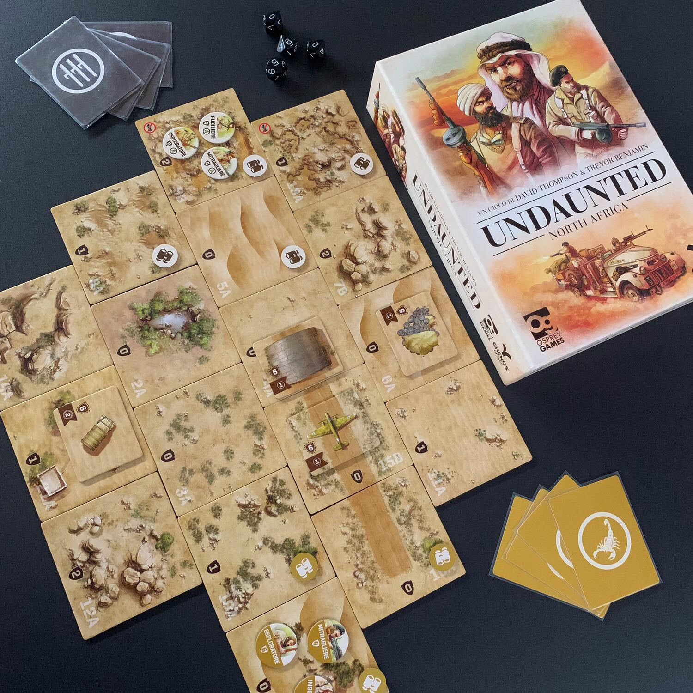
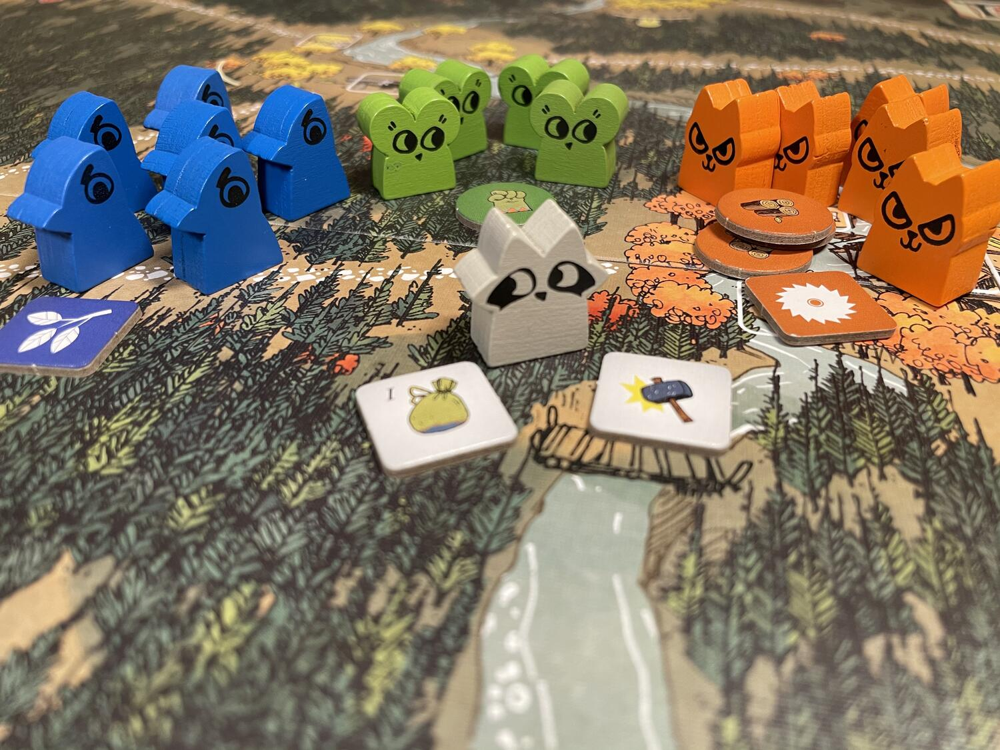

<AdvisorIntro>
  “Toc toc toc Amy! Toc toc toc Amy! Toc toc toc Amy!”
   
  “Avanti...”
   
  “È appena successo qualcosa di incredibile, a proposito della mia collezione: hai detto che una piccola asimmetria ci
  vuole”
   
  “Sì…”
   
  “Nella mia Callax cercavo di accumulare una collezione imperfetta e l’unico modo per farlo è introdurre l’imperfezione
  nella fila sottostante!”
   
  “Quindi invece dei giochi Super-Simmetrici ci sarebbero quelli Super-Asimmetrici?”
   
  “Ohhhh! Super-Asimmetrici! Sì, proprio quelli! Dammi Twilight Imperium!”
   
  “Cosa??”
   
  “Dammelo e basta! Abbiamo del lavoro da fare!”
</AdvisorIntro>

<AdvisorBit slug="undaunted-north-africa" writer="Tia">
  Ora ditemi cosa c'è di più asimmetrico di due eserciti che si fanno guerra.
   
  L'LRDG contro i Fasci, sabotatori contro carri armati, truppe d'assalto contro fortificazioni nel mezzo del deserto,
  Will Shepard contro Adriano Leone.
   
  Undaunted è un deck building nel quale dovrete comporre il vostro mazzo di soldati, arruolando quelli che secondo voi
  sono indispensabili per la missione in corso, nel quale andrete ad utilizzare ogni singola carta per fare qualcosa di
  eroico per portare a casa la pellaccia.
   
  Undaunted non è un war game, ma ne ha l'ambientazione.  
  Undaunted è davvero molto bello.
</AdvisorBit>

<AdvisorBit slug="bang" writer="Fora">
  Bang, probabilmente uno dei primi asimmetrici che abbia mai giocato. Un gioco che è la dimostrazione di come non
  servano ennemila poteri speciali, ma di come bastino dei semplici obiettivi per dare al tavolo una sensazione di
  ruoli, di asimmetria. Ora, sicuramente è un gioco che ha fatto il suo tempo, ma la gioia che può dare quando si è
  seduti in 7 assieme a ridere e scherzare mentre si sparano BANG a destra e a manca cercando di uccidere/salvare lo
  sceriffo, beh… è impagabile. Cos’è? Vi aspettavate <Link to="/reviews/root">Root</Link>?
</AdvisorBit>

<AdvisorBit slug="root" writer="Dadi-Daddy">
  Ed eccovi serviti.
   
  Ha sbancato, ha catturato, e non ha ancora fatto il suo tempo: Root è un titolo che, se siete a caccia di
  un’alternativa al solito, trito, competitivo, vi saprà sorprendere. Sullo stile di un soft wargame, presenta,
  attualmente tradotte in italiano, una decina di fazioni diverse (contando la possibilità di avere due vagabondi in
  gioco o la marchesa meccanizzata): tutte diversissime. Non vi stancherete di mescolarle per vedere che partita vi
  aspetta se abbinate proprio quelle che non avete ancora provato e vi piacerà così tanto che non potrete facilmente
  rimpiazzarlo.
</AdvisorBit>

<AdvisorBit slug="spirit-island" writer="LoveIsOnTheBoard">
  Il nostro consiglio è anche un augurio per questa vostra estate e per le prossime, e perché prima o poi la vita vi
  porti su un’isola incontaminata, dove è la natura a farla da padrona e a dettare il ritmo del tempo.
   
  Ma nel frattempo, per allenarvi a questo, c’è Spirit Island! Sarete chiamati a impersonare degli spiriti tribali, che
  incarnano le forze della natura, e a difendere l’isola dove vivete e i suoi abitanti dai “civilizzati” invasori (è
  davvero così? Può essere la devastazione “civile”?), che vogliono insediarsi e distruggere la vostra casa: ogni
  spirito ha i suoi poteri innati, le sue carte e un suo modo tutto speciale di espandere la sua presenza, al punto che
  dovrete allenarvi diverse partite per imparare ad usare ogni singolo spirito. Tutto è ben tematizzato: l’Oceano che
  Tutto Attanaglia vi porterà a muovervi come le onde del mare, mentre il Portatore di Incubi diffonderà l’orrore
  invisibile e la paura tra gli invasori.
   
  Spirit Island è un capolavoro assoluto, il miglior collaborativo e il nostro gioco preferito: non vi basta?
</AdvisorBit>

