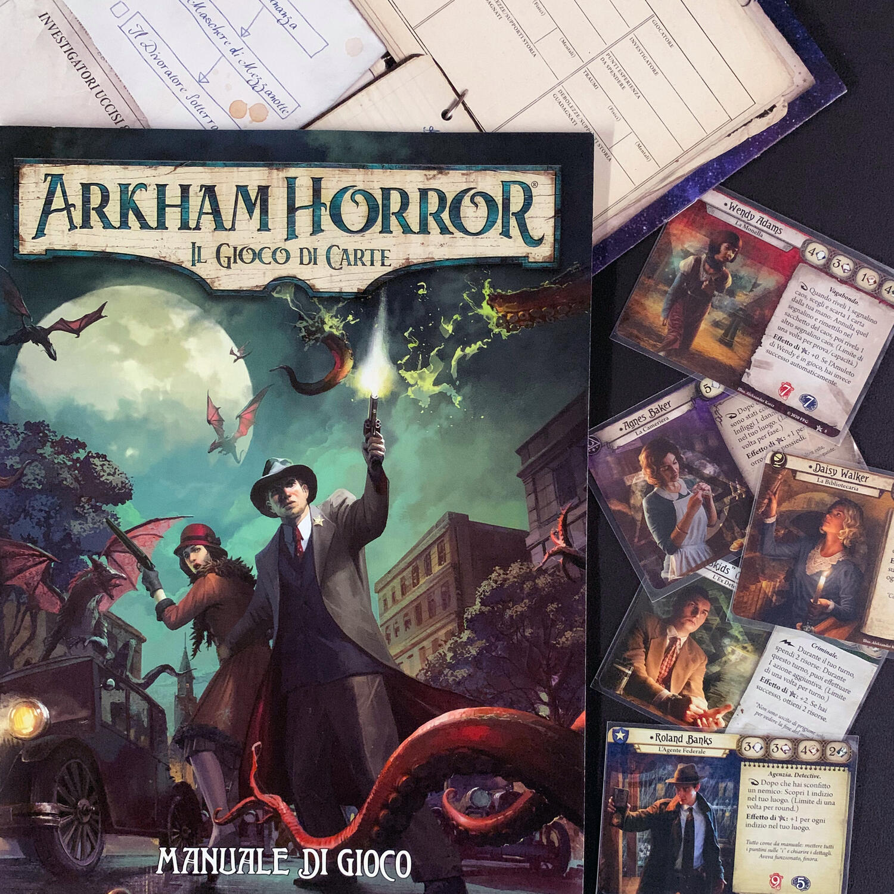
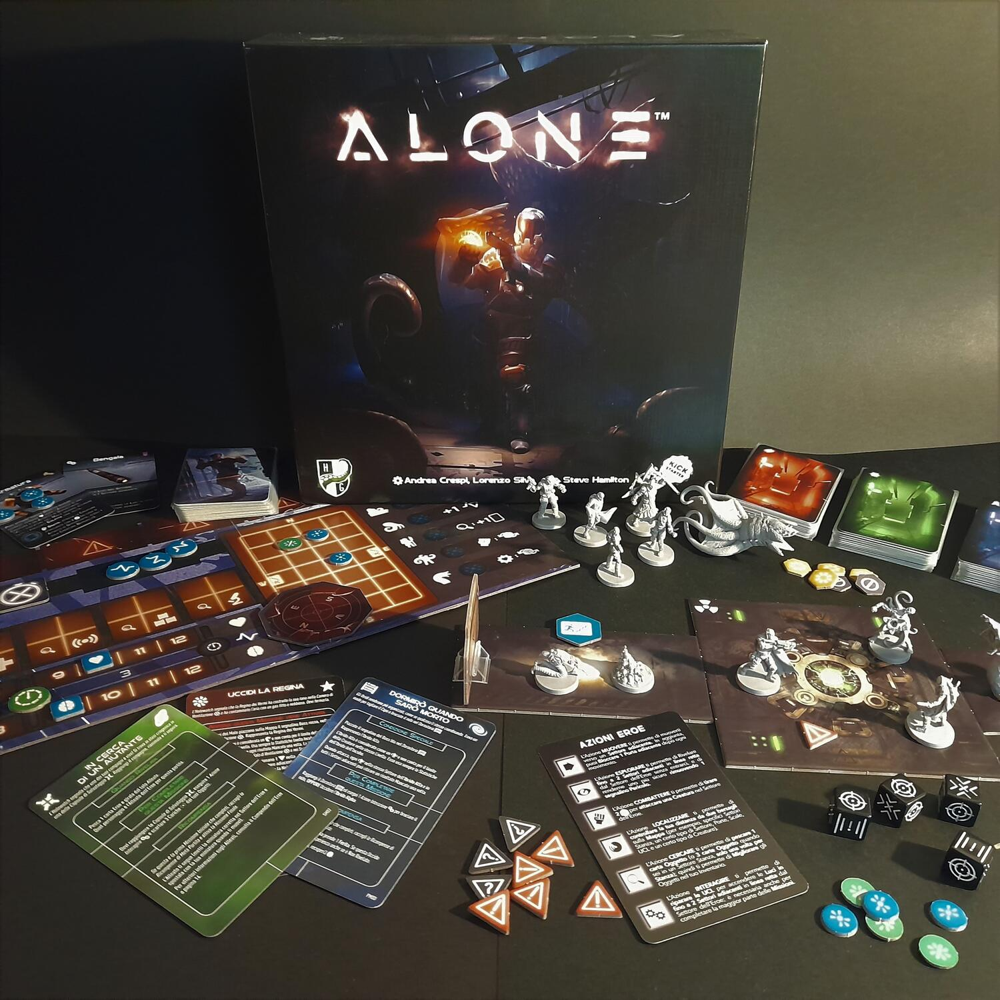
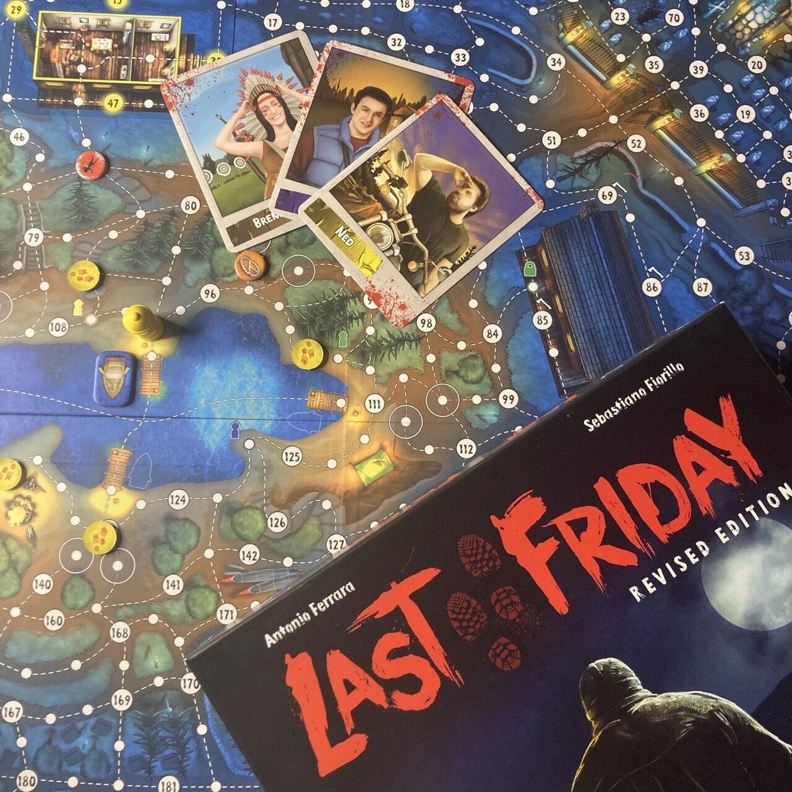
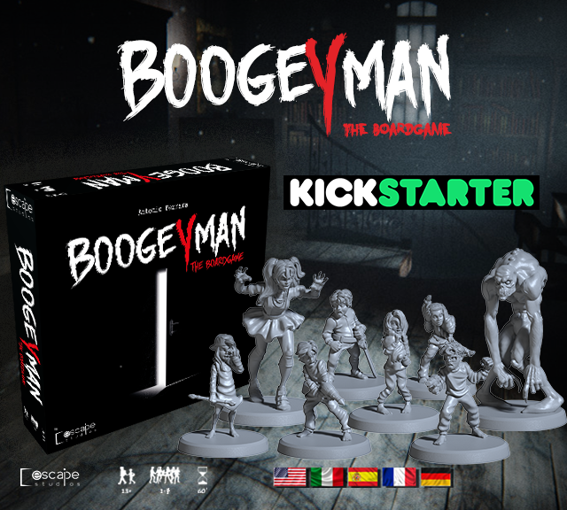

<AdvisorIntro>
  Vi piace provare scariche di adrenalina? Vi date appuntamento ogni anno per rievocare la storia di Jack-o'-lantern?
  Siete pronti anche per questo giro a guardare un bel film horror?
   
  Fermi tutti! E perché invece non… giocarlo?
   
  Oggi vi proponiamo quattro opzioni ludiche per animare le vostre serate a tema horror con straordinari colpi di scena,
  avvincenti inseguimenti e leggendarie colluttazioni con maniaci, mostri e chi più ne ha più ne metta!
   
  Fuori la zucca! “This is Halloween, this is Halloween…”
</AdvisorIntro>

<AdvisorBit slug="arkham-horror-lcg" writer="Tia">
  Chi meglio di Lovecraft può invocare l'Horror in me? Io adoro giocare Arkham horror LCG in solitario, sul tavolo della
  cucina, con luce soffusa e una colonna sonora spettacolare disponibile su{" "}<a href="https://open.spotify.com/playlist/5vQgSCzAdWiyjGlFQn00lb?si=4f1f3994a13548f0" target="_blank">spotify</a>
  . 
  Mi siedo, faccio partire i rumori in sottofondo e, con fare quasi teatrale, mi leggo l'introduzione dell'avventura.
  Persone scomparse da ritrovare, orrori che si muovono sotto i nostri piedi, cose che prima non c'erano ma ora sono
  proprio davanti a noi, portali, immagini distorte della realtà che stiamo vivendo… ma è davvero la realtà?
   
  Ogni avventura di questo gioco è diversa dall'altra, sia per l'obiettivo, sia per il modo che si ha nel giocarla, sia
  per alcune meccaniche che la caratterizzano. Il nostro scopo sarà quello di costruire (in stile magic) dei mazzi di
  carte che definiranno i nostri investigatori e, con questi, andare verso l'orrore cosmico a scoprire cosa si nasconde
  dietro la pubblica facciata.
   
  Arkham Horror LCG non è un gioco semplice, ma è il gioco che vi meritate e di cui avete bisogno.
</AdvisorBit>

<AdvisorBit slug="alone" writer="Fora">
  Cosa c'è di più pauroso che stare da solo in un'astronave schiantata? In un mondo pieno di mostri che non si vede? In
  fondo, è tutto buio. Si vede a pochi passi davanti a sé. Ogni passo è difficile, hai degli obiettivi da risolvere.{" "}
   
  Cosa c'è di più pauroso? Ovviamente <strong>le altre persone</strong>!   In Alone, un giocatore sarà il povero umano,
  mentre tutti gli altri saranno degli onniscienti malvagi in grado di manipolare orde di nemici, con l'unico obiettivo di
  eliminare il giocatore umano..  
  Ah, la paura… Ah, il sotterfugio…  
  Infatti.
</AdvisorBit>

<AdvisorBit slug="last-friday" writer="Dadi-Daddy">
  Classico gioco horror: <strong>angosciante, spaventoso, cruento</strong>! Un gruppo di ragazzi si ritrova bloccato in
  un campeggio tra le colline sulle sponde di un lago, inseguito da un assassino. Jason vi starà alle calcagna lungo le
  sponde afose del campeggio. I suoi movimenti segreti renderanno tutto più adrenalinico e le sue uccisioni più
  agghiaccianti, mentre pregate di non imbattervi in lui… finché non lo menate come si deve!
   
  Fondato sulla meccanica del <strong>movimento nascosto</strong> e sull'
  <strong>asimmetria</strong>, questo bel titolo di Antonio Ferrara non dovrebbe mancare in nessuna serata a tema: sicuramente
  da valutare per quella di Halloween!
</AdvisorBit>

<AdvisorBit slug="boogeyman" writer="Eris.in.Boardgameland">
  Quale gioco può essere più adatto ad Halloween di quello dalle <strong>vibes horror</strong>, nel quale dovrete
  scappare dal vostro incubo peggiore e che potrebbe mettervi l'uno contro l'altro quando meno ve lo aspettate?
   
  Ebbene sto parlando di Boogeyman, titolo firmato Antonio Ferrara, che con il suo stile anni 80 e tantissimi easter
  eggs vi farà vivere una serata da paura ma senza farvi mancare mai il sorriso! Il punto forte del gioco, oltre alla
  bellissima grafica, è il <strong>Fusion System</strong> grazie al quale vivrete momenti esilaranti in real per poter
  conquistare bonus o evitare malus!
   
  Siste quindi pronti a tornare ragazzini e sopravvivere alla prima notte a casa da soli?
</AdvisorBit>

