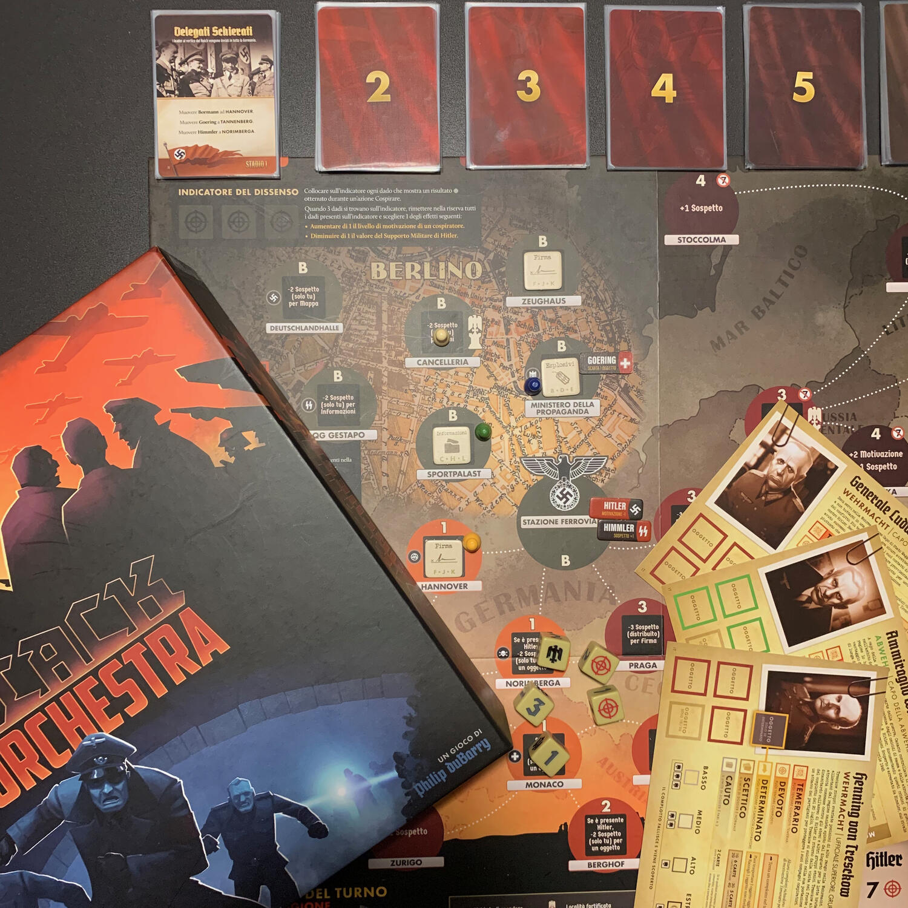

<AdvisorIntro>
  Quando si pensa ad un gioco da tavolo, la prima immagine che ci si presenta è
  quella di una competizione al cardiopalma in cui{" "}
  <strong>
    si rompono amicizie, si rovesciano tavoli e si ingaggiano duelli da Far West
  </strong>{" "}
  per stabilire chi è il vero vincitore in caso di parità, quando non c’è una
  regola per lo spareggio.
   A tutto questo <strong>c’è un’alternativa</strong>: quella di convogliare
  tutta questa <strong>energia negativa</strong> verso il vero “nemico”, il gioco
  stesso! Nei cooperativi, per vincere, si dovrà perseguire un <strong>
    obiettivo comune
  </strong>: non si vincerà mai come singoli, ma solo come <strong>
    gruppo
  </strong>.
   A noi Dude questo modo di giocare piace molto e siamo certi che tra
  questi <strong>4 Cooperativi</strong> ne troverete almeno uno che farà al caso
  vostro! Buon gioco!
</AdvisorIntro>

<AdvisorBit slug="black-orchestra" writer="Tia">
  Come fermerete <strong>Hitler</strong>?
   
  Avvelenando il cibo che mangerà durante un convegno?
   
  Posizionando una valigetta esplosiva nel palazzo in cui riposa?
   
  Facendo deragliare il treno con il quale si sta spostando da Monaco a Berlino?
   
  L'importante è farlo, farlo bene e farlo in fretta.
   
  Avete solamente 7 anni per collaborare assieme e organizzare l'attentato che
  libererà la Germania e il mondo intero dal nazismo.
   
  Come potete immaginare, <strong>ammazzare il capo di stato</strong> non sarà
  una cosa semplice, considerando che dalla sua Hitler avrà il supporto
  dell’esercito: dovrete definire un piano, trovare le risorse necessarie (armi?
  documenti? veleno? - a voi la scelta), essere nel{" "}
  <strong>posto giusto al momento giusto</strong> e fare in modo che un singolo
  tiro di dadi vi assicuri il successo. Fermarlo è possibile, basta esserne
  convinti e mettere a disposizione ciò che avete di più caro: la libertà.
</AdvisorBit>

<AdvisorBit slug="spirit-island" writer="Fora">
  Alla fine sono arrivati anche sulla vostra isola. Con le loro navi, con la
  loro industrializzazione, con la loro crudeltà. L’isola stessa sta rischiando
  di <strong>soccombere agli invasori</strong>…
   A questa richiesta d’aiuto a 360º potete rispondere solo voi, gli <strong>
    antichi spiriti
  </strong>!
   
  Utilizzando le antiche forze in vostro possesso, avrete la possibilità, ma soprattutto
  la responsabilità - grazie a maremoti, psicosi di massa, eruzioni vulcaniche -
  di incutere tanta paura nei vostri nemici da convincerli ad andarsene via come
  sono arrivati.
   
  Non sarà così facile come sembra, però. Questi invasori stanno trasformando l’isola
  secondo le loro esigenze e la loro cultura: questo significa che siete in lotta
  contro il tempo. Se le antiche vie dovessero essere dimenticate, anche voi sparirete!
</AdvisorBit>

<AdvisorBit slug="ta-pum" writer="Dadi-Daddy">
  Può l’amicizia essere più forte della guerra? Scopritelo insieme in questo
  cooperativo minimalista ma profondo, deliziosamente illustrato dal compianto
  Bernard Verlhac (il Tignous di Charlie Hebdo), dove dovrete aiutarvi a vicenda
  per sopravvivere alla dura vita di una fangosa trincea della prima guerra
  mondiale.
   
  In Ta-Pum! dovrete affrontare una serie di sfide nel corso di vari turni:
  neve, pioggia, gas, traumi, assalti e bombe. Le sfide verranno pescate dal
  mazzo Tribolazioni: esaurite questo mazzo per vincere la partita, prestando
  attenzione a non esaurire, invece, quello del morale e gestendo attentamente
  le vostre ristrette scorte di caffè e discorsi di incoraggiamento.
   
  Ta-Pum! vi insegnerà una verità fondamentale che altri cooperativi declinano
  in modo meno efficace e che i giochi competitivi per forza di cose ignorano:{" "}
  <strong>
    per la vittoria di tutti ognuno deve farsi carico del benessere degli altri
  </strong>
  , prima che del proprio. Certo, soccorrere chi sta peggio non significa per
  forza che chi aiuta stia meglio. Ma è proprio lì che si gioca tutto:
  nell’esserci per gli altri al momento del bisogno!{" "}
  <strong>Alla guerra si reagisce e si sopravvive con l’amicizia!</strong>
</AdvisorBit>

<AdvisorBit slug="atlantis-rising" writer="Angelo M Pero">
  La città di Atlantide è sull'orlo della fine. L'unica possibilità di salvezza
  per i suoi abitanti è fare fronte comune contro il susseguirsi di catastrofi e
  costruire i componenti di un portale che li trasporterà su lidi più
  favorevoli.
   
  In Atlantis Rising assumerete il ruolo di{" "}
  <strong>leader degli Atlantidei</strong>: personalità di spicco della città
  con un seguito di meeple che andranno distribuiti sulla mappa componibile a
  raccogliere le risorse utili per costruire il portale. Più in là vi
  spingerete, maggiori saranno le probabilità di successo e di guadagno, come
  più alto sarà anche il rischio di essere colpiti da una calamità.{" "}
  <strong>Solo un gruppo ben coordinato</strong>, fatto di freddi calcolatori e
  di amanti del rischio, riuscirà a mettere in salvo la popolazione prima che i
  cataclismi si abbattano sul centro dell'isola.
   
  Atlantis Rising può godere di meccaniche semplici e di una componentistica
  fuori dal comune, che agendo in tandem riescono a trasmettere perfettamente la
  tensione data dall'incombere delle calamità. Per tutta la partita si ha
  davvero l'impressione che ci siano delle persone la cui sopravvivenza dipende
  dalla propria capacità decisionale.
   
  Tanti livelli di difficoltà e un'ottima scalabilità (per non parlare delle
  illustrazioni di Vincent Dutrait) sono solo la ciliegina sulla torta di un
  titolo che accontenterà famiglie, principianti e giocatori esperti.
</AdvisorBit>

