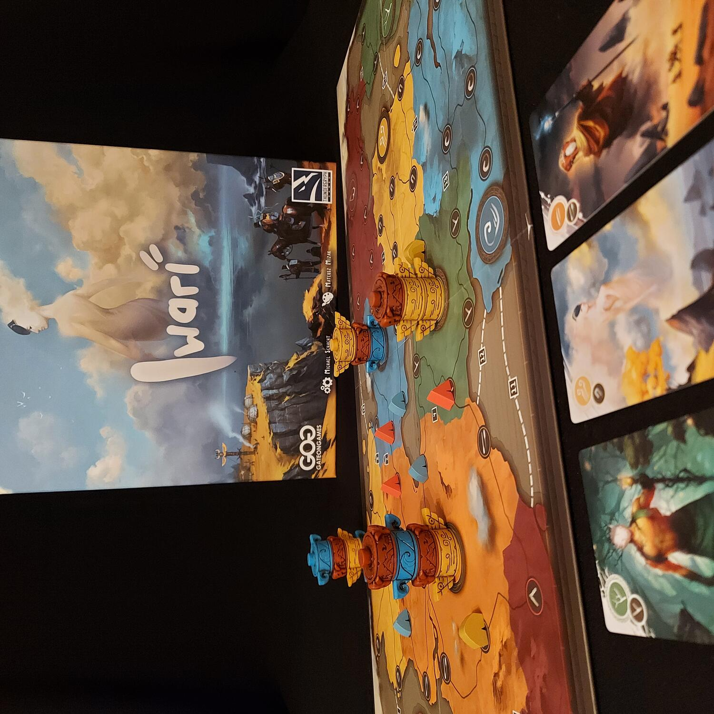
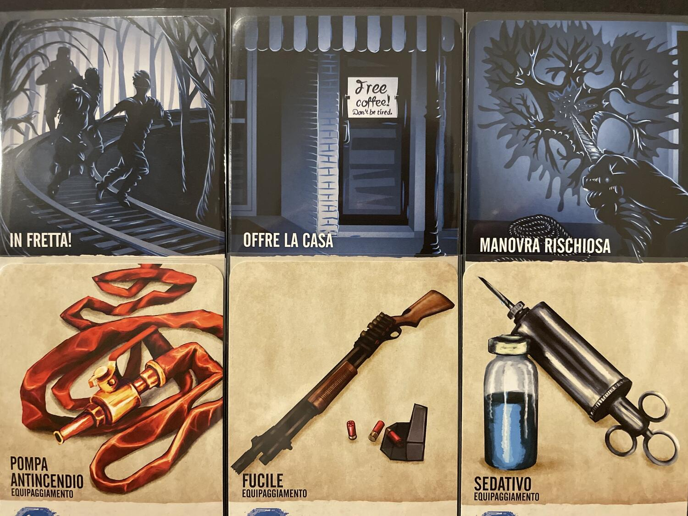
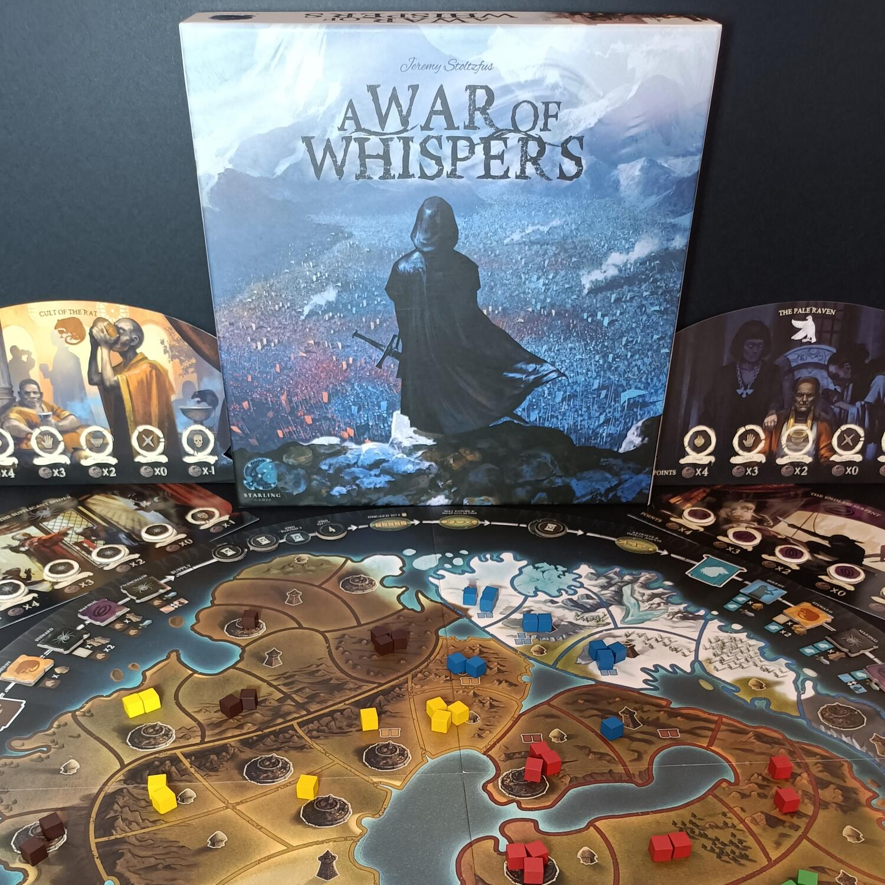

<AdvisorIntro>
  Dopo un appuntamento romantico in un bel ristorantino, salite a casa tua. Vi guardate negli occhi, indugiate un po’
  per esserne sicuri. Ma non ci sono dubbi. Trovi coraggio ed è allora che tiri fuori il tuo... gioco da tavolo
  preferito!  
  Per celebrare San Valentino, i vostri Dude vi consigliano 4 titoli perfetti da giocare in coppia, coinvolgenti ma leggeri,
  con cui potrete impressionare la vostra dolce metà. Un american da viaggio, un wargame minimal, un german DOC peso piuma,
  e naturalmente tanti dadi! Ce n'è davvero per tutti i gusti!
</AdvisorIntro>

<AdvisorBit slug="marvel-dice-throne" writer="Tia">
  Se non avete mai giocato a nessun Dice Throne, ho una brutta notizia per voi: avete perso la possibilità di passare
  delle serate indimenticabili. Invece di investire questo spazio a raccontarvi in poche parole come funziona il gioco,
  cercherò di convincervi ad andare a leggere la recensione intera.  
  Quello che una persona ricerca in un gioco da tavolo è sicuramente diverso dai desiderata di un'altra: io cerco <strong>
    originalità, emozioni e sentimenti
  </strong>. (Marvel) Dice Throne è capace di racchiudere tutte queste caratteristiche in partite di circa 30 min che verranno
  tramandate ai posteri per l'epicità che viene creata a suon di lancio di dadi.  
  Ogni volta che lo gioco mi meraviglio a pensare come 2 regole possano trasmettere e smuovere tanto.
   
  Provare per credere!
</AdvisorBit>

<AdvisorBit slug="iwari" writer="Fora">
  Iwari…  
  Chi se lo aspettava in questa lista… mente! Eppure, dopo una cinquantina di partite in due giocatori, spacca relazioni
  che neanche il monopoli. Il gioco di per sé non si gioca davvero con due giocatori: in due si dovrà ricorrere a una sorta
  di giocatore fantasma che darà fastidio intasando i territori con le sue pedine.
   
  Dov’è l’elemento interessante? <strong>Il fantasma fa punti come gli altri giocatori</strong>, quindi può vincere la partita
  anche lui. Visto che i giocatori stessi controllano il fantasma, la modalità per due di Iwari aggiunge di fatto un livello
  di complessità al gioco, facendolo diventare ancora più bello! Un controllo territori in due che <strong>
    non può mancare
  </strong> nelle vostre collezioni, ma premuratevi di nascondere tutte le potenziali armi presenti in casa…
</AdvisorBit>

<AdvisorBit slug="inbetween" writer="Dadi-Daddy">
InBetween
Nella categoria dei giochi per 2, non può mancare un riferimento a InBetween, un <strong>tiro alla fune interdimensionale</strong> che vi immergerà nella cittadina di Upsidville, dove una Creatura sta minacciando di far sparire ogni cosa e la Città stessa sta tentando in ogni modo di resisterle, mettendo al Sicuro i suoi abitanti. Se amate i titoli asimmetrici, senza esclusione di colpi, in cui tutto va tenuto costantemente sotto controllo, non potete non provare InBetween: avrete l’impressione di condurre una <strong>lotta per il controllo di ogni singolo centimetro</strong> della vostra dimensione e, a mano a mano che crescerete nell’esperienza di gioco, imparerete a vender cara la pelle di ogni Personaggio, fino a sviluppare quei tatticismi necessari a strappare la vittoria al vostro avversario addirittura con qualche turno di anticipo. Piccola nota a margine: questo gioco non ha <strong>nulla a che vedere con il marchio Stranger Things</strong>, anche se l’atmosfera può considerarsi un omaggio implicito alla fortunata serie.

</AdvisorBit>

<AdvisorBit slug="a-war-of-whispers" writer="Angelo M Pero">
So cosa state pensando. "Controllo del territorio? Per 2 giocatori?". Ebbene sì... e no. Non vorrei stare qui a confondervi troppo, ma il motivo per cui A War of Whispers è finito in questa lista è una caratteristica davvero sottile ma affascinante. Se ci pensate, quello che succede nella virtualità del gioco è una cosa in cui noi persone al tavolo non possiamo mettere le mani, perché avviene ad un livello immateriale che viene simulato attraverso meccaniche e componenti. C'è quindi una differenza tra i giocatori in carne ed ossa e le entità giocanti che manipolano la realtà interna del gioco. Pensateci: aprite un solitario ma al tavolo non siete davvero soli, perché c'è un'intelligenza (artificiale, in questo caso) che muove dei pezzi contro di voi.
In A War of Whispers succede una cosa simile. <strong>Il numero di giocatori può variare, ma le entità giocanti che si scontrano sulla mappa sono sempre 5</strong>, un numero perfetto per un gioco di controllo del territorio. Quello che fanno i giocatori materiali è scambiarsi di continuo il ruolo di condottieri delle diverse armate, senza mai stabilire un contatto fisso e necessario con un giocante specifico. E questo lo rende un titolo davvero importante per coppie di giocatori che non riescono mai ad intavolare un gioco di maggioranze <strong>senza finire nel classico "troppo largo" o "troppo stretto"</strong>.

</AdvisorBit>

