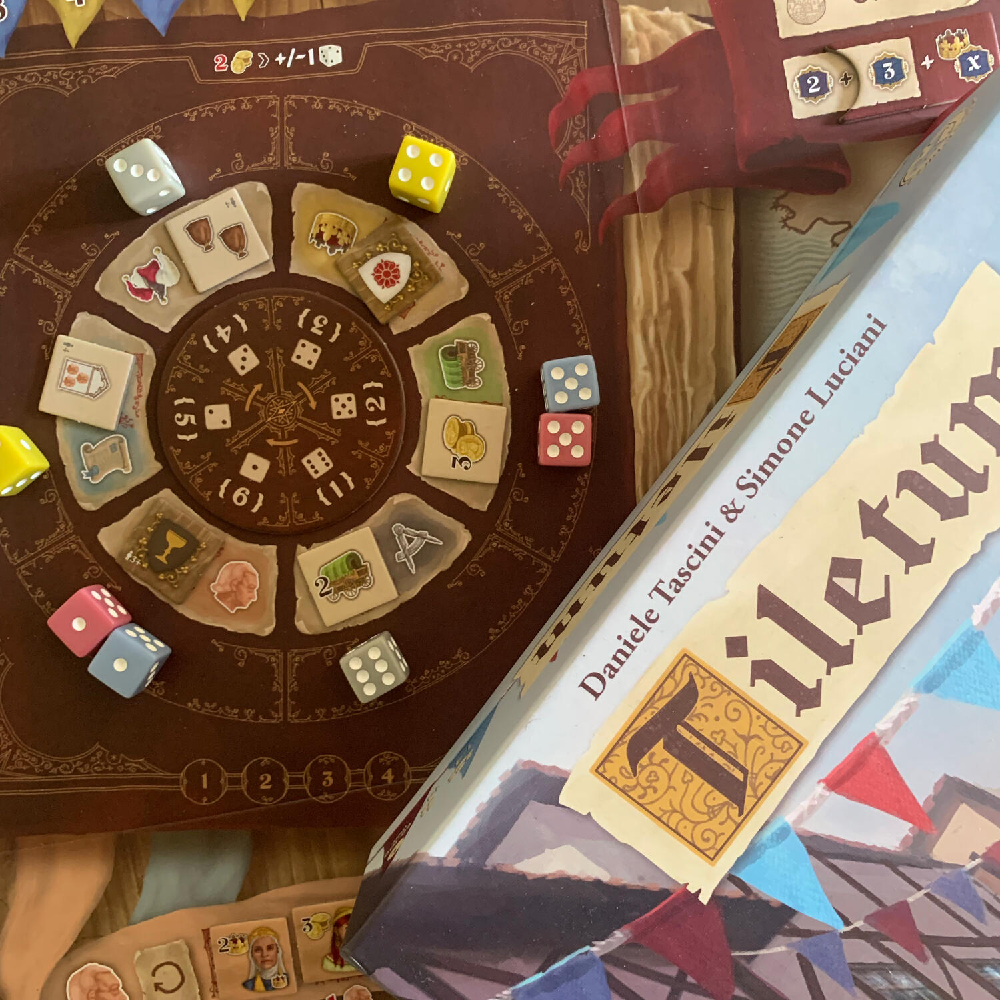
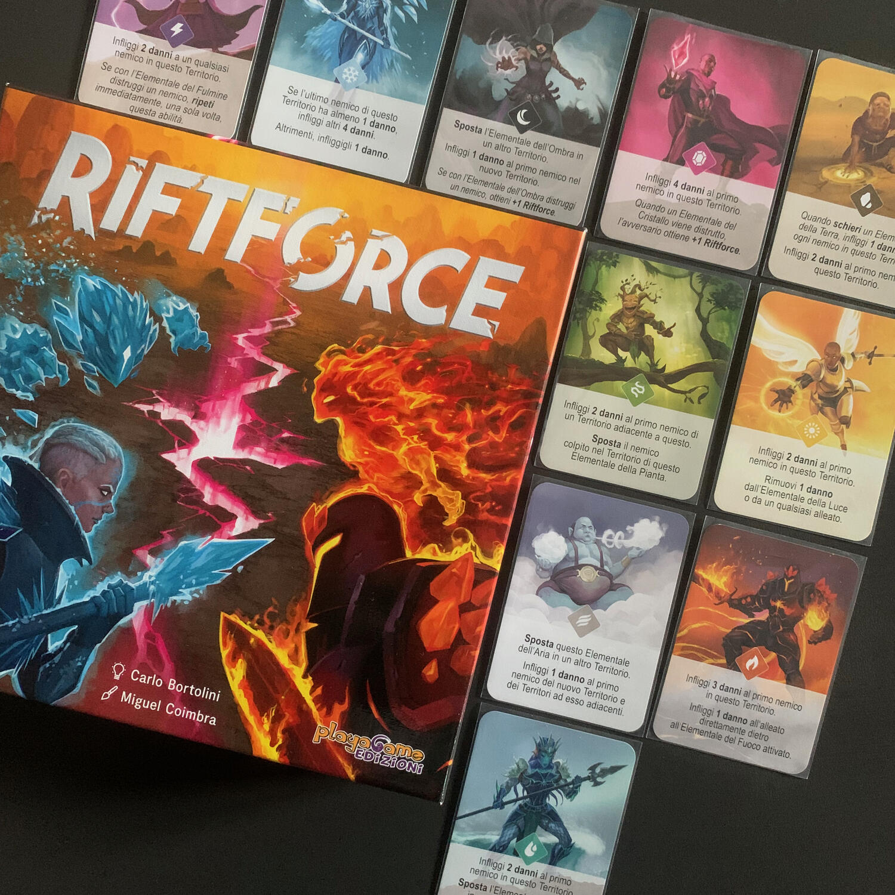
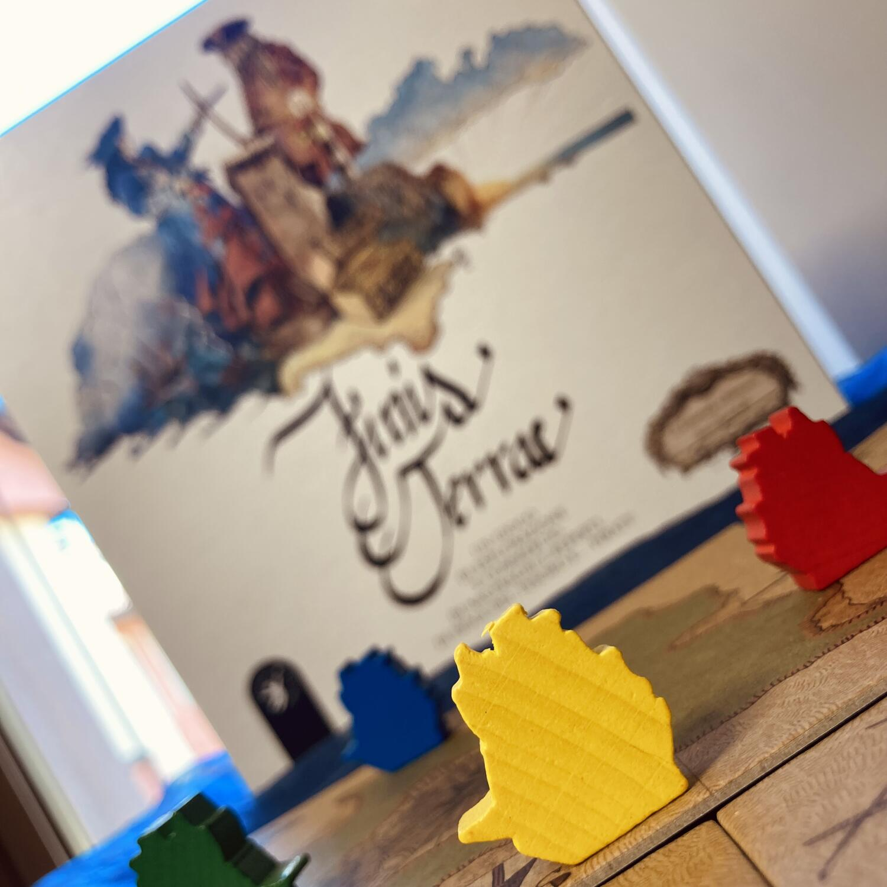

<AdvisorIntro>
  <strong> L’Italia non è solo</strong> il “bel Paese”, dove “se magna bbbene” e dove “il sì suona”. Non siamo solo gli
  “inventori” dei peggiori reati politici, del bunga bunga, della terribile burocrazia. Siamo un Paese certamente
  complicato e stereotipato, <strong>ma anche</strong> strabiliante. E abbiamo una lista di{" "}
  <strong>inventori strabilianti</strong>, che vale la pena ricordare: Leonardo Da Vinci, Galileo Galilei, Antonio
  Meucci, Alessandro Volta, Guglielmo Marconi, Alfonso Bialetti… Il “Made in Italy” è una <strong>garanzia</strong>: ci
  invidiano per il nostro <strong>spirito di inventiva</strong> e, come si dice, imprenditoriale. Bene: adesso ci
  invidieranno anche per la bellezza dei <strong>nostri giochi da tavolo</strong>, un altro tassello del{" "}
  <strong>“bello fatto bene”</strong> che ci rende apprezzati nel mondo. Adesso annovereremo tra i portabandiera delle
  competenze italiane, tra gli altri, anche autori come{" "}
  <strong>
    Luca Cervini, Carlo Bortolini, Francesco ed Emanuele Sassi Zanichelli, Daniele Tascini e Simone Luciani
  </strong>
  .
</AdvisorIntro>

<AdvisorBit slug="tiletum" writer="Tia">
  Luciani e Tascini sono sicuramente nomi che avete imparato ad amare dopo
  <em>Tzolk’in</em> e <Link to="/reviews/sulle-tracce-di-marco-polo">Marco Polo</Link>, e sono nomi che amerete ancora dopo
  aver provato <strong>Tiletum</strong>.
   
  Perché Tiletum? Dopo anni di "io non riesco proprio a capire che genere di giochi ti piacciono, Tia" sono riuscito a darmi
  una risposta: quelli con un <strong>gimmick particolare</strong>, una <strong>caratteristica che mi diverte</strong>, un{" "}
  <strong>dettaglio unico del gioco</strong>.
   
  La <strong>ruota dei dadi di Tiletum</strong> è stata la leva che mi ha portato a farci una partita dopo l'altra, che ancora
  oggi mi diverte e mi fa venire voglia di intavolarlo ancora e ancora.  
  Quella stramaledetta ruota, con delle regole semplicissime per gestirla, è geniale.  
  Provare per credere!
</AdvisorBit>

<AdvisorBit slug="riftforce" writer="Fora">
  Ancora mi ricordo la copia autografata dell’autore presa al Modena Play. Un gioco che ero totalmente preparato a non
  amare, ma che invece… Sarà per la
  <strong>meccanica</strong> della <Link to="/mechanisms/gestione-mano">Gestione mano</Link>? Sarà per la <strong>
    grafica accattivante
  </strong>? Si è rivelato un gioco per due davvero <strong>emozionante</strong> che, con un feeling simile a giochi del
  buon <Link to="/designers/richard-garfield">Garfield</Link> promette <strong>ore e ore</strong> di divertimento a chi saprà
  dedicarci del tempo: praticamente <strong>una matrioska di divertimento!</strong>
</AdvisorBit>

<AdvisorBit slug="soulgivers" writer="Dadi-Daddy">
  Nel multiverso di Soulgivers la Decadenza incombe sui Gusci e sugli Spettri. La loro unica possibilità di salvezza
  risiede nel Frammento: esso soltanto potrà guarirli dal tremendo male cosmico. Scatenate una{" "}
  <strong>feroce battaglia</strong> tattica e trasportate il Frammento nel vostro portale prima degli avversari!
  Lasciatevi sedurre da questo <strong>skirmish scacchistico estremamente bilanciato</strong>, in cui la{" "}
  <strong>superba eleganza estetica</strong> si combina con uno{" "}
  <strong>stile artistico visionario e surreale, onirico, “amniotico”</strong>. Lasciatevi catturare dalla cura
  dettagliata e raffinata di Luca Cervini, un grande giovane inventore che inorgoglisce il nostro Paese e merita tutta
  la nostra attenzione e tutto il nostro supporto. Ad maiora!
</AdvisorBit>

<AdvisorBit slug="finis-terrae" writer="Eris.in.Boardgameland">
  Uno degli aspetti più belli di giocare un titolo totalmente made in Italy è che, se si ha fortuna, si può avere
  l’occasione di <strong>vederlo crescere</strong> e di conoscere la storia che c’è dietro la sua{" "}
  <strong>creazione</strong>. Questo è il caso di Finis Terrae, ideato dalla mente di due fratelli, Emanuele e Francesco
  Sassi Zanichelli, che hanno deciso di mettersi in gioco.
   
  Un <strong>gestionale leggero</strong>, che vi ricorderà nel (rinnovato) sistema di piazzamento tessere lo storico
  Carcassonne, con chicche niente male!
   
  Un gioco con un <strong>pizzico di alea</strong>, totalmente autoprodotto, <strong>eco friendly</strong> e dalle{" "}
  <strong>vibes marinaresche</strong>, nel quale potrete sbizzarrirvi tra <strong>esplorazioni</strong>,{" "}
  <strong>battaglie</strong> e il <strong>recupero di tesori</strong> sommersi!
   
  Giocabile con l’intensità che preferite, a seconda del livello di competitività al tavolo.
</AdvisorBit>

