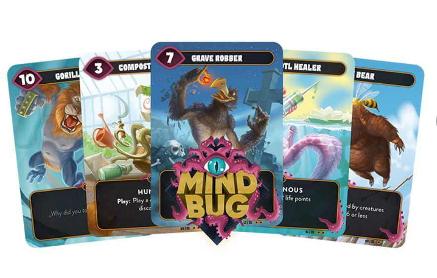
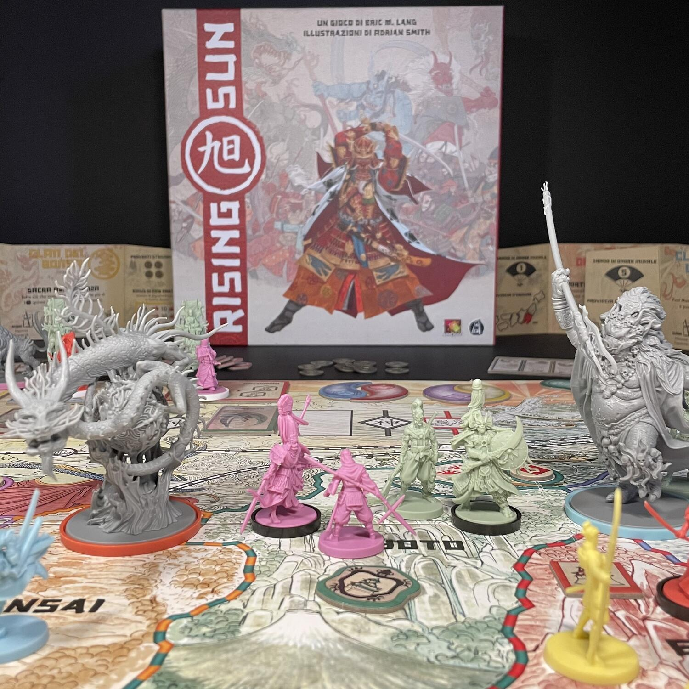
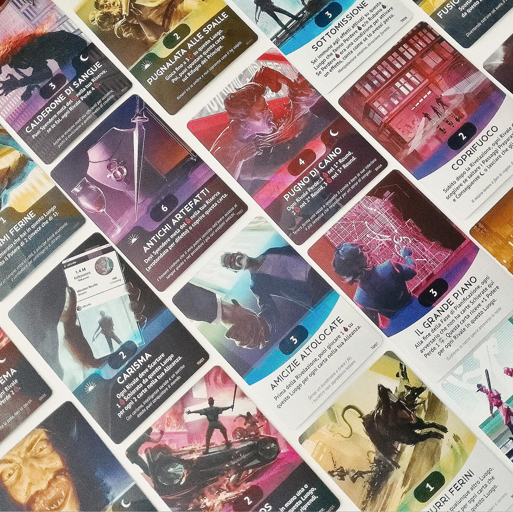

<AdvisorIntro>
  Oggi vogliamo cantare l'amore del pericolo, l'abitudine all'energia e alla temerità. Il coraggio, l'audacia, la
  ribellione, saranno elementi essenziali del nostro gioco. La ludomania esaltò fino ad oggi l'immobilità pensosa degli
  astratti, l'estasi dei solitari, il sonno dei cooperativi. Noi vogliamo esaltare il movimento aggressivo, l'insonnia
  febbrile, il passo di corsa, il salto mortale, lo schiaffo ed il pugno. Noi affermiamo che la magnificenza del mondo
  si è arricchita di una bellezza nuova: la bellezza dell’interazione cattiva. Un Mindbug in corsa col suo cofano adorno
  di grossi elementali simili a Vampiri dall'alito esplosivo... Un Oni ruggente, che sembra correre sulla mitraglia, è
  più bello di tutte le battaglie mai fatte dall’umanità a Risiko.
</AdvisorIntro>

<AdvisorBit slug="riftforce" writer="Tia">
  Prendi quattro gilde, schierane gli elementali e combatti fino alla fine per ottenere il controllo della Rift!
  Semplice no? Effettivamente lo è. Ma con che cattiveria! Ti troverai a dover scegliere se schierare nuovi elementari
  per diventare ancora più dominante o se mandare al macello quelli già in campo per bloccare l'avanzata del nemico. E
  ti troverai in questa situazione tutti i turni. Distruggere un elementare nemico non è solamente un passo verso la
  vittoria, bensì è sinonimo di combo distrutte, piani saltati e una miglior difesa nei turni a venire. Perché si sa che
  la miglior difesa è l'attacco, o sbaglio?
</AdvisorBit>

<AdvisorBit slug="mindbug" writer="Fora">
  Mindbug è quel gioco che ti aspetti sia bello, forse per colpa dell’autore sconosciuto che ha fatto quel gioco
  sconosciuto chiamato Magic, ma poi quando lo provi ti accorgi che è bellissimo. Poi lo giochi e ti accorgi che non
  solo è bellissimo, ma è anche cattivissimo! Basta guardare la sua meccanica principale. Quel doppio furto di carta
  dell’avversario ha il potere di cambiare completamente una partita, tanto che con l’esperienza bisognerà fare in modo
  che quel <em>Mindbug</em> venga usato sulla carta giusta al momento sbagliato! È proprio questa linea di tensione che
  determina la cattiveria dello scontro tra i giocatori, non più legata alla forza del mazzo, ricordo determinato
  casualmente, quando alla capacità di bluffare una posizione di vantaggio come nelle migliori partite di poker!
</AdvisorBit>

<AdvisorBit slug="rising-sun" writer="Dadi-Daddy">
  Non ci sono azioni o gesti innocenti in Rising Sun: perfino l’alleanza può diventare uno strumento di raffinata
  molestia. Non sarete stati così sorprendentemente cattivi nemmeno in qualsiasi versione del famigerato Risiko. Avete
  in mente un obiettivo? Quasi certamente pesterete i piedi di un altro giocatore per raggiungerlo. Vi piace la rissa?
  Vi accorgerete che prima di provare questo titolo di Eric Lang non sapevate neanche cosa fosse. Non potrete fare
  interazioni positive nemmeno volendolo, perché non potrete mai fidarvi di nessuno. E dopo aver combattuto innumerevoli
  battaglie, ricordando i vostri miserabili errori, passerete molte notti a ponderare tutte le possibili sfumature della
  parola “bluff”. Ma penserete anche a quanto sarà stato estetico e struggente esservele suonate di santa ragione sotto
  una pioggia di petali di ciliegio.
</AdvisorBit>

<AdvisorBit slug="vampiri-la-masquerade-vendetta" writer="Angelo M Pero">
  Mors tua vita mea: mai un locuzione è stata così calzante come nel caso di Vampiri: La Masquerade - Vendetta. In
  questo titolo dovrete pianificare accuratamente ogni mossa, giocando le carte nei diversi luoghi in cui avranno luogo
  gli scontri. Il cuore del gioco è tutto qui, nella fase della progettazione, in cui ci si affilano gli artigli e le
  zanne, pregustando l'odore del sangue che ci si prepara a spargere. Raramente si gioca per se stessi, perché la
  competizione è agguerrita e il trono di Chicago non è abbastanza grande per due paia di chiappe. Si gioca invece per
  sabotare le strategie avversarie, per far sprecare loro tempo e risorse preziose, inducendoli con l'inganno a
  indirizzare gli sforzi dove non avranno nulla da mordere, o tendendogli un'imboscata quando meno se lo aspettano.{" "}
   
  La scatola contiene 7 fazioni asimmetriche, ciascuna con la propria strategia che un interessante sistema di gestione della
  mano vi permetterà di mitigare in base alle circostanze.
</AdvisorBit>

