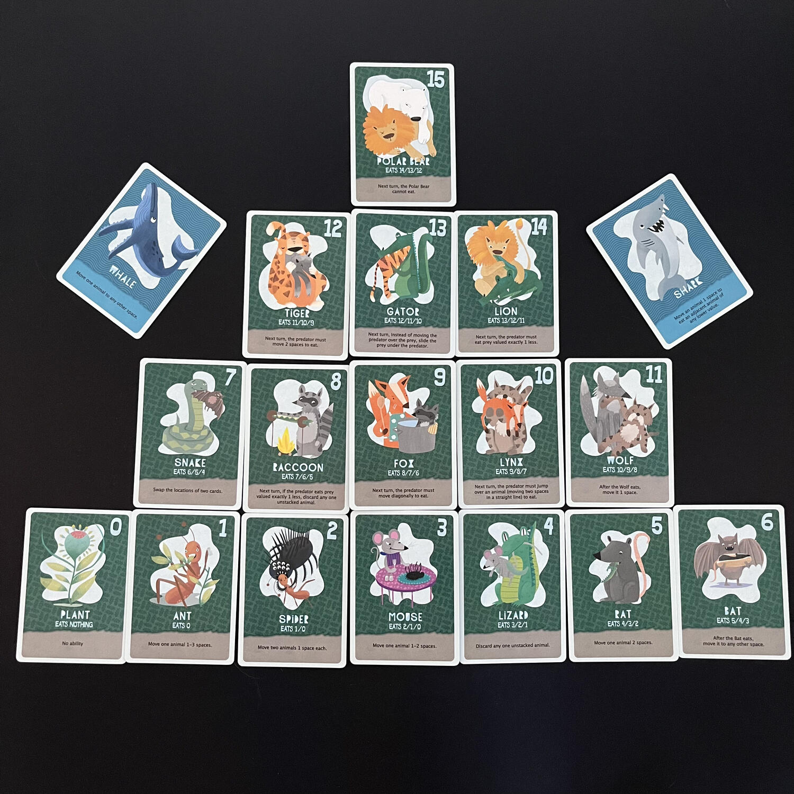
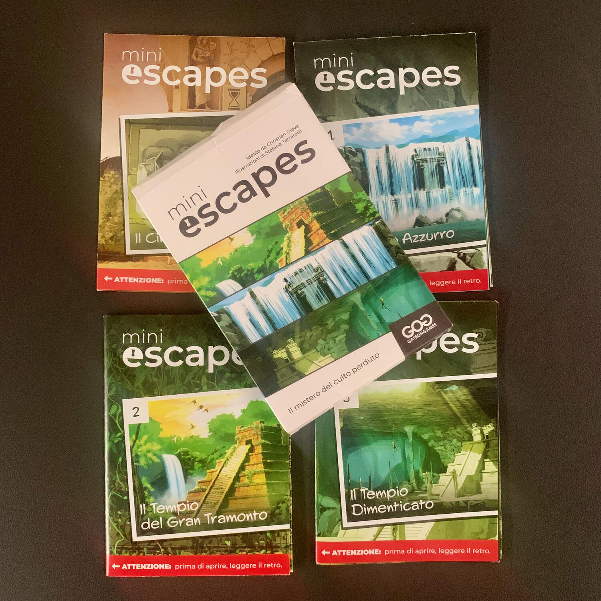
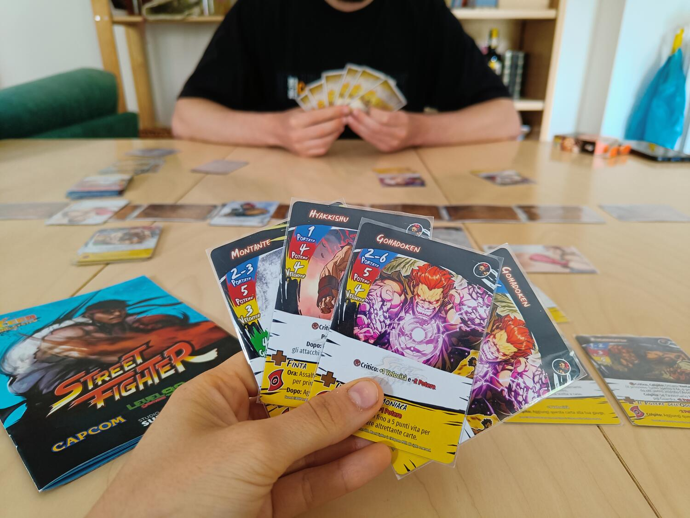

<AdvisorIntro>
  Il passaggio di molti giochi da tavolo alla loro versione digitale (horreur!) ha i suoi vantaggi pratici: giocare a
  distanza, giocare senza ingombrare l’unico tavolo della casa e… <strong>preparare in tempo zero</strong>! Negli ultimi
  tempi sembra quasi che più tempo si impiega a intavolare un gioco, più il gioco debba essere meritevole di attenzione
  pubblicitaria: le campagne di Crowdfunding, da questo punto di vista, ci hanno abituato all’idea che sbloccare sempre
  più stretch goals renda un gioco inequivocabilmente bello e qualitativamente superiore. Viene da chiedersi se il fatto
  che i tempi di intavolamento a momenti rischino di superare quelli di gioco sia davvero ciò che i giocatori vogliono
  da questo genere di intrattenimento.
   A noi di Dudexpress (intendiamoci) la quantità piace… Ma ci piace di più giocare! Ecco quindi <strong>
    4 proposte di giochi che si intavolano in tempi rapidissimi
  </strong> ma promettono ugualmente <strong>grande divertimento</strong>! 
</AdvisorIntro>

<AdvisorBit slug="marvel-dice-throne" writer="Tia">
  <strong>Marvel Dice Throne</strong> è il gioco che passerete più tempo a giocare che a setuppare. Stop.
   
  Ogni personaggio di un qualsiasi Dice Throne è "segregato" in <strong>una scatolina</strong> tutta sua: la prendete,
  la aprite, ne disponete il contenuto correttamente davanti a voi e <strong>nel giro di 1 minuto siete pronti</strong>{" "}
  a sfidarvi a suon di fulmini e bombe attaccate alla schiena.  
  Il gioco è <strong>strepitoso</strong>, davvero: è uno dei pochi che riesce ancora a darmi la scarica di adrenalina ogni
  volta che lo gioco e che mi spiace riporlo al suo <strong>posto d'onore nella Kallax</strong>, a fianco di <Link to="/reviews/heat-pedal-to-the-metal/">
    Heat Pedal To The Metal
  </Link> e sotto Final Girl.
   
  In questo momento è in corso una campagna Kickstarter con la quale potete portarvi a casa la Battle Chest sia della versione
  recensita qui sotto, che della nuovissima versione X-Men!  
  Inutile dire che appena Tempesta entrerà in casa, lo saprete tutti!
   
</AdvisorBit>

<AdvisorBit slug="food-chain-island" writer="Fora">
  <strong> Sgnaf! Sgnaf! Sgnaf! </strong>  
  Una partita di Food Chain Island tira letteralmente l’altra. Tempo di setup? 2 minuti. Tempo di gioco? Ancora meno. Che
  tu vinca o che tu perda, in altri 2 minuti ricomincerai a giocare.  
  Come tutti i giochi <Link to="/publishers/button-shy">Button Shy</Link>, è tutto molto veloce, ma questo…lo è
  particolarmente! E il suo essere un solitario si presta perfettamente a quelle pause snack in treno e a quei momenti
  in cui non si vuole intavolare un gioco da un’ora di setup!!
</AdvisorBit>

<AdvisorBit slug="mini-escapes-il-mistero-del-culto-perduto" writer="Eris.in.Boardgameland">
  Quando si è appassionati di enigmi e misteri si desidera avere la mente lucida e libera da distrazioni, così da
  portare a termine al meglio la sfida che ci si troverà davanti: per questo è saggio scegliere un gioco che non
  implichi un lungo tempo per il set up!
   
  Ebbene, sono diversi i titoli che rispecchiano queste caratteristiche, ma solo per uno in particolare il tempo tra la
  scelta e l’inizio effettivo partita è inferiore ai tre minuti!
   
  Quale?
   
  Sto parlando di MiniEscapes, <strong>escape room tascabili</strong> ideate da Christian Giove (
  <Link to="/interview/christian-giove/">DudeInterview Christian Giove</Link>), illustrate dall’abile mano di Stefano
  Tartarotti e edite da GateonGames!
   
  Sono letteralmente composte da un foglio ripiegato più volte su se stesso, quindi{" "}
  <strong>basterà aprire la confezione</strong>, <strong>estrarre l’avventura</strong> scelta e{" "}
  <strong>scansionare il Qr code</strong> per dare inizio alla storia e tuffarsi nei suoi enigmi!
   
  Attualmente sono usciti i primi due capitoli ma qualcosa mi dice che sarà una lunga saga: che sia la loro bellezza?
   
  Provare per credere, non ve ne pentirete!
   
</AdvisorBit>

<AdvisorBit slug="exceed-street-fighter-ryu-box" writer="LoveIsOnTheBoard">
  A volte la voglia di giocare, di sfogarsi è talmente forte che non c’è proprio tempo di pensare ad un setup….allora
  quello di cui avete bisogno è Exceed Street Fighter! <strong>Aprite la scatola</strong>,{" "}
  <strong>tirate fuori il mazzetto</strong> di ciascun giocatore,{" "}
  <strong>mettete in linea le 9 carte arena e…..SBAM!!</strong> Ma che avete capito??? Non dovete menare davvero il
  vostro sfidante, NON SI FA!! Fatelo piuttosto con le carte di questo gioco, tra{" "}
  <strong>combattimenti all’ultimo sangue</strong>, pugni e calci sarà ancora più soddisfacente, e, soprattutto, non
  avrete ripercussioni legali!
   
</AdvisorBit>

