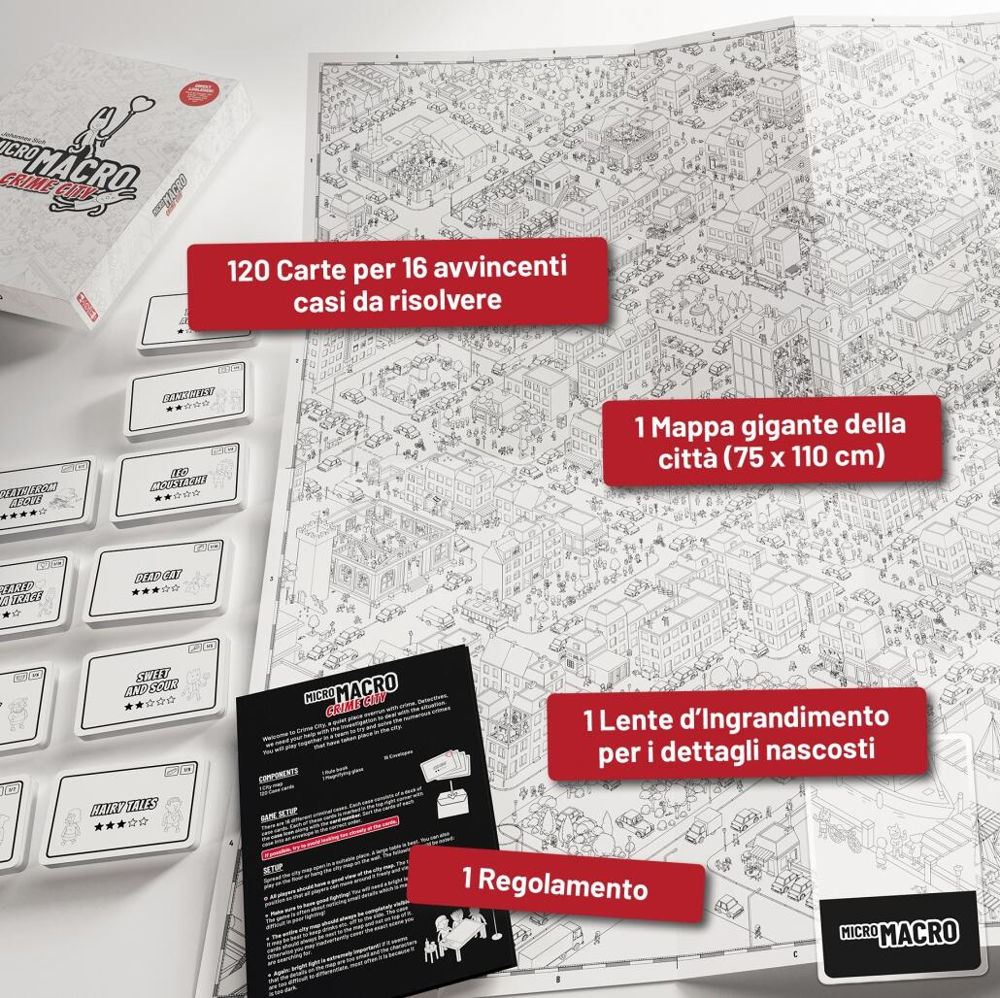
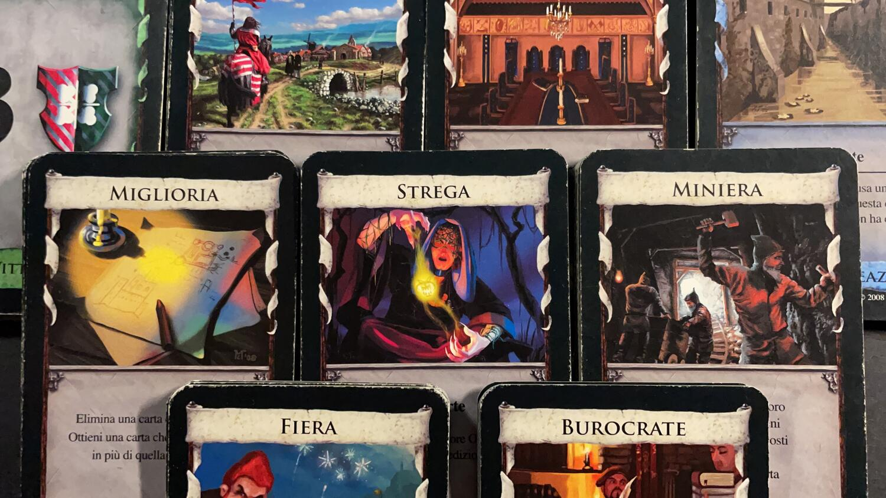

<AdvisorIntro>
  Lo Spiel des Jahres è una competizione lanciata nel 1978 da giornalisti tedeschi allo scopo di mantenere alto il
  livello di qualità del gioco da tavolo nel mercato tedesco, valorizzando fattori quali la novità, la semplicità e
  l’appeal grafico. Con la crescente internazionalizzazione della passione per il gioco da tavolo, il premio è diventato
  un catalizzatore di attenzioni anche al di fuori della Germania, fino a diventare una delle più attese onorificenze
  riservate al gioco da tavolo, distinguendo il pubblico di riferimento in tre gruppi: famiglie, esperti e bambini.
   
  Tra i vincitori del secolo scorso di questo premio troviamo titoli ben noti, come <em>La lepre e la tartaruga</em>{" "}
  (1979), <em>Sherlock Holmes: Consulente Investigativo</em> (1985), <em>I coloni di Catan</em> (1995),{" "}
  <em>El Grande</em> (1996), mentre tra quelli degli ultimi vent’anni non potrete non conoscere <em>Carcassonne</em>{" "}
  (2001), <em>Ticket to Ride</em> (2004), <em>Dixit</em> (2010), <em>Hanabi</em> (2013) o <em>Azul</em> (2018).
   E quelli di cui vi parliamo oggi? Li conoscete? Nooo? Correte subito a giocarli!
</AdvisorIntro>

<AdvisorBit slug="micromacro-crime-city" writer="Eris.in.Boardgameland">
  MicroMacro: Crime City (Spiel des Jahres 2021) è un gioco <strong>semplice</strong>, ma che una volta iniziato{" "}
  <strong>non vi farà più alzare dalla sedia!</strong>  
  Armatevi di un <strong>grande tavolo</strong> e di <strong>tanta luce</strong>, cosicché la mappa ricca di dettagli e personaggi
  curiosi possa darvi un adeguato benvenuto a MicroMacro, una cittadina allo sbaraglio e ormai stravolta dal <strong>crimine</strong> dove è urgentemente richiesto il vostro intervento: è tempo di riportare la tranquillità!  
  Un mix perfetto tra <em>Dov’è Wally?</em> e un investigativo alla Sherlock Holmes, che vi porterà a tentare di
  risolvere un caso tutto a ritroso per scoprire cos’è successo alla povera vittima. Omicidio? Furto? O magari un
  ricatto… I casi sono tanti e più andrete avanti con le indagini più le difficoltà aumenteranno, e sarà sempre più
  necessario <strong>aguzzare la vista</strong>, perché gli indizi si possono nascondere nel più remoto degli angolini!
</AdvisorBit>

<AdvisorBit slug="dominion-nasce-un-regno" writer="Fora">
  Oh, Dominion, caro Dominion (Spiel des Jahres 2009). Se non ci fosse lui il 90% delle recensioni della meccanica{" "}
  <Link to="/mechanisms/deck-building">Deck building</Link> <strong>non esisterebbero</strong>. Un gioco che non solo ne
  ha ispirati molteplici negli anni a venire, ma che ancora oggi, sicuramente, si difende bene. Sì, negli anni è stato
  accusato di essere praticamente risolto nella versione base, ma grazie ad una enorme community alle sue spalle si
  possono sempre trovare giocatori in grado di uscirsene con le strategie più improbabili che permettono le vittorie più
  incredibili!  
  Non è proprio questo il bello di un gioco da tavolo? Sempre in evoluzione e sempre divertente?
</AdvisorBit>

<AdvisorBit slug="cascadia" writer="Dadi-Daddy">
  Cascadia (Spiel des Jahres 2022) non è un vincitore da poco, per uno Spiel. È un astratto che sceglie un{" "}
  <strong> tema naturalistico </strong>e lo realizza facendovi respirare l’ambientazione, con tonalità gradevoli, sia
  cromaticamente che “eticamente”: configurare <strong> l’habitat migliore</strong> per gli animali della splendida
  regione nordamericana non è solo un piacere ludico… Ci riporta a quei momenti della nostra infanzia in cui pensavamo a
  quanto sarebbe stato bello girare il mondo e apprezzarne le meraviglie naturali, alla prima volta che abbiamo sentito
  parlare della sequoia, a quando abbiamo scoperto che i salmoni nuotano controcorrente...{" "}
  <strong>Uno dei giochi più semplici e piacevoli</strong> da manipolare degli ultimi anni, che vi porterà in
  un’ambientazione evocativa rilassando i vostri pomeriggi. Adatto alle famiglie, a tutti gli amanti dei colori
  pastello, del dolce relax e di tutte le forme di vita selvatica.
</AdvisorBit>

<AdvisorBit slug="7wonders" writer="LoveIsOnTheBoard">
  7 Wonders (Kennerspiel des Jahres 2011), un gioco che vi riporta nel passato, fra le fantomatiche{" "}
  <strong>7 meraviglie del mondo antico</strong>: e, per l’epoca, paradossalmente{" "}
  <strong>uno dei giochi più rivoluzionari</strong> e capaci di proiettare verso il futuro il mondo dei Board Game. Un
  city building <strong>leggero ma non banale</strong>, strategico e <strong>adatto anche ai neofiti</strong> e capace
  di mettere al tavolo agevolmente fino a 7 persone per sfide comunque non superiori ai 30-40 minuti. Pochi materiali,
  ovvero carte e alcune plance, e una <strong>grafica ottima</strong>, che ha portato al centro dell’attenzione la
  meccanica del draft, fino a quel momento sconosciuta ai più. È stato il primo vincitore del Kennerspiel des Jahres (il
  premio parallelo allo Spiel des Jahres) e <strong>uno dei giochi da tavolo che ha venduto di più</strong>, divenendo
  in poco tempo un <strong>classico</strong>.
</AdvisorBit>

