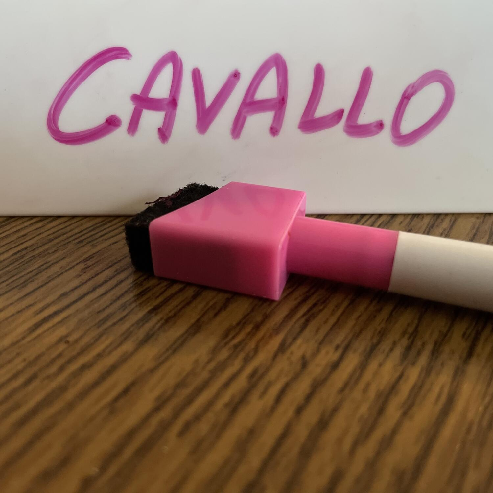
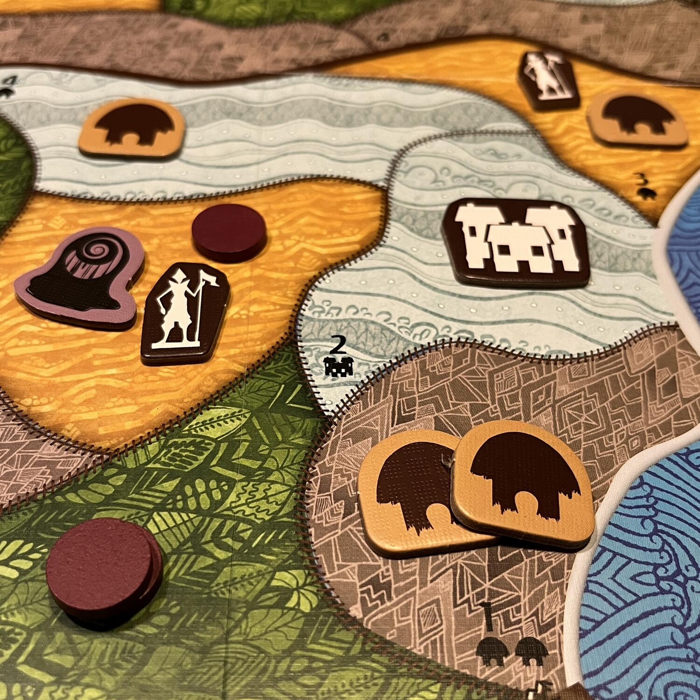

<AdvisorIntro>
  Ed eccoci! <strong>Natale si avvicina!</strong> Di nuovo... E di nuovo bisogna scegliere i regali… Già.
   
  Si prega di lasciare quegli orribili maglioni in negozio e di regalare invece qualcosa che riempia quell’ultimo,
  piccolo, spazietto sulla Kallax di ogni buon Dude. Un valido gioco da tavolo, per favore, possibilmente del 2023.
  L’ultima edizione del Monopoly, anche se a tema D&D, non conta. Chissà se quest’anno <strong>Babbo Natale</strong> mi
  ascolterà e illuminerà i miei cari convincendoli finalmente a giocare al mio gioco preferito?
</AdvisorIntro>

<AdvisorBit slug="just-one" writer="Tia">
  Se non a Natale, quando si ha l'occasione per sedersi al tavolo e cercare di portare <strong>nuovi proseliti</strong>{" "}
  alla fede dei giochi da tavolo? Se devo pensarne uno semplice, immediato, veloce da intavolare e capace di tenere per
  ore al tavolo al suon di "dai che facciamo l'ultima", questo è sicuramente Just One.
   
  Basta un "Avete mai visto l'eredità in televisione? Sedetevi che facciamo un gioco molto simile!" e avrete 6 persone
  al tavolo pronte a ridere e a prendersi in giro.
   
  Quindi, perché non regalarlo?
</AdvisorBit>

<AdvisorBit slug="horizon-of-spirit-island" writer="Fora">
  Ah… il Natale, quale momento migliore per non trovarsi in compagnia della propria famiglia a sterminare invasori a
  destra e a manca. Perché proprio questo gioco a Natale, <strong>vi chiederete voi?</strong>
   
  Perchè ad oggi questa è l’introduzione più economica e accessibile ad uno dei giochi cooperativi più belli in
  assoluto: <Link to="/reviews/spirit-island/">Spirit Island!</Link>. Quindi che aspettate? Stringetevi attorno al fuoco
  e imbarcatevi in un’avventura che vi porterà a quella successiva… E poi a un’altra… E a un’altra ancora…
</AdvisorBit>

<AdvisorBit slug="root" writer="Dadi-Daddy">
  Tra Natale e Capodanno non farete mica solo party game, giusto? Andiamo! Chi è che vorrebbe giocare ennemila partite
  di <Link to="/reviews/top-ten">Top Ten</Link> e basta? Sarebbe come ingozzarsi di patatine al cenone! Fossi in voi,
  darei un’opportunità a <strong>qualcosa di più complicato</strong>: io non vedo l’ora di rigiocare il mio Root! Da
  poco tradotta in italiano, è arrivata anche l’espansione <strong>Predoni e Cavalieri</strong> (no, quella di Catan è
  “Città e Cavalieri”) e… io ce l’ho! Non vedo l’ora di mettere alla prova i nuovi equilibri di potere nei boschi!
   A Natale siamo tutti più buoni… Tranne i topacci piromani!!! Muahahahahhaha! Spero che mentre mettono a ferro e fuoco
  i boschi, risparmino di dare alle fiamme anche l’alberoot di natale del mio salotto...
</AdvisorBit>

<AdvisorBit slug="alpaca" writer="Eris.in.Boardgameland">
  La paralisi d’analisi per trovare il regalo giusto a soli 11 giorni da Natale è sempre dietro l’angolo, quindi eccovi
  un consiglio morbidoso!  
  Perfetto da regalare ai vostri amici è <strong>l’alpaca</strong>: cucciolo coccoloso, ottimo per le passeggiate in collina
  e così tenero che li solleverà da ogni malumore, non lasciandoli mai soli!!
   
  Ah… Dite che un alpaca è scomodo da tenere nel kallax?! Oooh… Sob…
   
  Aspettate!! Ho un’alternativa!!
   
  Ringraziamo <Link to="/interview/christian-giove">Christian Giove</Link> che ha racchiuso tutte queste caratteristiche
  in Alpaca (toh, guarda la coincidenza!): un gioco facile e veloce, ma con un meccanismo di deck building per creare l’allevamento
  più bello e fruttuoso, da non sottovalutare e che vi terrà attaccati al tavolo tutto il pomeriggio!!!
   E la <strong>pucciosità</strong>? Mica sono tenere le carte…
   
  Tranquilli che a questo ci ha pensato Stefano Tartarotti con i suoi bellissimi disegni!!
   
  Non vi deluderà! Parola di scout!
</AdvisorBit>

