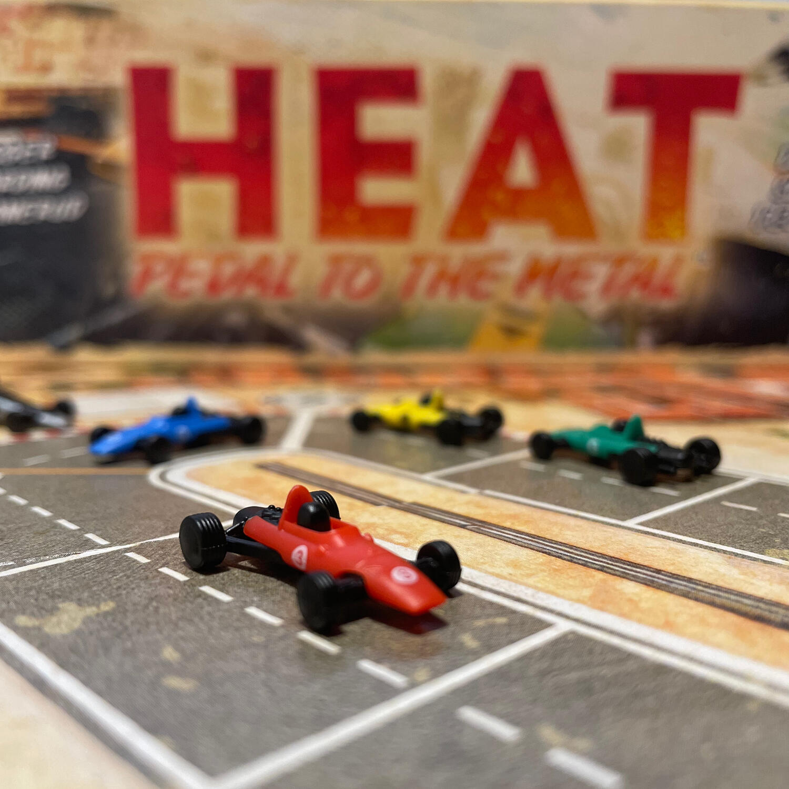
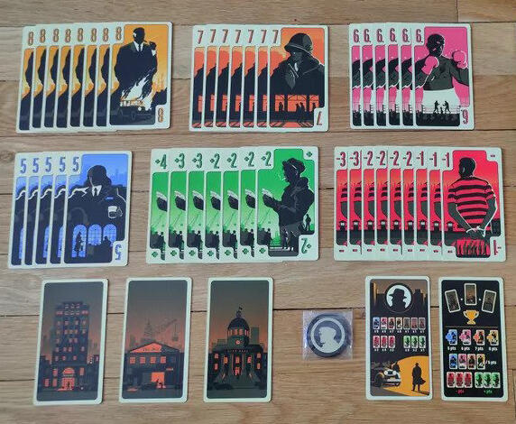
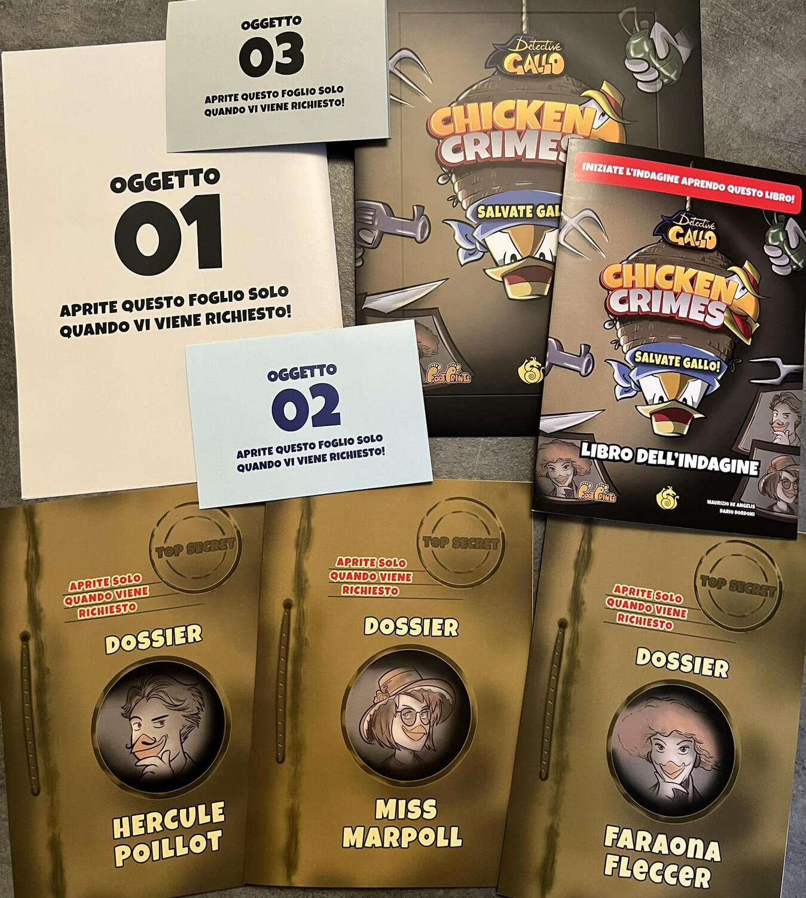

<FundingIntro>
  Se sei un amante dei giochi da tavolo, credo che non serva spendere una singola parola per spiegare cosa è Play e
  perché dovresti andarci... Altrimenti sappi che Modena Play è la fiera principale a livello nazionale circa il gioco
  da tavolo e il gioco di ruolo... insomma un bel posto.  
  Noi Dude <strong>ci saremo</strong> e saremo davvero contenti di conoscervi e di scambiare due parole con voi e, se capita,
  fare qualche partitina a uno dei tanti giochi che vogliamo provare.  
  Da oggi, per tre giorni, pubblicheremo una mini-rubrica per consigliarvi i giochi che dovreste provare e che,
  sicuramente, non potranno che meravigliarvi.
   
  Oggi inizio io, Tia. Pronti? Talk is cheap, show me the games!
</FundingIntro>

<ConBit
  title="Heat: Pedal to the metal"
  player_count={6}
  player_count_official="1-6"
  weight={2}
  playing_time="60min"
  playing_time_official="30–60min"
  score={9}
  publisher="Asmodee"
  stand="A 39"
  mechanism={["Gestione mano", "Gara", "Azioni simultanee", "Push your luck"]}
  slug="heat-pedal-to-the-metal"
>
  Un gioco di macchine? Davvero? Solamente l'idea mi annoiava!
   
  Poi Vincent Dutrait ha fatto il miracolo curando la grafica del gioco che reputo come{" "}
  <strong>il migliore che ho giocato nel 2022!</strong>  
  Cosa devi fare? In poche parole immagina un gioco dell'oca ma senza dadi, dove di quante caselle avanzare lo decidi giocando
  delle carte dalla tua mano. Ricordati, però, che è una gara e che vince solamente il primo che taglia il traguardo... e
  che tutti hanno le stesse carte nel mazzo. Un briciolo di fortuna serve sempre, ma bisogna essere lungimiranti e capire
  quanto accelerare e, soprattutto, quando frenare!
   
  Cerca di accaparrarti la pole position da Asmodee per provare questo gioco prima possibile e sappi che non tornerai a casa
  a mani vuote.
</ConBit>

<ConBit
  title="The Wolves"
  player_count={3}
  player_count_official="2-5"
  weight={3}
  playing_time="90min"
  playing_time_official="75min"
  score={9}
  publisher="Giochi uniti"
  stand="A 41"
  mechanism={["Maggioranze", "Movimento su griglia", "Setup variabile", "Gestione mano"]}
  slug="the-wolves"
>
  Programmare le azioni con largo anticipo è nelle tue corde? La grafica è un aspetto importante per definire se un
  gioco potrebbe far parte della tua collezione? Ululi ammirando una luna piena? Corri da{" "}
  <Link to="/publishers/giochi-uniti">Giochi Uniti</Link> e prova assolutamente questo gioco!
   
  In The Wolves sei il <strong>capo di un branco di lupi</strong>. Nel corso di un ciclo lunare, devi inseguire le prede
  nella natura selvaggia, reclutare lupi solitari per far crescere il tuo branco e combattere con branchi rivali per il
  controllo del territorio. Con astuzia e istinto omicida, forse riuscirete a stabilire il dominio del vostro branco.
  Forse…
</ConBit>

<ConBit
  title="District Noir"
  player_count={2}
  player_count_official="2"
  weight={1}
  playing_time="15min"
  playing_time_official="10-20min"
  hype={8}
  publisher="Studio Supernova"
  stand="B 35"
  mechanism={["Gestione mano", "Collezione set"]}
>
  <strong>Ansia</strong>? Qualcuno ha detto <strong>Ansia</strong>?
   
  In District Noir, ogni round dovrai giocare una carta (delle 5 iniziali) o prendere le ultime 5 giocate
  alternativamente tra te e il tuo unico avversario; ogni round puoi prendere una sola volta.
   
  Le carte rappresentano i numeri 5/6/7/8: alcune carte ti toglieranno punti, altre te ne regaleranno. Le carte città
  complicheranno la scelta, perché chi le avrà tutte e tre vincerà automaticamente la partita. Altrimenti, chi ha più 5
  farà 5 punti, chi ha più 6 ne farà 6... per ogni set composto da 5-6-7-8 si faranno altri 5 punti, si sommano le carte
  con il +, si sottraggono quelle con il -... e chi ha più punti vince!
   
  Semplice, no? Sulla carta! Passerai tutta la partita a domandarti se ha senso prendere ora o se è meglio aspettare un
  altro turno, nella speranza che l'avversario non ti metta una bella carta “meno” in mezzo o, ancora peggio, ti rubi le
  carte di cui ha bisogno.
   
  <strong>Ansia</strong>.
</ConBit>

<ConBit
  title="Chicken Crimes: Salvate Gallo"
  player_count={2}
  player_count_official="1-8"
  weight={3}
  playing_time="120min"
  playing_time_official="90-120min"
  hype={8}
  publisher="Dracomaca"
  stand="B 39"
  mechanism={["Deduzione"]}
>
  Non hai la minima idea di chi sia il Detective Gallo? Non preoccuparti: imparerai ad amare lui e il mondo in cui vive,
  visitando la stazione di Pollizia (sì, con due elle) e leggendo il Galletto del Mattino.
   
  Questo è il secondo capitolo del{" "}
  <Link to="/reviews/chicken-crimes-il-mistero-del-dom-gallignon/">libro game / gioco da tavolo</Link> che mi ha
  sorpreso nella mia scorsa Play.
   
  In questo capitolo, l'amato pennuto è stato <strong>rapito</strong> e, vestendo i panni di Hercule Poillot, Faraona
  Fleccer e Miss Marpoll (LOL), dovrete scoprire chi è stato, perché, dove si trova e salvarlo a tutti i costi!
   
  Speriamo non ci lasci le penne!
</ConBit>

