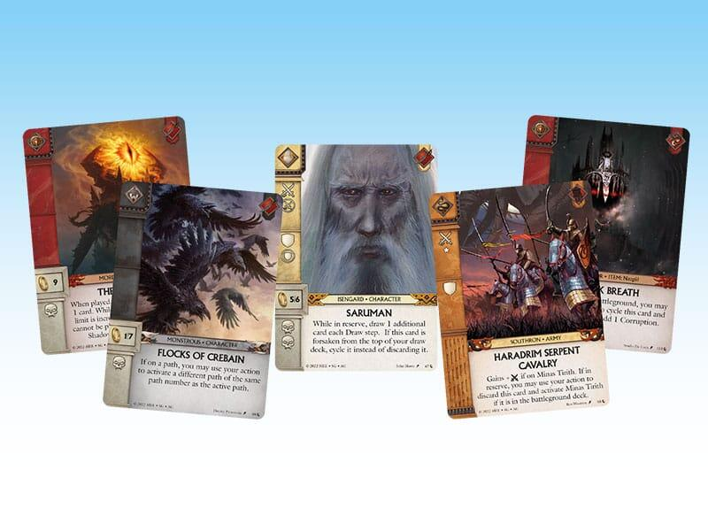
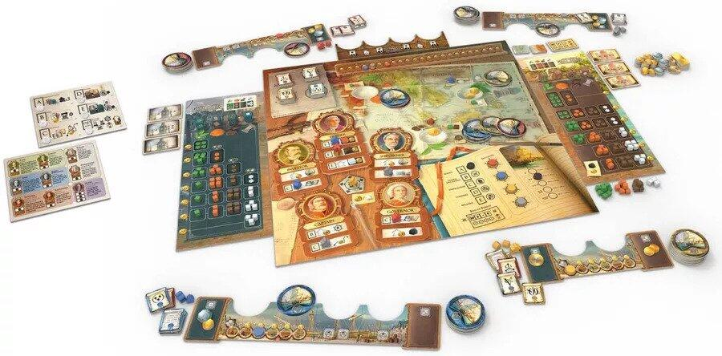
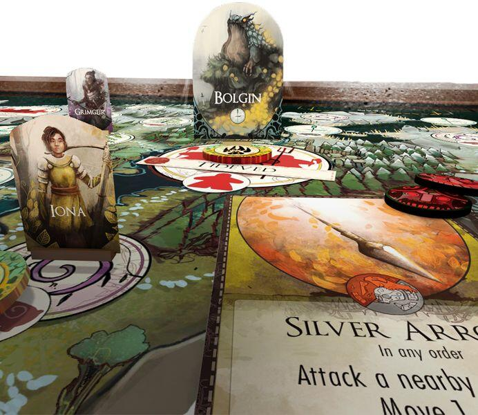

<FundingIntro>
  Ed eccoci qua, anche noi pronti ad affrontare quest’anno il Modena Play! Abbiamo curiosato fra tutte le novità che
  saranno presentate in questa fantastica fiera, alla ricerca di boardgame che potessero portarci in nuovi mondi a noi
  sconosciuti ed immergerci in storie appassionanti…ed ecco quello che abbiamo scovato per voi
</FundingIntro>

<ConBit
  title="The War of the Ring – The Card Game"
  player_count={4}
  player_count_official="2-4"
  weight={3}
  playing_time="100min"
  playing_time_official="90-120min"
  hype={10}
  publisher="Devir Italia"
  stand="B 9"
  mechanism={["Gestione mano", "Combattimento risolto con carte"]}
>
  Questo titolo è forse quello che ci sta maggiormente <strong>tentando</strong>
  ….come un anello, quell’anello, il NOSTRO TESSSORO!
   
  “The war of the Ring – The Card Game”, è un titolo pubblicato da Ares Games nel 2022 e che a brevissimo dovrebbe essere
  disponibile in italiano, localizzato da <Link to="/publishers/devir">Devir Italia</Link>: speriamo sia pronto proprio per
  Modena Play!
   
  Questo gioco di carte cerca di riproporre quel capolavoro che è la <strong>Guerra dell’Anello</strong> (edito per la prima
  volta nel 2004) in un formato più portabile e accessibile, nel quale i Popoli Liberi e le Forze dell’Ombra si sfideranno
  rispettivamente per salvare o per soggiogare la Terra di Mezzo. Sono previste 4 fazioni (due per i Popoli Liberi e due
  per le Forze dell’Ombra), controllabili da altrettanti giocatori: il prodotto è quindi pensato per quattro sfidanti (che
  giocheranno in due squadre contrapposte), ma è prevista anche una modalità per due persone.
   
  Il gioco sta ricevendo molti consensi sia per le meccaniche, che creano sfide appassionanti ed equilibrate, sia per l’ambientazione,
  che sembra essere stata riproposta in maniera molto fedele e coinvolgente dagli autori.
   
  Insomma, da grandi appassionati del <strong>Signore degli Anelli</strong>, come non cadere nella tentazione di provare
  l’Unico Anel….ops, questo gioco?
</ConBit>

<ConBit
  title="Circadians: Chaos and Order"
  player_count={4}
  player_count_official="2-5"
  weight={4}
  playing_time="120min"
  playing_time_official="120–240min"
  hype={8}
  publisher="Chur Games"
  stand="B 3"
  mechanism={["Controllo territori", "Combattimento risolto con carte", "Asimmetrico", "Albero tecnologico"]}
>
  Circadians: Chaos and Order vi tele-trasporterà sul pianeta di Ryh, al comando di una delle razze che si stanno
  contendendo il controllo del pianeta e soprattutto di sei potenti reliquie. Si sta parlando quindi di un{" "}
  <strong>war-game</strong>, dove ciascuno dei giocatori guiderà una tra le <strong>sei fazioni</strong> differenti e
  fortemente asimmetriche: la vittoria si conseguirà attraverso il controllo di alcuni artefatti (cioè le reliquie)
  disposti su differenti territori. Potrete costruire edifici, schierare truppe, sviluppare le vostre tecnologie,
  raccogliere risorse e ovviamente combattere contro i vostri avversari.
   
  “Circadians: Chaos and Order” richiama fin da subito due milestone come <Link to="/reviews/scythe/">
    Scythe
  </Link> e <Link to="/reviews/root/">Root</Link>, ma presenta delle novità che sembrano renderlo un gioco dall’identità
  ben precisa e con un gameplay convincente: innanzitutto la centralità delle reliquie, che portano potenti bonus e
  conducono alla vittoria, e poi la possibilità per ciascun giocatore di stabilire a inizio turno il prezzo da farsi
  pagare per consentire di svolgere una delle cinque azioni disponibili.
   
  Questo prodotto è la prima pubblicazione della Chur Games, casa editrice nata per localizzare in italiano le creazioni
  della Garphill Games, e questo è certo un debutto che richiama l’attenzione. Durante la fiera sarà inoltre presente
  Zachary Smith, fondatore della Chur Games e autore di Circadians: Chaos and Order, che potrà farvi provare in prima
  persona il gioco. Proprio una possibilità da non farsi sfuggire! Potrete provare presso lo stand della{" "}
  <Link to="/publishers/fever-games">Fever Games</Link>.
</ConBit>

<ConBit
  title="Compagnia delle Indie"
  player_count={4}
  player_count_official="2-4"
  weight={3}
  playing_time="100min"
  playing_time_official="90-120min"
  hype={8}
  publisher="Giochi uniti"
  stand="A 41"
  mechanism={["Piazzamento lavoratori", "Gestione risorse"]}
>
  Ma basta parlare di guerre, alieni e mostri. Parliamo di…FATTURATO!
   
  Compagnie delle Indie è un <strong>gioco economico ambientato nel XIX secolo</strong>, dove dovremo sfidarci per il
  predominio delle rotte commerciali tra l’Europa e l’Oriente. Oltre al rafforzamento della nostra compagnia, per la
  quale potremo decidere di puntare su navi veloci oppure lente ma più capienti, saremo chiamati a prestare attenzione
  anche alle dinamiche del mercato: questo vuol dire vendere i propri prodotti con il <strong>giusto tempismo</strong>{" "}
  (i prezzi potranno subire delle fluttuazioni) o persino investire sulle azioni societarie degli avversari, per trarre
  profitto dalle loro rendite.
   
  Avete già paura che vi fumerà il cervello, in mezzo a calcoli degni di un broker di Wall Street? Non preoccupatevi,
  Compagnie delle Indie si preannuncia come un gioco relativamente accessibile e alla portata di tutti.
   
  Potrete provare questo boardgame allo stand di <Link to="/publishers/giochi-uniti">Giochi Uniti</Link>!
</ConBit>

<ConBit
  title="Beast"
  player_count={3}
  player_count_official="2-4"
  weight={3}
  playing_time="90min"
  playing_time_official="60-120min"
  hype={10}
  publisher="Little rocket games"
  stand="B 11"
  mechanism={["Movimento nascosto", "Drafting", "Gestione mano"]}
>
  Piste dubbie… impronte fangose… foreste sconfinate e sinistre, dove ogni sussurro può rivelare una presenza che può
  essere fatale.
   
  In Beast, edito in Italia dalla <Link to="/publishers/little-rocket-games">Little Rockets</Link>, dei cacciatori
  professionisti avranno il compito di <strong>trovare e uccidere una creatura mistica</strong>, che sta terrorizzando i
  villaggi vicini mietendo vittime umane. Ma non siate così pronti a giudicare questa crudeltà animale: come viene
  raccontato nel gioco, la natura segue delle regole che spesso l’umanità ignora e quella che potrebbe apparire come
  semplice malvagità in realtà ha delle radici ben più profonde.
   
  Beast è quindi un gioco che si basa sulle meccaniche di movimento nascosto e nel quale ogni giocatore{" "}
  <strong>impersona un cacciatore o la Bestia</strong>. Tramite il sistema di draft si sceglieranno delle carte con le
  quali compiere azioni, due massimo per turno. La Bestia con movimenti felpati si muoverà attraverso boschi, paludi e
  caverne per perseguire degli obiettivi specifici, mentre i cacciatori, che dovranno sconfiggerla, non saranno a
  conoscenza della sua posizione, a meno che lei non attacchi o loro non la scoprano nelle proprie ricerche.
   
  Riusciranno i cacciatori ad avere la meglio o sarà la Bestia a prevalere? E soprattutto, Beast ce la farà a soddisfare
  le altissime aspettative che noi abbiamo? Speriamo di scoprirlo Modena Play, per quello che per noi è uno dei giochi
  più attesi della fiera.
</ConBit>

