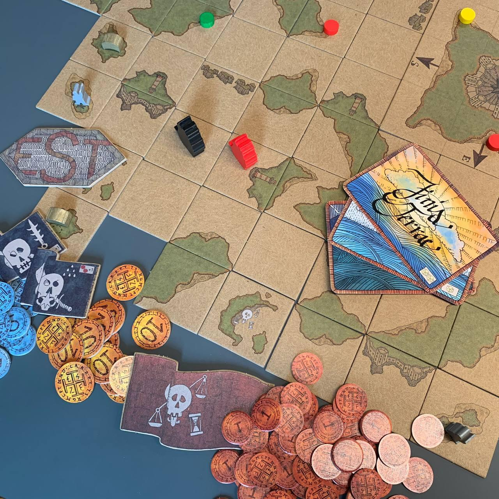
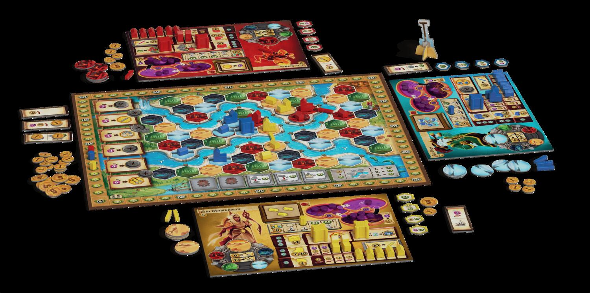
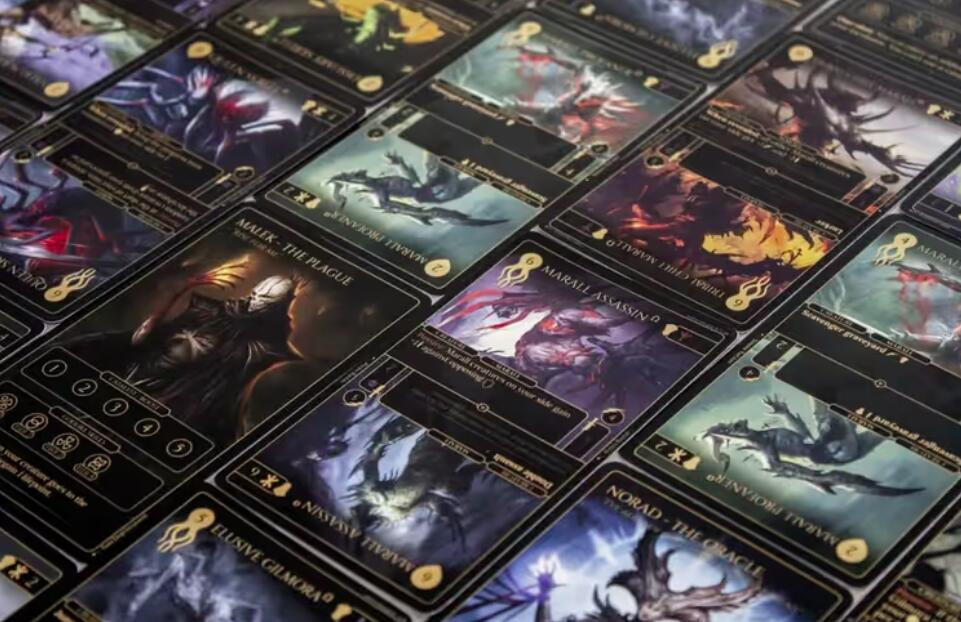
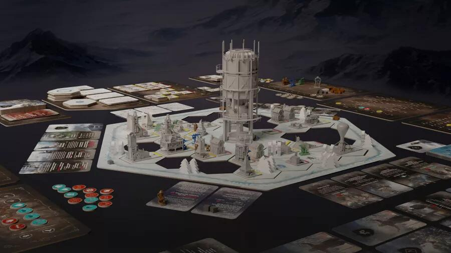

<FundingIntro>
  Una pagina tutta di rimpianti, questa…
   
  Rimpianti per giochi che non potrò provare, perché non andrò a Play 2023…
   
  Rimpianti per Kickstarter che non ho finanziato e che ora non potrò provare in fiera, essendo questi stati localizzati
  in Italia, perché… non andrò a Play 2023…
   
  L’ho già detto che non andrò a Play 2023? Sicuri?
   
  Ma mica solo io non vado alla Play da tre anni, vero?
   
  No dai… Non potete farmi questo… State mentendo…
   
  Io… Io…
   
  …
   
  Buaaaaaaaaaaaaaaah!!!
</FundingIntro>

<ConBit
  title="Finis terrae"
  player_count={3}
  player_count_official="2-4"
  weight={2}
  playing_time="60min"
  playing_time_official="40–80min"
  hype={9}
  publisher="CREARDO "
  stand="B 32"
  mechanism={["Piazzamento tessere", "Piazzamento lavoratori", "Push your luck"]}
>
  Avete sempre desiderato che <Link to="/reviews/corsari-dei-caraibi/">Corsari dei Caraibi</Link> non durasse una vita,
  ammettetelo! Se solo fosse stato un po’ più breve, meno macchinoso, se solo avesse avuto elementi intuitivi di
  piazzamento tessere “alla Carcassonne”, se solo il turno fosse stato più snello, in termini di scelte, magari con
  qualche elemento German come la gestione dei dadi… allora sì che vi sareste fatti catturare dal profumo di questo
  storico colosso dell’editoria ludica.
   
  Poi, Emanuele e Francesco Sassi Zanichelli vi leggono nel pensiero e se ne escono con Finis Terrae. Merci, scoperte,
  viaggi, pirati, tesori, bordate: tutto quello che desideravate, in un solo giro di clessidra! Ragazzi, sarebbe stato
  sicuramente il primo titolo che avrei provato in fiera! Ma voi che avrete tempo e voglia di fermarvi un’oretta (perché
  tanto durerà una partita a Finis Terrae), andate a provarlo! Andateci anche per me! E salutatemi questi pionieri
  nostrani del gioco da tavolo sostenibile che, solo per la loro scelta di orientare questo piccolo grande mondo verso
  una dimensione economica più circolare e collaborativa, meritano il nostro rispetto, la nostra ammirazione, il nostro
  orgoglio.
</ConBit>

<ConBit
  title="Terra Nova"
  player_count={3}
  player_count_official="2-4"
  weight={3}
  playing_time="80min"
  playing_time_official="60-90min"
  hype={9}
  publisher="Cranio Creations"
  stand="A 40"
  mechanism={["Punti azione come risorsa", "Albero tecnologico", "Setup variabile"]}
>
  Terra nova: un Terra Mystica… semplificato! Quattro giocatori potranno controllare diverse fazioni (mi piace l’odore
  dell’asimmetria, al mattino…), esplorando e controllando nuovi territori su cui erigere i propri edifici per
  guadagnare punti a fine partita. Per gli amanti di Terra Mystica, l’idea di una semplificazione sarà al tempo stesso
  affascinante e terrificante. La domanda se la sono posta in tanti (anche voi, non negatelo!): perché semplificare un
  gioco che funziona linearmente e che vanta uno storico successo? L’aspettativa è che lo snellimento vada tutto a
  vantaggio del gioco originale, facendolo apprezzare anche a chi lo ha trovato ostico, avvicinando gli utenti più
  sospettosi tramite un’alternativa meno impegnativa, che possa coinvolgere una più spessa fetta della popolazione
  ludica. Certo. Ma ricordate che una cosa è leggere un libro, un’altra è leggerne il riassunto!
   
  Duro, duro colpo, non poterlo provare allo stand, ma confidiamo in un successivo recupero!
</ConBit>

<ConBit
  title="Feralis"
  player_count={2}
  player_count_official="1-4"
  weight={2}
  playing_time="60min"
  playing_time_official="40-60min"
  score={8}
  publisher="Deer Games"
  stand="B 28"
  mechanism={["Gestione mano", "Drafting aperto", "Deck building"]}
  slug="feralis"
>
  Feralis: alla fine l’oscuro e spietato mondo di Morkh è in arrivo anche a Modena! Questo titolo promette decisamente
  bene per tutti gli amanti dei deck-construction games, al punto che, qui in Dudexpress,{" "}
  <Link to="/writers/fora">Fora</Link> e io ci mangiamo ancora le mani per non aver finanziato a suo tempo il
  Kickstarter, e ce le mangiamo ancora di più per non poterlo prendere a Modena di persona (lo abbiamo già detto che non
  andiamo a Play 2023…?). Tutto in questo gioco ci ispira: dall’ambientazione dark fantasy, alla finezza dell’artwork,
  all’evocatività del lessico (incubazione, richiamo, risveglio: e tutto improvvisamente risuona più alieno, misterioso
  e leggendario!). Mi raccomando: provatelo e fateci sapere se anche a voi corre un brivido lungo la schiena fissando
  gli occhi funesti e selvatici delle brutali creature di… Feralis!
</ConBit>

<ConBit
  title="Frostpunk"
  player_count={1}
  player_count_official="1-4"
  weight={4}
  playing_time="120min"
  playing_time_official="120-150min"
  hype={8}
  publisher="Pendragon"
  stand="A 2"
  mechanism={["Cooperativo", "Scenari", "Gestione risorse", "Gimmick"]}
>
  E per la serie “Kickstarter che avremmo tanto voluto finanziare e non abbiamo finanziato”, Pendragon Games Studio ha
  deciso, per la “fortuna” dei nostri risparmi, di farci il sommo favore di localizzare nel bel Paese questo titolone,
  che traspone ambiziosamente sul tavolo il fortunato videogioco (perché mai non dovrebbe esistere la versione analogica
  dei videogiochi??).
   
  Benvenuti, anzi, bentornati, nella distopica e post-apocalittica colonia che in una nuova era glaciale vi farà tremare
  per il freddo di fronte alla vostra nuova divinità: il generatore. Preparatevi a rinunce brutali, a scelte eticamente
  controverse e al duro confronto con le reazioni della gente comune alle vostre politiche. Gestite con prudenza ogni
  singolo brandello di risorsa e preparatevi a fronteggiare l’ultima sfida di Adam Kwapiński! Adatto a tutti quei
  giocatori a cui, come a me, non bastano le vere difficoltà della vita, ma che anelano a respirare la gelida aria di un
  gestionale a tema sopravvivenza!
</ConBit>

