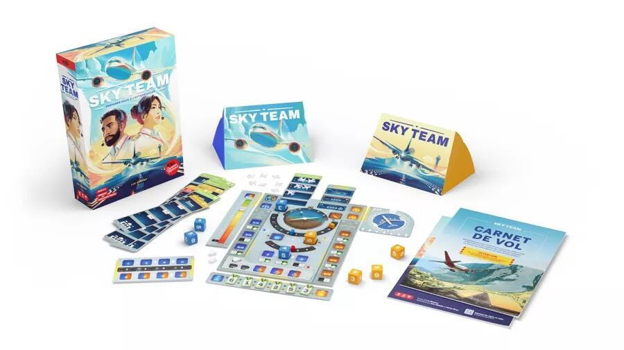
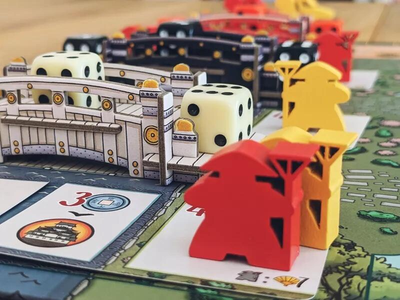
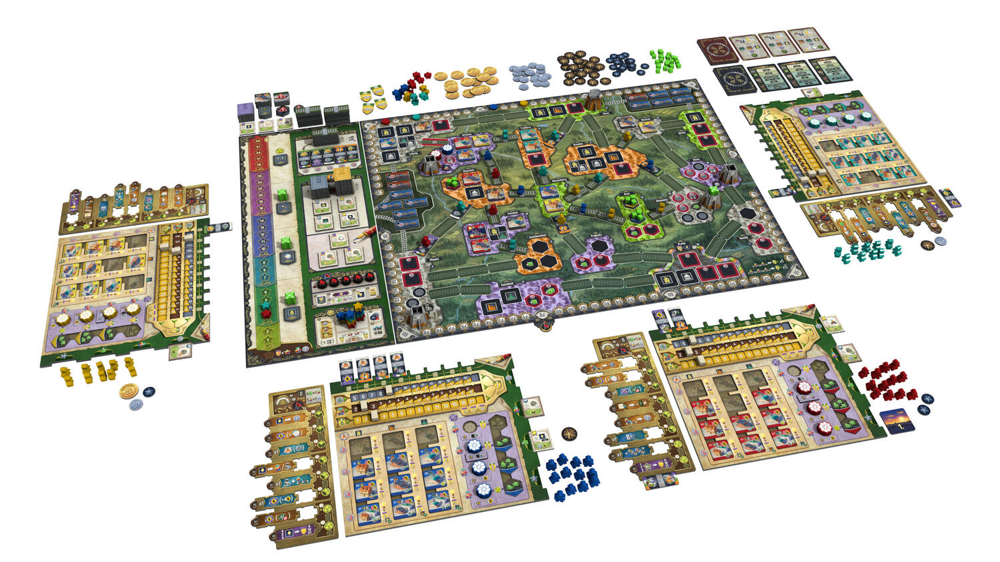
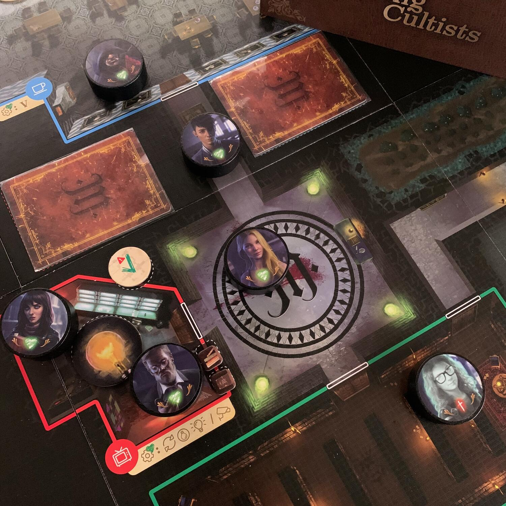

<FundingIntro>
  Se sei un amante dei giochi da tavolo, credo che non serva spendere una singola parola per spiegare cosa è lo{" "}
  <strong>Spiel di Essen</strong> e perché dovresti andarci...
   
  Quest'anno, per me, sarà la <strong>prima volta</strong> in vita che metterò piede sul suolo dello Spiel e sono sicuro
  che non sarà l'ultima.  
  Per andare allo Spiel bisogna aver studiato quanto verrà presentato, essere pronti e capaci di massimizzare ogni secondo
  passato in quei capannoni in modo da provare quanti più titoli possibili!  
  Ecco, ci ho studiato su, questa è la prima parte dei miei consigli!  
  <strong>Venite anche voi?</strong>  
  Battetemi tranquillamente sulla spalla e facciamo una partita assieme, oppure organizziamoci per una birretta durante
  la sera!
</FundingIntro>

<ConBit
  title="Sky team"
  player_count={2}
  player_count_official="2"
  weight={2}
  playing_time="30min"
  playing_time_official="15min"
  hype={10}
  publisher="Le Scorpion Masqué"
  stand="6F300"
  mechanism={["Comunicazione limitata", "Cooperativo", "Dadi"]}
>
  Hai mai sognato di entrare nella <strong>cabina di pilotaggio di un Boeing 747</strong>?  
  Di poter premere tutti quei pulsanti?
   
  Di muovere tutte quelle leve?
   
  E di giocherellare con la cloche?
   
  Sky team ovviamente non è questo, ma va a toccare i pulsanti e le leve giuste per farti assaporare quello che deve essere
  uno dei lavori più affascinanti del mondo: il pilota di aereo!  
  In questo gioco, <strong>un giocatore sarà il pilota e l'altro il co-pilota</strong>. Entrambi dovranno lavorare
  assieme per fare atterrare l'aeroplano, senza distruggerlo. La cosa interessante è come dovranno farlo: ognuno, a
  turno, andrà a giocare dei dadi (precedentemente lanciati in segreto) per modificare l'inclinazione, lo stato del
  carrello, la forza dei freni... e lo farà senza concordarsi con il collega. Cosa può andare storto?
   
  C'è solo un modo per far <strong>atterrare l'aereo tutto intero</strong>, negli altri casi si andranno a contare le
  vittime.  
  Il feeling che mi ha dato è un po' quello di <Link to="/reviews/ahotnik/">Ahotnik</Link>, ma con una durata a partita più
  adatta a giochi di questo tipo.
   
  Vi dico, non credo che nemmeno lo proverò, <strong>viene a casa con me al 100%</strong>.
</ConBit>

<ConBit
  title="The White Castle"
  player_count={3}
  player_count_official="1-4"
  weight={3}
  playing_time="90min"
  playing_time_official="80min"
  hype={9}
  publisher="Devir"
  stand="3D129"
  mechanism={["Piazzamento lavoratori", "Dadi"]}
>
  The White Castle è il <strong>classico eurogame</strong> che prende tante piccole meccaniche da altri giochi, prova a
  metterle assieme e... <strong>sembra farle funzionare!</strong>  
  Durante il gioco, nell'arco di tre round, i giocatori invieranno membri del proprio clan a curare i giardini, a difendere
  il castello o li faranno avanzare nella scala sociale della nobiltà.  
  Per farlo, dovrete gestire risorse, posizionare dei lavoratori e dei
  <strong>dadi-lavoratori</strong>. Questi ultimi sono il fulcro del gioco: potrete prendere il minore e il maggiore da uno
  dei tre ponti in comune tra tutti i giocatori e utilizzarli negli spazi azione sul tabellone. Ora, <strong>se il dado è più basso del valore richiesto dall'azione, andrete a pagare la differenza in monete, altrimenti guadagnerete quei soldi!</strong> Quindi basta prendere sempre il dado più alto, giusto?!? Eh no, perché se prenderete il dado basso dal ponte,
  avrete accesso a dei bonus!  
  Carino no? A me ispira!  
  Se <Link to="/reviews/sulle-tracce-di-marco-polo/">Marco Polo</Link> è nella vostra top 10, dategli assolutamente un'occhiata.{" "}
   
  <small>
    Ringrazio <Link to="/writers/ladybugmeeple">LadyBugMeeple</Link> per la bellissima foto &lt;3
  </small>
</ConBit>

<ConBit
  title="Nucleum"
  player_count={3}
  player_count_official="1-4"
  weight={4}
  playing_time="120min"
  playing_time_official="60-150min"
  hype={8}
  publisher="Board&Dice"
  stand="3H110"
  mechanism={["Costruzione rete", "Contratti", "Mercato"]}
>
  Prendete una briciola di <em>Barrage</em> e un po' di <em>Brass Birmingham</em>, mischiateli, ed ecco a voi l'ultima
  fatica di <Link to="/designers/simone-luciani">Luciani</Link> e <Link to="/designers/david-turczi">Turczi</Link> di
  cui non potete fare a meno!
   
  Assumerete il <strong>ruolo di industriali</strong> che vogliono avere successo durante il boom economico e
  tecnologico della Sassonia del XIX secolo, alimentato dall'invenzione e dalla diffusione del Nucleum (di fatto un
  reattore nucleare).
   
  I giocatori andranno a sviluppare le proprie reti, costruendo e alimentando edifici urbani, completando contratti e
  raggiungendo gli obiettivi di fine gioco.  
  Cosa mi aspetto da questo titolo? Avete presente quando vi alzate dal tavolo dopo aver giocato, salutate gli amici e pensate
  al gioco, vi lavate i denti e pensate al gioco, andate a dormire e pensate al gioco?  
  <strong>
    Vi dico solo che sono tentato di provarlo l'ultimo giorno che sarò in fiera: ho paura che tanti titoli che proverò
    non mi piaceranno altrettanto!
  </strong>
</ConBit>

<ConBit
  title="Among Cultists"
  player_count={6}
  player_count_official="4-8"
  weight={2}
  playing_time="45min"
  playing_time_official="45–90min"
  score={7}
  publisher="Godot Games"
  stand="3X110"
  mechanism={["Bluff", "Deduzione"]}
  slug="among-cultists-a-social-deduction-thriller"
>
  Se leggete questo blog post significa che avete superato la pandemia. Se avete superato la pandemia significa che
  siete entrati in contatto con <em>Among us.</em>  
  Matematico.
   
  Cosa è Among Cultists? È il porting di <strong>Among us</strong>, in un mondo che richiama <strong>Lovecraft</strong>,
  dove i giocatori saranno catapultati in un gioco di ruoli nascosti (Resistence?) nel quale i cultisti dovranno ammazzare
  gli altri e viceversa!
   
  Siete pronti per abbracciare gli Antichi?
   
  Leggete pure la <strong>recensione completa</strong>, l'abbiamo gia provato per voi!
</ConBit>

