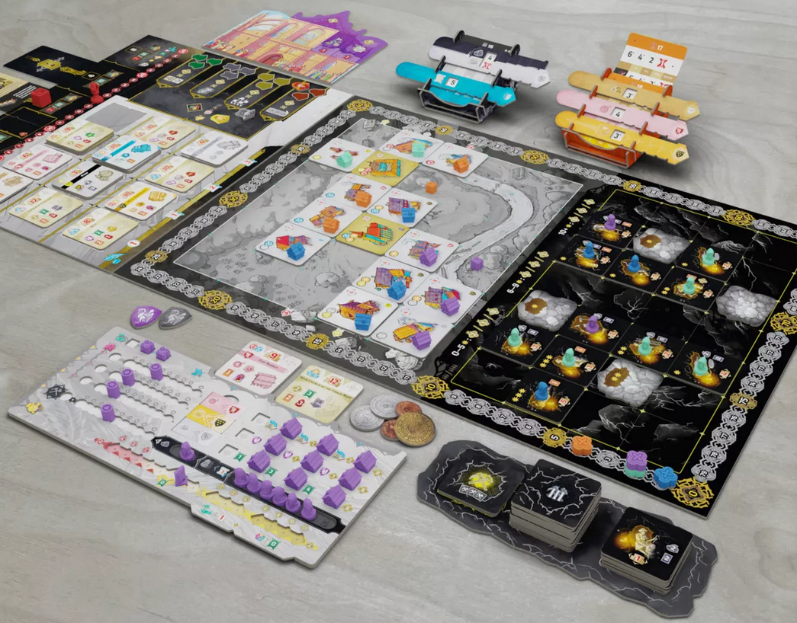
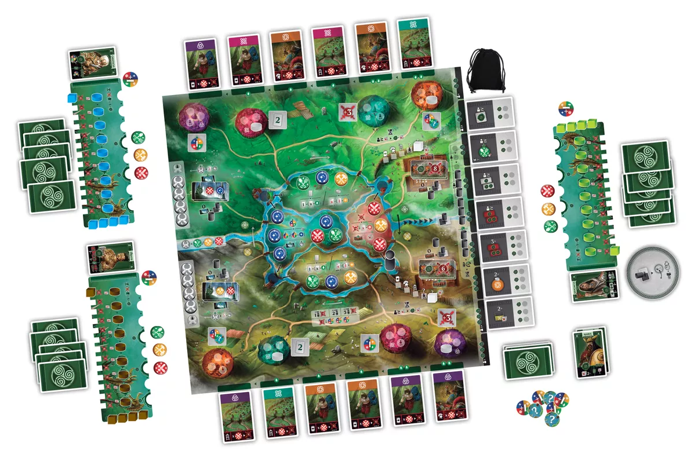
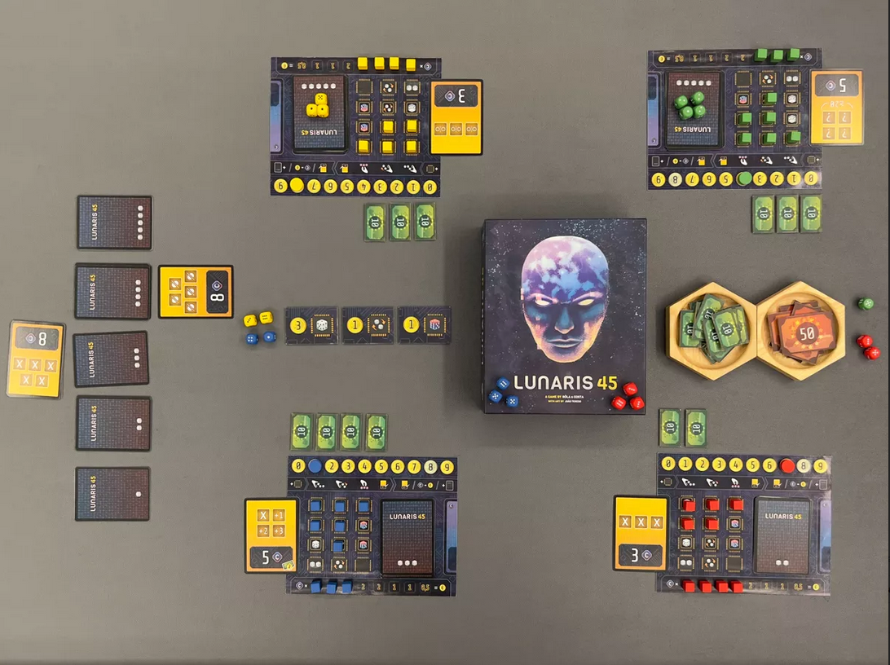

<FundingIntro>
  Una volta abbiamo letto che ogni anno, nel mondo dei giochi da tavolo, escono oltre 2000 nuovi titoli: 2000! Una marea
  di stimoli, suggerimenti e nuovi giochi da provare: come fare a orientarsi fra tutte queste novità? Non c'è una
  risposta univoca, ma di sicuro l'Essen Spiel ci aiuta: un’enorme fiera, l'evento in Europa più grande e importante per
  i giochi da tavolo, dove è possibile vedere tante, ma davvero tante delle novità più interessanti…o sono queste a
  guardare voi, tentandovi a fare una demo e, chissà, anche ad acquistarle?
   
  Noi abbiamo spulciato un po' l'elenco dei giochi che verranno presentati ad Essen, cercando di individuare quelli per
  noi più interessanti: quattro titoli, tra storia e spazio, di cui due tra le novità più note, e altri due di cui forse
  si è parlato poco, e che rischiano di passare ingiustamente inosservati. Ma tu, caro lettore, certamente non puoi
  permetterti tale disattenzione! Buona lettura!
</FundingIntro>

<ConBit
  title="Kutnà Hora"
  player_count={4}
  player_count_official="2-4"
  weight={4}
  playing_time="120min"
  playing_time_official="60-120min"
  hype={10}
  publisher="Czech Games Edition"
  stand="3Y124"
  mechanism={["Economico"]}
>
  <strong>Kutna Hora</strong> è una piccola cittadina della Repubblica Ceca, che tra il 1400 e il 1600 conobbe il suo
  momento di gloria grazie all’estrazione e alla lavorazione dell’argento.
   
  La <Link to="/publishers/czech-games-edition">Czech Games Edition</Link> ci porta a rivivere questo periodo d’oro (o
  meglio, d’argento), proponendoci <strong>un german articolato di stampo economico</strong>; un{" "}
  <strong>city building</strong> che promette di ricreare interessantissime combinazioni tra il mondo urbano in
  superficie e le miniere sotto terra, con la possibilità, inoltre, di gestire un <strong>mercato variabile</strong>{" "}
  influenzato dalle scelte di ciascun giocatore. Insomma, per noi una delle novità più attese di Essen, che si candida
  fortemente ad essere <strong>uno dei migliori german di quest’anno</strong>.
</ConBit>

<ConBit
  title="Evacuation"
  player_count={4}
  player_count_official="1-4"
  weight={4}
  playing_time="150min"
  playing_time_official="60-150min"
  hype={10}
  publisher="Delicious Games"
  stand="4J120"
  mechanism={["Gestione mano", "Gestione risorse"]}
>
  Rimaniamo sempre in Repubblica Ceca, con <strong>Vladimir Suchy</strong> (autore di Messina 1347, Underwater Cities,
  Pulsar 2849), che sarà uno dei protagonisti di questo Essen 2023, presentando ben due novità con la propria firma:{" "}
  <strong>Aldebaran Duel</strong> e, soprattutto, <strong>Evacuation</strong>. 
  In Evacuation, edito dalla Delicious Games (in Italia sarà pubblicato dalla <Link to="/publishers/tesla-games">
    Tesla Games
  </Link> con il nome di <strong>Hexodus</strong>), la Terra è oramai stata compromessa dal cambiamento climatico e dalle
  radiazioni solari, ed è necessario lasciare il nostro amato ma maltrattato Pianeta Blu per trasferirsi su un nuovo pianeta
  abitabile: il <strong>gioco è un gestionale</strong>, dove dovremmo smantellare infrastrutture, città, fabbriche e stadi
  per ricostruire la nostra società nel nuovo mondo, cercando di combinare al meglio le risorse, il trasporto e l’insediamento.
  Sarà quindi necessario <strong>creare le combinazioni giuste</strong> e gestire al meglio il <strong>
    timing delle proprie mosse
  </strong>. Anche qui parliamo di <strong>uno dei german più interessanti dell’anno</strong>: si capisce qual è il nostro
  genere di giochi preferito? D’altra parte, di quali giochi vogliamo parlare in una fiera che si svolgerà in Germania?
</ConBit>

<ConBit
  title="Celtae"
  player_count={4}
  player_count_official="1-4"
  weight={3}
  playing_time="100min"
  playing_time_official="50-100min"
  hype={8}
  publisher="Pythagoras games"
  stand="5M106"
  mechanism={["Piazzamento lavoratori", "Maggioranze"]}
>
  Torniamo ora indietro nel tempo, ai tempi degli antichi Celti e dei Romani, con questo{" "}
  <strong>
    <Link to="/mechanisms/piazzamento-lavoratori">piazzamento lavoratori</Link>
  </strong>{" "}
  dalla grafica cartoonesca e colorata (l’artista è Mihajlo Dimitrievsky, lo stesso dei giochi della Garphill Games)
  prodotto dalla Pythagoras Games, casa editrice portoghese. Il fulcro del gioco sarà qui costituito da una{" "}
  <strong>rondella</strong> (che si concretizza in quattro luoghi in circolo dove potersi muoversi lungo la mappa), che
  utilizzeremo per svolgere le azioni di{" "}
  <strong>coltivare, costruire, sviluppare la nostra tribù e combattere contro i Romani</strong>. Oltre alle azioni che vogliamo
  fare, il nostro movimento lungo la rondella sarà determinato anche dai bonus/malus che potremmo ottenere e dal fatto che
  quando verrà completato un giro i giocatori potranno influenzare il sistema di assegnazione dei punti vittoria. Il gioco
  pare coniugare un <strong>regolamento lineare ad una profondità di gioco interessante</strong>, ed è una delle novità che
  ai nostri occhi ha spiccato di più rispetto a tante altre. Inoltre come non sentirsi chiamati in causa dallo sguardo di
  sfida della guerriera/druida in copertina?
</ConBit>

<ConBit
  title="Lunaris 45"
  player_count={4}
  player_count_official="2-4"
  weight={2}
  playing_time="30min"
  playing_time_official="25-50"
  hype={9}
  publisher="Pile Up Games"
  stand="5M106"
  mechanism={["Dadi", "Contratti"]}
>
  Gioco dalle dimensioni ridotte pubblicato dalla Pile Up Games, ma che ci ha fin da subito incuriositi per la sua
  grafica sci-fi e per il suo sistema di gioco: in Lunaris 45 saremo chiamati a testare la sicurezza e l’affidabilità
  cybernetica di un’AI che gestirà in futuro il funzionamento di una colonia avanguardistica sulla Luna. Per far questo
  dovremo superare <strong>alcuni test di sicurezza</strong>, che concretamente dipenderanno dal risultato di alcuni{" "}
  <strong>
    <Link to="/mechanisms/dadi">dadi</Link>
  </strong>{" "}
  che lanceremo, ma <strong>che potremmo controllare e gestire in base ad alcuni diversi miglioramenti</strong> che
  acquisteremo durante la partita e che dipenderanno dalla strategia che decideremo di seguire. Il tutto all’interno di
  partite di circa 30 minuti, e con la possibilità di mettere al tavolo fino a 4 giocatori.  
  Lunaris 45 è un piccolo gioco finora passato inosservato, ma promette bene e sembra essere <strong>
    una piccola chicca
  </strong> nell’ambito di quei giochi che si collocano tra i filler e i pesi medi. Da provare assolutamente!
</ConBit>

