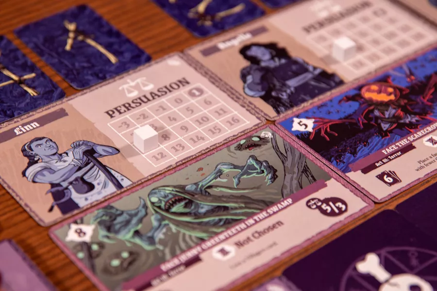
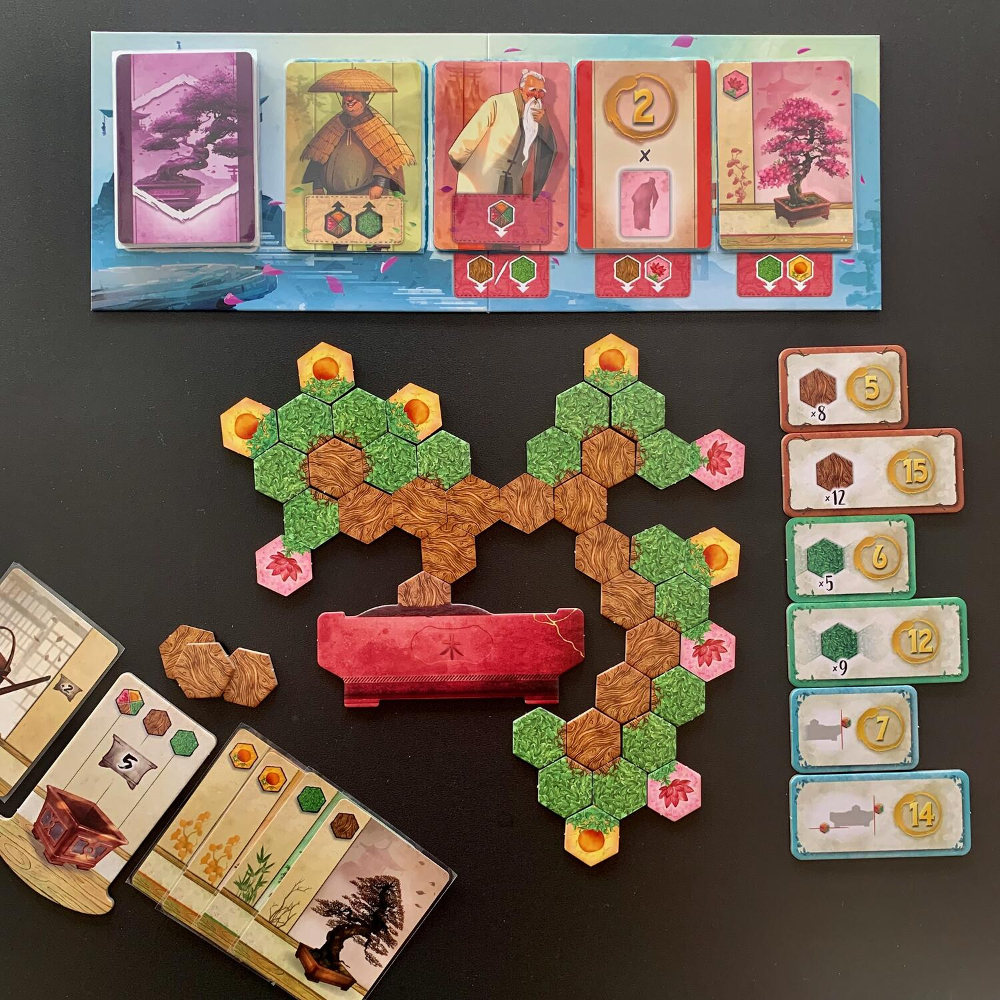
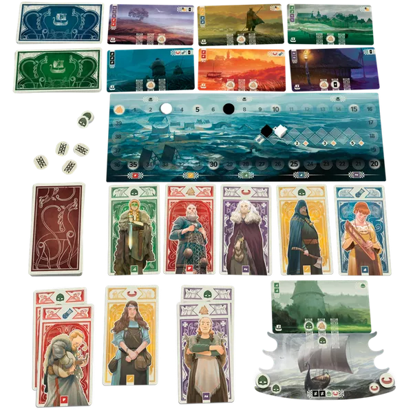
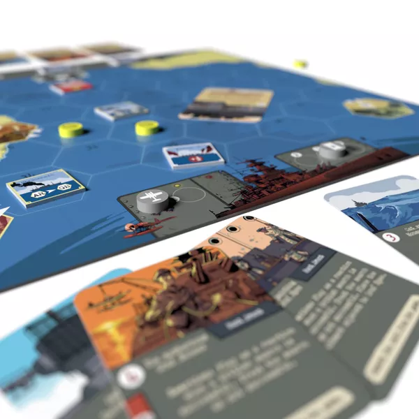

<FundingIntro>
  In questo momento sono in macchina, tra <strong>Trento e Essen</strong>. 
  Lo sarò per 10 belle ore insieme ad altri 2 amici. 
  Non abbiamo voluto viaggiare in 4... non ci sarebbe stato posto per i giochi, al ritorno.  
  Anche voi siete nella mia situazione? <strong>Se siete in viaggio, scrivetemi su IG e vediamo se riusciamo a trovarci addirittura sta sera per iniziare al meglio questo fine settimana!</strong> 
  Daghe!
</FundingIntro>

<ConBit
  title="Witchcraft!"
  player_count={1}
  player_count_official="1"
  weight={2}
  playing_time="40min"
  playing_time_official="20-40min"
  hype={10}
  publisher="Salt & Pepper Games"
  stand="3S102"
  mechanism={[
    "Combattimento risolto con carte",
    "Deck building",
    "Gestione mano",
    "Drafting aperto",
    "Push your luck",
    "Solitario",
  ]}
>
  Vi ricordate <Link to="/reviews/no-pasaran/">¡No pasarán!</Link>? <strong>Witchcraft è il suo erede spirituale</strong>: stessi autori, stessa casa editrice, stesso formato, stessa idea di base! 
  Ma... che cambia?  
  Qui non sarete più Maquis alle prese con i fascisti franchisti, bensì delle <strong>streghe</strong> che puntano a far capire alla popolazione del villaggio che la magia non è pericolosa mentre gli stessi abitanti cercheranno di mettervi in gabbia. 
  Oltre che al tema, ci saranno anche un po' di novità: <strong>le famiglie, i relativi poteri e il metodo di fine partita</strong>. 
  Le streghe appartengono a varie famiglie, ognuna delle quali ha un potere caratteristico che verrà migliorato se nel nostro mazzo / mano / scarto saranno presenti altri membri della stessa. <strong>Combo? Oh yes!</strong>  
  La partita, invece, non sarà un continuare a raccogliere punti e vedere fin dove si arriva (come in No pasaran), bensì il tentativo di conquistare la fiducia di <strong>3 giudici</strong> che decideranno del nostro destino. Bisognerà toccare le giuste corde, ammazzare i nemici appropriati e completare le missioni adeguate per portarli dalla nostra parte.
</ConBit>

<ConBit
  title="Bonsai"
  player_count={3}
  player_count_official="1-4"
  weight={2}
  playing_time="45min"
  playing_time_official="40min"
  score={8}
  publisher="DV Games"
  stand="2E143"
  mechanism={["Mercato", "Piazzamento tessere"]}
  slug="bonsai"
>
  Bonsai è quel gioco velocissimo da spiegare e da intavolare quando qualche tuo amico ti dice "eh ma i giochi da tavolo, a me, mmmannoiano" avendo conoscenza, forse, di Hotel.  
  Quattro regole in croce, <strong>effetto scenico</strong> al tavolo di primo livello e la soddisfazione di aver fatto qualcosa di bello quando, a fine partita, ti alzi dal tavolo. 
  Il gioco di per sé è <strong>molto semplice</strong>: ogni turno si sceglie una carta da un mercatino, ottenendo eventuali bonus, la si attiva e si passa. Altrimenti si può decidere di spostare tessere bonsai già collezionate sull'alberello. 
  Leggete pure la <strong>recensione completa</strong>, l'abbiamo gia provato per voi! 
  Provatelo, vi piacerà!
</ConBit>

<ConBit
  title="Knarr"
  player_count={2}
  player_count_official="2-4"
  weight={2}
  playing_time="20min"
  playing_time_official="30min"
  hype={8}
  publisher="Bombyx"
  stand="6C301"
  mechanism={["Collezione set", "Gestione mano", "Gara"]}
>
  Dopo <strong>decine di partite su BGA</strong> non vedo l'ora di andare a provare questo gioco direttamente in fiera. Di che si tratta?  
  Knarr è più difficile da scrivere che da giocare: il gioco è, sotto sotto, un <strong>set collection</strong>. 
  Ogni turno potremo fare due azioni: giocare una delle 3 carte che abbiamo in mano oppure scartarne per ottenere una delle carte obiettivo disponibili a tutti i giocatori.  
  Ogni carta ha un colore (5 in tutto) e un simbolo (punti vittoria / influenza / braccialetti / aiutanti). La carta, una volta giocata, andrà <strong>posizionata sulla colonna dello stesso colore</strong> di fronte a noi e tutte le carte che la compongono verranno nuovamente attivate. <strong>Più carte ci saranno, più l'azione sarà distruttiva</strong>. 
  Lo so che non è niente di innovativo, ma è una droga. Sarà che su BGA una partita dura 10 minuti, sarà che c'è sempre qualcuno che vuole giocare con me, sarà che vinco (quasi) sempre...
</ConBit>

<ConBit
  title="The Hunt"
  player_count={2}
  player_count_official="2"
  weight={2}
  playing_time="30min"
  playing_time_official="20-45min"
  hype={8}
  publisher="Salt & Pepper Games"
  stand="3S102"
  mechanism={["Combattimento risolto con carte", "Movimento nascosto"]}
>
  Gioco di carte? Asimmetrico? Due giocatori? Seconda guerra mondiale? Allora deve essere mio! <Link to="/reviews/undaunted-north-africa/">Undaunted</Link>? Ah no, non sto parlando di questo. 
  Storicamente, nel <strong>settembre del '39</strong>, il comandante della Admiral Graf Spee ricevette l'ordine di affondare il maggior numero possibile di navi da carico britanniche nell'Atlantico meridionale per impedire che i rifornimenti raggiungessero il Regno Unito. Il piano funzionò e vennero spediti sul fondo dell'oceano 50.000 tonnellate di materiale assieme a 9 navi da carico inglesi.  
  The Hunt vuole <strong>ripercorrere questo evento</strong>.  
  Da una parte i tedeschi, con i loro <strong>movimenti nascosti</strong>, pronti a rivelarsi solamente quando saranno sicuri di poter affondare le navi della Royal Navy; dall'altra gli inglesi, che devono portare a termine le spedizioni e resistere fino alla fine della partita, dove avrà luogo la battaglia finale. E tutto questo a suon di carte azione! 
  Riuscirà la Royal Navy a sfruttare la sua <strong>superiorità numerica</strong> o sarà la Kriegsmarine che, con la sua astuzia e la sua raffinata strategia, riuscirà ad abbattere il suo rivale?
</ConBit>

