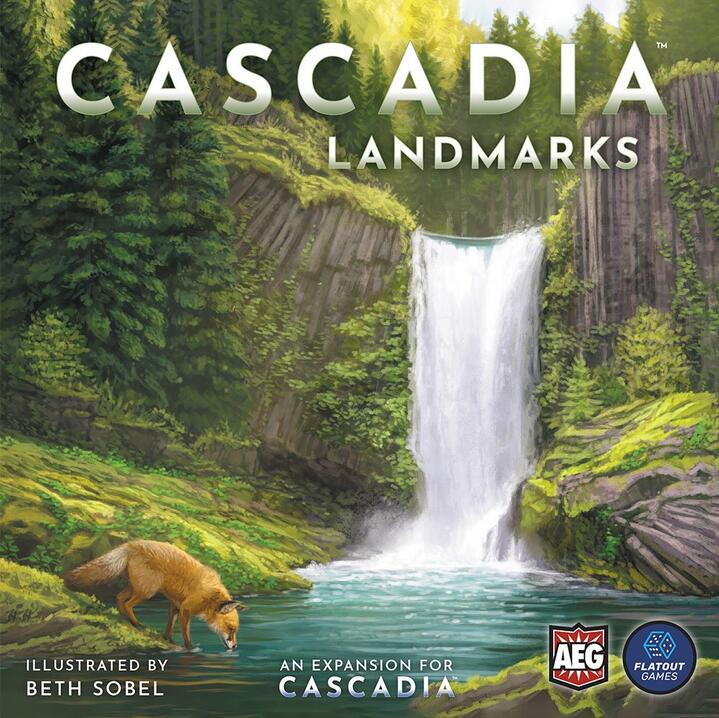
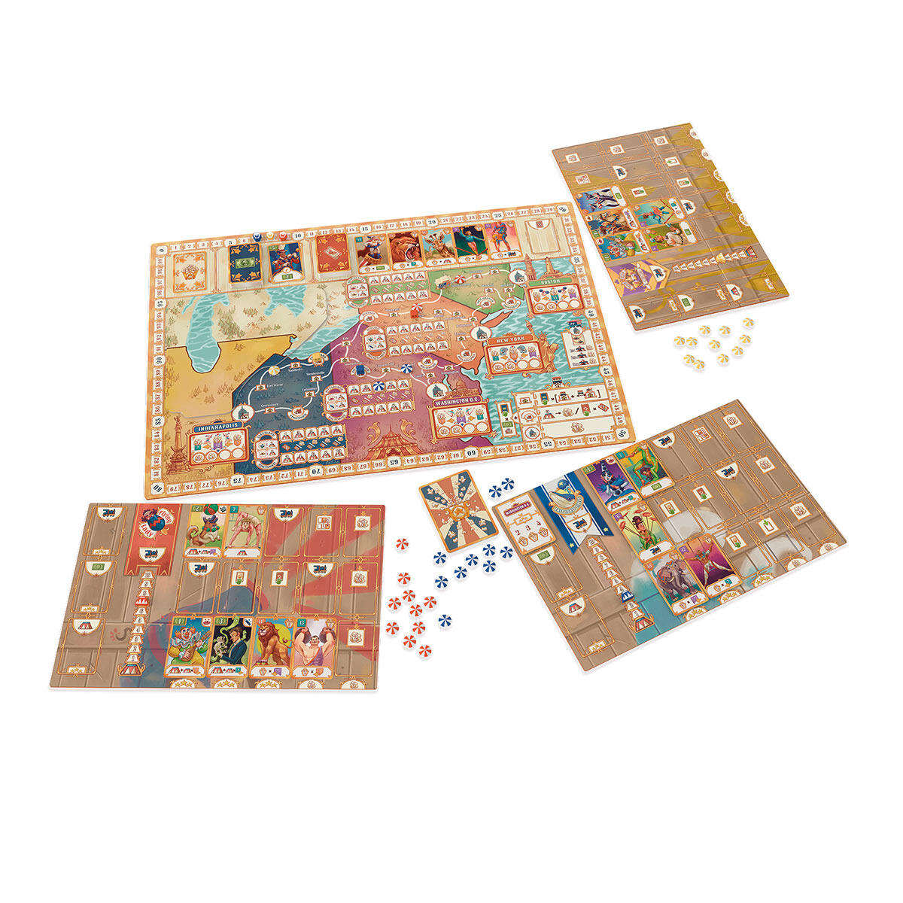
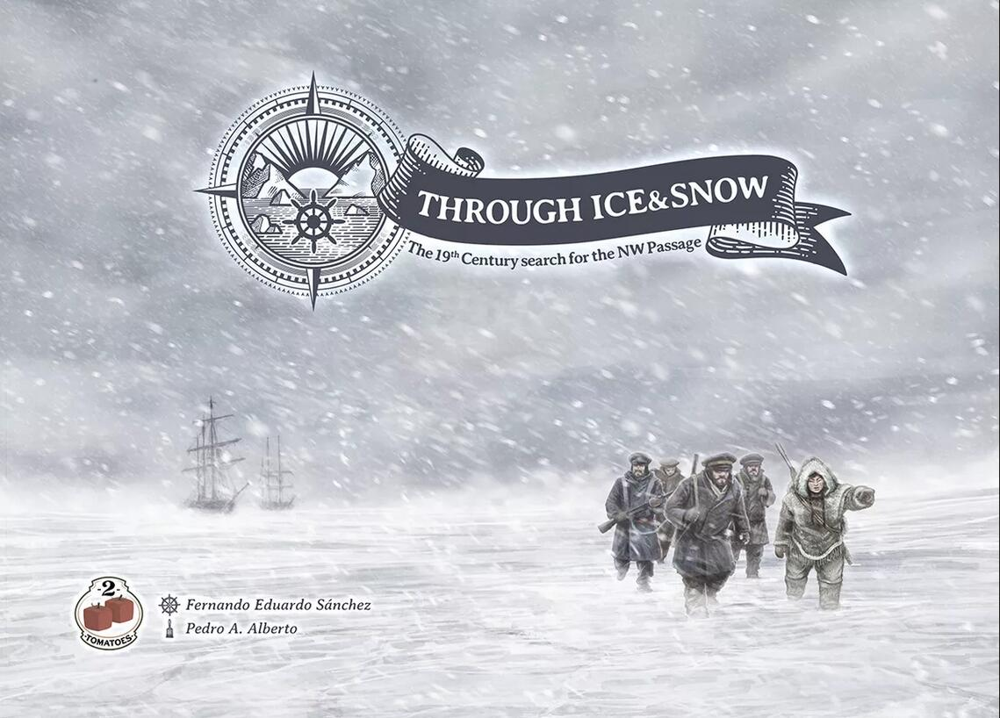
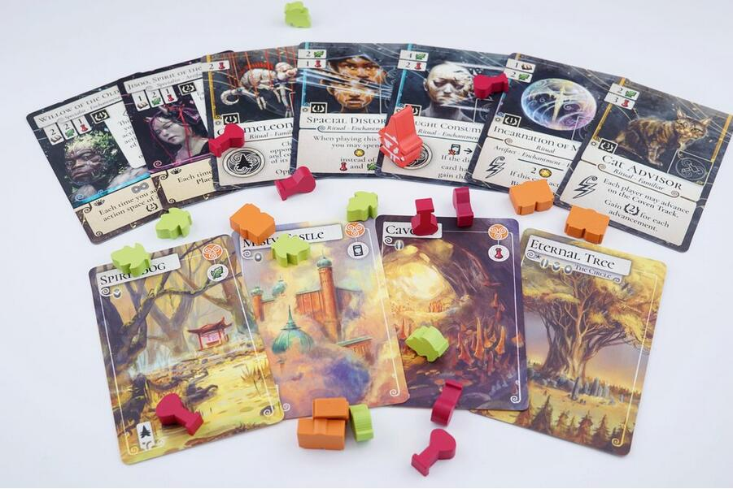

<FundingIntro>
  Non volevo fare un torto a Modena Play 2023… Quindi "ho deciso" che non andrò neanche a Essen 2023... E il mio cuscino
  inzuppato di lacrime notturne finirà nell’armadio segreto dei cuscini bagnati di lacrime notturne, insieme al cuscino
  di Essen 2022, quello di Play 2022, quello di Essen 2021, quello di Play 2021… Ma sì, non importa, dai… Non potevo
  evitarlo…
   
  Sarà per l’anno prossimo…
   
  Andrà meglio…
   
  Già…
   
  ...
</FundingIntro>

<ConBit
  title="Cascadia: Landmarks"
  player_count={6}
  player_count_official="1-6"
  weight={3}
  playing_time="45min"
  playing_time_official="30-45min"
  score={8}
  publisher="AEG"
  stand="3-B110"
  mechanism={["Piazzamento tessere", "Costruzione di Pattern", "Astratto"]}
  slug="cascadia-landmarks"
>
  La splendida regione <Link to="/reviews/cascadia">Cascadia</Link> del Nord-Ovest Pacifico vi attende, con i suoi
  incantevoli e lussureggianti ecosistemi, per ospitare ancora una volta i vostri habitat alpini, artici,
  pluviali-temperati e desertici. Ai vostri paradisi della vita selvatica stavolta potrete aggiungere dei{" "}
  <strong>landmark</strong>, i quali <strong>caratterizzeranno ulteriormente ogni ambiente</strong> e vi offriranno
  ulteriori punti vittoria!
   
  Se avete amato il vincitore dello <Link to="/advisor/spiel-des-jahres-vecchi-e-nuovi/">Spiel des Jahres 2022</Link>{" "}
  per la rilassatezza che infonde al tavolo da gioco, per la sua pulita linearità e per il suo peculiare sfondo
  educativo, non potrete non essere curiosi di sbirciare <strong>l’espansione Landmarks</strong>, modulo che, peraltro,
  consente di arrivare <strong>fino a 6 giocatori</strong>. 
  Non mi lascerei mai sfuggire l’occasione di provarlo… Se solo potessi andare a Essen quest’anno...
</ConBit>

<ConBit
  title="3 Ring Circus"
  player_count={4}
  player_count_official="1-4"
  weight={3}
  playing_time="60min"
  playing_time_official="45-75min"
  hype={7}
  publisher="Devir"
  stand="3D129"
  mechanism={["Maggioranze", "Bonus di fine partita"]}
>
  Il circo è forse uno dei contesti che da sempre hanno suscitato in me fascino e curiosità. Forse per via di Dumbo;
  forse dei ricordi d’infanzia, come quell’unica volta in cui ho potuto ammirare una piovra dal vivo; forse per
  l’inquieta tragicomicità dei clown; o per l’accattivante gioco del prestigiatore, che mi richiama alla mente altri
  ricordi ludici (Trickerion, <Link to="/reviews/the-magnificient">The Magnificent</Link>), cinematografici (The
  Prestige, di Nolan; The Greatest Showman, di Gracey; Hidalgo, di Johnston) e fumettistici (il P.T. Barnum di Il
  vigilante di Pizen Bluff, della saga di Paperon De Paperoni); o forse per la malinconia che suscita l’idea «di un
  circo prima e dopo lo spettacolo», come dice il mio amato Ungaretti. Sta di fatto, che con suggestioni talmente forti operanti dietro le quinte non è facile resistere: l’idea di giocare <strong>3 Ring Circus</strong> mi risulta estremamente accattivante, suscitando in me emozioni ancestrali… Lo proverei a scatola chiusa, perciò non aspettatevi che vi dica come funziona  
  Che dite? Lo andate a sbirciare anche per me a Essen…?
</ConBit>

<ConBit
  title="Through Ice and Snow"
  player_count={4}
  player_count_official="1-4"
  weight={3}
  playing_time="90min"
  playing_time_official="45-90min"
  hype={8}
  publisher="2 Tomatoes Games"
  stand="3-S102"
  mechanism={["Bonus di fine partita", "Movimento su griglia", "Collezione set", "Mappa modulare"]}
>
  Siete a caccia di un <strong>piazzamento lavoratori</strong> dal sapore innovativo ed estremamente{" "}<strong>ben ambientato</strong>? Vi piace l’idea di scoprire per primi il <strong>Passaggio a Nord Ovest</strong>, in mezzo a calotte di ghiaccio, velieri ben equipaggiati e freddo polare (qualcuno ha detto "The Terror"???)? Vi piace sentire rivolgere un bel "mush mush!" ai cani da slitta? Vi piace l’idea di{" "}<strong>esplorare una landa desolata</strong> e sottoposta a un clima estremamente rigido, dove una spedizione in cui tutti partono con lo stesso obiettivo può di fatto trasformarsi in itinere in un <strong>semi cooperativo</strong>? Questo gioco fa senz’altro per voi! 
  Dovrete esplorare un territorio mai visto prima, annotare tutte le scoperte scientifiche, tenere in piedi la vostra nave e aver cura del vostro equipaggio. 
  Se non vi sembra abbastanza tutto ciò, cosa state cercando esattamente? 
  Questo titolo entra di diritto nella mia collezione! E pazienza se non potrò prima provarlo a Essen…
</ConBit>

<ConBit
  title="Evenfall"
  player_count={3}
  player_count_official="1-4"
  weight={3}
  playing_time="90min"
  playing_time_official="30min/giocatore"
  hype={8}
  publisher="Nanox Games"
  stand="G130"
  mechanism={["Piazzamento lavoratori", "Gestione risorse", "Gestione mano", "Maggioranze", "Costruzione motore"]}
>
  L’<strong>Evenfall</strong> si avvicina! I Clan della Magia sono pronti a reclamare il Trono Incantato! Scopriranno nuovi Luoghi di Potere e li impregneranno con la magia dei loro rituali. Questa è la vostra occasione: cacciatori di combo ed esploratori di combinazioni tra carte fatevi avanti! In questa opera prima di{" "}<strong>Stefano di Silvio</strong> avrete modo di sperimentare un <strong>titolo di grande spessore analitico</strong>, di cui non vi stancherete di esplorare le potenzialità strategiche. Troverete una{" "}<strong>gran quantità di meccaniche</strong> in lineare dialogo tra loro, un ricco bacino di{" "}<strong>opzioni combinatorie</strong> e un flusso di gioco fitto di ragionamenti! Tutto sta nel trovare la quadra per  costruire il sistema migliore, che massimizzi i punti vittoria sin dalla prima mano di <strong>carte</strong>. Perché il tempo stringe, anche se ogni turno avrete sicuramente tantissime azioni da fare. 
  Questo è il bello di <Link to="/reviews/evenfall">Evenfall</Link>: vi fa godere il vostro motore di gioco senza farvi temere che gli altri vi mettano troppo i bastoni tra le ruote (l’interazione sarà perlopiù indiretta). 
  Noi lo abbiamo già provato! Ora toccherà a voi testare questo miscuglio inedito di grande efficacia, accattivante e soddisfacente, e non dimenticate di godervi le splendide illustrazioni di Martin Mottet!
</ConBit>

