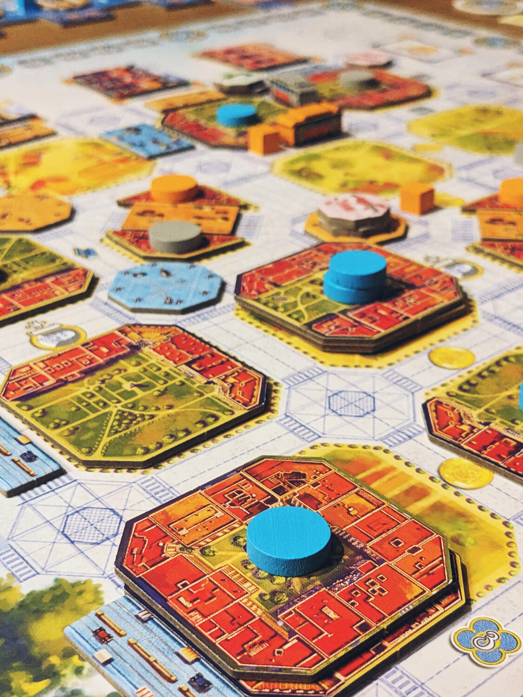
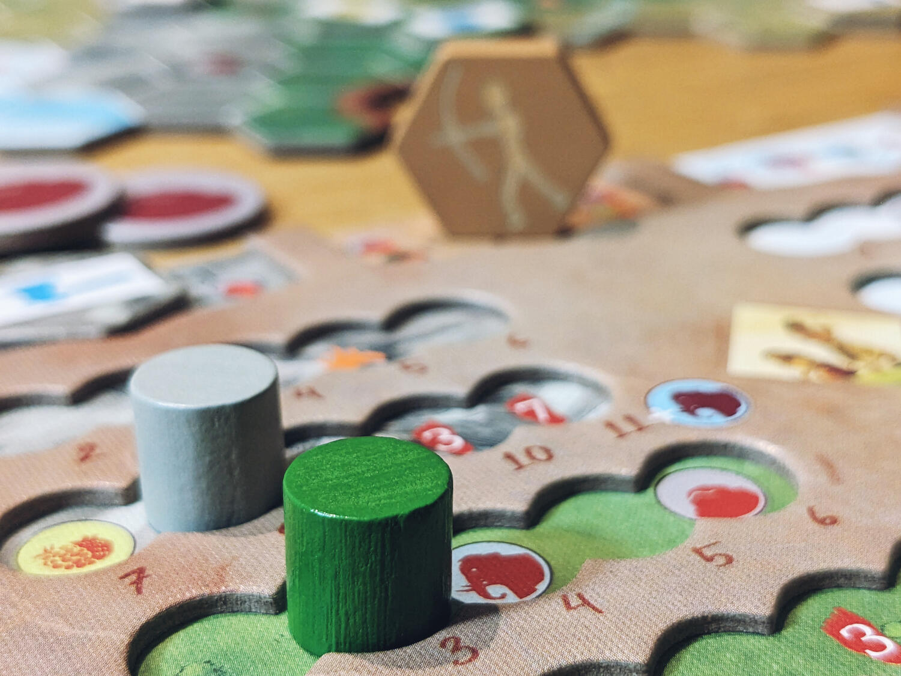

<FundingIntro>
  Il famosissimo Essen Spiel è finalmente tornato! La voglia di provare nuovi giochi (e comprarli) è sicuramente tanta, e qui vogliamo parlarvi di alcuni che saranno disponibili in fiera e che noi abbiamo avuto la fortuna di provare.
</FundingIntro>

<ConBit
  title="Barcelona"
  player_count={2}
  player_count_official="1-4"
  weight={4}
  playing_time="90min"
  playing_time_official="60–90min"
  hype={8}
  publisher="Board&Dice"
  stand="3H110"
  mechanism={["Piazzamento tessere", "Piazzamento lavoratori"]}
>
  Barcelona della <Link to="/publishers/boardanddice">Board&Dice</Link>, prima creazione del designer{" "}<em>Dani Garcia</em>, è un <strong>eurogame con un aspetto meraviglioso</strong> e caratterizzato da lato tematico molto presente (cosa non banale quando si parla di heavy euro-games). In Barcelona stai contribuendo a costruire{" "}<strong>l'Eixample</strong>, la nuova zona residenziale costruita nell'omonima città verso la fine del XIX secolo. La meccanica prevalente è quella del piazzamento lavoratori, ognuno dei quali attiva almeno{" "}<strong>2 azioni in ogni turno</strong>. Ciascuna di queste ha la potenzialità di dar inizio ad una{" "}<strong>cascata di azioni aggiuntive</strong>, che a loro volta possono innescare altre reazioni a catena. Le possibilità sono tante e variegate, e questo titolo spicca non solo per il gameplay appagante, ma anche per la sua ottima integrazione tra aderenza al tema e meccaniche. È un gioco pieno di combo e possibilità, ed è assolutamente da provare per ogni eurogamer che ami i turni durante i quali si potrebbe "rimanere sommersi" dai punti che si possono ottenere. Ma attenzione a non farvi paralizzare da cotanta scelta. Se avete amato i giochi precedenti dello stesso editore (per esempio <em>Teotihuacan</em>), non potete perdervi Barcelona.
</ConBit>

<ConBit
  title="Footprints"
  player_count={4}
  player_count_official="1-6"
  weight={3}
  playing_time="45min"
  playing_time_official="30-60min"
  hype={9}
  publisher="Chilifox Games"
  stand="3F102"
  mechanism={["Gestione mano", "Poteri variabili", "Movimento su griglia"]}
>
  Footprints, della <em>Chilifox Games</em> e degli autori <Link to="/designers/eilif-svensson">Eilif Svensson</Link>, Åsmund Svensson e Geir André Wahlquist, ti trasporta in un <strong>mondo paleolitico</strong> tutto da esplorare. In questo gioco di <Link to="/mechanisms/movimento-su-griglia">movimento su griglia</Link> ti muoverai attraverso diversi terreni grazie alla tua mano di carte, potenziando nel mentre <strong>il tuo motore</strong> di gioco per eseguire spostamenti migliori in futuro, lasciando indietro le tue impronte e cercando di viaggiare il piú lontano possibile. Hai a disposizione una <strong>vasta gamma di possibilità</strong>, grazie alle quali potrai muoverti liberamente e dove vorrai spingerti sempre un po' piú in là! I percorsi da seguire sono tanti, ed avrai solo 14 azioni per farlo. 
  Footprints è un gioco <strong>semplice da imparare ma più profondo e strategico di quanto ti aspetteresti</strong>. Si adatta meravigliosamente a un numero elevato di giocatori (da 1 a 6), e possiamo consigliarlo a tutti coloro che vogliono esplorare un gioco molto amichevole nelle sue molteplici possibilità e percorsi diversi per arrivare alla vittoria!
</ConBit>

<ConBit
  title="Forest Shuffle"
  player_count={2}
  player_count_official="2-5"
  weight={2}
  playing_time="45min"
  playing_time_official="40-60min"
  hype={8}
  publisher="Lookout Games"
  stand="6D102"
  mechanism={["Collezione set", "Gestione mano"]}
>
  In Forest Shuffle, i giocatori creeranno la loro propria foresta attraverso l'uso delle carte. <strong>Inizialmente si svilupperá la flora e verranno piazzati alberi di diverse specie per ospitare quanti più animali possibili, in modo da popolare questo ricco ecosistema</strong>. Successivamente, questi alberi saranno in grado di provvedere al sostentamento di tutta la fauna, composta da mammiferi, uccelli, rettili e una variegata pletora di insetti. <strong>Ogni carta presenta diverse possibilità per collezionare punti</strong>, ed interagisce con altre creando varie combo e dando forma ad una strategia diversa in ogni partita. Tutte le piante e gli animali si relazionano tra loro in modi differenti, simulando la catena alimentare con divertentimento e dinamicità. Un gioco perfetto per gli amanti della natura, dei giochi di carte e per chi adora cercare la perfetta sinergia tra diverse combinazioni disponibili.
</ConBit>

<ConBit
  title="Tipperary"
  player_count={4}
  player_count_official="2-5"
  weight={1}
  playing_time="30min"
  playing_time_official="20-45min"
  hype={9}
  publisher="Lookout Games"
  stand="6D102"
  mechanism={["Piazzamento tessere"]}
>
  In Tipperary i giocatori si troveranno in un lussureggiante paesaggio irlandese. Qui ti prenderai cura dei tuoi pascoli, scoprirai torri medievali, misteriosi cerchi di pietre, e svilupperai la tua{" "}<strong>distilleria personale</strong>. Tutto questo viene implementato con un semplice meccanismo di{" "}<Link to="/mechanisms/piazzamento-tessere">tile placement</Link>. La Lookout Games è famosa per aver pubblicato titoli family, come ad esempio <em>Bärenpark</em> e <em>Llamaland</em>, e Tipperary non fa eccezione. Con i suoi turni veloci ed il semplice meccanismo ma che permette di intraprendere diverse strategie e seguire varie strade, risulta adatto a tutti i tipi di giocatore, ma sempre con un'atmosfera rilassata e distesa. Insomma, il perfetto filler game.
</ConBit>

