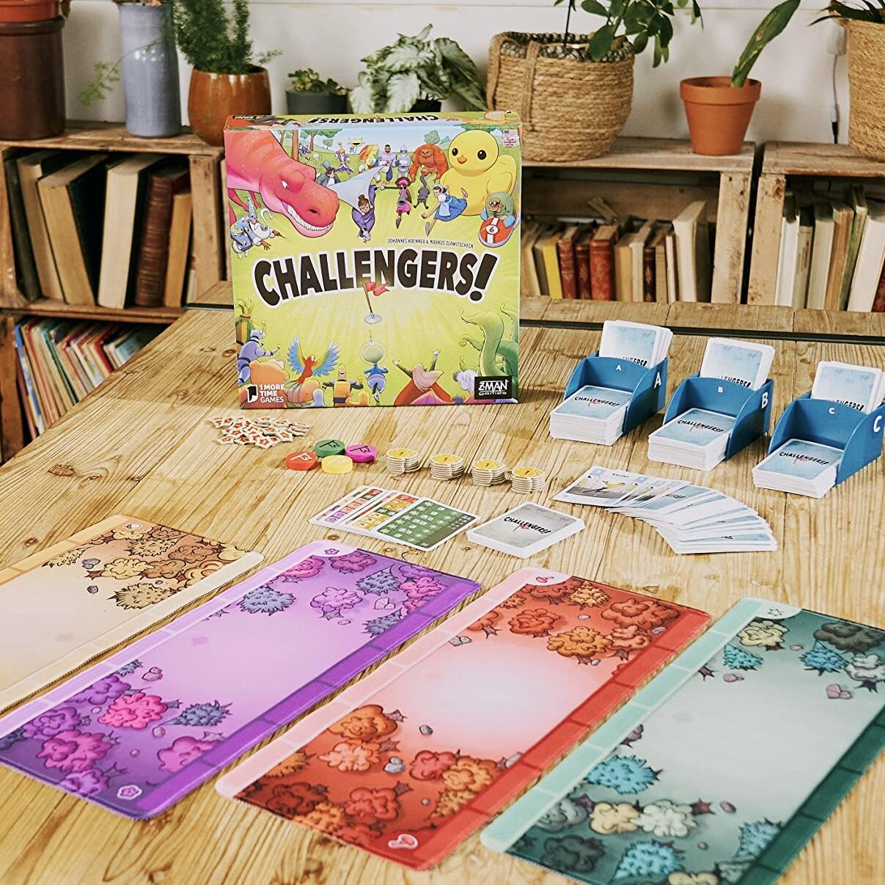
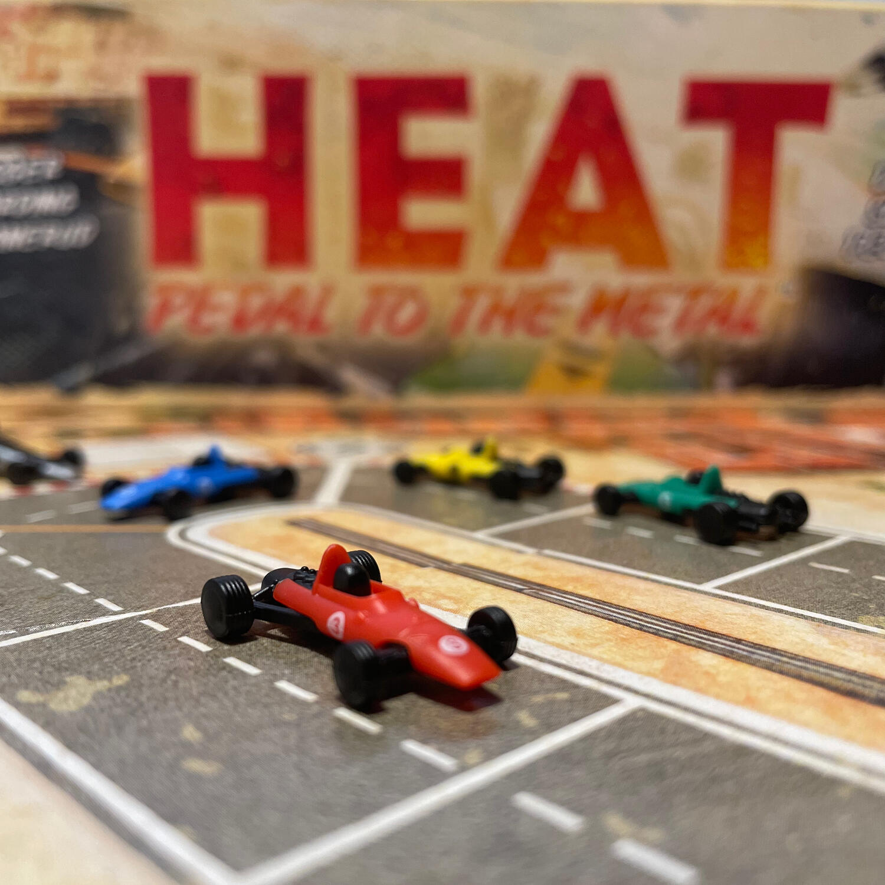
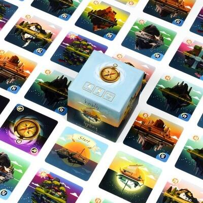

<FundingIntro>
  Se siete qui è perché, come me, vi appassionano i giochi da tavolo, dedicate loro le vostre serate, nicchie e stanze
  speciali in casa e, sì, inutile negarlo, una parte cospicua dei vostri risparmi!
   
  Come me, sicuramente avrete individuato nel tempo la vostra comfort zone, quei giochi che intavolereste ancora e
  ancora, che non vi stuferebbero mai e che proporreste a tutti i compleanni e cene di famiglia. E sono certa che, per
  difendere il vostro gioco del cuore, ognuno di voi sarebbe disposto ad improvvisarsi procuratore e costruire
  un’arringa degna di Matlock!
   
  Ma questa nostra passione basterebbe per eleggere uno e un solo gioco, giudicandolo il migliore tra moltissimi altri
  titoli, nella maniera più oggettiva possibile?! Immagino che la risposta sia no, ma per fortuna né voi né io siamo
  tenuti a farlo, perché una giuria di super esperti si prenderà questo mal di pancia al posto nostro!
   
  Di cosa stiamo parlando?! Della proclamazione del <strong>Miglior gioco dell’Anno</strong> che si terrà durante il{" "}
  <strong>Lucca Comics and Games giovedì 2 Novembre</strong> (spoiler: io potrei esserci per documentare l’evento per
  voi!!).
   I <strong>nominati</strong> quest’anno sono stati <strong>ben 33</strong>, editi da <strong>
    14 case editrici diverse
  </strong>, ma tra questi <strong>solo 5</strong> sono i <strong>finalisti</strong>: vediamo quindi quali tra questi sono,
  secondo la mia umile opinione e senza con ciò voler definire una classifica, i <strong>3 favoriti</strong>! 
</FundingIntro>

<ConBit
  title="Challengers!"
  player_count={8}
  player_count_official="1-8"
  weight={2}
  playing_time="60min"
  playing_time_official="45min"
  score={8}
  publisher="Asmodee"
  stand="CAR391"
  mechanism={["Deck Building", "Gestione Mano", "Drafting Aperto"]}
  slug="challengers"
>
  Già vincitore del <strong>Kennerspiel</strong> di quest’anno, <Link to="/reviews/challengers/">Challengers!</Link> è
  riuscito a sbaragliare la critica con la sua <strong>leggerezza</strong> e i suoi <strong>colori accesi</strong>!
   
  Accusato di essere banale perché definito un rubabandiera da tavolo, Challengers! <strong>è riuscito</strong> invece <strong>
    a conquistare tutte le tipologie di giocatori
  </strong>, unendo meccaniche più strategiche come il <strong>deck building</strong> a meccaniche più aleatorie come quella
  della <strong>sfida</strong>, cuore pulsante del gioco, nella quale, giocando le carte del mazzo precedentemente costruito,
  dovrete conquistare la bandiera e battere l’avversario.
   
  Un vero e proprio torneo, con tanto di programmazione, che soddisferà tutti i partecipanti grazie alle sue <strong>
    regole semplicissime
  </strong>, ai <strong>bellissimi materiali</strong> e all’<strong>ilarità</strong> che ne deriverà partita dopo partita!
   
</ConBit>

<ConBit
  title="Heat: Pedal to the Metal!"
  player_count={6}
  player_count_official="1-6"
  weight={2}
  playing_time="60min"
  playing_time_official="30-60min"
  score={9}
  publisher="Asmodee"
  stand="CAR391"
  mechanism={["Azioni Simultanee", "Gestione Mano", "Push Your Luck"]}
  slug="heat-pedal-to-the-metal"
>
  Beh! Beh! Beh! Che dire?!
   
  <strong>Giocone</strong> che ha conquistato la critica e i giocatori ancor prima di raggiungere gli scaffali e i
  tavoli da gioco!
   
  Un gioco che <strong>trasuda adrenalina</strong> da ogni centimetro della confezione!!
   
  Un titolo per il quale <strong>fai volentieri la coda in fiera</strong> prima per provarlo e poi per comprarlo!!
   
  Successone di una delle case editrici più famose in Italia,{" "}
  <Link to="/reviews/heat-pedal-to-the-metal/">Heat: Pedal to the Metal</Link>{" "}
  <strong>ha conquistato il cuore di tutti</strong>, sia di chi non ha mai perso un Gran Premio la domenica, sia di
  coloro che fanno delle carte e del deck building il loro cavallo di battaglia. <strong>Ottimi materiali</strong> e{" "}
  <strong>regole davvero semplici</strong>, anche se <strong>da non prendere sotto gamba</strong>, se non si vuole
  perdere il controllo della vettura e surriscaldare il motore!
   
  Prendete una curva troppo velocemente? HEAT!
   
  Spingete troppo su un rettilineo? HEAT!
   
  Scalate troppo rapidamente? HEAT!
   
  Insomma, un gioco che <strong>vi lascerà con il fiato sospeso</strong>, come se ci foste davvero voi sull’auto ai 180
  km all’ora prima di imboccare una curva a gomito, e che vi spingerà a giocare ancora e ancora per completare la gara
  perfetta!
   
</ConBit>

<ConBit
  title="Tranquility"
  player_count={5}
  player_count_official="1-5"
  weight={2}
  playing_time="25min"
  playing_time_official="15-20min"
  score={8}
  publisher="Lucky Duck Games"
  stand="CAR355"
  mechanism={["Cooperativo", "Gestione Mano", "Carte"]}
  slug="Tranquility"
>
  Il <strong>silenzio</strong>, quella condizione ambientale definita dall’assenza di perturbazioni sonore, è allo
  stesso tempo sia il punto forte che <strong>la più grande difficoltà di questo gioco</strong>; e sì, anche la ragione
  per cui questo titolo si è presto rivelato una bellissima e rilassante forma di dipendenza!
   
  Come il cugino più frenetico The Mind, in <Link to="/reviews/tranquillity/">Tranquility</Link>{" "}
  <strong>l’allineamento mentale con i compagni sarà essenziale</strong> per portare a termine il vostro viaggio con
  successo. Raggiungere l’obiettivo non sarà permesso proferire parola, non sarà facile, ma questo non farà che spingere
  un vero adepto del gioco da tavolo a riprovare, giusto?  
</ConBit>

