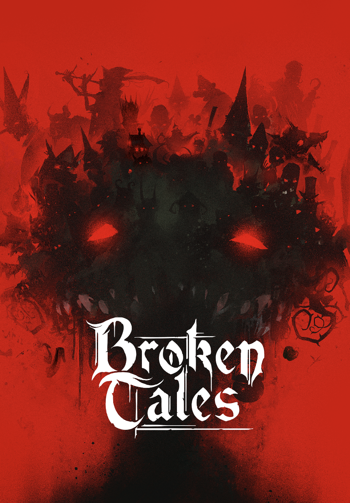
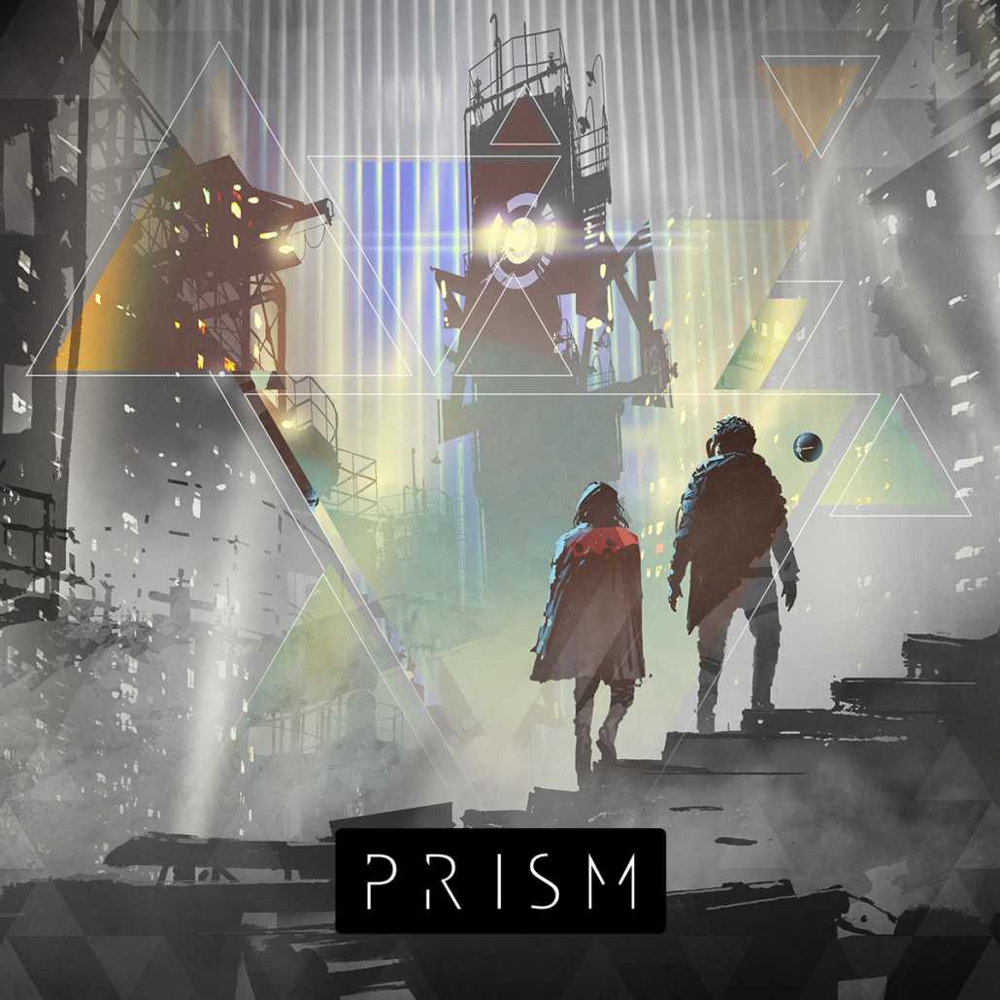

<FundingIntro>
    <strong>Il mondo del gioco di ruolo</strong> negli ultimi anni <strong>è sensibilmente cambiato</strong>. 
    Vediamo affacciarsi sul mercato <strong>titoli narrativi</strong> o che puntano a far emergere momenti particolari nel gioco, con l’obiettivo di <strong>esplorare nuove strade</strong> e, molto più spesso che in passato, <strong>nuovi sentimenti</strong> da portare al tavolo. Giochi sempre <strong>più introspettivi</strong>, con ambientazioni o idee rivolte più alla creazione di una <strong>storia condivisa</strong>, al vivere <strong>emozioni potenti e contrastanti</strong>, <strong>per tutte le età</strong>! 
    Quest’anno al Lucca Comics &amp; Games ci sono stati davvero numerosi titoli interessanti tra le nomination per il titolo di GdR dell’anno e noi ne abbiamo scelti tre tra i cinque finalisti su cui fare più luce.
</FundingIntro>

<ConBit
    title="Broken Tales"
    hype={8}
    system="Monad Echo"
    family="Narrativo"
    publisher="MS Edizioni"
    stand="CAR281"
    mechanism={["Successi", "Obiettivi", "Tratti narrativi"]}
    weight={3}
>
    Ecco il primo titolo che ha fatto drizzare le orecchie allo Zio e alla Locandiera. 
    Ai <strong>cattivi</strong> delle storie è stata data una possibilità di <strong>redenzione</strong>, <strong>ma</strong> così <strong>i buoni hanno reso il loro posto</strong>! Il confine tra il mondo delle fiabe e il mondo reale si fa più sottile: esseri una volta relegati alla pura fantasia prendono ora le sembianze di incubi reali e tangibili. Se volete immergervi in <strong>un’ambientazione dai toni e dai temi oscuri</strong>, Broken Tales è il gioco per voi! Preparate gli zaini e le torce, perché non sapete in quali luoghi viaggerete: semplici e verdi campagne dai caratteristici villaggi o foreste e rovine che non hanno mai visto la luce del sole? 
    Broken Tales è un <strong>gioco altamente narrativo</strong>, in cui la capacità dei giocatori di <strong>condividere</strong>, creare o elaborare situazioni e scene viene grandemente premiata. Per cui, sbizzarritevi, senza paura! 
    Agli occhi di chi gioca da molto tempo, questo gioco di ruolo potrà anche sembrare banale, ma questo genere di temi “a capovolta” risulta sempre molto interessante e <strong>apre a diverse strade di narrazione molto meno usuali</strong>. E poi… <strong>l’horror è sempre appassionante</strong>!
</ConBit>

<ConBit
    title="Prism"
    hype={8}
    system="HexSys"
    family="Narrativo"
    publisher="MS Edizioni"
    stand="CAR281"
    mechanism={["Gestione del rischio", "Tratti Narrativi"]}
    weight={3}
>
    Dall’autore di <em>Not the End</em>, con furore, arriva questo nuovo prodotto. 
    L’<strong>obiettivo</strong> che <em>Prism</em> si pone è quello di <strong>far affrontare ai giocatori le loro paure e i loro terrori in un mondo distopico</strong>. I personaggi si muoveranno all’interno di una <strong>società deviata</strong>, le cui regole metteranno <strong>a dura prova </strong>la loro <strong>morale</strong> e la loro stessa <strong>sanità mentale</strong>. 
    Possiamo sbizzarrirci nella scelta di quale distopia mettere al tavolo, perché <strong>saremo noi i creatori del mondo in cui giocheremo</strong>.  
    Parole come Punto di svolta, Paura, Distopia. Cioè! Non vi fa venire l’<strong>acquolina in bocca</strong>? 
    <strong>Promette un’esperienza narrativa</strong> <strong>molto interessante</strong> e pensiamo anche <strong>molto</strong> <strong>profonda</strong> se ci si mette in gioco. 
    Anche qui la vostra coppia “Bardica” mette un bel “pin”.
</ConBit>

<ConBit
    title="Il re è morto"
    hype={8}
    system="Mobile Frame Zero: Firebrands"
    family="Narrativo"
    publisher="Grumpy Bear"
    stand="CAR265"
    mechanism={["Carte", "Narrativo"]}
    weight={2}
>
    “<strong>Lunga vita al re</strong>” ha esclamato lo Zio nel sentire il titolo (povera Locandiera!). 
    Il Re è morto è un <strong>mix equilibrato</strong> <strong>tra un gioco di carte e un gioco di ruolo</strong>: non dovrete far altro che procurarvi un <strong>normalissimo mazzo di bridge</strong> e… sarete pronti! 
    La singolarità del gioco sta nel fatto che ogni giocatore avrà il suo <strong>personale libretto</strong> contenente le regole necessarie per giocare e un’infarinatura di informazioni e interessi delle altre casate (per vincere bisogna conoscere l’avversario, no?! E scatta la sigla di GoT). Una volta che ognuno ha letto queste poche pagine si è pronti a giocare.  
    E come si fa direte voi? Semplice, esiste un indice di “<strong><em>Scene di Corte</em></strong>” da giocare! Uniche ed irripetibili.  
    Se si riesce ad immedesimarsi, il Re è Morto è un gioco che rende moltissimo ed è <strong>perfetto per chi si avvicina al mondo dei giochi di ruolo per la prima volta</strong>: regole semplici, un mazzo di carte come “strumento”. Il resto risiede tutto nel coinvolgimento e nel fare i propri interessi nella maniera migliore e più creativa! 
    Più che interessante, non trovate? E mentre la Locandiera cerca di calmare lo Zio, che già indice consigli e ricevimenti per amicarsi i nobili, voi segnatevi il titolo!
</ConBit>

