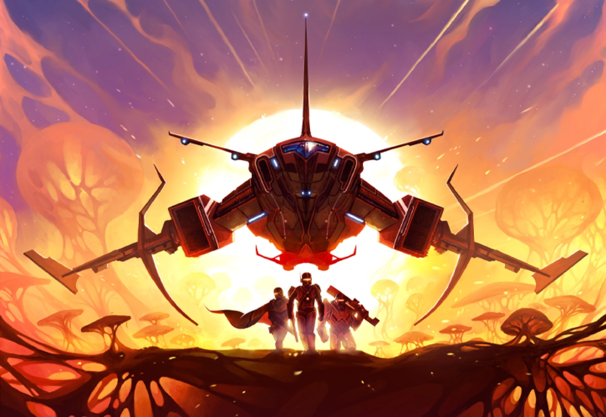
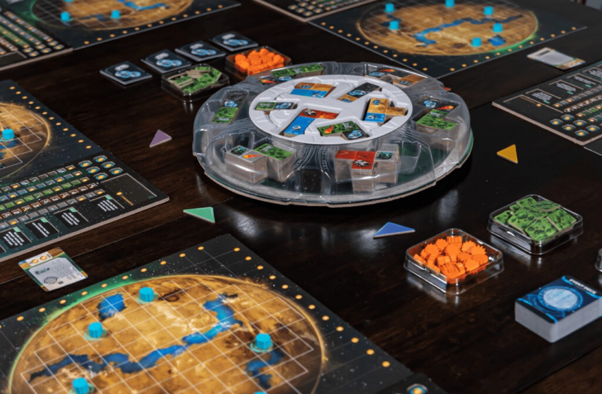
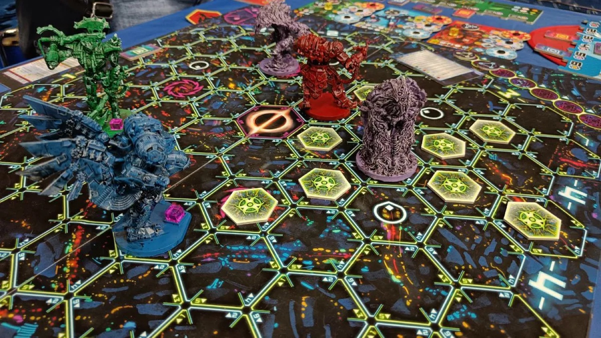

<FundingIntro>
2024, l’anno in cui non andrò a Modena, ma in cui sicuramente ho sguinzagliato i miei colleghi ad andare a recuperare qualcosa… In fondo mica serve andare a play per avere il bottino di play. Giusto? Giusto vero?! <strong>FUNZIONA COSI VERO</strong>?!
</FundingIntro>

<ConBit
title="AXO"
player_count={3}
player_count_official="1-4"
weight={1}
playing_time="20min"
playing_time_official="20min"
hype={8}
publisher="Playagame edizioni"
stand="A 65"
mechanism={["Carte", "Flip and write"]}
>
Axo, un gioco basato sui punti di vista e i fantastici polinonimi! Bisognerà scegliere, marcare e verificare le proprie carte, cercando di anticipare i propri avversari in modo da ottenere i 9 punti che decreteranno il vincitore prima di tutti. Sembra interessante anche la modalità Solitario in cui ci si scontrerà con Simona e, di fatto, si avrà un tempo limitato (l’esaurimento delle sue carte) per arrivare ai fatidici 9 punti. Un light game "spaziale" da godersi sia nelle notti solitarie più buie che in associazione? Axiosissimo!
</ConBit>

<ConBit
title="Iss Vanguard"
player_count={1}
player_count_official="1-4"
weight={3}
playing_time="120min"
playing_time_official="90-120min"
hype={10}
publisher="Giochi uniti"
stand="A 74"
mechanism={[ "Cooperativo", "Campagna"]}
>
E così, dopo Tainted Grail ed Etherfields, Awaken Realms ci porta nello spazio più profondo con il suo terzo gioco narrativo. A bordo della ISS Vanguard, i giocatori (sarebbe meglio fosse un solo giocatore) si troveranno a dover gestire un lunghissimo viaggio spaziale, sia a livello logistico (= un raccoglitore in cui si potranno gestire il personale e le sue abilità), che a livello di esplorazione, in cui attivamente dovrete confrontarvi con i pianeti e con le relative sfide. Che dire? Awaken Realms ci ha sempre viziato e un narrativo così maturo a livello di gameplay non può non essere interessante!
</ConBit>

<ConBit
title="Pianeti sconosciuti"
player_count={4}
player_count_official="1-6"
weight={2}
playing_time="70min"
playing_time_official="60-80min"
hype={8}
publisher="Pendragon"
stand="A1"
mechanism={[ "Costruzione pattern", "Draft"]}
>
Gioco con polimini in cui i giocatori si scontrano per sviluppare il pianeta migliore. Ogni polimino è a doppia risorsa e rappresenta le infrastrutture necessarie per supportare la vita nel pianeta. Piazzare bene i polimini, però, non è che il primo passo. Bisognerà assicurarsi anche di poter supportare il piazzamento… Ah, e conoscete Lazy S.U.S.A.N. ?!
</ConBit>

<ConBit
title="Ahotnik"
player_count={6}
player_count_official="2-12"
weight={2}
playing_time="90min"
playing_time_official="90min"
hype={8}
publisher="AM Mazzi Games"
stand="A 1"
mechanism={[ "Movimento su griglia", "Semi cooperativo"]}
>
Oooh Ahotnik! L’ultima volta che ci è passato tra le mani ne avevamo apprezzato l’idea interessante. Poi è arrivato su kickstarter e purtroppo alla fine hanno dovuto cancellare il crowdfunding, visto che il funding goal non era stato raggiunto. Ora… Sono tornati. Una campagna si profila all’orizzonte: cosa avranno migliorato per poter raggiungere il funding goal questa volta? 
</ConBit>

