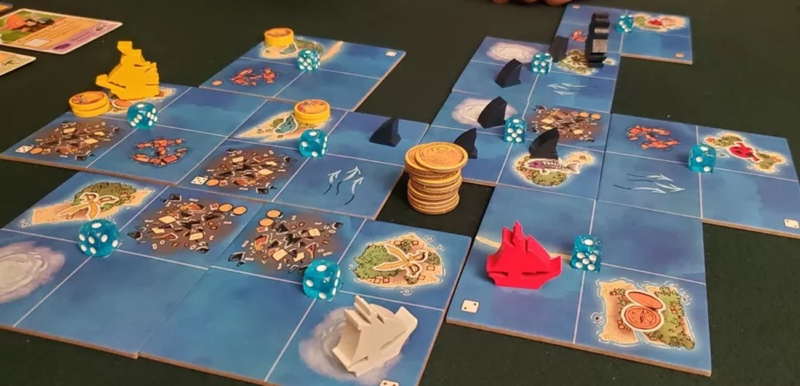
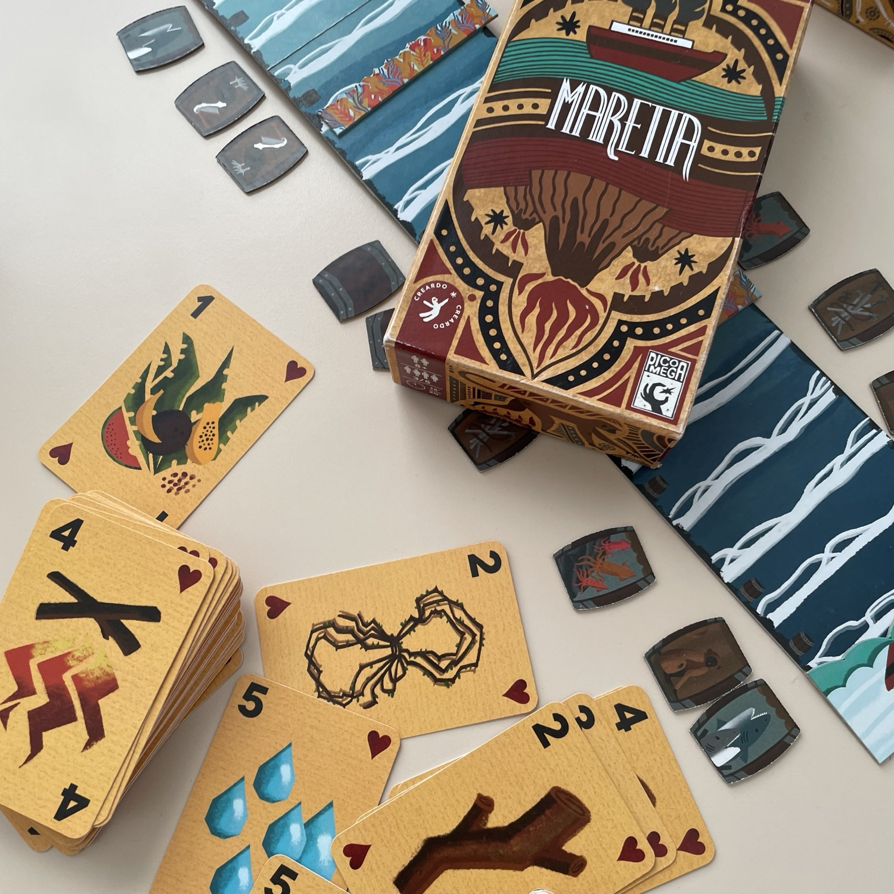

<FundingIntro>
Ci siamo! Questa volta non ci ferma nessuno (non starà mica facendo la solita alluvione, vero?): Modena, stiamo arrivando (domani)! Da anni non partecipavo alla fiera del gioco da tavolo che mi ha "battezzato": ora, invece che da visitatore, me la "godrò" da spiegatore. <strong>Insieme al grande <Link to="/writers/tia/">Tia</Link> </strong>. E magari riuscirò anche a provare qualcosina! Per un saluto, passate a trovarmi sabato e domenica da Weega (A53) o domenica da Creardo (A31)!
Sgomberate il bagagliaio! Spalancate il portafogli! Si parte!
</FundingIntro>

<ConBit
title="Wyrmspan"
player_count={4}
player_count_official="1-5"
weight={3}
playing_time="90min"
playing_time_official="90min"
hype={9}
publisher="Ghenos Games"
stand="A67"
mechanism={["Costruzione motore","Bonus di fine partita", "Gestione mano"]}
>
…E dopo aver scoperto il birdwatching, preparatevi al… dracologism! 
Torna un titolo dal sapore <Link to="/reviews/wingspan/">wingspaniano</Link>, ma stavolta dovrete guadagnarvi il favore della Gilda dei Draghi, trovando posto a draghi di ogni misura, forma e colore: scavate in tre ambienti diversi (la Caverna Cremisi, la Grotta Dorata e l’Abisso di Ametista), per indurre queste indomite e maestose creature a posarsi presso i rifugi che costruirete per loro, concatenando le loro potenti abilità! <strong>Finalmente in italiano!</strong> Grazie amici di Ghenos!!!
</ConBit>

<ConBit
title="Ahoy"
player_count={4}
player_count_official="2-4"
weight={2}
playing_time="60min"
playing_time_official="45-75min"
hype={8}
publisher="MS Edizioni"
stand="A11, B21"
mechanism={[ "Controllo area", "Pick-up and deliver"]}
>
Per gli amanti dei personaggi pucciosi e violenti di <Link to="/reviews/root/">Root</Link>, per chi si emozionato solo alla vista di <Link to="/reviews/oath/">Oath</Link>, per chi ama l’ambientazione marinaresca di <Link to='/reviews/corsari-dei-caraibi/'>Corsari dei Caraibi</Link> o <Link to="/reviews/finis-terrae/">Finis Terrae</Link>… Non fatevi sfuggire AHOY! Sarete contrabbandieri e soldati, esploratori dei Mari e pirati alla ricerca di gloria e ricchezza! 
Ogni round tirerete i dadi e li posizionerete nella vostra plancia fazione per svolgere azioni uniche. Potrete guidare lo squadrone Granfauci (una compagnia di squali e dei loro amici dentuti che pattugliano le acque e mantengono l'ordine a colpi di spada e pistola); oppure l'Unione dei Molluschi (un'alleanza di creature sottomarine e dei loro compagni d'armi che lottano per reclamare la loro casa ancestrale); infine, ci saranno due Contrabbandieri, capitani anticonformisti che gestiscono i blocchi per contrabbandare beni di lusso e di prima necessità, consegnandoli a chi ne ha più bisogno (o a chi ha più soldi…). 
C'è chi brama il controllo, chi preferisce consegnare merci… <strong>L'importante, alla fine, è la fama!</strong>
</ConBit>

<ConBit
title="Maretta"
player_count={5}
player_count_official="3-5"
weight={1}
playing_time="20min"
playing_time_official="15-20min"
hype={7}
publisher="Creardo, Pico Mega"
stand="A31"
mechanism={[ "Gara", "Collezione set"]}
>
Tra scimmie, pellicani, seppie e squali, siete naufraghi sull’isola di Maretta: <strong>un nome, un programma!</strong> Tra tensioni e nervosismi, dovrete fuggire da quest’isola deserta, percorrendo il breve tratto di mare che vi separa prima di raggiungere il piroscafo di passaggio in lontananza. Per raggiungere la salvezza dovrete procurarvi delle risorse en passant, che vi serviranno per saltare al volo sul vostro mezzo di salvataggio. 
Nel caso in cui la vostra fuga preferita includesse la lava, più che il mare, in questo bel filler disponete di una seconda versione di gioco: basta ribaltare il tracciato per ritrovarsi sull’isola di Vulcano (ovviamente in eruzione!) e stavolta la fuga rocambolesca sarà sui fianchi scoscesi o sui Carrelli di Miniera. Qui bisogna semplicemente…sopravvivere!
</ConBit>

<ConBit
title="Agape"
player_count={5}
player_count_official="3-5"
weight={1}
playing_time="15min"
playing_time_official="10-15min"
hype={8}
publisher="Creardo, Pico Mega"
stand="A31"
mechanism={[ "Carte", "Trick-Taking"]}
>
L’amore ha limiti? Né di genere, né d’età, né d’altezza, né di capello! L’agenzia Agape offre ai suoi clienti abbinamenti amorosi, aiutandoli a trovare l’anima gemella e garantendo risultati impeccabili in tempi da record! Agape è un gioco che propone <strong>l’identità di genere come ambiziosa forma di meccanica di gioco</strong>, favorendo l’interazione tra i giocatori attraverso la connessione delle caratteristiche e degli interessi delle Carte Amante. Ma la competizione all’interno dell’agenzia è accanita. La soddisfazione delle richieste e la creazione di nuove coppie sarà la vostra attività principale per generare punti. Superate sterili pregiudizi e diventate veri Maestri dell’Amore! 
</ConBit>

