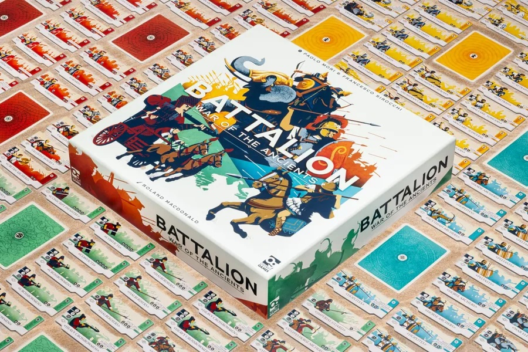
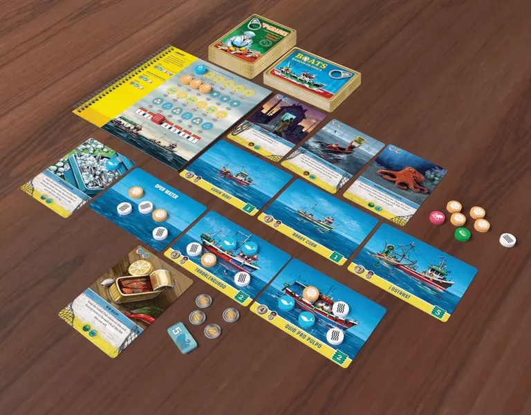
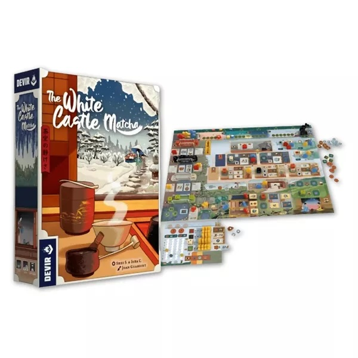
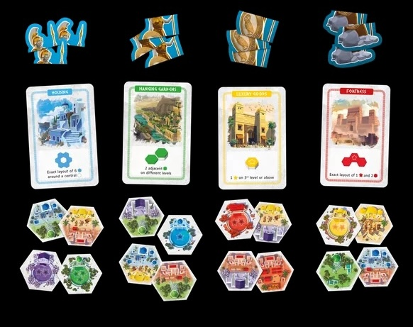

<FundingIntro>
Ancora una volta sulla breccia, amici: si parte per lo Spiel di Essen! 
Anche quest'anno sto studiando cosa poter andare a provare appena metto piede nelle lande del nord, sono carico e ho voglia di andare a giocare come non mai! 
Alcuni titoli mi sono già entrati nel cuore e sono sicuro che torneranno a casa con me. Siete curiosi? Ecco la mia top 4!
</FundingIntro>

<ConBit
  title="Battalion: War of the Ancients"
  player_count={2}
  player_count_official="2-4"
  weight={2}
  playing_time="30min"
  playing_time_official="20–45min"
  hype={10}
  publisher="Osprey Games"
  stand="2B111"
  mechanism={["Punti azione", "Gestione mano", "Dadi"]}
>
Al primo posto il nuovo titolo di <Link to="/publishers/osprey-games">Osprey Games</Link>, una delle mie <strong>case editrici preferite</strong>, che tra gli autori schiera <Link to="/designers/paolo-mori">Paolo Mori</Link>. 
In Battalion, prendete il comando delle <strong>legioni romane, dei balestrieri Han, della cavalleria greco-bactriana o dei mercenari ed elefanti cartaginesi</strong>. Ogni fazione ha unità e tattiche uniche, e dovrete guidarle con attenzione. 
Scegliete una fazione, valutate le unità e bilanciate i loro ordini in battaglia. <strong>Ogni tessera di rango rafforza le unità, ma combinarne troppe le rende meno agili.</strong> 
Comandate le unità di quattro fazioni storiche, ognuna con i propri vantaggi e svantaggi, usando carte tattiche per prevalere. Pianificate con cura e guidate il vostro esercito alla vittoria! 
Direi che ha tutte le carte in tavola per entrare nella mia top10 di sempre!
</ConBit>

<ConBit
  title="Conservas"
  player_count={1}
  player_count_official="1"
  weight={2}
  playing_time="30min"
  playing_time_official="25–40min"
  hype={9}
  publisher="Salt & Pepper Games"
  stand="3A111"
  mechanism={["Deck building", "Bag building", "Campagna"]}
>
Al secondo posto Conservas, della stessa casa editrice di <Link to="/reviews/no-pasaran/">¡No pasarán!</Link> , casa editrice che mi sorprende sempre più per i suoi giochi, soprattutto i solitari. 
In Conservas gestite un'azienda di conserve sulla costa spagnola, responsabili di tutto, dalla pesca alla vendita. Ogni mese ha obiettivi specifici, ma non sempre conta il guadagno: l'impatto sostenibile sul mare è fondamentale. <strong>Per vincere, dovrete bilanciare pesca e sostenibilità</strong>, con obiettivi finanziari e ambientali. Se danneggiate l'oceano con una pesca eccessiva, fallirete. Perciò difendere l'equilibrio con il mare per produrre le migliori conserve. 
In Conservas, gioco dello stesso autore di <Link to="/reviews/food-chain-island/">Food Chain Island</Link> , si parte con una sola barca e poche risorse. Il mare è rappresentato da un sacchetto di token: alcuni andranno alla stagnatura, altri rimarranno per far crescere le popolazioni marine. 
I mercati e le strategie cambiano in ogni partita, con 12 scenari ed elementi randomizzati che offrono sempre nuove sfide.
</ConBit>

<ConBit
  title="The White Castle: Matcha"
  player_count={3}
  player_count_official="1-4"
  weight={3}
  playing_time="120min"
  playing_time_official="90-110min"
  hype={9}
  publisher="Devir"
  stand="3D611"
  mechanism={["Draft di azioni", "Piazzamento dadi", "Piazzamento lavoratori", "Setup variabile"]}
>
E come potrebbe mancare l'espansione di uno dei <Link to="/reviews/the-white-castle/">giochi</Link> che ho giocato di più l'anno scorso? 
La cerimonia del tè è al centro della cultura giapponese, rappresentando ospitalità, rispetto e filosofia Zen. Originaria della Cina, divenne nel tempo un rifugio di calma per i samurai, lontano dal caos delle battaglie. 
In The White Castle: Matcha, <strong>dovrete piazzare membri del vostro clan in posizioni strategiche all'interno della Chashitsu</strong> (sala da tè) per aumentare l'influenza a corte. Ogni round offre un'azione extra: sarà abbastanza per dominare la corte di Himeji? 
Giusto perché si avevano già poche scelte…
</ConBit>

<ConBit
  title="Akropolis: Athena"
  player_count={2}
  player_count_official="1-4"
  weight={2}
  playing_time="30min"
  playing_time_official="25min"
  hype={8}
  publisher="Gigamic"
  stand="6F403"
  mechanism={["Piazzamento tessere", "Drafting aperto"]}
>
Infine, l'espansione di uno dei miei entry level preferiti: <Link to="/reviews/akropolis/">Akropolis</Link> ! 
Akropolis Athena è ambientato nel Mediterraneo antico, dove gli architetti competono per ottenere il favore di Atena e guadagnare ricchezza e onore. 
I giocatori devono completare carte Costruzione, <strong>organizzando le loro città in base ai layout richiesti</strong>. Completando le carte, si acquisiscono parti della Statua di Atena e mini-tile per potenziare la città. Chi costruisce meglio e più in fretta, sarà il vincitore! 
Spero che questa espansione dia un soffio di complessità in più al suo quasi perfetto papà!
</ConBit>

