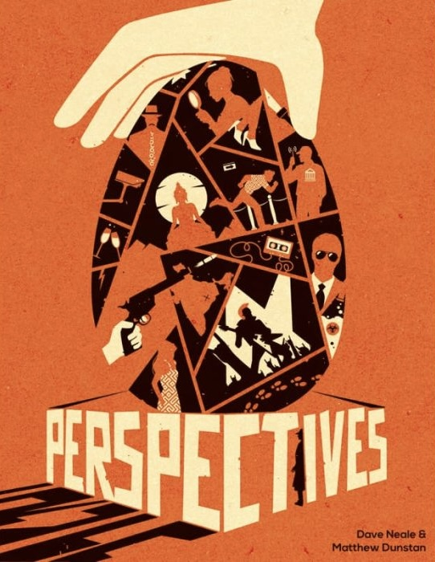
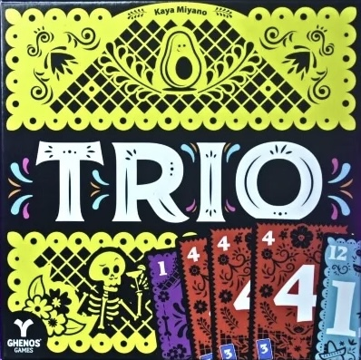

<FundingIntro>
  Cari amici, siamo infine giunti a quel periodo dell’anno in cui rispolveriamo Excel per creare il documento perfetto!
  Eh no, non sto parlando di lavoro, ma del groviglio di appuntamenti, firmacopie, interviste che cerchiamo di
  districare e ordinare in vista del Lucca Comics & Games!
   
  Ognuno di noi spera di scoprire il segreto del dono dell’ubiquità, o parte alla ricerca della Giratempo, ma, ahimè,
  nessuno finora è riuscito nella sua impresa e tutti siamo costretti a compiere delle scelte a volte dolorose.
   
  Ma posso dirvi con certezza, amici, che 7 persone, 7 esperti, si trovano davanti ad un compito ancora più gravoso:
  essi sono, infatti, la giuria che giovedì 31 ottobre dovrà decretare il <strong>Gioco dell’ Anno 2024</strong>.  
  I giochi nominati sono stati ben 37, di cui 5 sono arrivati a contendersi il titolo: ora vorrei condividere con voi qualche
  parola sui tre che secondo me hanno più possibilità di vincere!
   
</FundingIntro>

<ConBit
  title="Harmonies"
  player_count={4}
  player_count_official="1-4"
  weight={3}
  hype={9}
  playing_time="60min"
  playing_time_official="45min"
  publisher="Asmodee"
  stand="CAR358"
  mechanism={["Posizionamento tessere", "Creazione schemi"]}
>
  <strong>Armonia </strong> e <strong>Natura </strong>: ecco le parole chiave di questo gioco. Di round in round i{" "}
  <strong>Dischi Paesaggio </strong> dovranno essere posizionati sulla plancia con saggezza per guadagnare più punti
  possibile a fine partita! Ma non finisce qui: la scelta dei dischi, infatti, sarà guidata dalle{" "}
  <strong>Carte Animale </strong> in possesso dei giocatori, che identificano la tipologia di habitat che dovrà essere
  realizzato: sarà montagna, campo, foresta o fiume? Oppure vi darete all’edilizia? Insomma, il connubio tra questi
  elementi genera un mix perfetto tra <strong>strategia </strong> e <strong>creatività </strong>, che sa esser
  rilassante per la difficoltà non troppo elevata, ma allo stesso tempo sfidante e competitivo.
</ConBit>

<ConBit
  title="Perspectives"
  hype={7}
  player_count={4}
  player_count_official="2-6"
  weight={3}
  playing_time="90min"
  playing_time_official="90min"
  publisher="Asmodee"
  stand="CAR358"
  mechanism={["Deduzione", "Puzzle"]}
  >
   Titolo accattivante e misterioso nel quale si potranno vivere avventure ricche di mistero che vi faranno{" "}

  <strong>aguzzare l’ingegno </strong>. Ogni giocatore vestirà i panni di un investigatore che però - punto forte del
  gioco - avrà una <strong>prospettiva unica </strong> sul caso; solo collaborando e condividendo le informazioni si
  potrà quindi svelare la verità. Dai casi più semplici a quelli più complicati, non bisognerà lasciare nulla al caso,
  aspetto che permette ai giocatori di immergersi completamente nell’indagine e di godere a pieno dell’intuito reciproco
  per non incappare in false piste! Bellissimo vedere come partita dopo partita l’{" "}
  <strong>affinità tra le menti </strong> cresce sempre di più, sviluppando tra i giocatori una sete di curiosità
  indispensabile per raggiungere una soluzione! Insomma, è il gioco perfetto per chi ama i gialli e le sfide
  intellettuali.
</ConBit>

<ConBit
  title="Trio"
  hype={7}
  player_count={4}
  player_count_official="3-6"
  weight={3}
  playing_time="30min"
  playing_time_official="15min" 
  publisher="Ghenos Games"
  stand="CAR350"
  mechanism={["Collezione set", "Memoria"]}
>
Unico gioco ilare tra i finalisti, questo titolo ha saputo sorprendere anche i giocatori più esperti con la sua  <strong>semplicità di regolamento </strong> abbinato ad un  <strong>gameplay frizzante</strong>!
Sicuramente è da definirsi un fillerino, il classico gioco che si può intavolare aspettando la pizza, ma questo non è sinonimo di banalità!
Ok, siamo d’accordo che raccontarlo come “basta fare tris con le carte” sia il modo più diretto per farne capire l’obbiettivo, soprattutto ai neofiti, ma resta un dato di fatto che presenta delle dinamiche che sanno rendere la sfida alquanto interessante!
La mia preferita è quella di dover completare dei <strong>tris abbinati</strong> per poter vincere! Questa è una variante hot del gioco che, oltre al numero principale della carta, prende in considerazione anche il numerino riportato in basso: una volta riusciti a completare un tris, infatti, per potersi dichiarare vincitori, si dovrà completare anche il tris corrispondente per numero e colori all’icona riportata sulle carte del tris già conquistato!

Eccoci giunti alla fine di questa carrellata sui miei favoriti; porterò fortuna ad uno di loro oppure la sfortuna si abbatterà su di essi?
Dovremo aspettare ancora qualche giorno per scoprirlo!

</ConBit>

