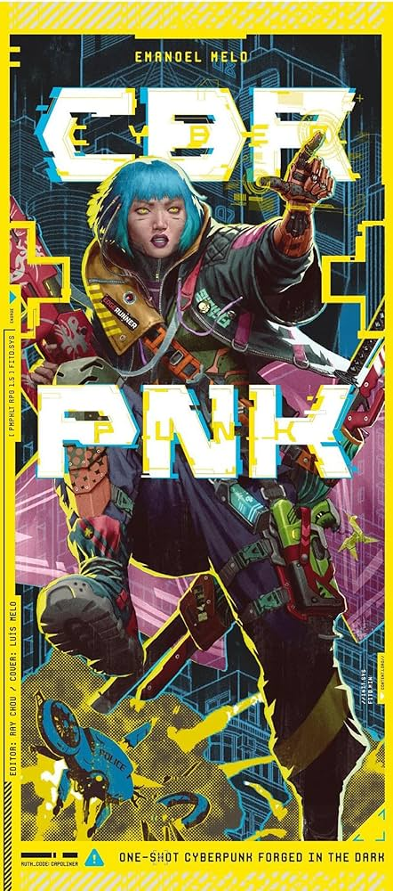
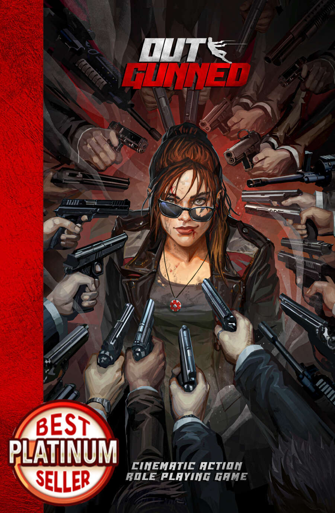
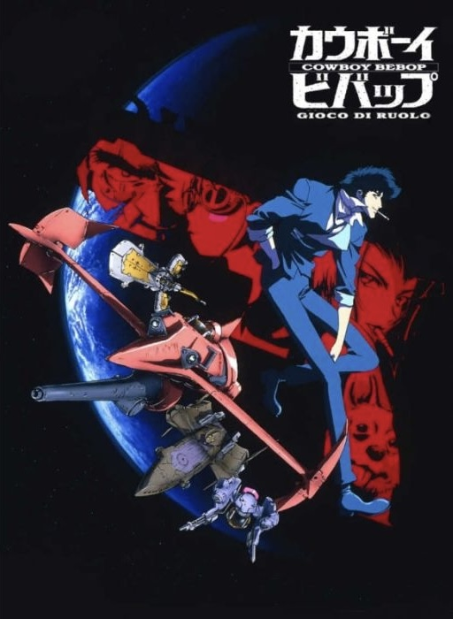

<FundingIntro>
  Ci risiamo. Lucca Comics&Games è tornato anche quest'anno e, che lo si ami o lo si odi, per tanti sviluppatori e designer rimane un punto di svolta importante per realizzare sogni e avviare carriere. 
  Riuscire a vincere uno dei numerosi premi in palio come <strong>Gioco di Ruolo dell'Anno</strong> a una manifestazione simile non può che essere quindi una grandissima conferma dei propri sforzi, nonché un trampolino di lancio per l'accesso a un palcoscenico importante nel proprio ambiente. 
  Quindi bando alle ciance: andiamo a vedere i titoli che tra i giochi di ruolo, secondo il sottoscritto, umile master e giocatore, hanno più probabilità di accedere al podio.
</FundingIntro>

<ConBit
  title="CBR+PNK"
  hype="8"
  weight={2}
  system="Forged In The Dark"
  family="narrativo"
  publisher="Grumpy Bear"
  stand="CAR240"
  mechanism={["pool di dadi", "modulare", "stress e conseguenze"]}
>
  Un'ultima run. Un'ultima missione. Questo titolo ci proietta direttamente ad un punto della carriera di un personaggio
  che ogni giocatore di ruolo spera di raggiungere: <strong>la fine</strong>. O almeno appena prima. CBR-PNK sguinzaglia
  i PG in una letale avventura finale prima del ritiro, pronta a mettere a repentaglio ad ogni angolo l'incolumità dei
  malcapitati. Il sistema è strutturato per sviluppare avventure one-shot, sfruttando il motore di Forged in the Dark,
  per un <strong>cocktail semplice da preparare e da giocare</strong>, ma carico di sangue e cromo. Inoltre, c'è da
  apprezzare il design del "manuale": un semplice <strong>cofanetto</strong> ricco di dépliant esplicativi. Schede
  comprese. E sì, è tutto quello che è necessario per divertirsi, a parte una manciata di D6. E se proprio si volesse
  complicarsi l'esistenza, il gioco propone delle aggiunte, come ad esempio la possibilità di fare delle campagne più
  lunghe, di usare poteri ESP o di farsi inseguire da un Predator. Credetemi, vorrei scherzare.
</ConBit>

<ConBit
  title="Outgunned"
  hype="8"
  weight={3}
  system="Director's Cut"
  family="narrativo"
  publisher="Raven Distribution "
  stand="CAR336"
  mechanism={["pool di dadi", "sistema di successi, risorse", "azione concitata"]}
>
  Ecco a voi, invece, il gioco giusto se vi piace il <strong>cinema d'azione</strong>. Avete amato Die Hard, John Wick e
  Rambo? Quest'opera vi permetterà di giocare avventure che andranno a ricalcare temi e situazioni tipiche di film e
  serie del genere, spingendo l'acceleratore sull'adrenalina e sulla sopravvivenza contro tutto e tutti. E fidatevi:
  meno riusciranno a uccidervi, peggio sarà per chiunque provi a fermarvi. Il sistema gira sul motore di Director's Cut,
  con un corposo impianto regolistico che purtroppo non lo rende di facile apprendimento, ma che se cercate un gioco che
  vi faccia lanciare una macchina a un elicottero perché avevate finito le pallottole fa proprio al caso vostro.
  Insomma, prendete dei D6, dei caricatori, delle patatine e qualche buona brutta battuta da rifilare al cattivo di
  turno e buttatevi nell'azione. <strong>CIAK, si ruola</strong>!
</ConBit>

<ConBit
  title="Cowboy Bebop - Il GDR"
  hype="9"
  weight={3}
  system="Original"  
  family="narrativo"
  publisher="Mana Project Studio"
  stand="CAR241"
  mechanism={["pool di dadi", "focus sul gruppo", "risorse", "introspezione", "ritmo a episodi"]}
>
Ammetto che questo gioco è qui più per cuore che per altro, ma fidatevi: non c'è di nulla di cui pentirsi. 
Cowboy Bebop è stata una <strong>serie cul</strong>t per chi come me masticava pane e MTV Anime Night.
Guardare le avventure nello spazio di Spike e della sua carismatica quanto fulminata Ciurma di cacciatori di taglie era, ed è tuttora, sia una gioia per gli occhi che un godimento per orecchie e cuore.
Ogni puntata era intrisa d'ironia, azione, drammi esistenziali e inseguimenti a rotta di collo in grado di tenerti col fiato sospeso fino all'ultimo.
Capirete bene, quindi, che ciò che si propone di fare questo gioco non è assolutamente facile;  tuttavia, credo che in questo caso il proiettile abbia centrato bene l'obiettivo (pun intended).
Come per gli altri due giochi discussi in precedenza, anche per Cowboy Bebop saranno necessari dei D6 per tuffarsi all'interno dell'infinito spazio profondo dell'ambientazione, costruendo col gruppo dapprima la propria nave madre e proseguendo con la creazione del proprio protagonista.
Un gioco <strong>estremamente immersivo e narrativo</strong>, dove spendere le proprie risorse tra pallottole e fiches (letteralmente, in quest'ultimo caso), in sequenze di scene che ricalcano a grandi linee la struttura degli episodi della serie.
Forse anche questo gioco risulterà un po' macchinoso da apprendere, ma saprà di certo scaldare il cuore a chiunque abbia mai sognato di vivere una vita sulle note del jazz e del pericolo 
<strong>See you, Space Cowboys!</strong>

In Chiusura...
Questi, giocatori dell'etere, sono i miei tre gettoni sui vincitori.
Ma credetemi che anche gli altri due concorrenti si sarebbero meritati qualche chiacchiera in più.
Se siete curiosi di scoprirli, I Misteri di Brindlewood Bay e Wildsea vi attendono coi loro enigmi e i loro incubi.
DAJE!

</ConBit>

