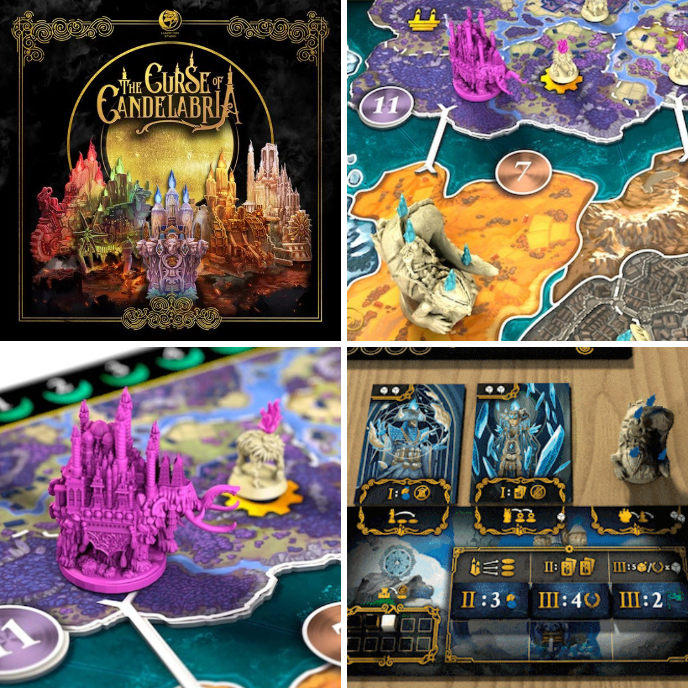
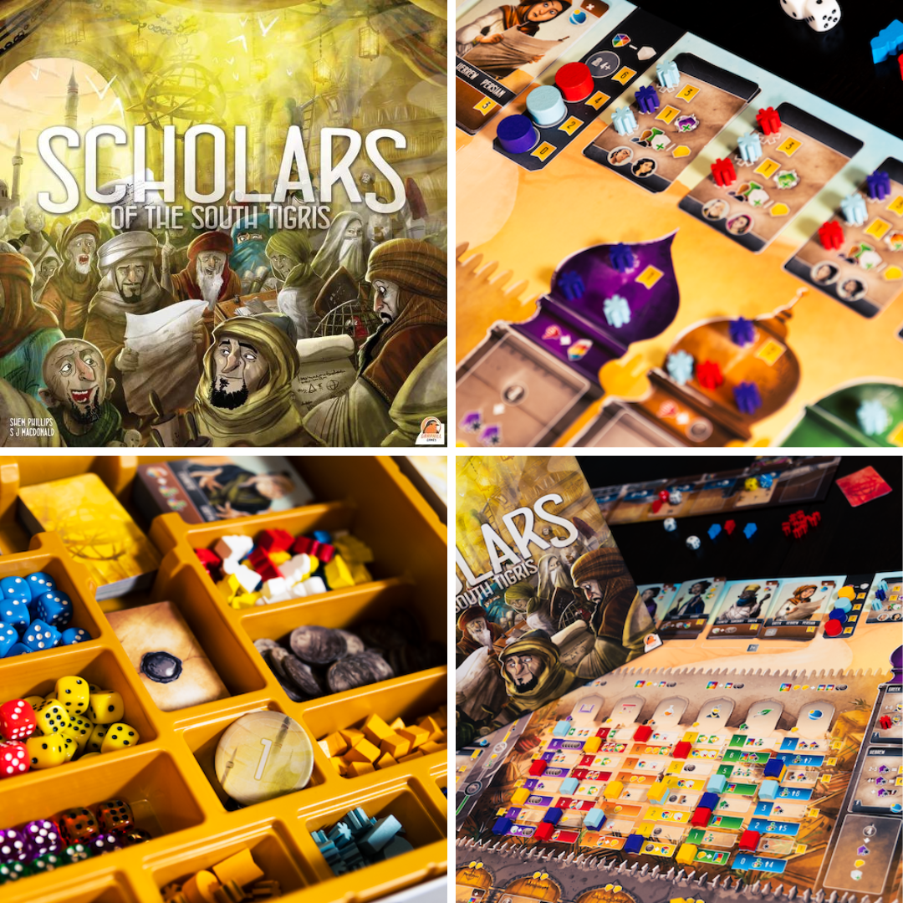
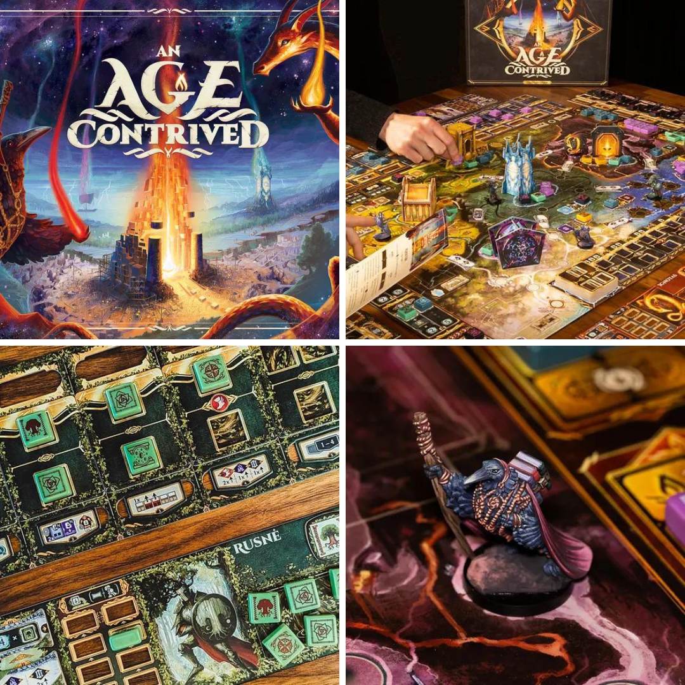
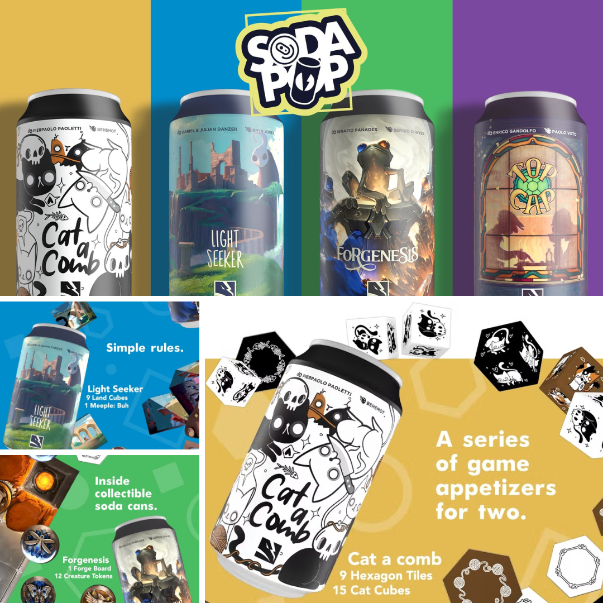

<FundingIntro>
  In un mondo con più kickstarter che esseri umani, in cui occorre affinare il metodo per distinguere le castronerie
  assurde dalle figate assolute, una rubrica in più sul Crowdfunding può avere il suo perché. Il nostro intento qui non
  sarà quello di descrivere esaustivamente un vostro potenziale prossimo acquisto, ma piuttosto quello di darvi qualche
  elemento (sempre in formato express) per conoscerlo meglio, prima che sia troppo tardi... Con queste intenzioni, oggi
  vi presentiamo quattro pezzi su cui vorrete sicuramente sapere di più: un gioco sulle candele che sembra ispirato a
  Lumière, uno per studiosi non daltonici, uno che a momenti rischierete di bere e un gioco per realizzare il quale i
  designer si sono ispirati a tutti i vostri giochi preferiti!
</FundingIntro>

<FundingBit
  title="The Curse of Candelabria"
  player_count={3}
  player_count_official="3-5"
  weight={3}
  playing_time="90min"
  playing_time_official="60-120min"
  hype={7}
  deadline="15/03/2023"
  delivery="04/2024"
  price="89€"
  otherPrice="28€ + VAT"
  designer={["Davide Carcelli", "Gabriel Porro"]}
  publisher={["Lunar Oak Studio"]}
  mechanism={["Movimento ad area", "Maggioranze", "Risoluzione conflitto con carte"]}
>
  Nel mondo di Curse of Candelabria della <em>Lunar Oak Studio</em> gli umani sono diventati delle candele viventi a
  causa di una maledizione. Ogni casata, in questo mondo caotico, dovrà difendersi sia dai rivali che dalla maledizione
  stessa. In questa lotta per il potere, solo il vincitore potrà liberarsi dalla maledizione diventando il nuovo re di
  Candelabria!  
  Una partita a Curse of Candelabria è divisa in tre anni, a loro volta suddivisi in stagioni. Ci sarà una <em><strong>"Mist Season"</strong>
  </em> in cui la maledizione si evolverà, così come i giocatori. Ci sarà una <em><strong>"Kindling Season"</strong>
  </em> per manipolare le truppe sui territori, compreso un castello semovente, e scontrarsi contro gli altri giocatori,
  e una <em><strong>"War Season"</strong></em> in cui ci saranno i grandi scontri campali tra le fazioni rivali.  
  Il gioco è un <Link to="/mechanisms/controllo-territori">controllo territori</Link> basato su un sistema di
  combattimento in cui nulla è lasciato al caso. Ogni mossa sembra poter essere deterministica cosicché il giocatore più
  abile trionferà irrimediabilmente. Il che non è bello solamente in teoria? E, soprattutto, non provoca una paralisi di
  analisi di dimensioni colossali? A parte questo paio di domande esistenziali, se Curse of Candelabria si rivelerà il
  gioco che promette di essere, potrebbe essere destinato a non lasciare in fretta il tavolo per tutti gli appassionati
  di giochi come <Link to="/reviews/rising-sun">Rising Sun</Link>, <Link to="/reviews/ankh">Ankh</Link> e compagnia
  bella, in quanto qua troveranno pane per i loro denti e una sfida entusiasmante.
</FundingBit>

<FundingBit
  title="Scholars of the South Tigris"
  player_count={3}
  player_count_official="1-4"
  weight={4}
  playing_time="90min"
  playing_time_official="60-90min"
  hype={9}
  deadline="16/03/2023"
  delivery="11/2023"
  price="42€"
  otherPrice="12€ + VAT"
  designer={["S J Macdonald", "Shem Phillips"]}
  publisher={["Garphill Games", "Fever Games"]}
  mechanism={["Dadi", "Carte"]}
>
  Siete stati incaricati dal califfato di accumulare più conoscenza possibile, ma ci sarà bisogno di traduttori e di
  studiosi per interpretare i manoscritti in modo da renderli fruibili.
   
  Nel secondo capitolo della trilogia del Sud la <Link to="/publishers/garphill-games">Garphill Games</Link> alza
  l’asticella di complessità, con un gameplay che ruota attorno a dadi e colori. Ogni dado avrà un colore, ma
  utilizzando delle pedine o degli effetti speciali dati da carte, potrà trasformarsi in un dado di altro colore,
  cambiando così le azioni possibili. Il tutto starà nel riuscire a manipolare sapientemente i dadi e le carte in
  proprio possesso, per rendere sempre più efficace il proprio motore, concatenando azioni di vario tipo e poteri
  speciali.
   
  Scholar of The South Kingdom (che sarà portato in italiano dalla <Link to="/publishers/fever-games">Fever Games</Link>)
  è al momento il gioco con una complessità più alta della Garphill Games. Nelle trilogie di questa casa editrice di norma
  il secondo gioco è sempre quello più complicato, ma questo ha l’aria di essere il più complicato di tutti! Molte azioni
  da fare, molti intrecci e molte strade da percorrere. Un gioco che sicuramente sa come intrattenere al tavolo un pensatore.
  Se vi piacciono i titoli pesanti non sarà certo questo a spaventarvi, anche se sembra promettere di darvi filo da torcere
  in maniera unica. Per chi, come me, teme di intavolarlo con un pensatore, per fortuna le modalità solitario della Garphill
  riescono sempre bene e si spera che questa non sia da meno!
</FundingBit>

<FundingBit
  title="An Age Contrived"
  player_count={4}
  player_count_official="3-5"
  weight={3}
  playing_time="90min"
  playing_time_official="60-120min"
  hype={7}
  deadline="23/03/2023"
  delivery="01/2024"
  price="65$"
  otherPrice="12$ + VAT"
  designer={["Chris Matthew"]}
  publisher={["Bellows Intent", "Tesla Games"]}
  mechanism={["Drafting aperto", "Albero tecnologico", "Costruzione rete"]}
>
  In An Age Contrived della <em>Bellows Intent</em>, che sarà portato in Italia dalla{" "}
  <Link to="/publishers/tesla-games">Tesla Games</Link>, ogni Divinità di Eldranic sa che è tanto più potente quanto più
  i suoi fedeli la venerano e che c’è solo un modo per ottenere il potere assoluto (e portare pace e prosperità a tutti
  i popoli, ovviamente...)  
  Durante il proprio turno un giocatore dovrà manipolare l’energia in proprio possesso per permettere al proprio nastro d’azioni
  di attivarsi per svolgere le azioni volute fino a quando ci sarà energia. Evidentemente, potenziare il proprio motore di
  gioco e interagire con gli altri giocatori sarà chiave per ergersi in cima al Pantheon di Eldranic.  A parte gli scherzi
  è un gioco che fa di questo "nastro azione" e del sequenziamento corretto delle azioni la sua cifra principale. Se questa
  una meccanica può interessarvi e se vi intriga massimizzare il vostro <Link to="/mechanisms/albero-tecnologico">albero di abilità</Link>, siete davanti al titolo che fa per voi; se invece una curva d’apprendimento elevata e dei componenti che sembrano
  molto belli, ma altrettanto poco pratici, vi disturbano, considerate il lato affettivo della cosa: Age Contrived è una
  lettera d’amore ad almeno tre dei vostri giochi preferiti che iniziano con la T... Li indovinerete tutti?
</FundingBit>

<FundingBit
  title="Soda Pop"
  player_count={2}
  player_count_official="2-2"
  weight={2}
  playing_time="15min"
  playing_time_official="15-20min"
  hype={8}
  deadline="23/03/2023"
  delivery="10/2023"
  price="15€"
  otherPrice="8€"
  designer={["Pierpaolo Paoletti", "Daniel Danzer", "Julian Danzer", "Ignazio Panades", "Enrico Gandolfo"]}
  publisher={["ThunderGryph Games"]}
  mechanism={["Poteri variabili", "Movimento su griglia", "Setup variabile"]}
>
  La <Link to="/publishers/thundergryph-games">Thundergryph Games</Link> non ci propone uno, ma ben 4 Giochi in lattine
  da… giocare tutte d’un fiato!
   
  <em>Cat a comb</em>, <em>Light seeker</em>, <em> Top Cap </em> e <em>Forgenesis</em> si presenteranno a voi in una
  caratteristica lattina e pronti per una partita a due giocatori entusiasmante e rapida. Se state Pensando ad{" "}
  <Link to="/reviews/hive/">Hive</Link> siete nella direzione giusta, ma immaginate un prodotto ancora più portatile!
  Ogni gioco esplorerà un’ambientazione diversa e soprattutto delle meccaniche diverse, che sapranno dare freschezza al
  vostro tavolo da gioco e impegnarvi in sfide... all’ultima goccia!  A parte le battute a tema lattine, Soda pop
  sembra promettere davvero 4 filler per due da massimo venti minuti a partita… Non saranno addirittura troppo filler?
</FundingBit>

