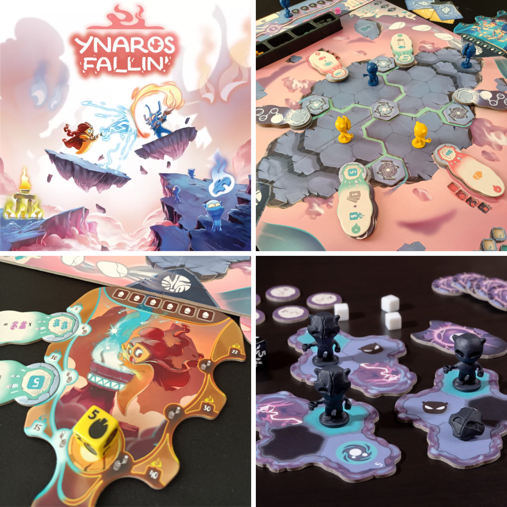
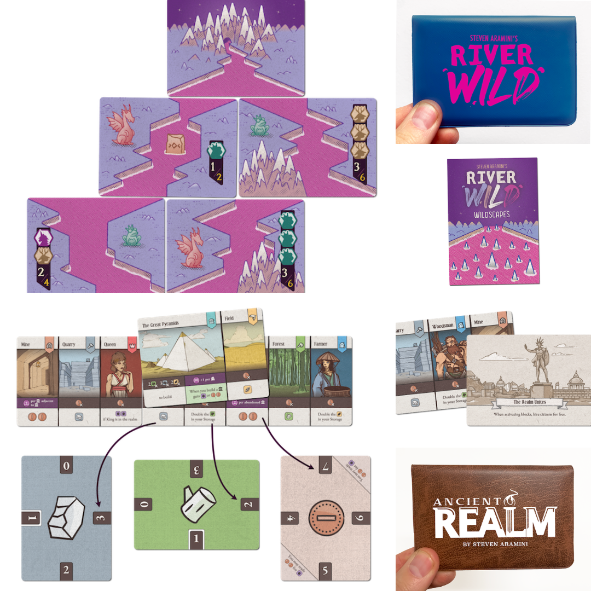
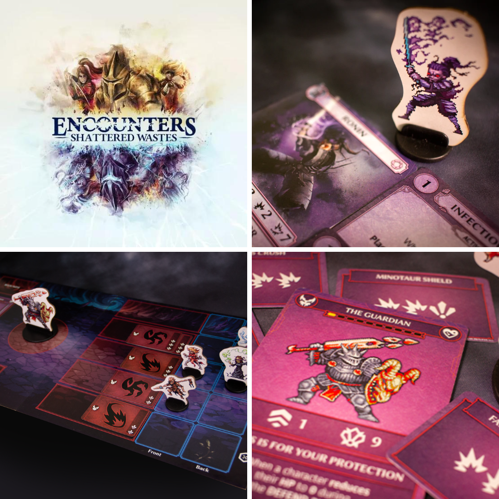
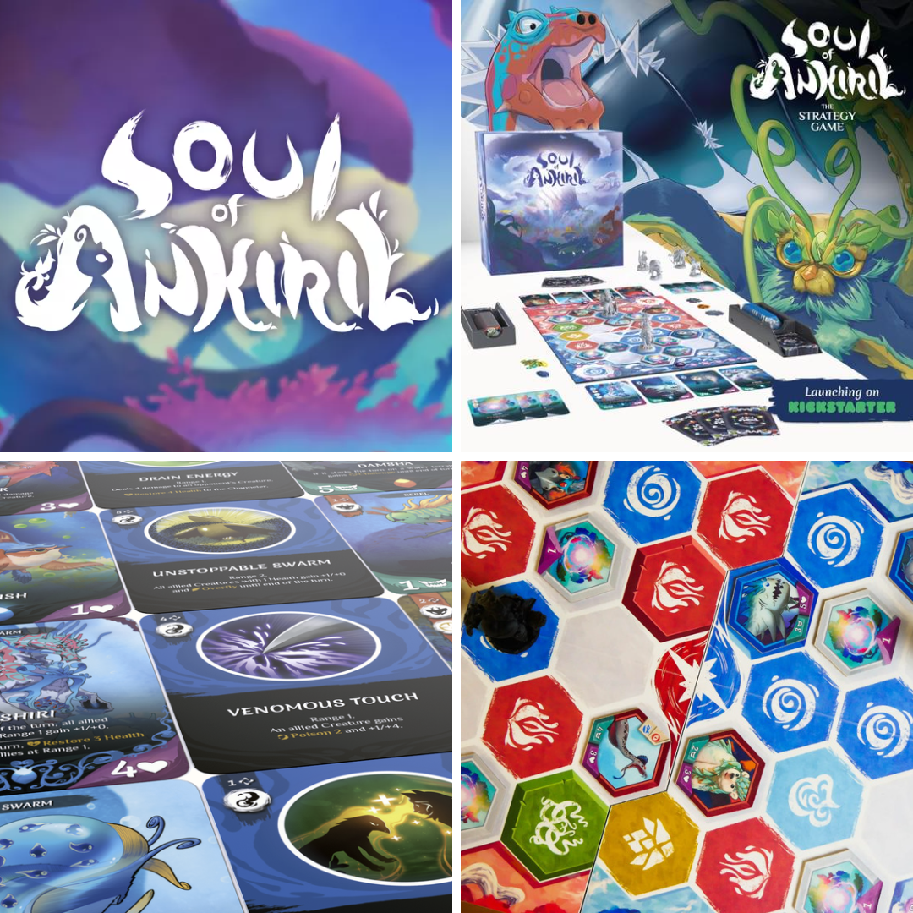

<FundingIntro>
  In questa seconda uscita di DudeFunding (seguiteci tutti i martedì) parliamo di giochi dalla direzione artistica
  spettacolare e cucita su misura.  
  “Embè?" direte voi.
    Risposta: diamo un po’ di credito a questi artisti fenomenali e ai loro lavori bellissimi. Quindi eccoci qua, a
  sbirciare tra giochi con un gameplay, si spera, bello almeno quanto l’artwork!
</FundingIntro>

<FundingBit
  title="Ynaros Fallin’"
  player_count={2}
  player_count_official="1-4"
  weight={2}
  playing_time="60min"
  playing_time_official="60min"
  hype={7}
  deadline="31/03/2023"
  delivery="02/2024"
  price="36€"
  otherPrice="13€ + VAT"
  designer={["Luca Sanfilippo", "Ugo Tomasello"]}
  publisher={["Peekwik Dreams"]}
  mechanism={["Controllo area", "Gestione risorse", "Combattimento risolto con carte"]}
>
  Di Ynaros Fallin’ abbiamo già ampiamente parlato in anteprima <Link to="/reviews/ynaros-fallin/">qui</Link>, se volete
  approfondire.  I giocatori impersonano dei potenti sciamani che si scontrano in una lotta per la supremazia. Il
  gioco si basa sulla ripetizione delle fasi <em>deeds</em>, <em>fate</em> e <em>cantrips</em>, in cui giocatori
  manipoleranno le carte a loro disposizione per accrescere l’energia e la propria esperienza durante battaglie magiche.{" "}
   
  Le illustrazioni sono gradevolissime e il flusso di gioco non sembra niente male. Saranno sufficienti queste caratteristiche
  per dargli la giusta visibilità in un mondo pieno di giochi di <Link to="/mechanisms/controllo-area">
    Controllo area
  </Link>?
</FundingBit>

<FundingBit
  title="River Wild & Ancient Realm"
  player_count={1}
  player_count_official="1"
  weight={2}
  playing_time="15min"
  playing_time_official="15-15min"
  hype={9}
  deadline="18/03/2023"
  delivery="07/2023"
  price="20US$"
  otherPrice="20US$ + VAT"
  designer={["Steven Aramini"]}
  publisher={["Button Shy "]}
  mechanism={["Solitario", "Carte"]}
>
  La <Link to="/publishers/button-shy">Button Shy</Link> e Steven Aramini? I'm in! Anche se… in realtà no, le spese di
  spedizione dei kickstarter della Button Shy sono troppo costose e questo è il lato negativo di questi due giochi.{" "}
   
  Detto ciò, la Button Shy questa volta ci mostra due kickstarter contemporaneamente:
  <ul>
    <li>
      River Wild sfida i giocatori a creare la valle più bella possibile, arrangiando i fiumi in modo da massimizzare i
      punti, sfruttando anche il potere delle rune: e tutto questo sempre contenuto nella magia delle 18 carte classiche
      dei loro giochi. Davanti a sé il giocatore avrà sempre tre possibilità tra cui scegliere la carta che andrà a
      connettersi alla valle in corso e ogni mossa sarà fondamentale per massimizzare il punteggio.
    </li>
    <li>
      In Ancient Realm, invece, i giocatori cercheranno di creare la civiltà migliore utilizzando le risorse per
      costruire edifici e attivarne le abilità. Ogni carta pescata tra le quattro disponibili può essere posizionata a
      fianco dell'impero già esistente o in modo da coprirne dei pezzi. In entrambi i casi bisognerà pagare il prezzo di
      costruzione, ma solo nel secondo si attiveranno dei bonus di copertura. La sfida sta tutta nel trovare
      l'equilibrio tra il miglioramento della propria civiltà e il tentativo di sopravvivere agli eventi positivi o
      negativi che dovremo affrontare ogni turno. A fine partita, il giocatore si godrà lo spettacolo di quanto sarà
      rimasto in piedi e dovrà capire quanti punti avrà ottenuto!
    </li>
  </ul>
</FundingBit>

<FundingBit
  title="Encounters: Shattered Wastes"
  player_count={2}
  player_count_official="1-4"
  weight={3}
  playing_time="70min"
  playing_time_official="60-100min"
  hype={9}
  deadline="24/03/2023"
  delivery="04/2024"
  price="55US$"
  otherPrice="20US$ + VAT"
  designer={["Almanac Games"]}
  publisher={["Almanac Games"]}
  mechanism={["Cooperativo", "Drafting aperto"]}
>
  Standee con illustrazioni 8bit? Ci sono!
   
  Come in ogni buon GDR, i giocatori impersoneranno avventurieri che dovranno affrontare le pericolose terre chiamate “
  <em>The shattered Wastes</em>", fino a quando non ne usciranno vincitori o non moriranno per colpa delle ferite o
  della corruzione.
   
  In concreto, i giocatori affronteranno una serie di incontri utilizzando carte e dadi per poter infliggere abbastanza
  danni da uccidere i boss… 2 volte! Sì, come ormai i vari Dark Souls ci hanno insegnato, anche qua i boss hanno una
  seconda fase! Ma sapete stavolta chi altri avrà una seconda vita? I giocatori! Dopo avere visto la loro vita ridotta a
  zero, risorgeranno corrotti, più fragili ma anche più potenti!  
  Un gioco del genere, anche solo per l’8bit, avrebbe già un posto speciale nel mio cuore… In più, la possibilità di costruirsi
  un personaggio e lanciarlo a capofitto verso la sua morte ha quel non so che di nostalgico che non può che fare bene al
  cuore, visto anche il sistema di gioco che sembra tanto semplice quanto tattico e che pregustiamo già immaginando molteplici
  soddisfazioni. C’è da domandarsi solo se non sia tutto troppo facile… Aspettiamo fiduciosi che i designer stronchino tutti
  questi scrupoli!
</FundingBit>

<FundingBit
  title="Soul of Ankiril"
  player_count={3}
  player_count_official="2-4"
  weight={2}
  playing_time="40min"
  playing_time_official="30-45min"
  hype={9}
  deadline="24/03/2023"
  delivery="11/2024"
  price="34€"
  otherPrice="10€ + VAT"
  designer={["Ercole Belloni", "Marco Valtriani"]}
  publisher={["Tambù"]}
  mechanism={["Punti azione", "Deck building", "Gestione mano"]}
>
  Nel pianeta Ankiril alcuni individui controllano i 6 Temen: fuoco, terra, metallo, acqua, aria elegno. C’è però dello
  squilibrio e così vengono evocati degli Avatar, ovvero i giocatori, nel tentativo di ristabilire ordine ed equilibrio
  con scontri alchemici!
   
  Qualcuno ha detto <Link to="/reviews/marvel-dice-throne/">Dice Throne</Link>? No? Avete fatto bene! Le similitudini
  tra i due sono solo a livello concettuale e, tutt’al più, si rivedono nella presenza di un mazzo di carte. Per il
  resto, si tratterà di collegare due mappe che fungeranno da base per il combattimento. Ogni giocatore avrà a
  disposizione creature da evocare e incantesimi da lanciare. Il tutto allo scopo di manipolare la mappa e far sì che il
  proprio avatar possa raggiungere e chiudere dei portali, garantendo così la vittoria.
   
  Soul of Ankiril sembra un gioco in cui il bilanciamento avrà un ruolo preponderante: i sei elementi saranno abbastanza
  bilanciati? e le creature? e ogni singolo oggetto della componentistica? Scontri troppo sbilanciati potrebbero far
  storcere il naso ai più, giustamente, invogliando surrettiziamente ad acquistare il pack con tutti i sei elementi per
  ridurre questo rischio. Però, se sopravvivrà alla ghigliottina del bilanciamento, questo titolo potrebbe avere le
  carte in regola per entrare presto nella rubrica <Link to="/advisor/giochi-da-due/">DudeAdvisor</Link>...
</FundingBit>

