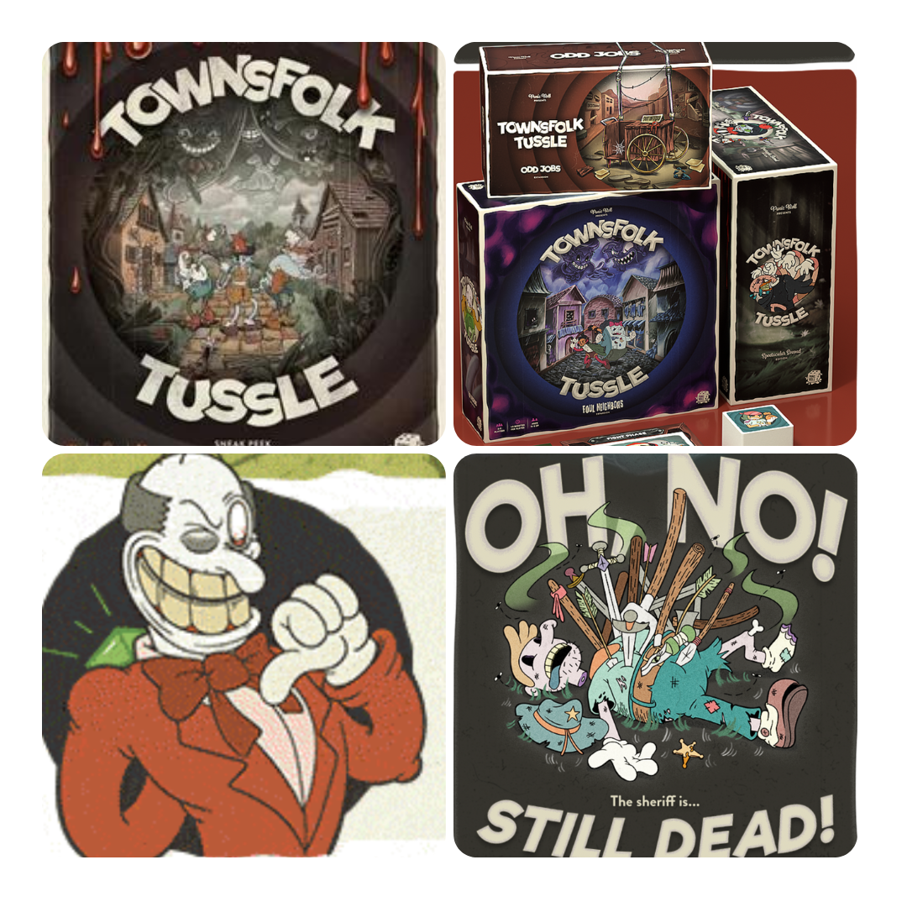
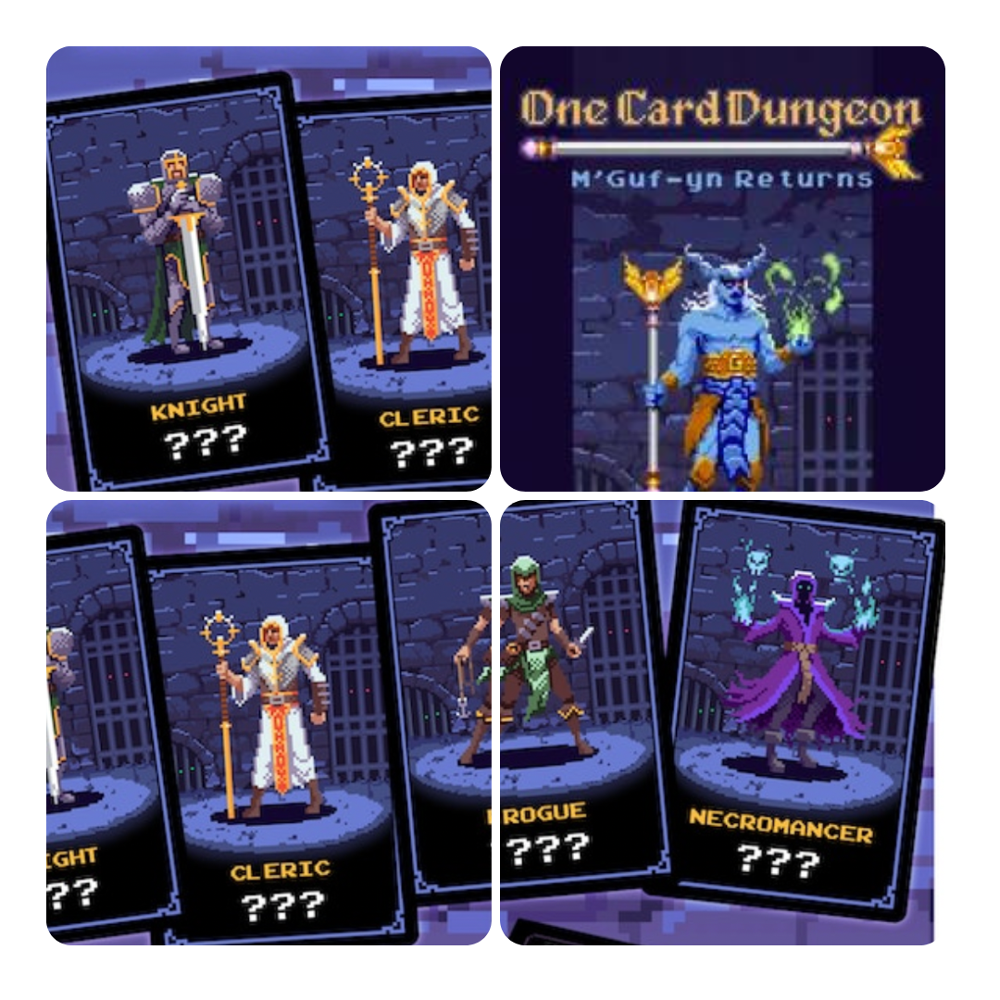
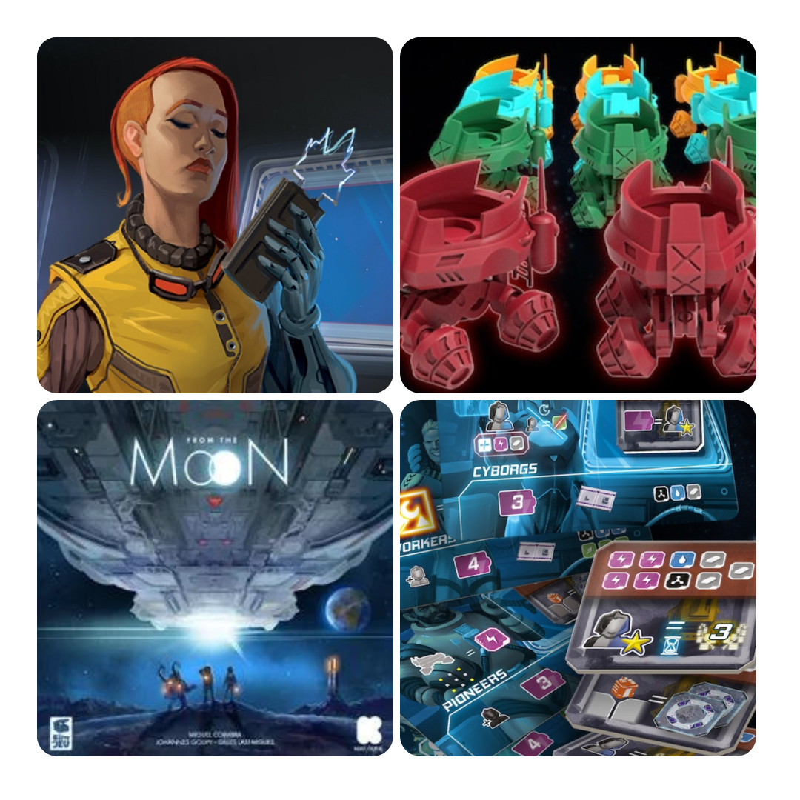
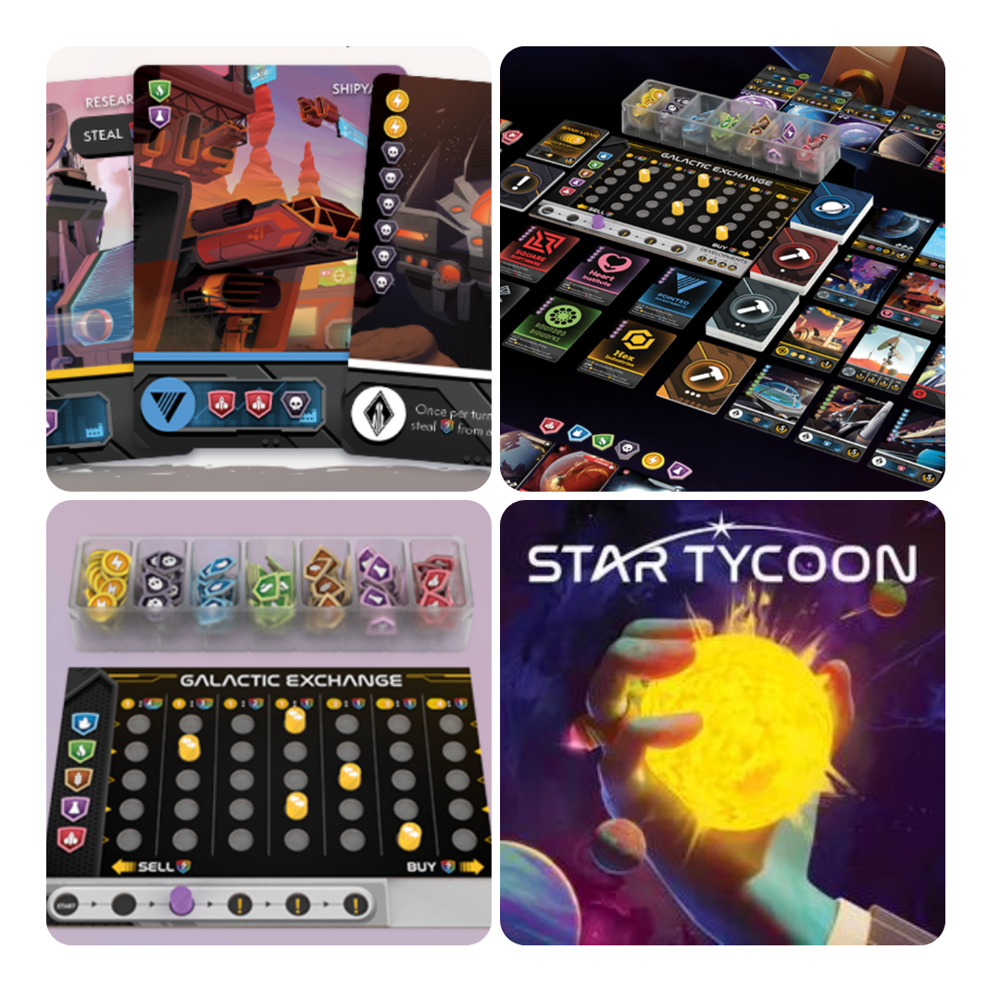

<FundingIntro>
  Per la terza uscita di questa rubrica vi portiamo tra i meandri spaziali del kickstarter… E in un dungeon… E in una
  insospettabile cittadina cartoonesca. Questa volta i giochi scelti saranno un attacco ai portafogli per rivisitazioni
  a meccaniche ormai abusate o semplicemente per una grafica accattivante. Cederete al canto delle sirene?
</FundingIntro>

<FundingBit
  title="Townsfolk Tussle: Foul Neighbors and Odd Jobs"
  player_count={3}
  player_count_official="2-5"
  weight={3}
  playing_time="90min"
  playing_time_official="40-200min"
  hype={9}
  deadline="07/04/2023"
  delivery="09/2024"
  price="105 US$"
  otherPrice="40 US$ + VAT"
  designer={["Stephen Louis", "Tony Mayer", "Rachel Rusk"]}
  publisher={["Panic Roll"]}
  mechanism={["Cooperativo"]}
>
  Seconda edizione per Townsfolk Tussle e nuova comparsa su Kickstarter. Il sindaco è morto, di nuovo: sta a voi
  proteggere la città dai cattivissimi che cercano di rovesciare l’ordine pubblico! Uno dopo l’altro dovranno cadere in
  pieno stile…cartoonesco?!  
  Da 2 a 5 giocatori dovranno muoversi su una mappa, diversa per ogni <em>Ruffian</em>, sfruttando abilità e oggetti comprati
  per poter picchiare fino alla morte il cattivone di turno, mentre questi cerca di reagire attraverso il classico mazzo
  di carte reazioni.  
  Questo kickstarter vi permetterà non solo di ottenere il gioco base in una versione 2.0, ma vi permetterà anche di
  "comprare" le espansioni del gioco, le quali introducono nuova variabilità di carte oggetti, abilità o veri e propri
  boss e ruoli per i giocatori per rendere il tutto più interessante!  
  Che dire? Un gioco che non solo attira decisamente per la grafica cartoonesca, ma che sembra avere tutte le caratteristiche
  per essere un bel <Link to="/mechanisms/cooperativo">Cooperativo</Link> grazie ad un sistema di azioni divertente e alla
  diversità dei cattivi, che promettono alta rigiocabilità e un sistema di combattimento tattico emozionante!
</FundingBit>

<FundingBit
  title="ONE CARD DUNGEON - M'Guf-yn Returns P&P"
  player_count={1}
  player_count_official="1"
  weight={2}
  playing_time="30min"
  playing_time_official="15-60min"
  hype={7}
  deadline="11/04/2023"
  delivery="04/2023"
  price="3€"
  otherPrice="-"
  designer={["Barny Skinner"]}
  publisher={["Little Rocket Games"]}
  mechanism={["Punti azione", "Dadi", "Solitario"]}
>
  Sì, avete letto bene: è un Print and Play. Dovrete stamparvi i file che vi verranno mandati praticamente subito! O
  aspettare che quest’autunno la <Link to="/publishers/little-rocket-games">Little Rocket Games</Link> ce lo porti
  fisicamente!  
  One Card Dungeon è un solitario basato su un sistema di dungeon composti da carte, in cui il giocatore, utilizzando le
  abilità speciali della sua classe, dovrà destreggiarsi per eliminare tutti i nemici che gli si pareranno davanti lanciando
  e assegnando dadi, esplorando i piani del dungeon, di carta in carta, fino ad arrivare al confronto finale contro il boss.{" "}
   
  Da amante dei <Link to="/mechanisms/solitario">Solitari</Link>, ho sempre voluto provare questo gioco e con la scusa
  del print and play… la mia stampante sicuramente mi odierà!
</FundingBit>

<FundingBit
  title="From The Moon"
  player_count={3}
  player_count_official="1-4"
  weight={2}
  playing_time="90min"
  playing_time_official="90-90min"
  hype={9}
  deadline="23/03/2023"
  delivery="02/2024"
  price="65€"
  otherPrice="7€"
  designer={["Johannes Goupy", "Gilles Lasfargues"]}
  publisher={["La Boîte de Jeu"]}
  mechanism={["Piazzamento lavoratori", "Preparazione variabile"]}
>
  In From the Moon i giocatori, appartenenti a diverse "fazioni", dovranno contribuire tutti assieme a costruire
  l’astronave che salverà l’umanità da una Terra morente e che porterà tutti in giro per la Galassia.
   
  In termini di gioco, bisognerà sfruttare i propri lavoratori, in tre diversi colori, con competenze base o
  specializzati, per farli salire massimo tre alla volta sui rover e attivare così delle azioni con cui si recupereranno
  le risorse necessarie al potenziamento della propria base, che a sua volta potenzierà le azioni disponibili, allo
  scopo di riuscire a salvare l’umanità completando la costruzione della nave!  
  Il gioco sembra dare linfa nuova ad una meccanica vista e rivista come il <Link to="/mechanisms/piazzamento-lavoratori">
    piazzamento lavoratori
  </Link>, regalando variabilità e di complicazioni che permette una ricerca particolare di ottimizzazione estrema che vi
  porterà nello spazio e oltre!!
</FundingBit>

<FundingBit
  title="Star Tycoon"
  player_count={3}
  player_count_official="1-6"
  weight={2}
  playing_time="60min"
  playing_time_official="20-120min"
  hype={8}
  deadline="31/03/2023"
  delivery="02/2024"
  price="49 US$"
  otherPrice="17 US$ + VAT"
  designer={["Peter Sanderson"]}
  publisher={["Warp Core Games"]}
  mechanism={["Economico", "gestione risorse"]}
>
  Cosa c’è di meglio di un business? Un business spaziale, ovviamente! In Star Tycoon i giocatori dovranno espandere i
  propri desideri di conquista monetari in ogni angolo della galassia. Il tutto mentre un mercato centrale alla{" "}
  <Link to="/reviews/clans-of-caledonia">Clans of Caledonia</Link> reagisce alle scelte economiche dei giocatori,
  contraendo e/o espandendo i prezzi delle risorse.  
  All’atto pratico bisognerà usare delle carte per acquistare pianeti (sì: si pensa in grande), ottenere risorse da essi,
  vendere e comprare per massimizzare i profitti e ottenere punti vittoria grazie a preziose partnership.
   
  Star Tycoon è un gioco che un certo <Link to="/writers/dadi-daddy">Dude</Link> non potrà che apprezzare: riuscirà a farsi
  trascinare da un’ambientazione spaziale con grafica accattivante e da un motore di gioco che, per quanto semplice, sembra
  davvero fare quello che promette, proponendosi come un economico puro?
</FundingBit>

