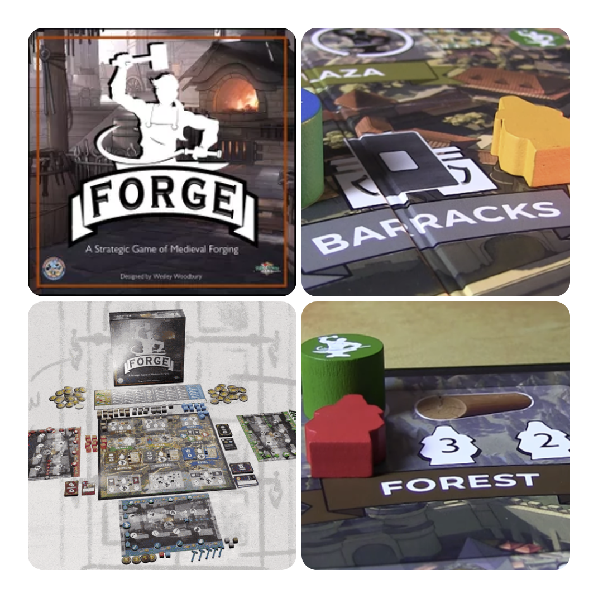
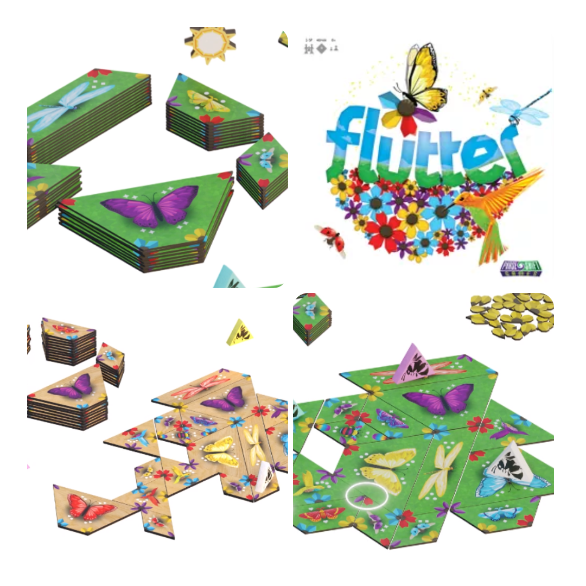
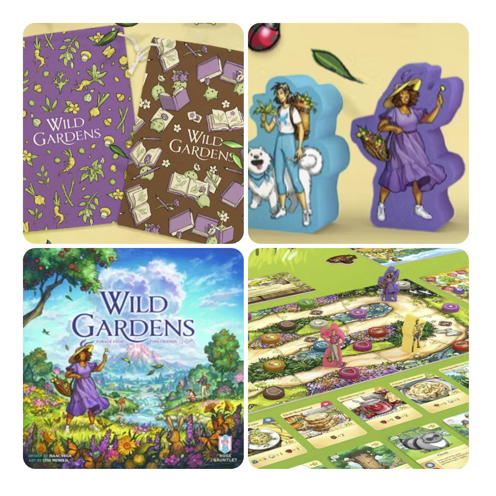
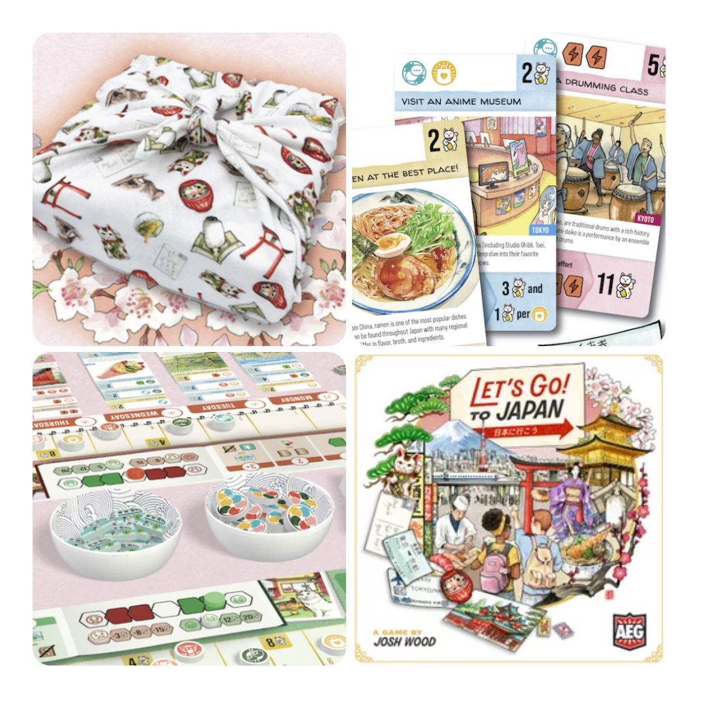

<FundingIntro>
  Oggi vi porteremo prima nel medioevo, poi a cercare farfalle e buoni ingredienti per piatti prelibati e infine nel
  miglior viaggio possibile: in Giappone. In tutti questi giochi c’è un filo comune: i punti vittoria. In ogni gioco di
  questo numero i punti vittoria sembrano quasi una scusa, appiccicati. Sono sempre i punti vittoria la condizioni di
  fine partita più interessante?
</FundingIntro>

<FundingBit
  title="Forge"
  player_count={3}
  player_count_official="2-4"
  weight={2}
  playing_time="100min"
  playing_time_official="90-120min"
  hype={7}
  deadline="14/04/2023"
  delivery="12/2023"
  price="75 CA$"
  otherPrice="27 CA$ + VAT"
  designer={["Wesley Woodbury"]}
  publisher={["Self-Published"]}
  mechanism={["Piazzamento lavoratori"]}
>
  La via del Fabbro nei tempi antichi era considerata un’arte e l’abilità di forgiare richiedeva competenze invidiabili:
  in Forge sarete dei fabbri desiderosi di migliorare la vostra arte e di guadagnare reputazione e fama.  
  Lo scopo del gioco sarà avere più punti vittoria di tutti quando uno dei giocatori avrà completato 5 obiettivi facendo
  scattare il round finale di gioco. Durante il turno i giocatori dovranno gestire il proprio fabbro e gli assistenti per
  completare azioni sulla plancia del gioco e trovare clienti: il tutto mentre si migliora la propria forgia per massimizzare
  il profitto, all’inseguimento degli obiettivi e dei preziosi punti vittoria seguendo varie strade!  
  Un classico <Link to="/mechanisms/piazzamento-lavoratori">Piazzamento lavoratori</Link> insomma. Un gioco che ha quel
  gusto di una campagna crowdfunding per qualcosa che serve per davvero. Perché dargli fiducia? Perché l’ambientazione è
  affascinante e il gioco sembra filare tutto liscio, un colpo sull’incudine dopo l’altro. Siete pronti a forgiare la
  vostra strada verso il successo?
</FundingBit>

<FundingBit
  title="Flutter"
  player_count={3}
  player_count_official="2-5"
  weight={1}
  playing_time="40min"
  playing_time_official="30-35min"
  hype={8}
  deadline="20/04/2023"
  delivery="12/2023"
  price="29 US$"
  otherPrice="15 US$ + VAT"
  designer={["Matt Bahntge"]}
  publisher={["Phase Shift Games"]}
  mechanism={["Piazzamento tessere", "Drafting aperto"]}
>
  Solo io ho pensato a <Link to="/reviews/wingspan">Wingspan</Link>? Davvero? Beh meno male: perché sbagliereste! Anche
  perché in questo gioco lo scopo è di fatto quello di attrarre farfalle invece che uccelli…  
  Tutto sembra molto semplice: si dovranno giocare delle tessere per comporre fiori in grado di attrarre le specie desiderate,
  sfruttando le api per spostare il polline su altri fiori e ottenere più punti.  
  Sulla campagna Gamefound c’è scritto che il gioco punta ad essere semplice e facile e beh… Sembra esattamente così. Un
  gioco semplice adatto alle famiglie, per serate rilassanti attorno ad un tema rilassante!
</FundingBit>

<FundingBit
  title="Wild Gardens"
  player_count={1}
  player_count_official="1-4"
  weight={2}
  playing_time="100min"
  playing_time_official="90-120min"
  hype={9}
  deadline="19/04/2023"
  delivery="05/2024"
  price="50 US$"
  otherPrice="27 US$ + VAT"
  designer={["Isaac Vega"]}
  publisher={["Rose Gauntlet Entertainment"]}
  mechanism={["Costruzione motore"]}
>
  Un gioco sul cibo dall’inizio alla fine! Count me in!  
  Sfruttando le carte bisognerà migliorare la propria conoscenza per poter scoprire gli ingredienti necessari a creare delle
  prelibatezze raffinate. Il tutto andrà tarato sul proprio playstyle e dovrà portare alla massimizzazione dei… punti vittoria
  ovviamente!  
  Una campagna con una direzione grafica appassionante e particolare: questo gioco sembra un viaggio verso una
  destinazione sconosciuta, fatta di gioia per il palato e per gli occhi. Forse, da giocatore di{" "}
  <Link to="/mechanisms/solitario">Solitari</Link> quale sono, l’idea del <em>Solo Storybook</em> mi risulta
  particolarmente affascinante e forse potrebbe essere proprio questo il modo migliore per godersi questa esperienza
  artistica! Voi che ne pensate?
</FundingBit>

<FundingBit
  title="Let's Go! To Japan
"
  player_count={3}
  player_count_official="1-4"
  weight={2}
  playing_time="60min"
  playing_time_official="45-60min"
  hype={6}
  deadline="11/04/2023"
  delivery="04/2024"
  price="39 US$"
  otherPrice="18 US$ + VAT"
  designer={["Josh Wood"]}
  publisher={["Alderac Entertainment Group"]}
  mechanism={["Collezione set", "Narrativo", "Drafting"]}
>
  Un gioco-guida turistica in Giappone alla ricerca delle sue attrazioni... ma come funziona sul tavolo?  
  Giocando carte si potranno pianificare le visite e un itinerario di viaggio tale da poter ottenere più punti vittoria possibile,
  ma solo se l’esperienza si rivelerà soddisfacente e non stressante!  
  Un gioco sicuramente stuzzicante per gli amanti del sol levante, ma basta davvero attaccare dei punti vittoria per
  rendere un’esperienza un gioco?
</FundingBit>

