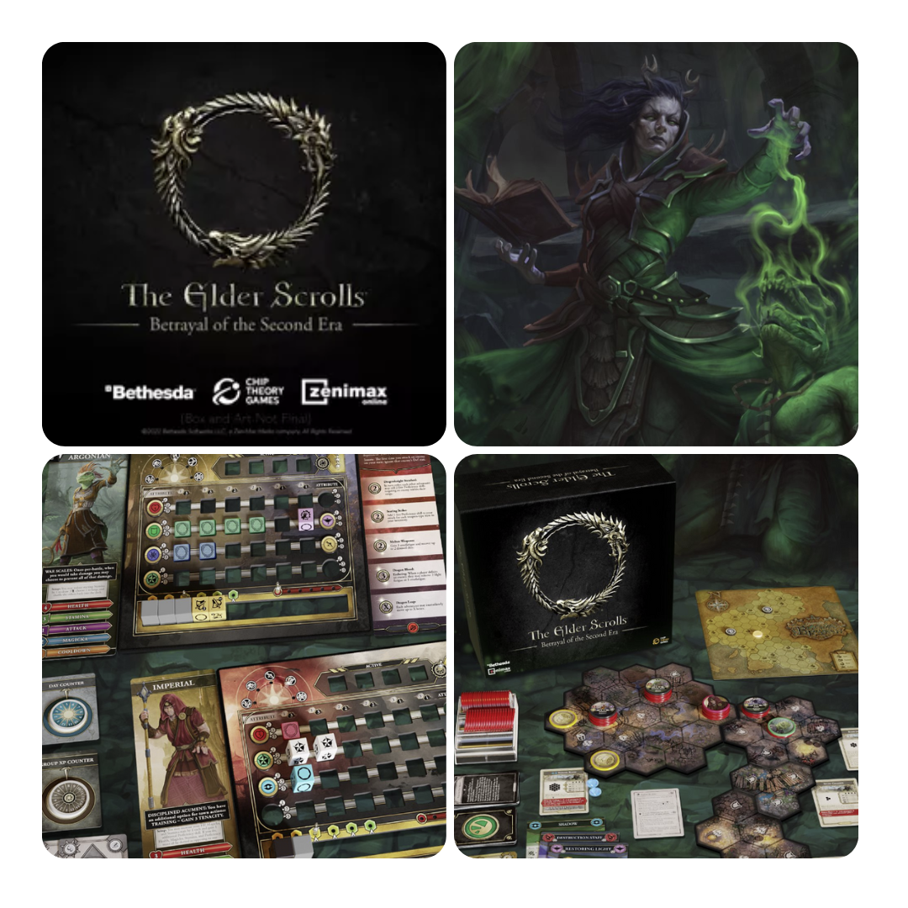
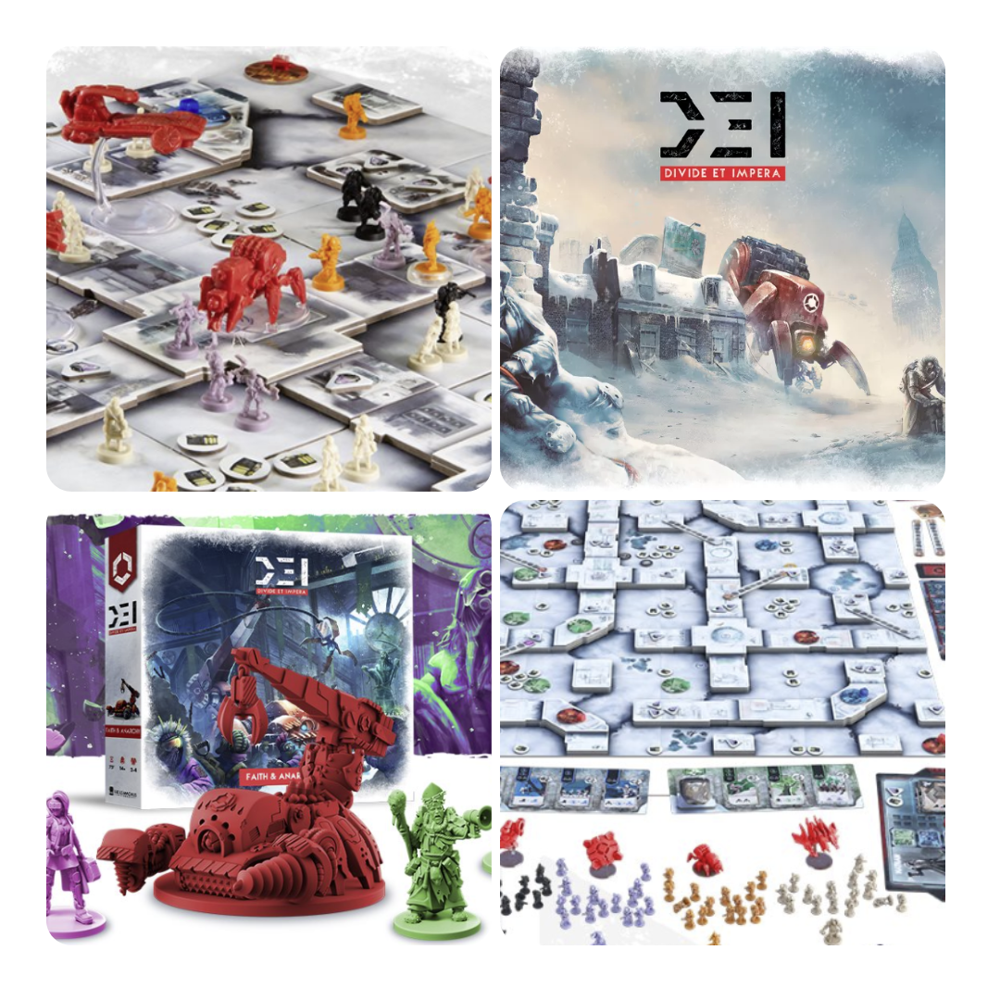
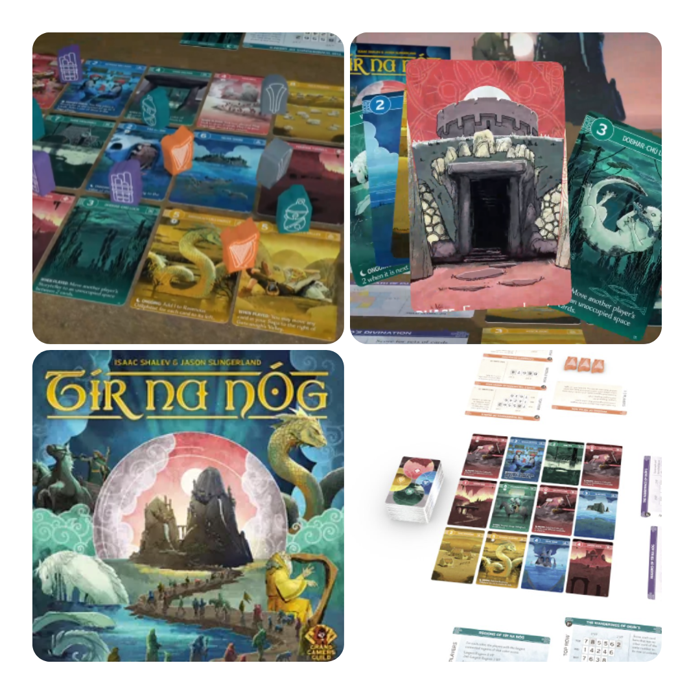
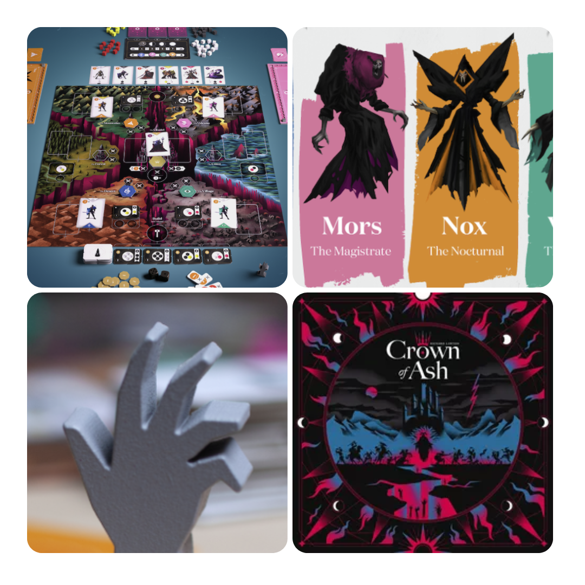

<FundingIntro>
  Cosa succede quando escono dei progetti crowdfunding molto belli contemporaneamente e non si sa scegliere?  
  Ci si rivolge agli "esperti" del settore sperando che le loro osservazioni critiche vi facciano vacillare e non spendere
  il denaro sonante! Eppure… Perché dopo aver letto una rubrica a tema spendo più soldi? Succede solo a me?
</FundingIntro>

<FundingBit
  title="The Elder Scrolls: Betrayal of the Second Era"
  player_count={2}
  player_count_official="1-4"
  weight={3}
  playing_time="100min"
  playing_time_official="60-240min"
  hype={9}
  deadline="22/04/2023"
  delivery="10/2024"
  price="195$"
  otherPrice="0$ + VAT"
  designer={["Josh J. Carlson", "Michael Gernes", "Logan Giannini"]}
  publisher={["Chip Theory Games"]}
  mechanism={["Cooperativo", "Dadi", "Poteri variabili", "Albero tecnologico"]}
>
  Da sempre esiste lo stigma sui giochi da tavolo tratti da IP, che, si dice, sono così belli, sovra prodotti e
  sovraprezzati per spillare più soldi possibili ai poveri acquirenti. Beh, questo "The elder scroll" non sembra tanto
  diverso.  
  L’ambientazione è nel mondo omonimo, famoso per la serie di videogiochi. I giocatori dovranno crearsi un personaggio e
  mandarlo in una regione di Tamriel per risolvere la <em>Quest</em> di turno, un’avventura dopo l’altra, per la salvezza
  del mondo. Eventi, incontri, battaglie... Ci sarà di tutto da affrontare e da fare. Intanto, il personaggio si evolverà
  per essere più performante, sviluppando nuove abilità utili al combattimento o ad altro!  
  Un gioco che sembra un’evoluzione di <Link to="/reviews/too-many-bones">Too Many Bones</Link> (della stessa casa
  editrice): ne prende e ne espande i lati migliori, dando al giocatore un’esperienza di gioco super customizzabile!
  Sapiente sembra essere il ricorso al cooldown delle abilità che, almeno su carta, dovrebbe dare un livello di
  complessità e di divertimento assicurato alle vostre avventure. Sarà davvero così o la maledizione delle IP avrà la
  meglio?
</FundingBit>

<FundingBit
  title="D.E.I. - Divide Et Impera (Expansion & Reprint)"
  player_count={4}
  player_count_official="1-4"
  weight={3}
  playing_time="90min"
  playing_time_official="60-90min"
  hype={9}
  deadline="07/04/2023"
  delivery="12/2023"
  price="49€"
  otherPrice="13€"
  designer={["Tommaso Battista"]}
  publisher={["Ludus Magnus Studio"]}
  mechanism={["Movimento ad area", "Piazzamento lavoratori", "Controllo territori"]}
>
  In un mondo sopraffatto dai postumi di una catastrofe che l’ha quasi distrutto, i giocatori, leader di una delle
  fazioni in lotta, dovranno cercare di fare tutto il possibile per ottenere più potere. In D.E.I. Faith & Anarchy ci
  saranno due nuove fazioni: Cultisti e Anarchici si aggiungeranno alla lotta per il potere con le loro debolezze e i
  loro punti di forza. Inoltre, in questa espansione saranno presenti nuove fonti di variabilità per i giocatori che
  dovranno affrontare queste nuove sfide.  
  Tramite questo kickstarter non sarà solo possibile recuperare questa espansione, ma anche avere accesso alla ristampa di
  un gioco che in piene stile <Link to="/publishers/ludus-magnus-studio">LMS</Link> saprà lasciarsi apprezzare dagli appassionati:
  quale scusa migliore, dunque, per lanciarsi nella lotta al potere?
</FundingBit>

<FundingBit
  title="Tír na nÓg"
  player_count={3}
  player_count_official="1-5"
  weight={2}
  playing_time="45min"
  playing_time_official="30-34min"
  hype={8}
  deadline="14/04/2023"
  delivery="04/2024"
  price="36$"
  otherPrice="24$ + VAT"
  designer={["Isaac Shalev", "Jason Slingerland"]}
  publisher={["Grand Gamers Guild"]}
  mechanism={["Drafting aperto", "Gestione mano"]}
>
  Nell’<em>Otherworld</em>, secondo le mitologie irlandesi, risiedono le fate e, ogni tanto, le porte del Tír na nÓg si
  aprono, permettendo ai bardi di affrontare un viaggio incredibile al loro interno. Affronterete questo viaggio?  I
  giocatori, quasi come in <Link to="/reviews/red-rising">Red Rising</Link>, dovranno cercare di comporre una sequenza di
  carte in grado di produrre il maggior numero di punti vittoria (in questo caso, si tratterà di riuscire a comporre la saga
  migliore). Queste carte andranno recuperate, come storie dall’Otherworld. A fine partita, la saga "migliore" verrà premiata
  con più punti vittoria.  
  Tír na nÓg è un gioco che si presenta fresco e pulito, con una direzione artistica stupefacente e un sistema di gioco
  accattivante e che, grazie alla sua velocità di esecuzione, sembra promettere partite rapide e al cardiopalma. Chi
  sarà il miglior bardo in grado di generare una saga destinata a rimanere negli annali? Unico piccolo problema… le
  spese di spedizione costano quanto il gioco stesso!
</FundingBit>

<FundingBit
  title="Crown of Ash"
  player_count={3}
  player_count_official="1-4"
  weight={3}
  playing_time="90min"
  playing_time_official="60-120min"
  hype={7}
  deadline="20/04/2023"
  delivery="03/2024"
  price="45£"
  otherPrice="9£ + VAT"
  designer={["Richard Lawton"]}
  publisher={["Card Noir"]}
  mechanism={["Controllo territori", "Piazzamento lavoratori"]}
>
  Crown of Ash della <u>Card Noir</u> è un gioco che vedrà i giocatori confrontarsi per il trono di migliore Necromante
  grazie a poteri alchemici e beh… ovviamente a non morti!  
  Il gioco si basa sulla raccolta di risorse durante il turno, da cui ottenere potenti guerrieri, da porre poi sulla mappa
  di gioco a controllo di potenti strutture. Il tutto ovviamente condito da sane mazzate tra orde di non morti, veicolate
  da carte con un sistema di bluff che può, mooolto alla lontana, ricordare vagamente il buon <Link to="/reviews/rising-sun">
    Rising sun
  </Link>.  
  Sicuramente non si può dire che Crown of Ash non sia un gioco elegante: si vede il lavoro di fino che il designer sta
  tentando di dare al progetto. Una dichiarazione d’amore al gioco da tavolo del suo creatore, forse uno dei pochi
  giochi che ha senso portare su kickstarter nella speranza di poter coronare il proprio sogno! (Sì era una battuta)
</FundingBit>

