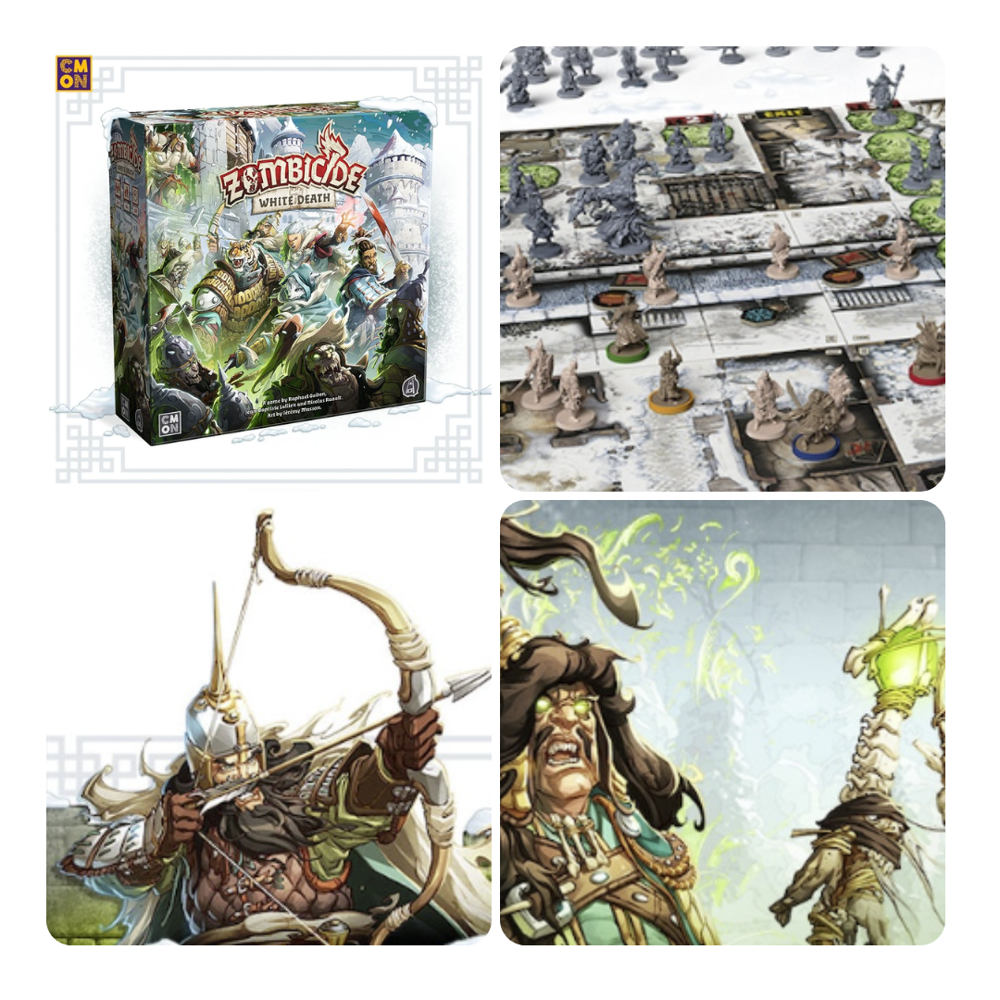
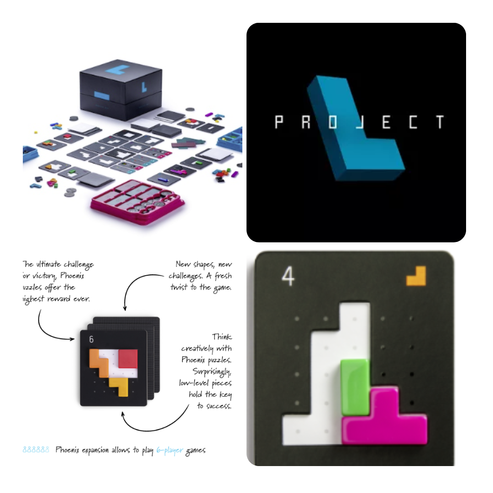
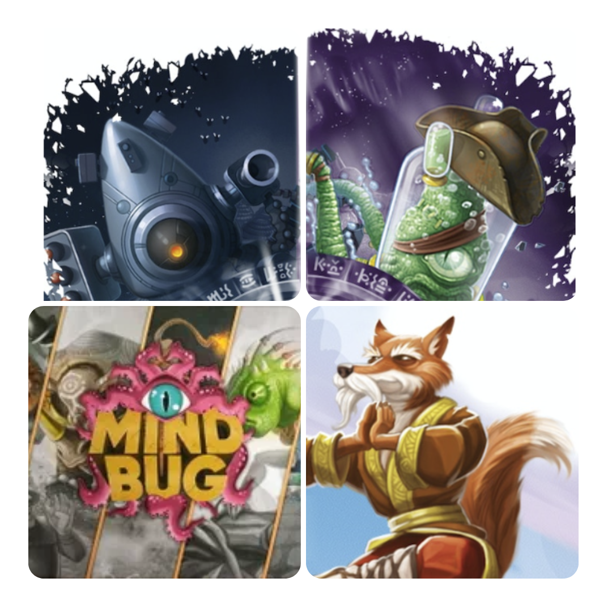
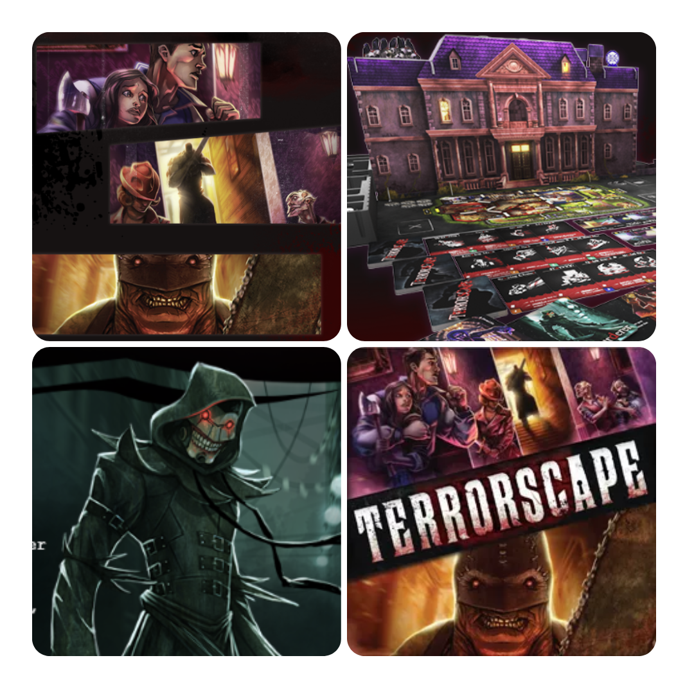

<FundingIntro>
  Ci risiamo!. <Link to="/publishers/cmon">CMON</Link> ha prodotto un nuovo gioco… Un nuovo…Zombicide! Per festeggiare
  questo rarissimo evento abbiamo deciso di portarvi solamente giochi che sono stati già coperti su Dudexpress e un
  gioco che non può non mancare, ma che vi terrorizzerà fino alla viscere! Quindi eccoci: Wintergard e il vostro
  portafoglio hanno bisogno di voi!
</FundingIntro>

<FundingBit
  title="Zombicide: White Death"
  player_count={3}
  player_count_official="1-6"
  weight={2}
  playing_time="60min"
  playing_time_official="30-180min"
  hype={7}
  deadline="27/04/2023"
  delivery="05/2024"
  price="110 US$"
  otherPrice="35 US$ + VAT"
  designer={["Raphaël Guiton", "Jean-Baptiste Lullien", "David Preti", "Nicolas Raoult"]}
  publisher={["CMON"]}
  mechanism={["Cooperativo", "Dadi"]}
>
  Wintergrad è stata attaccata dai crudeli Necromanti che con le loro legioni di zombie vi daranno filo da torcere, ma
  non hanno fatto i conti con voi, i Sopravvissuti!  
  Questa ennesima edizione di Zombicide sembra mantenere il nostro “amato" motore di gioco e allinearlo con la sua versione
  più moderna vista in <Link to="/reviews/zombicide-2-edizione/">Zombicide seconda edizione</Link> e con meccaniche nuove
  che vi permetteranno di affrontare le orde in maniere più efficaci! Apprezzo il tentativo di inserire le guardie come aiutanti
  dei sopravvissuti, che vi permetteranno di poter usare dell’extra <s>carne da macello</s> e armi al vostro servizio! Un
  gioco che in teoria può anche essere interessante, ma… Lo sarà ancora con questa ennesima iterazione?
</FundingBit>

<FundingBit
  title="Project L Reprint + New Expansion"
  player_count={3}
  player_count_official="1-4"
  weight={2}
  playing_time="30min"
  playing_time_official="20-40min"
  hype={8}
  deadline="13/04/2023"
  delivery="12/2023"
  price="45€"
  otherPrice="15€ + VAT"
  designer={["Michal Mikeš", "Jan soukal", "Adam Spanel"]}
  publisher={["Boardcubator"]}
  mechanism={["Punti azione", "Costruzione pattern", "Posizionamento tessere"]}
>
  <Link to="/reviews/project-l">Project L</Link> è tornato con i suoi puzzle e il suo divertimento assicurato! In questa
  nuova pubblicazione su kickstarter ci sarà la possiblità di recuperare tutto il materiale originario, l’espansione
  Phoenix e di avere una collector edition con un sacco di chicche che non potranno che far gola all’appassionato! Ma
  non solo per gli appassionati: snche i novizi potranno trovare in questa edizione un buon motivo per imbarcarsi nell’
  avventura di project L!
</FundingBit>

<FundingBit
  title="Mindbug Beyond"
  player_count={2}
  player_count_official="2"
  weight={2}
  playing_time="10min"
  playing_time_official="15-25min"
  hype={10}
  deadline="22/04/2023"
  delivery="12/2023"
  price="35€"
  otherPrice="10€ + VAT"
  designer={["Skaff Elias", "Richard Garfield", "Marvin Hegen", "Christian Kudahl"]}
  publisher={["NERDLAB GAMES"]}
  mechanism={["Gestione mano", "Carte"]}
>
  Lo abbiamo amato grazie alla <Link to="/reviews/mindbug">Review</Link> e questa nuova ondata di espansioni sembra
  promettere una grande crescita a questo piccolo grande gioco. Le due espansioni permetteranno infatti di utlizzare
  nuove meccaniche, come la possibilità di attivare azioni su alcune carte per effetti speciali ancora più incredibili,
  possibilità di far evolvere alcune carte in creature sempre più forti su più turni, e la possibilità di potenziare
  un’abilità usando le carte dalla pila degli scarti e addirittura carte che attivano i loro effetti solo se sono nella
  pila degli scarti! Che dire? Mindbug sta proprio andando beyond come scelte di design e come abilità, permettendo al
  gioco di raggiungere nuove vette. Coglierete l’opportunità?
</FundingBit>

<FundingBit
  title="Terrorscape"
  player_count={4}
  player_count_official="2-4"
  weight={2}
  playing_time="40min"
  playing_time_official="30-45min"
  hype={6}
  deadline="21/05/2023"
  delivery="11/2023"
  price="585 HK$"
  otherPrice="29 US$ + VAT"
  designer={["Jeffrey CCH"]}
  publisher={["ICE Makes"]}
  mechanism={["Deduzione", "Movimento nascosto"]}
>
  Chiusi in una casa con un assassino che vuole fare una sola cosa (che non è divertirsi con voi). O meglio. L’assassino
  si divertirà.  
  Terrorscape è un gioco asimmetrico che vedrà un giocatore assumere il ruolo di un killer, mentre gli altri assumeranno
  quello di poveri sopravvissuti che dovranno cercare le chiavi che aprono le porte della magione e garantirsi la fuga. Ogni
  azione causerà rumore e porterà il killer sempre più vicino a voi, ma non tutto è perduto: i giocatori potranno compiere
  azioni per depistare il killer, che chissà cosa avrà in serbo per voi...  
  Terrorscape è un gioco che fa del suo comparto visivo sicuramente la scusa per farvi entrare nella magione: ma il
  gioco sarà altrettanto valido? Dopo aver analizzato la campagna il dubbio rimane: divertente per una partita, certo…
  divertente per il gruppo giusto, ma poi?
</FundingBit>

