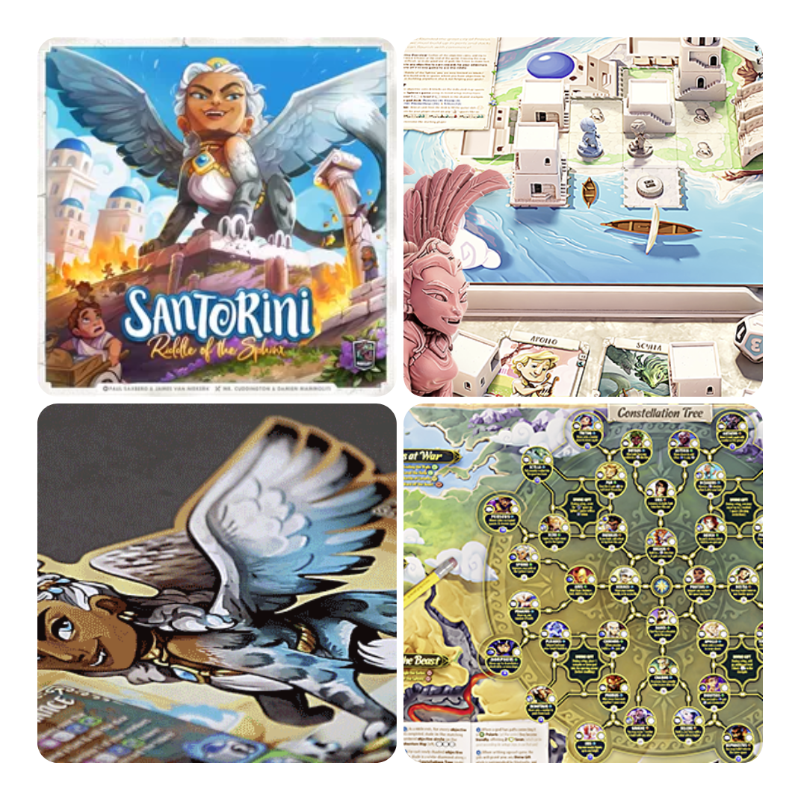
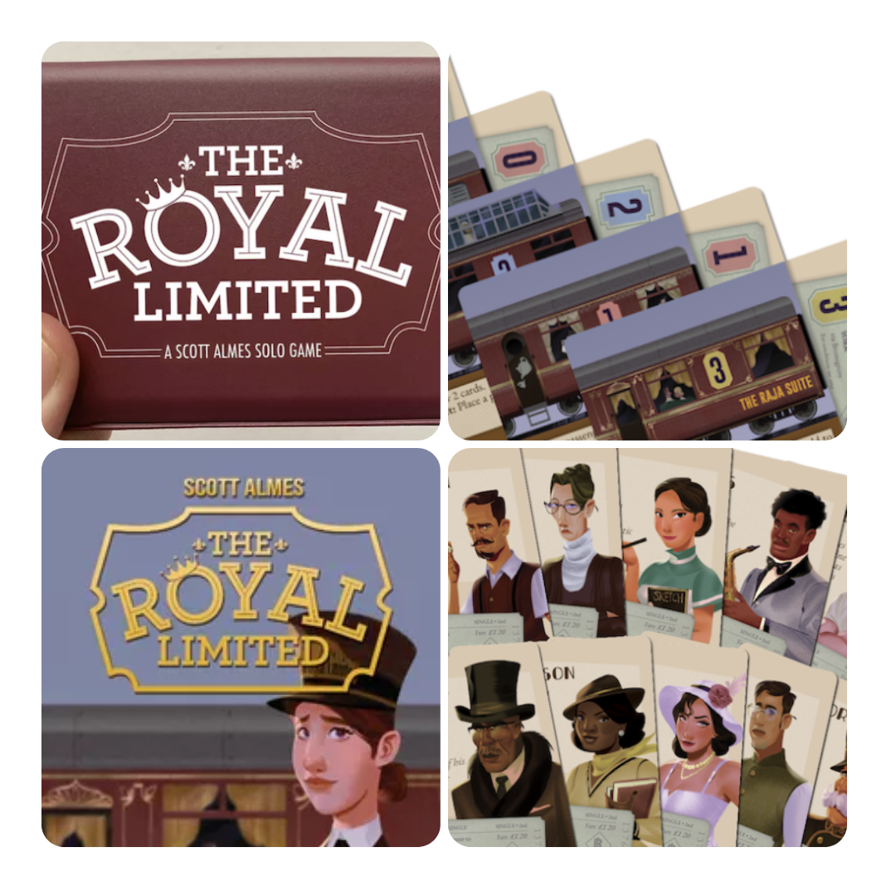

<FundingIntro>
  In questa uscita di DudeFunding, e ormai sono quasi troppe, ho voluto portarvi dei giochi che hanno tutto un tema
  affine al viaggio.  
  Cos’ha un viaggio in comune con il gioco da tavolo? Generalmente porta con sé delle meccaniche come <Link to="/mechanisms/campagna">
    giochi a campagna
  </Link>, <Link to="/mechanisms/costruzione-rete">costruzione di rete</Link> e <Link to="/mechanisms/costruzione-motore">
    costruzione di motore
  </Link> che di solito sono le mie meccaniche preferite! Sono pure le vostre?
</FundingIntro>

<FundingBit
  title="Santorini Co-op & Deluxe Pantheon Edition"
  player_count={1}
  player_count_official="1-4"
  weight={2}
  playing_time="20min"
  playing_time_official="20min"
  hype={8}
  deadline="28/04/2023"
  delivery="05/2024"
  price="66 CA$"
  otherPrice="19 CA$ + VAT"
  designer={["Paul Saxberg", "James Van Niekerk"]}
  publisher={["Roxley"]}
  mechanism={["Cooperativo", "Solitario", "Movimento su griglia"]}
>
  Notiziona numero 1… Santorini è tornato!!!  
  Notiziona numero 2… Ha una modalità coop, che ad occhio sarà un <Link to="/mechanisms/solitario">solitario</Link> coi fiocchi,
  in quanto fortemente basato sull’idea di puzzle. Un puzzle che sembra pure complicato: molteplici collegamenti, un libro
  di avventure e di scenari e un sistema pure di… combattimenti?!
</FundingBit>

<FundingBit
  title="Thorgal: The Board Game"
  player_count={1}
  player_count_official="1-4"
  weight={2}
  playing_time="100min"
  playing_time_official="90-120min"
  hype={9}
  deadline="28/04/2023"
  delivery="12/2024"
  price="85€"
  otherPrice="25€"
  designer={["Joanna Kijanka", "Jan Maurycy Święcicki", "Rafał Szyma"]}
  publisher={["Portal Games"]}
  mechanism={["Cooperativo", "Deck building", "Costruzione Pattern", "Dadi"]}
>
  Mondo di Thorgal, una lettera d’amore a questa saga di fumetti da parte della{" "}
  <Link to="/publishers/portal-games">Portal</Link> che trasuda l’ambientazione in ogni sua singola scelta stilistica.{" "}
   
  All’atto pratico, si tratta di un gioco di sopravvivenza in cui i giocatori potranno scegliere tra 7 scenari per entrare
  nel mondo di Thorgal con un sistema che sembra un’evoluzione di Robinson Crusoe, regalandoci un’esperienza di gioco che,
  se fa quello che promette, sarà decisamente in linea con le aspettative! Poi ci sono i polimini alla <Link to="/reviews/isola-dei-gatti/">
    Isola dei gatti
  </Link>!
</FundingBit>

<FundingBit
  title="The Royal Limited"
  player_count={1}
  player_count_official="1-1"
  weight={2}
  playing_time="15min"
  playing_time_official="10-15min"
  hype={9}
  deadline="22/04/2023"
  delivery="08/2023"
  price="14 US$"
  otherPrice="16 US$ + VAT"
  designer={["Scott Almes"]}
  publisher={["Button Shy"]}
  mechanism={["Solitario", "Gestione mano"]}
>
  Innanzitutto sì, il prezzo del gioco è più basso delle spese di spedizione. Ma questa sarà o no una scusa per entrare
  nei magici mondi di <Link to="/designers/scott-almes">Scott Almes</Link> e della{" "}
  <Link to="/publishers/button-shy">Button shy</Link>? Questa volta si dovrà riempire un treno con i passeggeri
  migliori, facendo sì che ogni passeggero sia seduto nel vagone giusto, rispettando la combinazione di condizioni di
  una o dell’altra carta… Ah, i giochi da 18 carte… A fine partita però sarà una vittoria solo se il punteggio sarà
  basso!
</FundingBit>

<FundingBit
  title="Fractured Sky"
  player_count={3}
  player_count_official="1-5"
  weight={2}
  playing_time="60min"
  playing_time_official="45-75min"
  hype={8}
  deadline="02/05/2023"
  delivery="01/2024"
  price="49 US$"
  otherPrice="20 US$ + VAT"
  designer={["Max Anderson", "Zac Dixon", "Austin Harrison"]}
  publisher={["IV Games"]}
  mechanism={["Maggioranze", "Asta", "Informazioni nascoste"]}
>
  Fractured Sky porta i giocatori al comando di una flotta di navi volanti, che dovrà competere con gli altri equipaggi
  per riuscire a recuperare più materiali possibili da una stella cadente… Che la caccia abbia inizio!  
  Il tutto in un gioco che fa della mancanza di informazioni, del bilanciamento tra fortuna e abilità e della facilità di
  regole il suo punto di forza. Raccogliere risorse, espandere territori, combattere: sarà tutto incentrato sul seguire un
  flusso che vi entrerà nella testa fino a che non finirete la partita e non vi chiederete quando arriverà il momento di
  farne un’altra.
</FundingBit>

