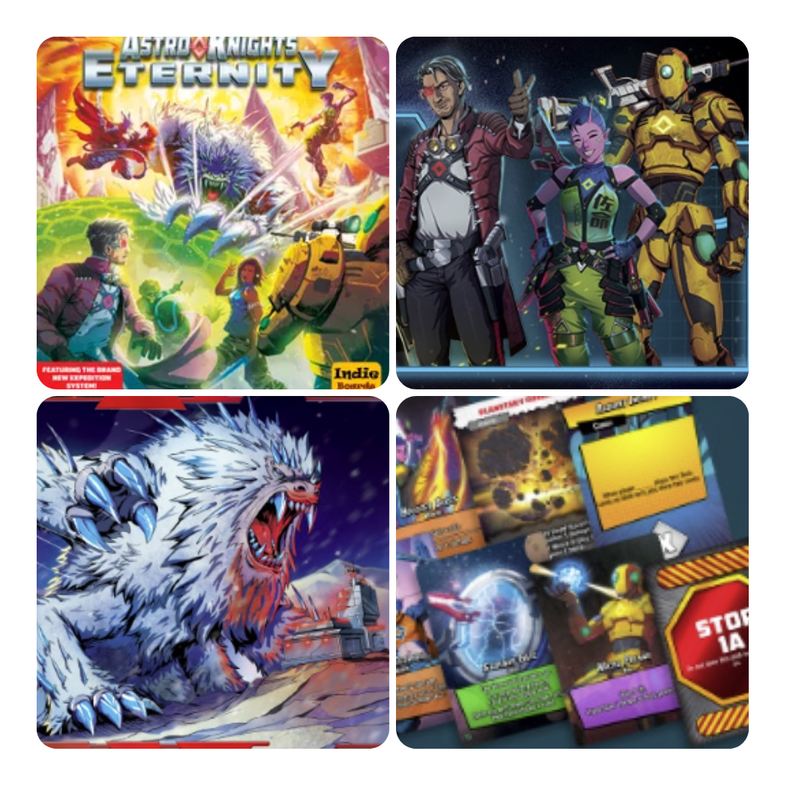
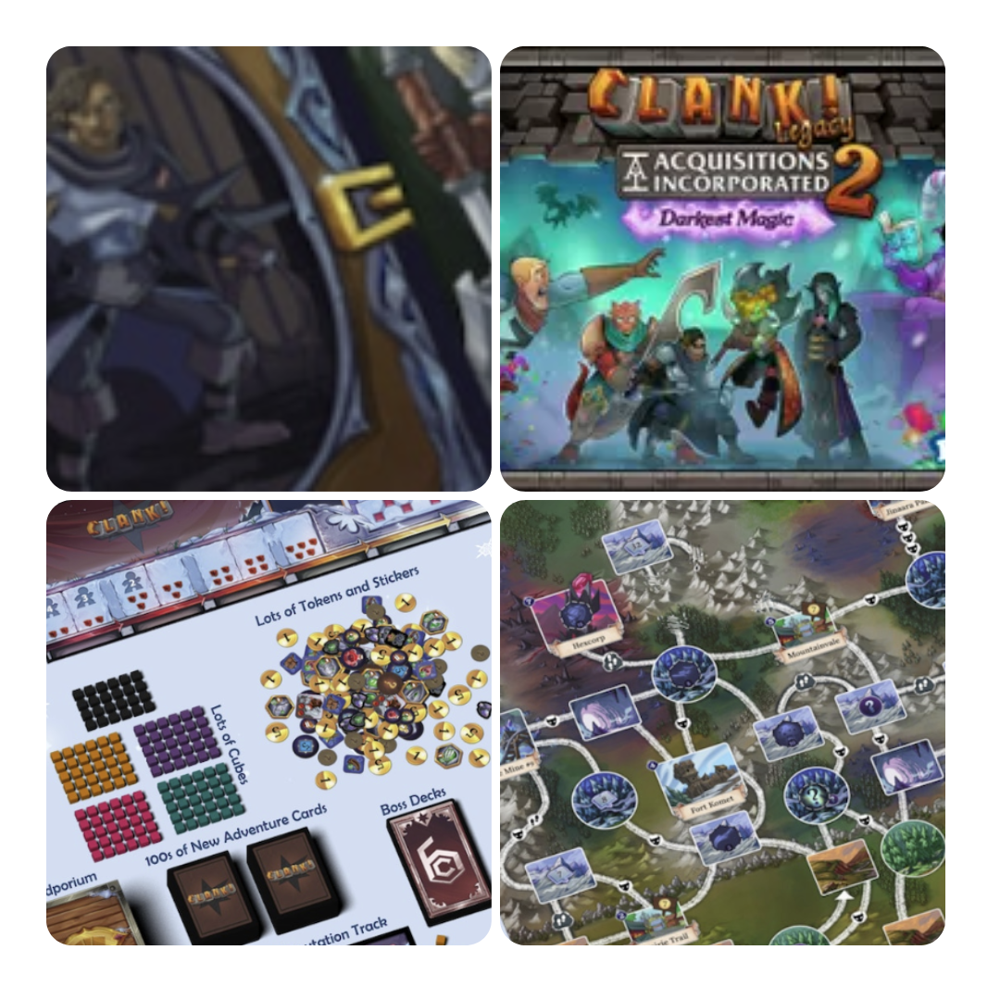
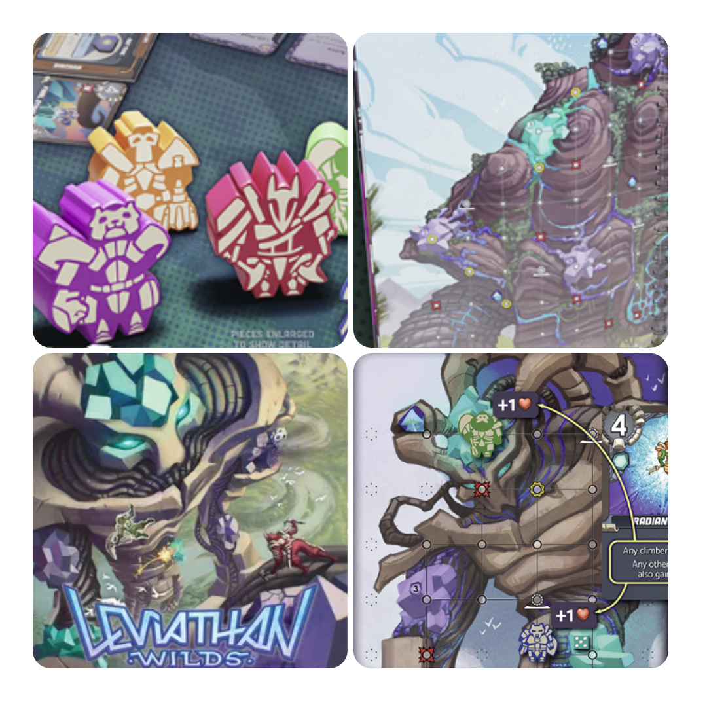
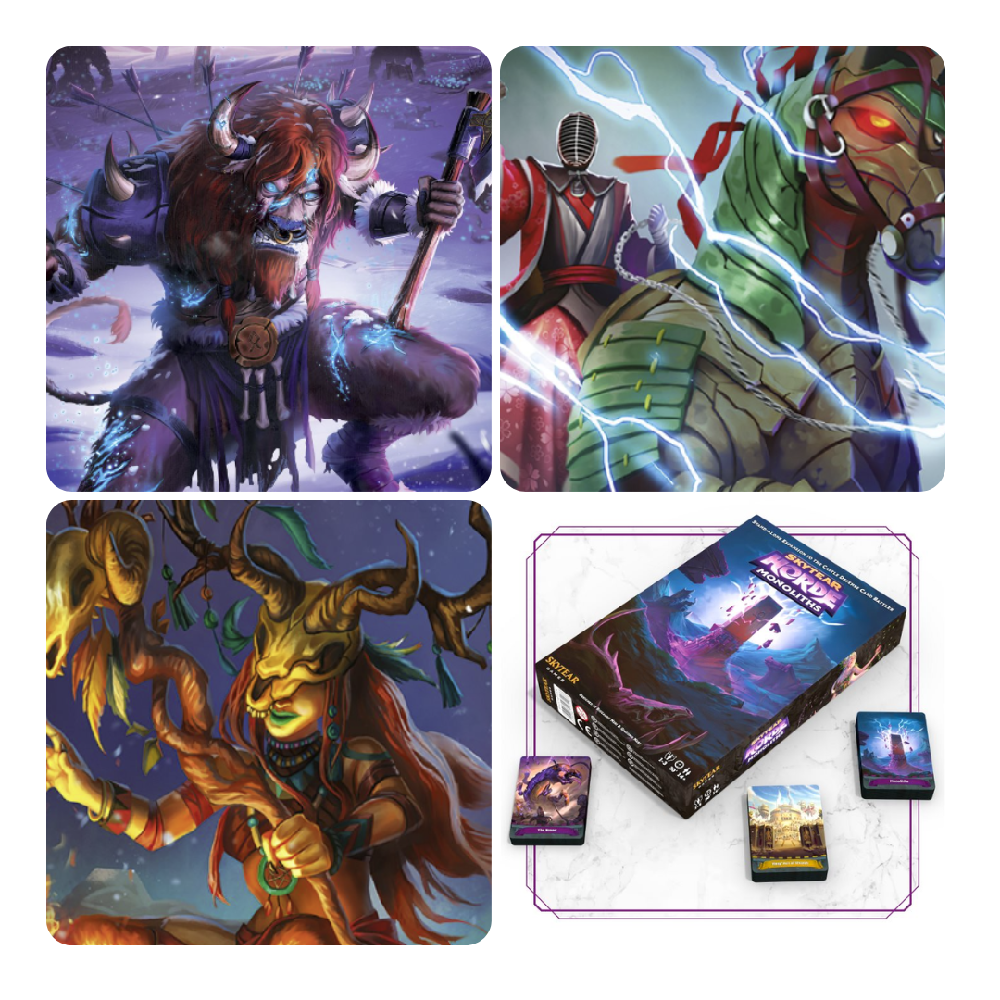

<FundingIntro>
  Eeee… siamo tornati! Tra malattia, vacanze eccetera abbiamo pensato di graziare il vostro portafoglio, ma è giunto il
  momento di farvi spendere i vostri tanto agognati soldi!!
</FundingIntro>

<FundingBit
  title="Astro Knights: Eternity"
  player_count={2}
  player_count_official="1-4"
  weight={2}
  playing_time="60min"
  playing_time_official="45-60min"
  hype={10}
  deadline="19/05/2023"
  delivery="01/2024"
  price="55 US$"
  otherPrice="32 US$ + VAT"
  designer={["Sydney Engelstein", "Nick Little (I)", "Will Sobel"]}
  publisher={["Indie Boards & Cards"]}
  mechanism={["Cooperativo", "Solitario", "Carte"]}
>
  <Link to="/reviews/astro-knights/">Astro Knight</Link>, evoluzione di{" "}
  <Link to="/reviews/aeon-s-end/">Aeon’s End</Link>, in questa sua espansione Eternity, ci presenta una storia
  ambientata anni in avanti rispetto alla storia del primo Astro Knight. Nuovi guardiani, nuovi avversari e nuove
  meccaniche, ma soprattutto nuove carte!  
  Come ogni buon gioco di carte, ci sarà un mercato in cui i giocatori potranno ottenere nuovi potenziamenti, ma più il tempo
  passa, più il nemico, ovviamente formato da un mazzo, avrà tempo di terminarlo e di farlo rimescolare, ma ogni volta che
  succede si potenzia a sua volta, quindi…  
  Astro Knight: Eternity introduce nel gioco una meccanica che non ho mai sopportato nelle espansioni dell’Aeon’s end
  originale (le spedizioni) che però è stata ampiamente apprezzata dalla community. Confido che il carattere più snello
  di Astro Knight me le faccia rivalutare, ma se così non fosse…. <strong>NUOVI BOSS</strong>
</FundingBit>

<FundingBit
  title="Clank! Legacy 2: Acquisitions Incorporated – Darkest Magic"
  player_count={3}
  player_count_official="2-4"
  weight={2}
  playing_time="90min"
  playing_time_official="60-120min"
  hype={7}
  deadline="27/05/2023"
  delivery="06/2024"
  price="99 US$"
  otherPrice="18€ + VAT"
  designer={["Paul Dennen", "Jay E. Treat, III"]}
  publisher={["Dire Wolf"]}
  mechanism={["Cooperativo", "Legacy", "Push your luck"]}
>
  Clank, uno di quei giochi che o ami o odi, ma che se ci attacchi una campagna{" "}
  <Link to="/mechanisms/legacy">Legacy</Link> funziona? Contando che con la sua prima versione ha avuto un discreto
  successo…  
  In un’ottica da perversa azienda in un mondo fantasy volta solo al guadagno, i giocatori si dovranno muovere per razziare
  dungeon ogniqualvolta possibile, spingendo la fortuna al limite e accettando <s>felicemente</s> i risultati. Il tutto condito
  dalle meccaniche legacy che permettono al gioco di ricordare i disastri e le imprese che compirete, fino ad arrivare a
  scoprire chi è il più ricco a fine campagna!  
  Clank legacy 2 sembra un bel push your luck legacy tutto sommato (e lo dico da non amante della saga). Le uniche
  perplessità risiedono nel quanto il <Link to="/mechanisms/push-your-luck">Push your luck</Link> sia davvero
  interessante come base per un legacy. Sarà questo il gioco in grado di farmi cambiare idea?
</FundingBit>

<FundingBit
  title="Leviathan Wilds"
  player_count={2}
  player_count_official="1-4"
  weight={2}
  playing_time="60min"
  playing_time_official="45-90min"
  hype={8}
  deadline="01/06/2023"
  delivery="02/2024"
  price="59 US$"
  otherPrice="23 US$ + VAT"
  designer={["Justin Kemppainen"]}
  publisher={["Moon Crab Games"]}
  mechanism={["Solitario", "Dadi", "Punti azione"]}
>
  Leviathan Wilds: una lettera d’amore, spero, ad un certo videogioco della Playstation chiamato Shadow of the Colossus.
  Uno scontro tra “piccoli" guerrieri e giganteschi leviatani che, a conti fatti, sono proprio degli scenari/mappe da
  gioco.  
  Bisognerà innanzitutto formare il mazzo del proprio personaggio, ottenuto mischiando quello personaggio con una delle sette
  classi per 49 combinazioni da scoprire! Poi bisognerà iniziare la scalata, muovendosi per la mappa colossale tramite punti
  azioni e sopravvivendo alle carte evento: il tutto mentre si cercheranno dei cristalli che proteggono il leviatano!  
  Leviathan Wilds sembra interessante, ma il dubbio principale riguarda la rigiocabilità degli scenari / leviatani. A
  ben vedere, niente che un sistema di difficoltà ben tarato e sufficiente variabilità non possa risolvere. E sarà così,
  vero? Perché se lo sarà avremo per le mani una vera gemma nascosta per gli amanti dei giochi a{" "}
  <Link to="/mechanisms/punti-azione/">Punti azione</Link>!
</FundingBit>

<FundingBit
  title="Skytear Horde: monoliths"
  player_count={1}
  player_count_official="1-3"
  weight={2}
  playing_time="30min"
  playing_time_official="30-30min"
  hype={7}
  deadline="25/05/2023"
  delivery="05/2024"
  price="50€"
  otherPrice="14€ + VAT"
  designer={["Giacomo Neri", "Riccardo Neri"]}
  publisher={["Skytear Games"]}
  mechanism={["Risoluzione conflitto con carte", "Solitario", "Carte"]}
>
  Tempo fa, un certo <Link to="/writers/tia/">Dude</Link> recensì un certo gioco: questo gioco si chiamava{" "}
  <Link to="/reviews/skytear-horde/">Skytear Horde</Link>. Il progetto su Gamefound, di fatto, è un “more of the same":
  nuove fazioni e nuovi avversari, quindi non mi dilungherò troppo in grandi spiegazioni. Vi dirò, però, che in questa
  nuova espansione verranno introdotti nuovi modi per aumentare la difficoltà del gioco, il che è decisamente
  affascinante, visto che mostra la cura dei designers in un titolo già uscito e la loro volontà di rendere l’esperienza
  la migliore possibile per noi giocatori!
</FundingBit>

