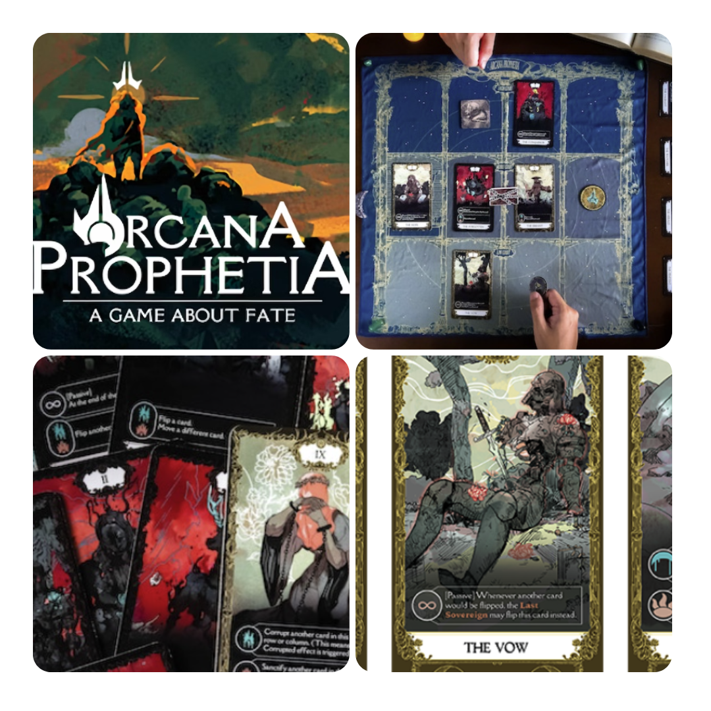
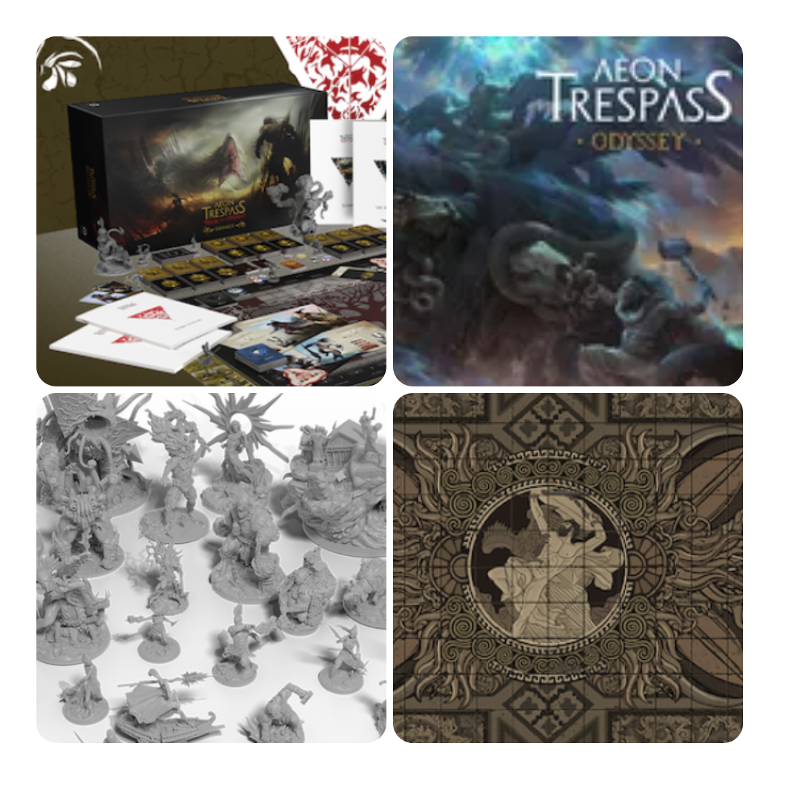
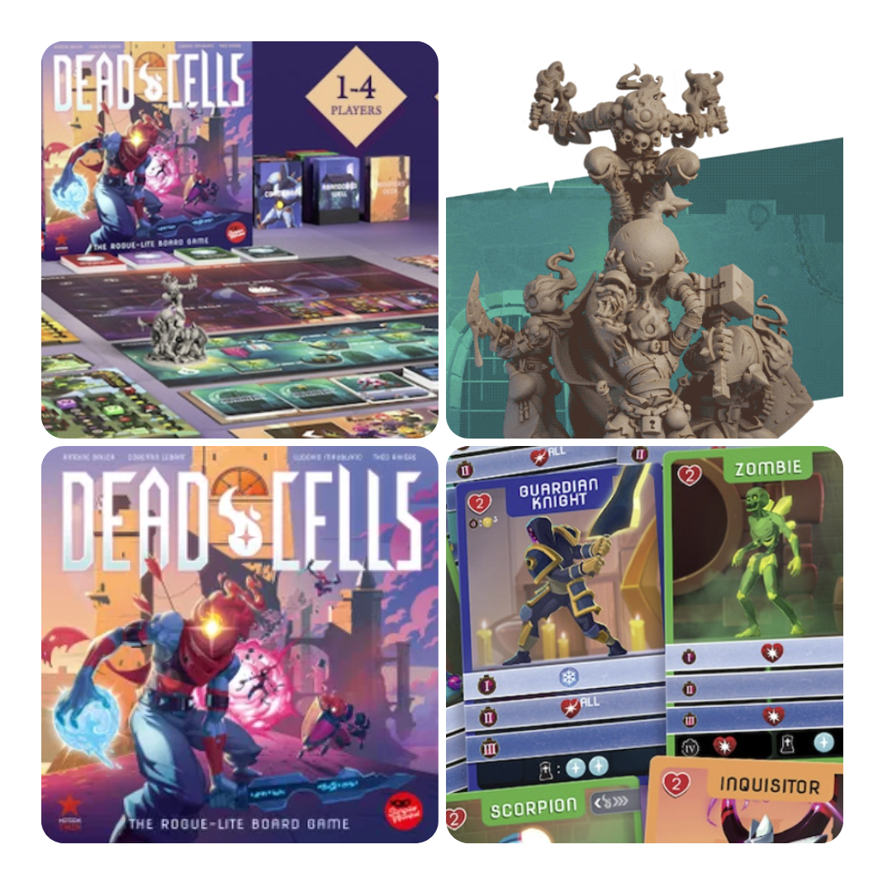
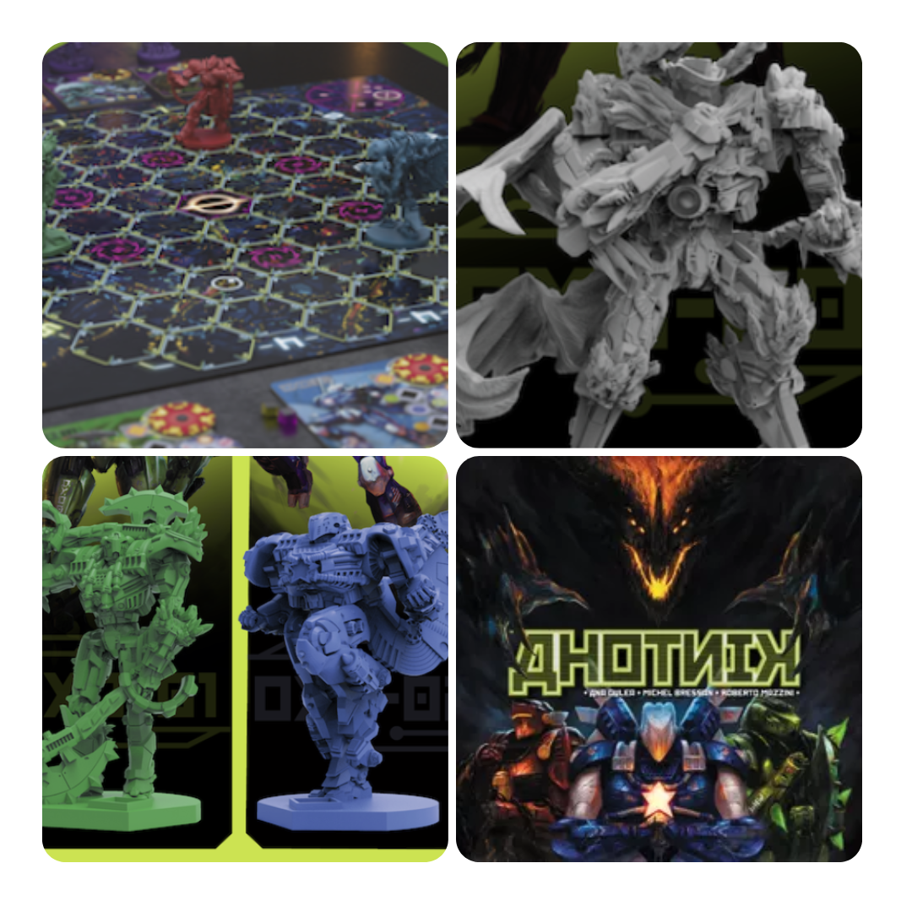

<FundingIntro>
  Nel magico mondo di Kickstarter fatto di miniature, giochi bellissimi e mezzi stipendi che se ne vanno, ogni tanto si
  trovano delle chicche, che però di solito o, appunto, costano un rene o ne costano due perché sono piene di
  miniature... Quindi: in un mondo in cui le compagnie chiudono causa indigenza, come si fa ad evitare le fregature?
</FundingIntro>

<FundingBit
  title="Arcana Prophetia: A Game About Fate"
  player_count={2}
  player_count_official="2"
  weight={2}
  playing_time="20min"
  playing_time_official="20-30min"
  hype={8}
  deadline="10/06/2023"
  delivery="N/A"
  price="40 US$"
  otherPrice="12 US$ + VAT"
  designer={["Andre Hui", "John Neufeld", "Brandon Ong", "Russell Wee"]}
  publisher={["The Aerie Games"]}
  mechanism={["Piazzamento tessere", "Poteri variabili", "Carte"]}
>
  Partiamo dal presupposto che mi piacciono i tarocchi, quindi un gioco ispirato agli Arcani maggiori ha già un posto
  riservato nel mio cuore. Se poi ci si mette pure il fatto che si tratta di una sfida di bluff tra i giocatori, beh...
  ha tutta la mia attenzione! Vediamolo però un po’ più nel dettaglio.  
  Da regolamento sembra un gioco molto veloce, con pochi round, ma intensi. Un giocatore dovrà corrompere le carte dell’altro,
  manipolando pattern e attivando effetti, mentre l’altro dovrà cercare di resistere a questa manipolazione, attivando a
  sua volta gli effetti speciali delle carte. Un gioco che sembra risolversi in pochi attimi garantendo una rigiocabilità
  e una velocità di esecuzione davvero interessante: perfetto per gli amanti delle predizioni e degli scontri uno contro
  uno al cardiopalma, un po’ alla <Link to="/reviews/mindbug">Mindbug</Link>.
</FundingBit>

<FundingBit
  title="Aeon Trespass: Odyssey Second Printing Plus All-New Content"
  player_count={2}
  player_count_official="1-4"
  weight={4}
  playing_time="100min"
  playing_time_official="90-90min"
  hype={8}
  deadline="07/06/2023"
  delivery="03/2025"
  price="118€"
  otherPrice="33€ + VAT"
  designer={["Marcin Wełnicki"]}
  publisher={["Into the Unknown"]}
  mechanism={["Cooperativo", "Campagna"]}
>
  Aeon Trespass è quel tipo di gioco a cui devi dedicare una vita anche solo per pensare di leggere il regolamento
  (gigante). La copia che è a casa mia aspetta solo una scusa annuale per essere giocata. L’idea poi di avere altre
  campagne da giocare… Beh sicuramente attira!  A livello di gameplay, sempre nell’ottica di gioco totalizzante,
  Aeon Trespass è diviso in due fasi: una prima fase di esplorazione in cui, a bordo dell’Argo, in una Grecia antica a
  cui non siamo certo abituati, plagiata dai pericolosi Titani (che andranno affrontati… con altri Titani!); e una
  seconda fase, uno scontro con il boss nudo e crudo, in cui più il tempo passa più entrambe le parti diventano più
  forti, con un sistema basato sull’equilibrio sottile tra morire e fare danni…  
  Che dire, se Aeon Trespass è un bel gioco nessuno lo può dire. Richiede soldi, tempo, dedizione e probabilmente un armadio
  in cui tenere tutto dopo questa ristampa e le aggiunte. Ne vale la pena? Se tutto ciò è nelle vostre corde, certo che sì!
</FundingBit>

<FundingBit
  title="Dead Cells: The Rogue-Lite Board Game"
  player_count={1}
  player_count_official="1-4"
  weight={2}
  playing_time="45min"
  playing_time_official="45-45min"
  hype={9}
  deadline="02/06/2023"
  delivery="09/2024"
  price="89 CA$"
  otherPrice="15 US$ + VAT"
  designer={["Antoine Bauza", "Corentin Lebrat", "Ludovic Maublanc", "Théo Rivière"]}
  publisher={["Le Scorpion Masqué"]}
  mechanism={["Carte", "Solitario"]}
>
  Sono sempre stato un po’ scettico verso i giochi da tavolo che derivano da giochi tratti da computer/console/ecc. In
  fondo, media diversi motivi diversi, vero? Ecco, appunto, anche questo Dead Cells è così. Come rendere cooperativo un
  gioco solitario, facendo sì che ogni giocatore impersoni un aspetto del gioco? Funzionerà? Speriamo di sì, anche se
  secondo me come tutti i giochi del genere sarà meglio in solitario…  
  In concreto, i giocatori dovranno destreggiarsi su una mappa sbloccando strade, affrontando nemici e...morendo. Ogni volta
  che si morirà si sbloccheranno miglioramenti e si potrà ricominciare più potenti di prima.  
  Ora, grosso modo il gioco è questo: bello quel che si vuole, ma avrà senso come gioco da tavolo? Non è comunque troppo
  un videogioco, nel bene e nel male?
</FundingBit>

<FundingBit
  title="Ahotnik"
  player_count={6}
  player_count_official="2-12"
  weight={2}
  playing_time="90min"
  playing_time_official="90-90min"
  hype={6}
  deadline="06/06/2023"
  delivery="11/2024"
  price="149€"
  otherPrice="19€"
  designer={["Michel Bressan", "Ana Gulea", "Roberto Mazzini"]}
  publisher={["AM Games", "Mazzi Games"]}
  mechanism={["Carte", "Semi-cooperativo", "Movimento su griglia"]}
>
  Ahhh… Ahotnik, un gioco di cui abbiamo già parlato in questa <Link to="/reviews/ahotnik">anteprima</Link> quindi non
  mi dilungherò troppo, se non dicendo che questo gioco ha potenzialità enormi. È decisamente molto particolare, ma
  dalla prova del prototipo in poi si vede la volontà dei designer di produrre un oggetto che non solo piaccia a loro,
  cosa fondamentale, ma che piaccia anche a più giocatori possibile. Vi unirete anche voi a questo progetto, non è vero?
</FundingBit>

