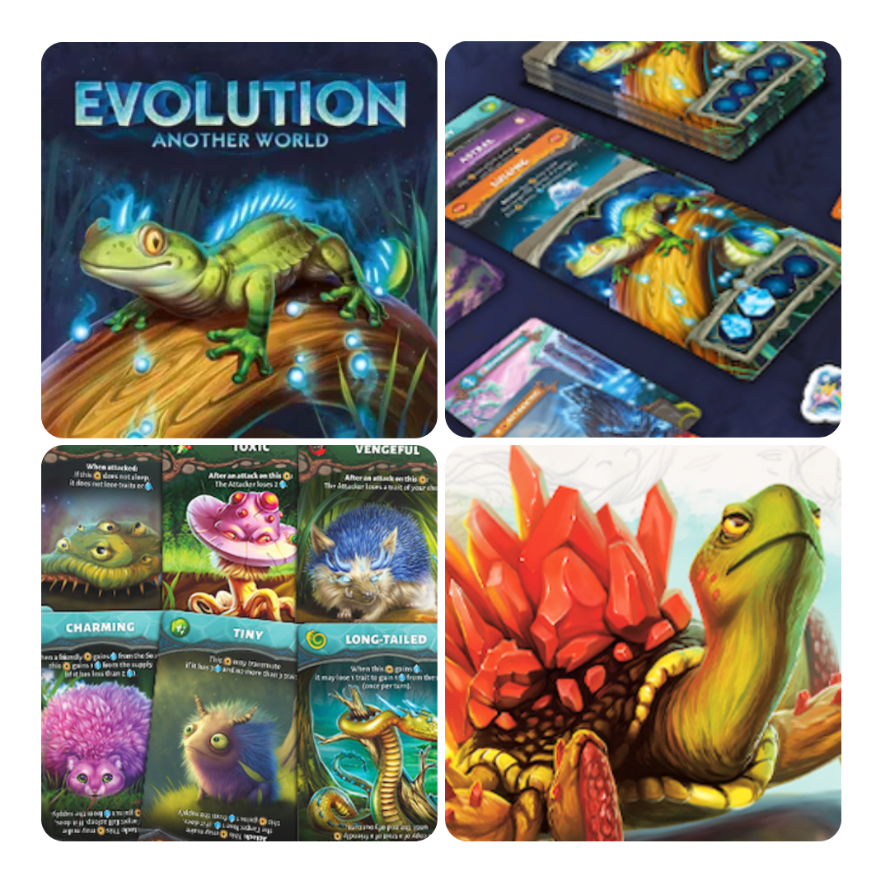
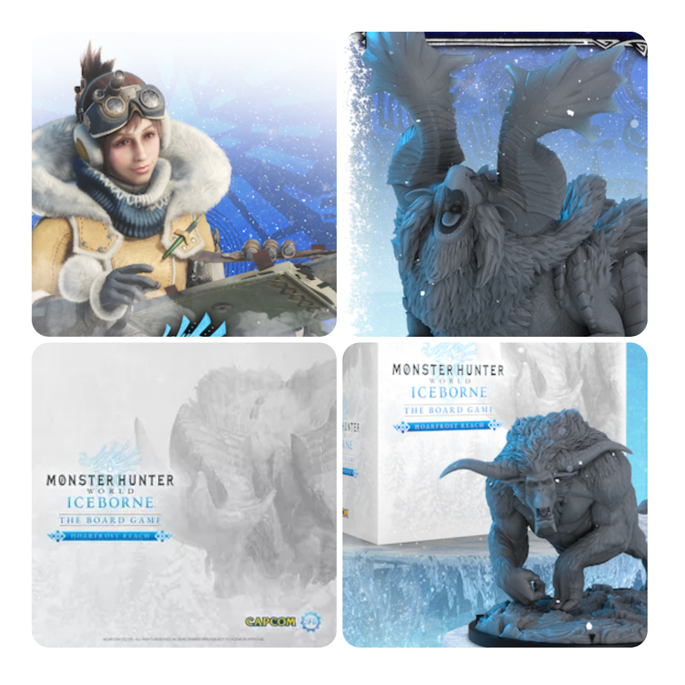
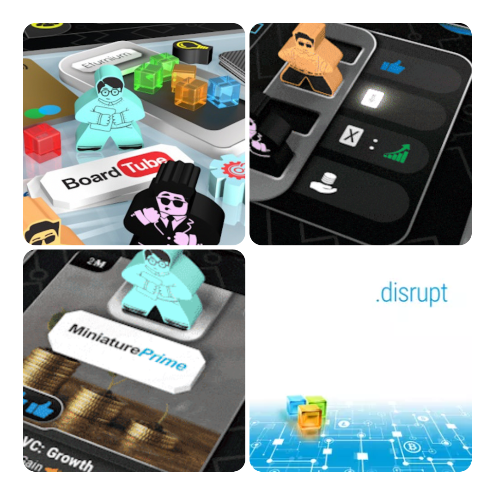

<FundingIntro>
  Detto tra noi, un gioco da tavolo tratto da un gioco al computer continua a risultarmi sbagliato. Tanto per dirne una,
  sicuramente devi pagare una licenza e questo può portare via soldi allo sviluppo e a componenti importanti di un gioco
  da tavolo. Ne vale quindi la pena?!
</FundingIntro>

<FundingBit
  title="Evolution: Another World"
  player_count={3}
  player_count_official="1-4"
  weight={2}
  playing_time="30min"
  playing_time_official="20-30min"
  hype={8}
  deadline="07/06/2023"
  delivery="02/2024"
  price="30 US$"
  otherPrice="15 US$ + VAT"
  designer={["Yury Yamshchikov"]}
  publisher={["CrowD Games"]}
  mechanism={["Gestione mano"]}
>
  Quante poche cose sappiamo della scintilla che scatena l’evoluzione? Se ne vedono gli effetti chiaramente ma… cosa
  succederebbe se cambiasse il mondo? Quante specie ci sarebbero diverse da quelle attuali?! Non sarebbe fichissimo?
   
  A conti fatti, con Evolution: Another World stiamo parlando di un gioco di carte in cui si potranno far nascere
  creature o farle evolvere; soprattutto, occorrerà assicurarsi che resistano nei vari ambienti, risalendo in cima alla
  catena alimentare per raggiungere l’apice dell’evoluzione e trasmutando in qualcos’altro. Chi avrà trasmutato tre
  creature sarà il vincitore!  
  Sembra essere il classico gioco di <Link to="/mechanisms/carte">carte</Link> in cui i giocatori dovranno cercare di fare
  fantasmagoriche combo per uscirne vincitori, e in cui pochi errori separano la sconfitta dalla vittoria. Il tutto, come
  ogni buon gioco moderno, sarà accompagnato da bellissime illustrazioni. Che dire, pledgiare per credere nell’evoluzione!
</FundingBit>

<FundingBit
  title="Apex Legends: The Board Game"
  player_count={4}
  player_count_official="2-4"
  weight={4}
  playing_time="90min"
  playing_time_official="60-90min"
  hype={6}
  deadline="08/06/2023"
  delivery="06/2024"
  price="80€"
  otherPrice="25€"
  designer={["Thanos Argyris", "Michalis Nikolaou"]}
  publisher={["Glass Cannon Unplugged"]}
  mechanism={["Movimento su griglia", "Gestione mano", "Poteri variabili"]}
>
  Apex Legends: un battle royal che dalla sua uscita ha segnato il genere come videogioco. Riuscirà a segnare anche il
  mondo dei giochi da tavolo?  
  Mantiene la sua natura di sparatutto e tattica grazie a una mappa tattica modulare che ricorda qualche gioco di guerra:
  movimento, linea di vista, carte giocate per attivare le abilità, munizioni. Un giocatore avrà sicuramente di che divertirsi.
  Tra la personalizzazione del personaggio durante il prepartita e un sistema di combattimento che cambia in base alle armi
  equipaggiate ne avrete a bizzeffe.  
  Problema: quanto sarà bilanciato? Quanto vario? Soprattutto: a cosa serve il diorama-fermacarte oltre a far lievitare
  il prezzo della scatola base? Sulla carta, il gioco sembra anche interessante, ma una scatola con solo 4 eroi sembra
  limitare drammaticamente la variabilità… A meno che non vogliate il full team pledge, no?
</FundingBit>

<FundingBit
  title="Monster Hunter World Iceborne: The Board Game"
  player_count={4}
  player_count_official="1-4"
  weight={3}
  playing_time="90min"
  playing_time_official="60-90min"
  hype={7}
  deadline="01/06/2023"
  delivery="11/2024"
  price="65£"
  otherPrice="18£ + VAT"
  designer={["Mat Hart", "Jamie Perkins"]}
  publisher={["Steamforged Games Ltd."]}
  mechanism={["Cooperativo", "Deck building"]}
>
  Monster Hunter World Iceborne: The Board Game è un gioco da tavolo cooperativo basato su Monster Hunter World. I
  giocatori assumono il ruolo di cacciatori che devono proteggere il campo base di Seliana da pericolosi mostri in un
  mondo gelido.  
  Attraverso missioni, combattimenti basati su carte e potenziamento delle attrezzature, i giocatori affronteranno mostri
  sempre più grandi e potenti. Il gioco offre campagne epiche, sfide in arene a sessione singola e una modalità in solitaria.{" "}
   
  Un’esperienza che sulla carta sembra molto customizzabile a seconda dei bisogni e del gruppo di gioco. Considerando il
  fatto che il gioco originale ha avuto un grande successo, questa iterazione sembra promettere bene e c’è solo da
  sperare che la Steamforged abbia fatto un buon lavoro! Sarà davvero così?
</FundingBit>

<FundingBit
  title="Disrupt"
  player_count={4}
  player_count_official="1-4"
  weight={3}
  playing_time="90min"
  playing_time_official="50-90min"
  hype={8}
  deadline="03/06/2023"
  delivery="12/2023"
  price="45€"
  otherPrice="20€ + VAT"
  designer={["Aiollus", "Iskios", "VantoN"]}
  publisher={["Triple Meeple"]}
  mechanism={["Asta", "Negoziazione", "Piazzamento lavoratori "]}
>
  Disrupt è un gioco da tavolo di taglio economico completamente asimmetrico con meccaniche di posizionamento dei
  lavoratori e basate su carte.  
  I giocatori assumono uno dei ruoli disponibili: imprenditore di startup, leader di mercato, investitore angelo o fornitore
  di servizi aziendali. L'obiettivo è progettare, sviluppare e commercializzare progetti ad alta tecnologia, comprare e vendere
  azioni, consolidare il proprio marchio, manipolare il mercato e sfruttare abilità uniche per avere successo. Con negoziati,
  inganni e visione, puoi superare gli avversari e diventare il prossimo titano tecnologico del nostro tempo!  
  Disrupt è un gioco che si rifa ad una delle mie meccaniche preferite, cioè l’
  <Link to="/mechanisms/asta">Asta</Link>, creando delle dinamiche, almeno in teoria, interessanti, che sembrano promettere
  una gemma parecchio interessante con un’ambientazione realistica e piena di citazioni incredibili: guardare la pagina kickstarter
  per credere!
</FundingBit>

