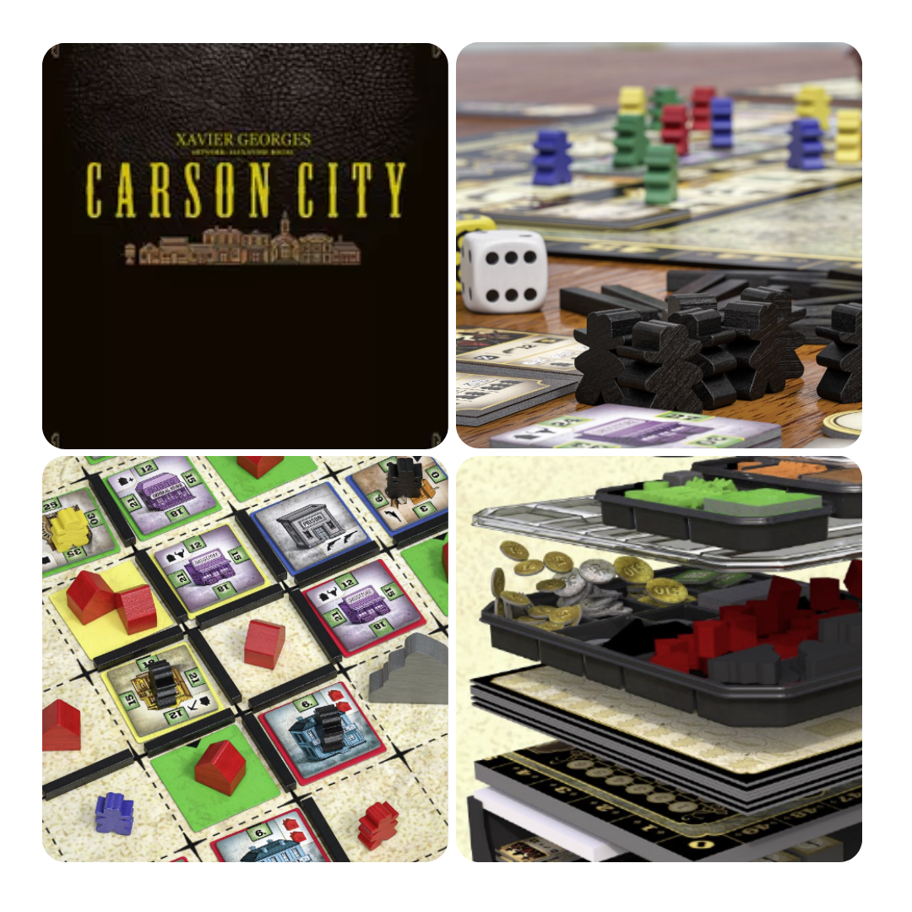
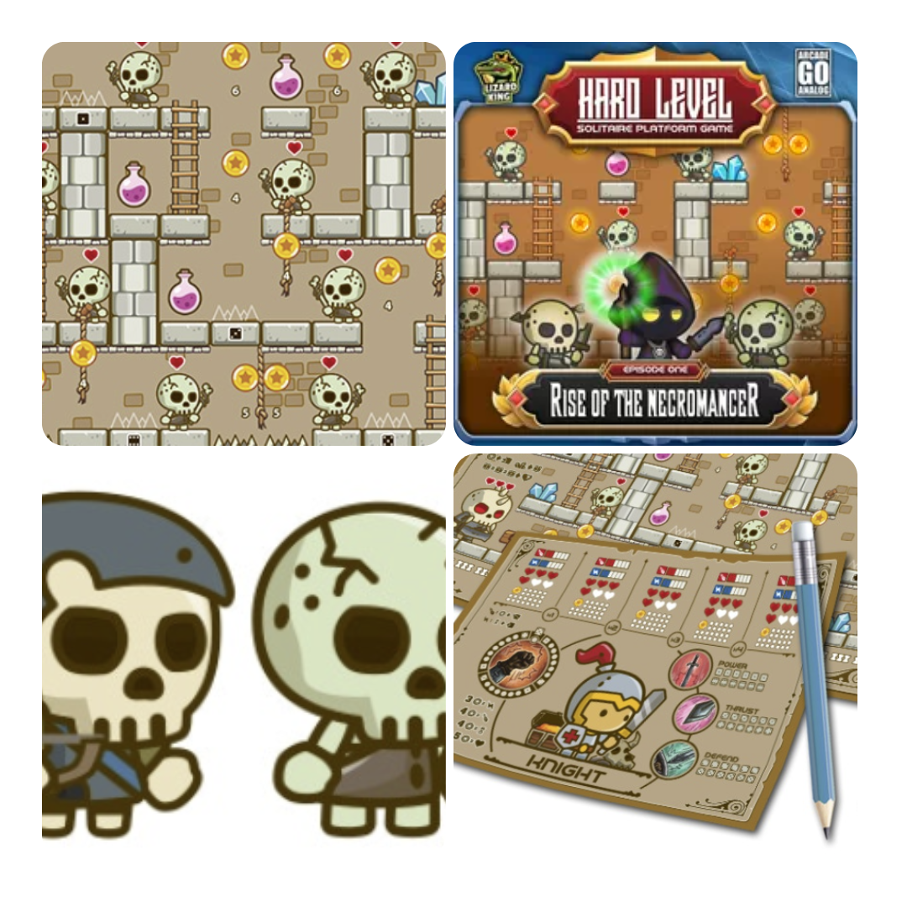
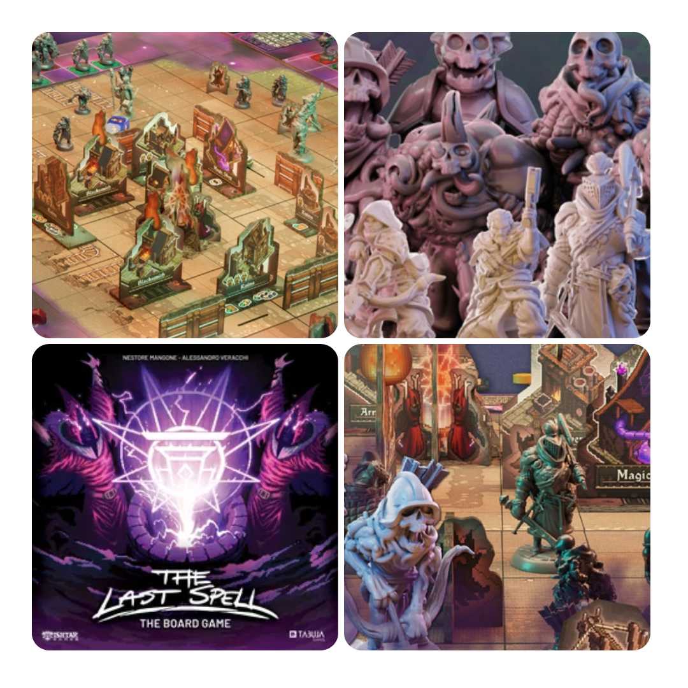
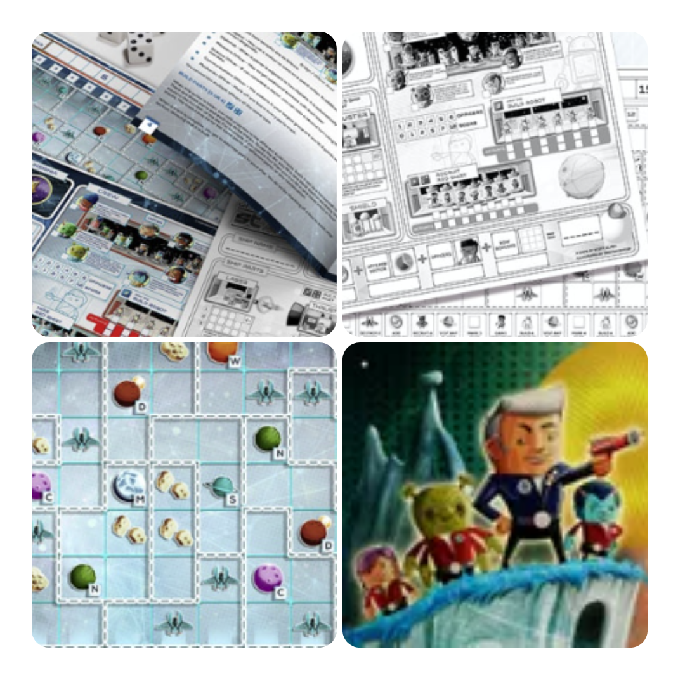

<FundingIntro>
  Sì: mi piacciono i <Link to="/mechanisms/roll-and-write"> Roll and write </Link> e affini. C’è sempre un nuovo
  amalgama di regole che li rendono interessanti! Quindi, oltre a dei giochi più classici che sembrano fichissimi,
  beccatevi anche dei roll and write!
</FundingIntro>

<FundingBit
  title="Carson City: Big Box"
  player_count={4}
  player_count_official="2-6"
  weight={3}
  playing_time="100min"
  playing_time_official="90-180min"
  hype={7}
  deadline="14/06/2023"
  delivery="03/2024"
  price="75€"
  otherPrice="12€ + VAT"
  designer={["Xavier Georges"]}
  publisher={["Quined Games"]}
  mechanism={["Dadi", "Piazzamento lavoratori", "Piazzamento tessere"]}
>
  Carson City Big Box, beh, è esattamente quello che il titolo suggerisce: una riedizione riveduta e corretta di Carson
  City con materiale pornolusso e una big box dotata di tutti gli inserti che ogni giocatore spera il suo gioco abbia,
  per riunire tutte le espansioni in un unico posto. Figo vero?  
  Carson City è un gioco strategico giocato in quattro round, in cui i giocatori scelgono personaggi con vantaggi specifici.
  Posiziona i tuoi cowboy sulle location dell'azione per costruire edifici, case o strade, reclamare terreno, guadagnare
  denaro o ottenere punti vittoria. Quando più giocatori sono nella stessa posizione, si svolge un duello a dadi per determinare
  il vincitore. Durante il gioco, puoi compiere varie azioni per ottenere punti vittoria dai tuoi terreni, pistole (aiutanti
  assunti) e edifici. Alla fine, i punti vittoria ottenuti da edifici, case, montagne e denaro determinano il vincitore.{" "}
   
  Questo gioco sembrava già bello nel 2015, quando è uscito, e probabilmente è sopravvissuto al peso del tempo in questi
  anni. Varrà la pena comprarlo adesso?
</FundingBit>

<FundingBit
  title="Hard Level"
  player_count={1}
  player_count_official="1"
  weight={2}
  playing_time="30min"
  playing_time_official="15-30min"
  hype={8}
  deadline="12/06/2023"
  delivery="07/2023"
  price="3€"
  otherPrice="-"
  designer={["Krzysztof Matusik"]}
  publisher={["Lizard King"]}
  mechanism={["Roll and write", "Dadi", "Punti azione"]}
>
  Hard Level: un print and play che non vede l’ora di essere stampato e portato a casa vostra!  
  Il gioco a conti fatti è un puzzle. Dato uno scenario, che simula il vostro gioco di ruolo a scorrimento preferito, il
  giocatore dovrà lanciare i suoi dadi per determinare che abilità utilizzare (nonché se un combattimento ha successo o se
  un salto non farà finire il giocatore incontro alla morte).
   
  Hard Level sembra il classico giochino che non dovrebbe mancare nella collezione di un appassionato di <Link to="/mechanisms/solitario">
    Solitari
  </Link>, in quanto sembra promettere un’esperienza veloce ed esilarante, anche grazie a delle illustrazioni simpaticissime!
</FundingBit>

<FundingBit
  title="The Last Spell: The Board Game"
  player_count={3}
  player_count_official="1-4"
  weight={4}
  playing_time="120min"
  playing_time_official="120-150min"
  hype={8}
  deadline="16/06/2023"
  delivery="05/2024"
  price="109€"
  otherPrice="20€"
  designer={["Nestore Mangone", "Alessandro Veracchi"]}
  publisher={["Tabula Games"]}
  mechanism={["Cooperativo", "Punti movimento", "Dadi"]}
>
  I maghi hanno portato il cataclisma e pochi ormai sopravvivono alle orde dei mostri, ma è nel momento della difficoltà
  che i veri eroi appaiono, soprattutto in un gioco di miniature ispirate e arte ad 8bit!  
  Come ogni <em>tower defence</em> che si rispetti, c’è una fase in cui dovremmo agire, in quanto eroi. Usare i nostri punti
  azione per muoverci, usare le nostre potentissime abilità e i materiali trovati nella zona per costruire trappole e barricate
  di fortuna… Beh, sì, poi dovremmo anche eliminare i nostri nemici, perché di notte loro arrivano sempre… Si riuscirà a
  sopravvivere?  
  Inutile negarlo: The Last Spell sembra un bel gioco da tavolo. Forse soffrirà un bel po’ di problemi di lungo setup e
  desetup, ma in fondo per avere tutte queste meccaniche di simulazione a qualcosa bisognava pure rinunciare, no?
  Eppure, se tutto filerà liscio come sembra, sapendo il peso ipotetico del gioco ce ne faremo una ragione!
</FundingBit>

<FundingBit
  title="Uncharted Stars"
  player_count={1}
  player_count_official="1-99"
  weight={2}
  playing_time="30min"
  playing_time_official="25-100min"
  hype={9}
  deadline="11/06/2023"
  delivery="06/2023"
  price="5£"
  otherPrice="-"
  designer={["Scott Almes"]}
  publisher={["Bright Light Games"]}
  mechanism={["Dadi", "Roll and write"]}
>
  Uncharted Stars è un gioco uscito dalla mente di un designer specializzato in giochi solitari… Non vorrete mica
  giocarlo in più di un giocatore, vero?  
  In 18 round bisognerà condurre la propria nave spaziale nella galassia ed esplorare il più possibile, assoldare la ciurma
  giusta, sconfiggere i nemici ed evitare che tutto salti per aria! Lanciando dadi e massimizzando le proprie caratteristiche,
  cosa riuscirete a fare partita dopo partita?  
  Anche quest’altro print and play merita l’attenzione da parte di un giocatore attento: qui si corre il rischio di
  trovare una gemma incredibile anche grazie alla grande personalizzazione che si può ricavare letteralmente disegnando
  la propria plancia di gioco. Dove finirete per conquistare la galassia?
</FundingBit>

