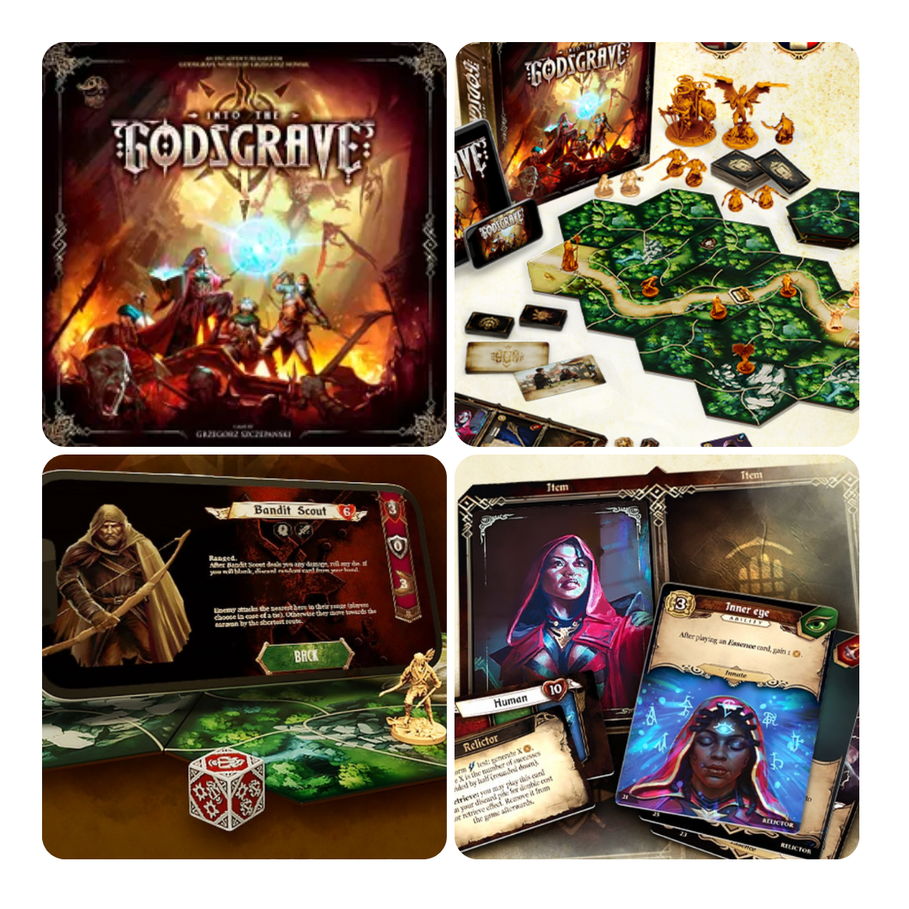
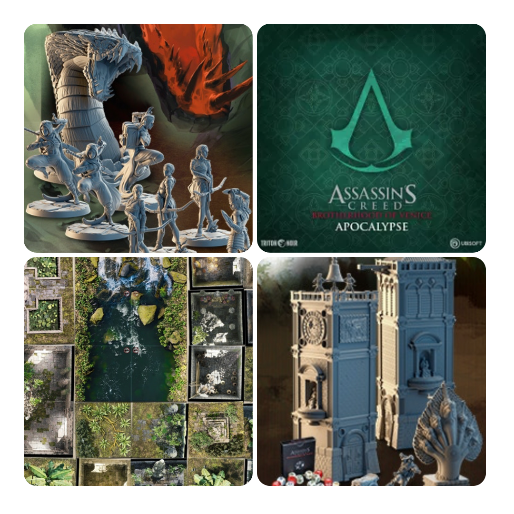
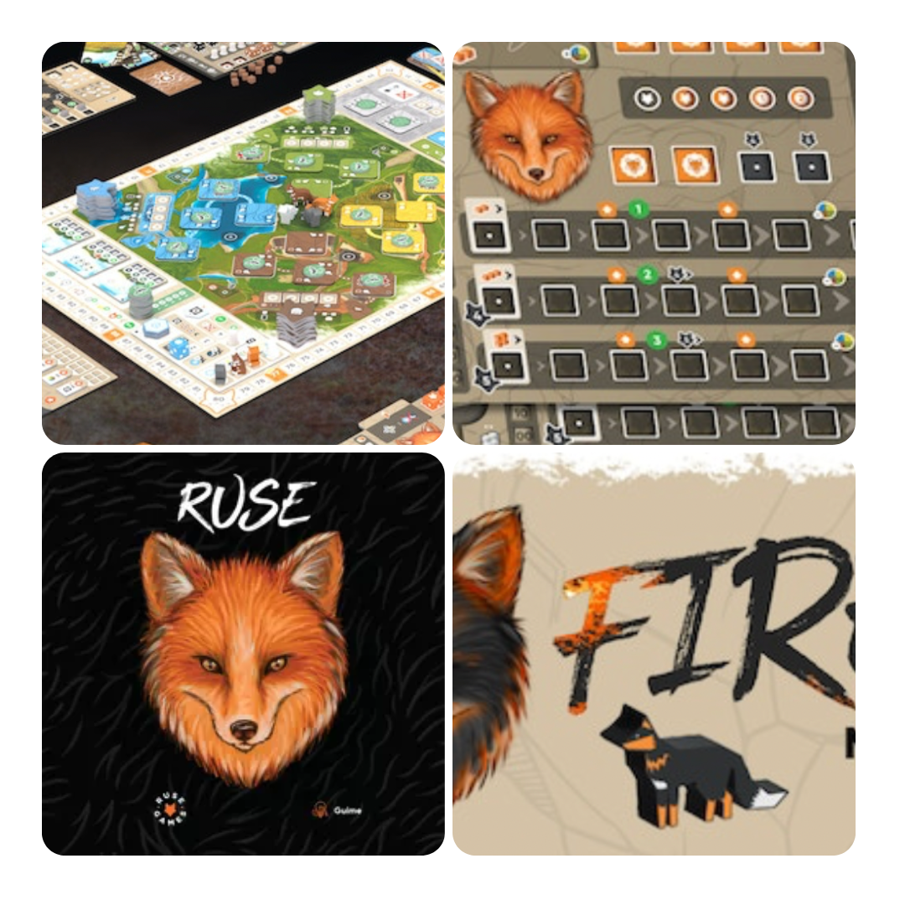
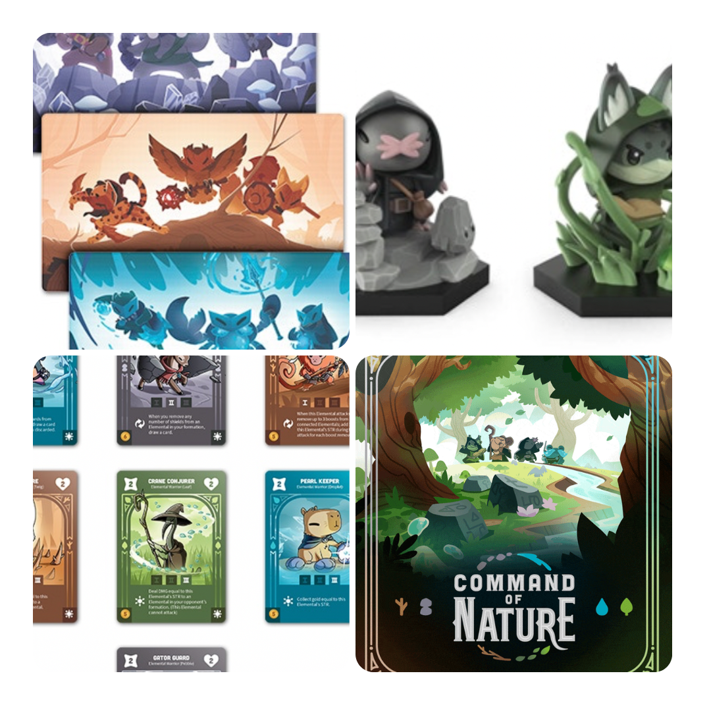

<FundingIntro>
  Il magico mondo di kickstarter ogni tanto riserva grandi sorprese. Detto ciò, ci potreste trovare sia espansioni di
  giochi grossi, ma soprattutto, di tanto in tanto, delle gemme che bisogna assolutamente tenere in considerazione, così
  da vivere in maniera più salutare il suddetto magico mondo di kickstarter, senza essere sommersi dai pledge esagerati!
</FundingIntro>

<FundingBit
  title="Into the Godsgrave"
  player_count={2}
  player_count_official="1-4"
  weight={2}
  playing_time="90min"
  playing_time_official="60-120min"
  hype={8}
  deadline="16/06/2023"
  delivery="12/2024"
  price="80€"
  otherPrice="12€ + VAT"
  designer={["Grzegorz Szczepański"]}
  publisher={["Lucky Duck Games"]}
  mechanism={["App", "Cooperativo", "Gestione mano"]}
>
  Into the Godsgrave è un gioco d’avventura che utilizza un’app per gestire tutte le faccende che più annoiano un
  giocatore da tavolo e rendere l’esperienza di gioco la più snella e variegata possibile.  
  Il gioco, di per sé, si basa sulla costruzione di un mazzo di carte. Si partirà dal proprio mazzo base e, a seconda di
  come ci si comporterà, l’app indicherà al giocatore come potenziarsi. Il resto del gioco sarà si svolgerà con test sulle
  abilità decisi da dadi, che influenzeranno il seguito e che l’app ovviamente… ricorderà.  
  Into the Godsgrave sembra integrare la fisicità di un gioco da tavolo con la potenza di calcolo di un’App in maniera
  elegante, alla <Link to="/reviews/destinies"> Destinies</Link>: un’integrazione che sembra perfetta, ma sarà davvero
  così? Solo una volta uscito si potrà capire quanto videogame c’è in questo gioco da tavolo!
</FundingBit>

<FundingBit
  title="Assassin's Creed: Brotherhood of Venice – Apocalypse"
  player_count={2}
  player_count_official="1-4"
  weight={3}
  playing_time="60min"
  playing_time_official="30-120min"
  hype={7}
  deadline="16/06/2023"
  delivery="03/2024"
  price="120 CA$"
  otherPrice="28€ + VAT"
  designer={["Thibaud de la Touanne", "Fabrice Lamidey"]}
  publisher={["Triton Noir"]}
  mechanism={["Punti azione", "Cooperativo", "Mappa modulare"]}
>
  Assassin's Creed: Brotherhood of Venice – Apocalypse è un gioco ovviamente tratto dalla fortunata saga di Assassin’s
  Creed della Ubisoft ed è un’espansione di un kickstarter uscito "molto" tempo fa. Creato come contenuto inedito
  rispetto al mondo di Assassin’s Creed, in questo gioco la Gilda degli assassini si vedrà protagonista di varie
  missioni nella giungla cambogiana, affrontando non solo i "soliti" templari, ma anche i pericolosi animali.  
  In termini di gioco niente di troppo nuovo: muovi miniature su una mappa, lanci dadi per gestire i risultati e usi carte
  per migliorare le abilità! Il classico che piace!  
  Un gioco, espansione di un titolo molto apprezzato, che ha le potenzialità di essere a sua volta un buon pledge, ma se
  non si è appassionati della saga? EHHHH…
</FundingBit>

<FundingBit
  title="RUSE Instincts of the Den"
  player_count={3}
  player_count_official="2-4"
  weight={2}
  playing_time="90min"
  playing_time_official="50-100min"
  hype={9}
  deadline="15/06/2023"
  delivery="12/2023"
  price="120 CA$"
  otherPrice="25 US$ + VAT"
  designer={["Guime"]}
  publisher={["self-published"]}
  mechanism={["Dadi", "Drafting", "Piazzamento tessere"]}
>
  Ruse è un gioco di sviluppo. Ogni giocatore dovrà far evolvere il proprio branco per essere il migliore e
  sopravvivere: solo così la propria tana sarà salva.  
  Raccogliere risorse, utilizzare azioni, usare i "punti crescita" ottenuti per migliorare le proprie caratteristiche: il
  tutto condito con le meccaniche di manipolazione di dadi, piazzamento tessere e, ovviamente, <Link to="/mechanisms/gestione-risorse">
    gestione risorse
  </Link>!  
  Sinceramente? Questo gioco a me sembra <Link to="/reviews/root">Root</Link>, nel senso che entrambi sono pucciosi, ma
  mannaggia quanto sono incasinati e difficili! Con una miscela di meccaniche che li rendono decisamente complicati, ma
  anche decisamente interessanti!
</FundingBit>

<FundingBit
  title="Command of Nature"
  player_count={2}
  player_count_official="2-4"
  weight={1}
  playing_time="45min"
  playing_time_official="30-60min"
  hype={9}
  deadline="20/06/2023"
  delivery="06/2024"
  price="39 US$"
  otherPrice="20 US$ + VAT"
  designer={[]}
  publisher={["Unstable games"]}
  mechanism={["Carte", "Deck building"]}
>
  Un duello tra maghi elementali pucciosissimi: cosa si può chiedere di meglio alla{" "}
  <Link to="/publishers/unstable-games/"> unstable games </Link> ?  
  In Command of nature ogni giocatore avrà un team di saggi e campioni di un elemento, dovrà manipolare le proprie schiere
  di elementali tramite la saggia attivazione di carte speciali e la manipolazione di un mercato comune, in modo da ottenere
  più potere per proteggere il proprio saggio!  
  Giochino decisamente carino e che vuole essere adatto a tutti. Ci riuscirà? Le premesse sembrano esserci, tra le art
  molto carine e pucciose e un sistema di duelli che si preannuncia molto snello. Sarà davvero così?!
</FundingBit>

