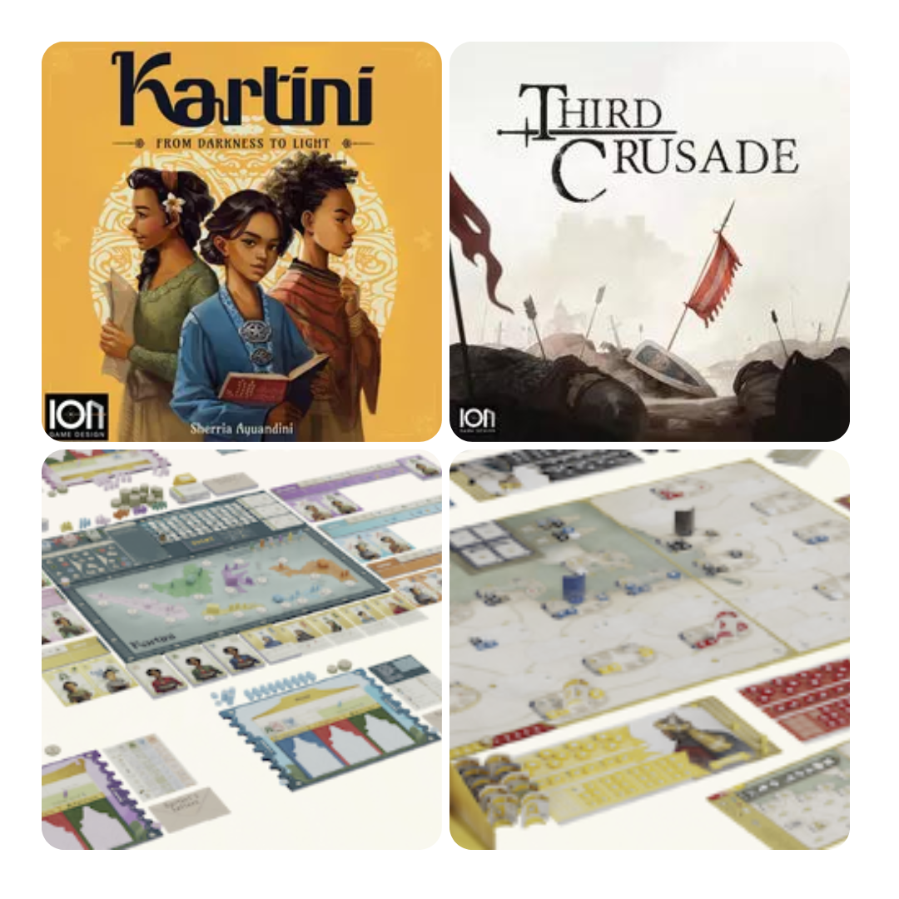
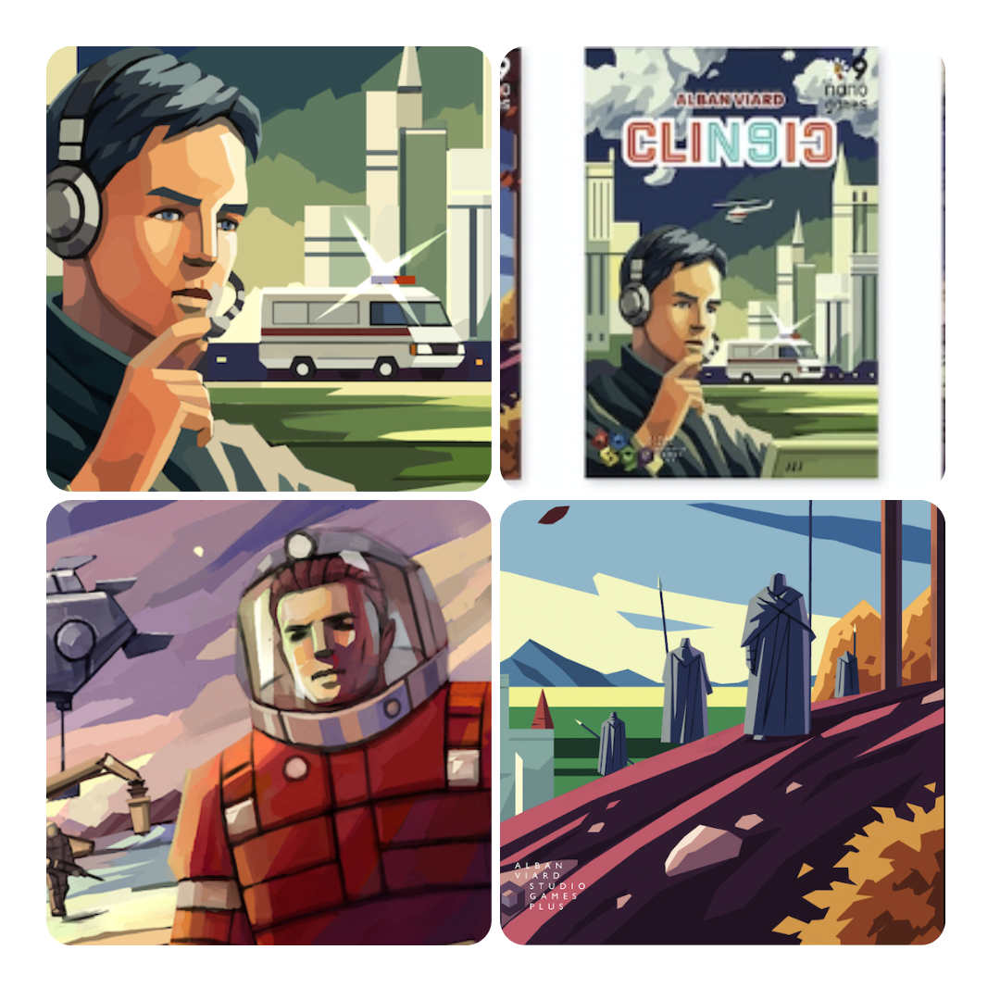
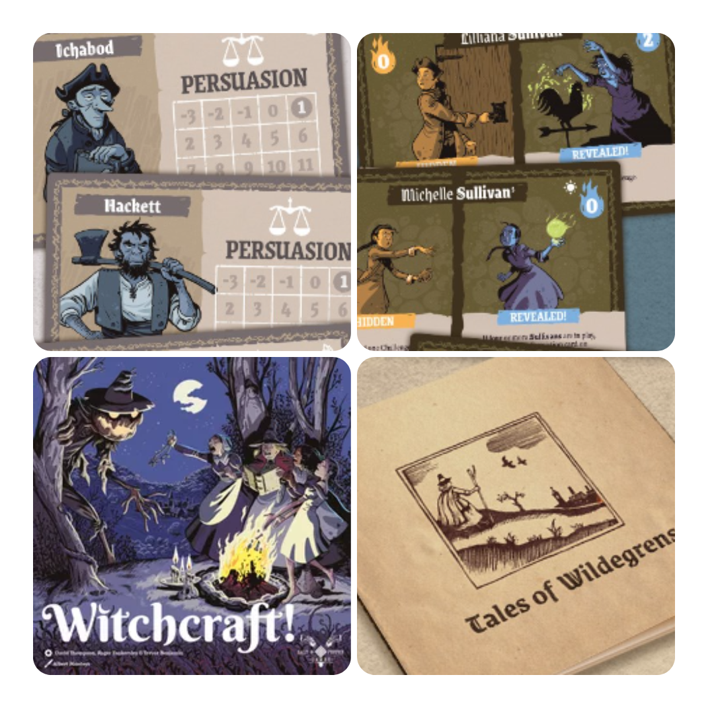
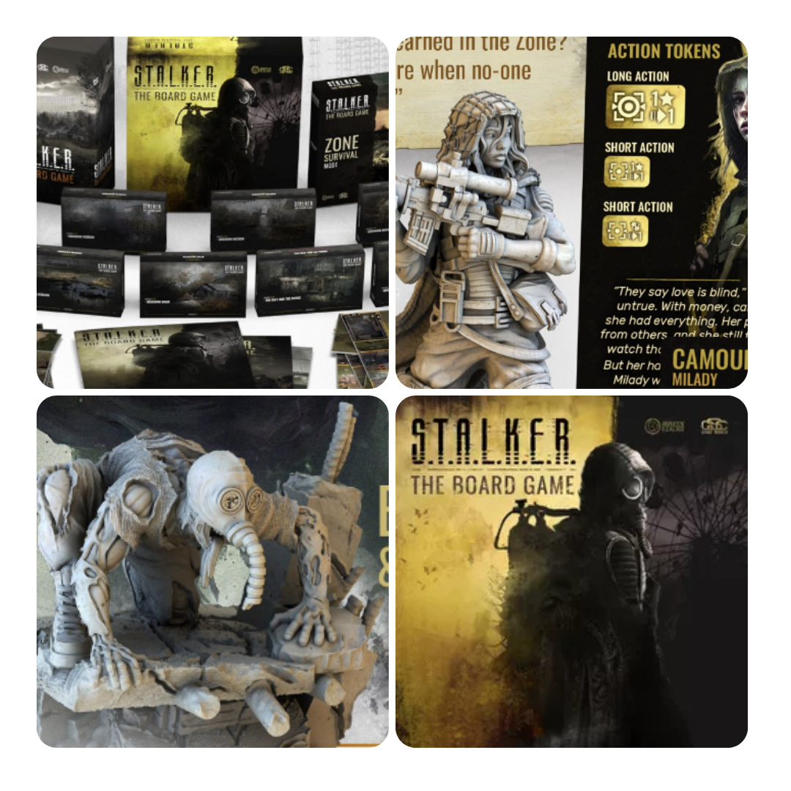

<FundingIntro>
  Su kickstarter e sui vari siti di crowdfunding che ormai spuntano come funghi si possono trovare tendenzialmente due
  tipi di giochi: il gioco indie e il gioco AAA. Se siete dei videogiocatori sapete già di cosa sto parlando. Voi che
  giochi da tavolo preferite pledgiare su kickstarter? Un gioco che praticamente è un preordine o un gioco che senza di
  voi non potrebbe mai essere creato?
</FundingIntro>

<FundingBit
  title="Third Crusade & Kartini - From Darkness to Light"
  player_count={3}
  player_count_official="1-6"
  weight={3}
  playing_time="120min"
  playing_time_official="120-180min"
  hype={8}
  deadline="26/06/2023"
  delivery="06/2024"
  price="129€"
  otherPrice="25€"
  designer={[]}
  publisher={["ion Design"]}
  mechanism={["Solitario"]}
>
  La ion Games questo giro porta su kickstarter due suoi nuovi giochi: Third crusade e Kartini due giochi a tema
  orientale. In <strong>Third Crusade</strong> i giocatori dovranno scontrarsi in uno scontro principalmente diplomatico
  durante le crociate. Superare eventi, allearsi al momento giusto, ottenere il giusto favore, questo sarà il motore
  principale del gioco e solo il giocatore più abile potrà ottenere la vittoria. Tanto diverso invece è{" "}
  <strong>Kartini</strong> un gioco cooperativo/competitivo/solitario ambientato agli inizi del 900 durante la “lotta"
  per l’educazione delle donne. In questo gioco invece si seguirà il processo di educazione utilizzando le carte per
  soddisfare degli obiettivi mentre si cercheranno di soddisfarne i requisiti…  
  Due giochi che sebbene su carta sembrino parecchi interessanti, sembrino quasi amatoriali come produzione, ma ad una più
  attenta analisi tutto ha un senso, è solo uno stile molto particolare! Darete fiducia alla ion?
</FundingBit>

<FundingBit
  title="Nano9games 2"
  player_count={1}
  player_count_official="1-2"
  weight={2}
  playing_time="30min"
  playing_time_official="15-30min"
  hype={9}
  deadline="30/06/2023"
  delivery="03/2024"
  price="80€"
  otherPrice="5€ + VAT"
  designer={[]}
  publisher={["AVStudioGames"]}
  mechanism={["Carte", "Dadi", "Solitario"]}
>
  AVStudioGames torna con i suoi nanogames. Questa volta la serie da 4 a 6. Sapendo che ne mancano altri tre questa
  potrebbe essere la vostra occasione di recuperarne una parte prima della fine!
   
  <strong>Clin9ic</strong> è la nanoversione ambiziosa di Clinic e considerando che è proprio l’autore del gioco
  originale ad averla curata non si può che essere affascinata da questa versione minimalistica.{" "}
  <strong>12 Patrols</strong> di <Link to="/designers/scott-allen-czysz">Scott allen</Link> invece è un astratto che si
  basa sull’essere un puzzle nel collegare correttamente carte dadi e cubetti. <strong>Asteroid Miners</strong> invece è
  un gioco di manipolazione dadi che si base sul cercare di estrarre più risorse possibili. Se vi piace l’idea dei
  nanogames: 9 carte 9 dadi e 9 cubetti non potere che essere affascinati anche da questi tre giochi, ma se invece avete
  perplessità… beh non saranno questi tre giochi a farvi cambiare idea!
</FundingBit>

<FundingBit
  title="Witchcraft!"
  player_count={1}
  player_count_official="1"
  weight={2}
  playing_time="30min"
  playing_time_official="20-40min"
  hype={9}
  deadline="05/07/2023"
  delivery="10/2023"
  price="20€"
  otherPrice="12€ + VAT"
  designer={["Trevor Benjamin", "Roger Tankersley", "David Thompson (I)"]}
  publisher={["SaltandPepper"]}
  mechanism={["ManiGestione mano", "Push your luck", "Solitario"]}
>
  Witchcraft ci porta a capo di una congrega di streghe in un mondo in cui la magia non è morta e nemmeno i mostri. Sarà
  compito nostro decidere come utilizzare la magia per affrontare le difficoltà stando attenti agli abitanti del
  villaggio, che non bene vedono l’utilizzo delle arti occulte e che soprattutto potrebbero incarcerarvi e costringervi
  a mostrare la propria innocenza!!  
  In questo solitario dovrete ogni volta scegliere se le vostre streghe potranno effettuare la loro magia alla luce del sole
  in maniera più potente o nascondendosi dai compaesani mentre si cerca di essere abbastanza forti per superare le forze
  oscure che si avventano sul villaggio. Il tutto mentre si cerca di convincere i giudici della propria bontà.  I designer
  hanno preso pari pari il loro <Link to="/reviews/no-pasaran/">no pasaran</Link> e hanno cercato di sviluppare nuove meccaniche
  sopra di esso (giudici, famiglie, famigli) in un gioco che è affascinante per le scelte di gameplay da eseguire di volta
  in volta e che, se siete appassionati dell’altro gioco non può che far per voi!
</FundingBit>

<FundingBit
  title="S.T.A.L.K.E.R. The Board Game"
  player_count={1}
  player_count_official="1-4"
  weight={3}
  playing_time="150min"
  playing_time_official="120-180min"
  hype={6}
  deadline="04/07/2023"
  delivery="04/2024"
  price="95 US$"
  otherPrice="17 US$ + VAT"
  designer={["Paweł Samborski"]}
  publisher={["Awaken Realms"]}
  mechanism={["Cooperativo", "Dadi"]}
>
  In una Chernobyl alternativa piena di anomalie e mutanti i giocatori impersoneranno uno stalker, che dovrà
  sopravvivere alla “vita di tutti i giorni". Scenari sempre diversi e campagne emozionanti vi aspettano in un gioco in
  cui la gestione delle proprie risorse/personale vi garantirà di portare a casa la pellaccia… si spera…   Il gioco
  è un classico della <Link to="/publishers/awaken-realms">Awaken Realms</Link>, grandi miniature e grande cuore. Sembra
  una versione sempre più rifinita dei loro sistemi per i coop e visto il designer che ci sta dietro, l’autore di{" "}
  <Link to="/reviews/this-war-of-mine/"> This of War of mine</Link>, sicuramente si ha a che fare con un altro gioco di
  qualità e livello… Se ti piace il genere ovviamente…
</FundingBit>

