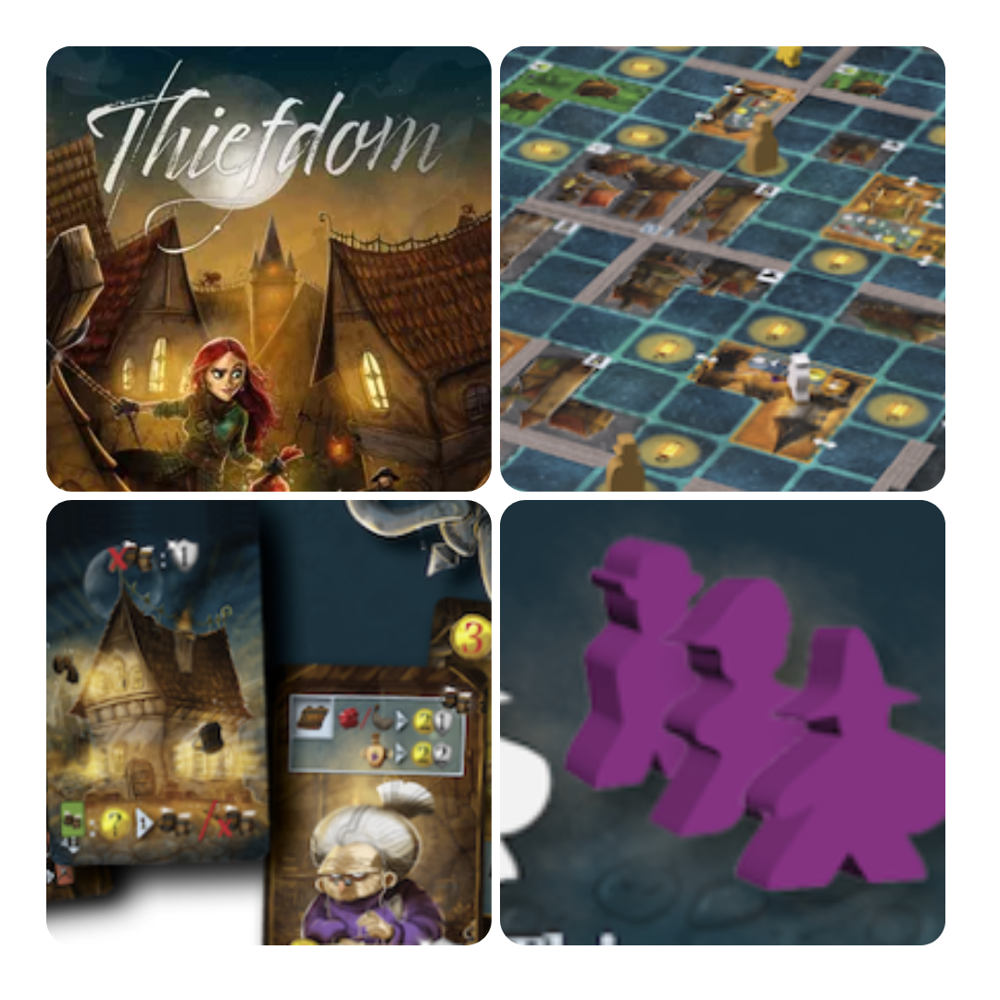
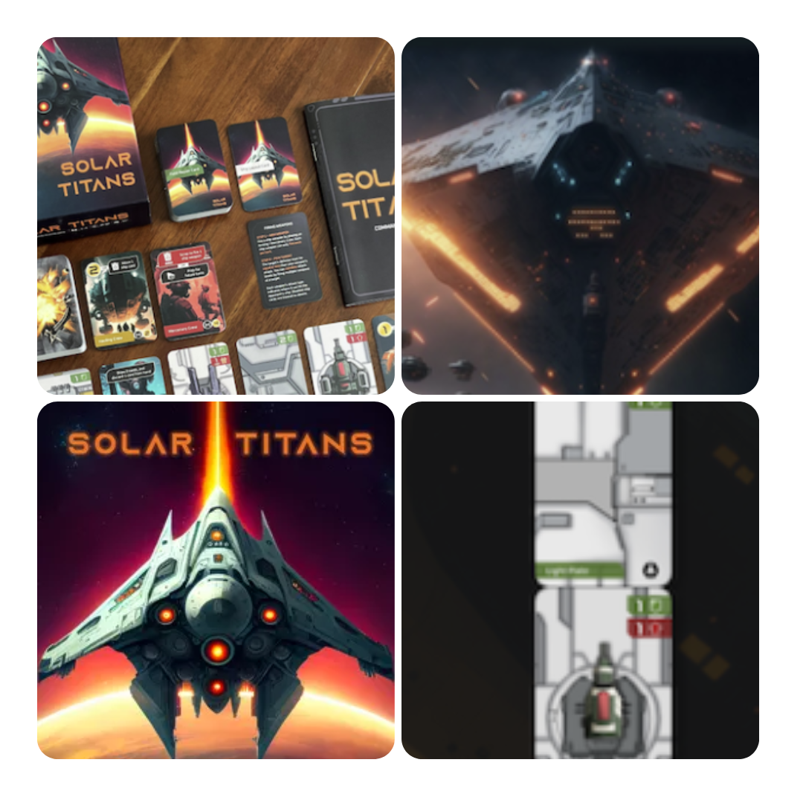
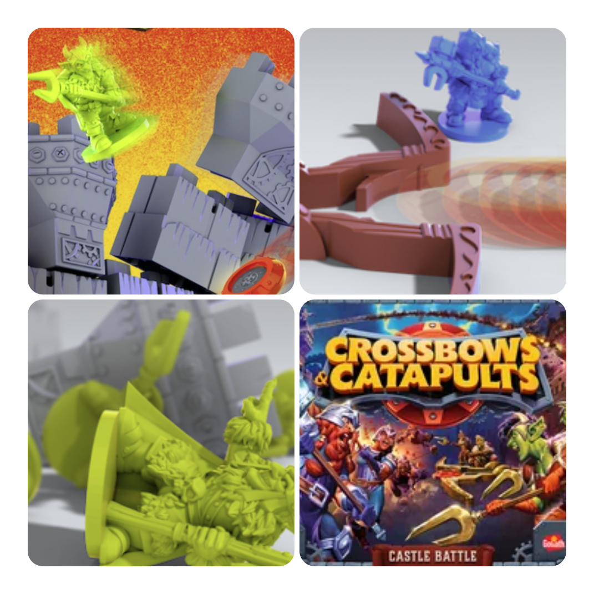

<FundingIntro>
  È sempre bello vedere designer amati tornare su kickstarter dopo tanto tempo: si è sempre curiosi di sapere cosa
  succederà. Un po' peggio è quando invece tornano delle ristampe… Molto meglio i <Link to="/designers">Designer</Link>!
</FundingIntro>

<FundingBit
  title="Thiefdom"
  player_count={3}
  player_count_official="1-4"
  weight={3}
  playing_time="90min"
  playing_time_official="60-120min"
  hype={10}
  deadline="30/06/2023"
  delivery="12/2024"
  price="29€"
  otherPrice="17€ + VAT"
  designer={["Juma Al-JouJou", "Simon Schmieder"]}
  publisher={["Karma Games"]}
  mechanism={["Pick up and deliver", "Movimento ad area", "Mappa modulare"]}
>
  Ah! Finalmente è tornato il creatore di <Link to="/reviews/clans-of-caledonia/">Clans of Caledonia</Link>: questa
  volta niente whisky, andiamo invece in una città medioevale, a capo di una gilda di ladri!
   
  I giocatori avranno il controllo su due elementi: da un lato i propri ladri, con l'obiettivo di depredare il più
  possibile per ottenere abbastanza punti da vedere decretata la propria gilda la migliore, dopo 6 notti; dall'altro, il
  controllo delle guardie, decisamente più interessante, perché offrirà la possibilità di disturbare attivamente i
  giocatori avversari e mettere loro i bastoni tra le ruote.  
  Che dire? Un gioco decisamente interessante. Carte usate per il movimento, poteri speciali, pianificazione delle azioni
  e perfino una modalità in solitario. Se tutto viene confezionato a dovere potremmo finire per avere tra le mani un piccolo
  capolavoro!
</FundingBit>

<FundingBit
  title="Phantom Epoch"
  player_count={1}
  player_count_official="1-4"
  weight={3}
  playing_time="100min"
  playing_time_official="60-180min"
  hype={8}
  deadline="13/07/2023"
  delivery="06/2024"
  price="70 US$"
  otherPrice="21 US$ + VAT"
  designer={["Tyson Abernethy"]}
  publisher={["Doteira Games"]}
  mechanism={["Campagna", "Deck building", "Dadi"]}
>
  Phantom Epoch è un gioco a campagna con ambientazione sci-fi composto da 40 missioni, che vi porterà a difendere la
  galassia da una misteriosa minaccia.
   
  Si presenta come il classico gioco a campagna a scenari. Data una missione, ci saranno una mappa, degli eventi per
  ogni round e ogni giocatore dovrà far muovere e combattere il proprio personaggio grazie a delle carte e degli
  oggetti. Ogni spedizione avrà delle conseguenze e la campagna si evolverà di conseguenza; tra le decisioni di cui
  bisognerà farsi carico ci sarà anche quella di potenziare la propria astronave e il proprio team!
   
  Un gioco che sicuramente ha il suo fascino, ma che come tutti i giochi a campagna si porta con sé il rischio di essere
  alla lunga ingiocabile. Chi ha tutto questo tempo insomma? Eppure… Come si fa a resistere al richiamo della
  fantascienza?!
</FundingBit>

<FundingBit
  title="Solar Titans"
  player_count={2}
  player_count_official="1-4"
  weight={2}
  playing_time="45min"
  playing_time_official="30-60min"
  hype={7}
  deadline="11/07/2023"
  delivery="01/2024"
  price="25 US$"
  otherPrice="12 US$ + VAT"
  designer={["Phillip Gee", "Xian Wu"]}
  publisher={["SunnySideUp Games"]}
  mechanism={["Carte", "Solitario"]}
>
  Un gioco competitivo in cui si sarà a capo di una nave e bisognerà scontrarsi e sopravvivere.  
  Ogni turno nel gioco ci dà la possibilità di prendere decisioni cruciali. Durante i combattimenti, occorre decidere quali
  armi utilizzare, a quale obiettivo mirare e quali moduli nemici disabilitare. Nel mercato, si può scegliere se migliorare
  la propria economia, la difesa, l'attacco o l'utilità, acquistando armi potenti, rivestimenti avanzati o equipaggi specializzati.
  Inoltre, si ha la possibilità di modificare o riparare la nave, ma attenzione alle risorse limitate disponibili per le
  riparazioni!  
  Solar Titans è un gioco che sembra quasi… innovativo?! Scegliere la forma della propria nave, la propria ciurma, come
  combattere e come evolvere. Questo sicuro non è innovativo, ma l'amalgama lo è assolutamente! Un duello decisamente
  interessante.
</FundingBit>

<FundingBit
  title="Crossbows & Catapults"
  player_count={2}
  player_count_official="2"
  weight={1}
  playing_time="30min"
  playing_time_official="20-30min"
  hype={7}
  deadline="11/07/2023"
  delivery="07/2024"
  price="30 US$"
  otherPrice="35€"
  designer={["Stephen Baker", "Noah Cohen", "Rob Daviau", "Justin D. Jacobson", "Brian Neff"]}
  publisher={["Goliath Games", "Restoration Games"]}
  mechanism={["Destrezza", "Gestione mano", "Poteri variabili"]}
>
  Una riedizione di un gioco del 1983. Ogni giocatore avrà il suo castello e bisognerà letteralmente far crollare quello
  del proprio avversario lanciando dei dischetti attraverso baliste e catapulte e cose bellissime.  
  Regole minimali, massimo divertimento, per un gioco che vi farà tornare bambini! E poi dalla Restoration Games…ci si aspetta
  il meglio!
</FundingBit>

