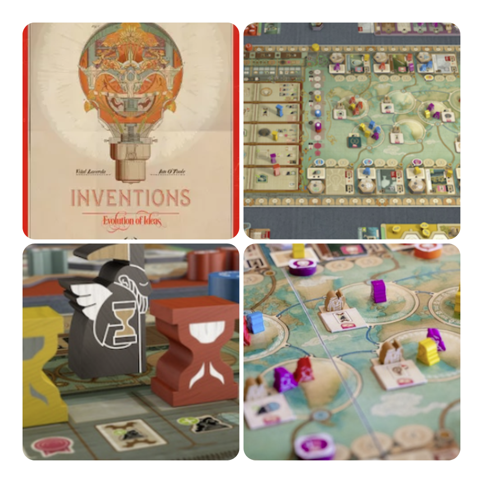
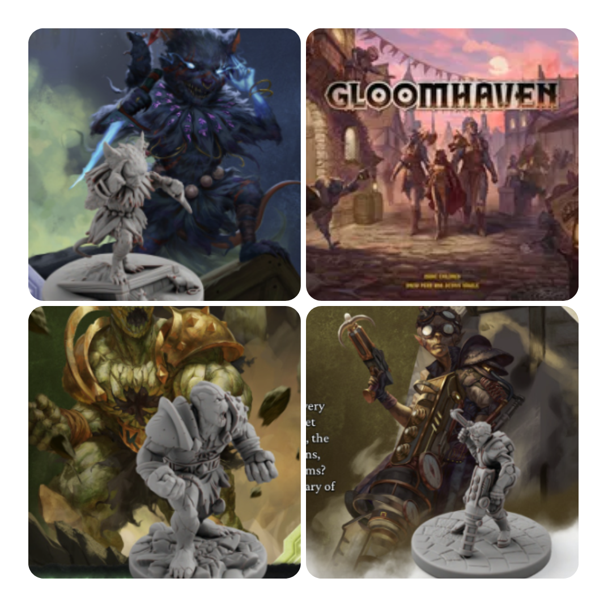
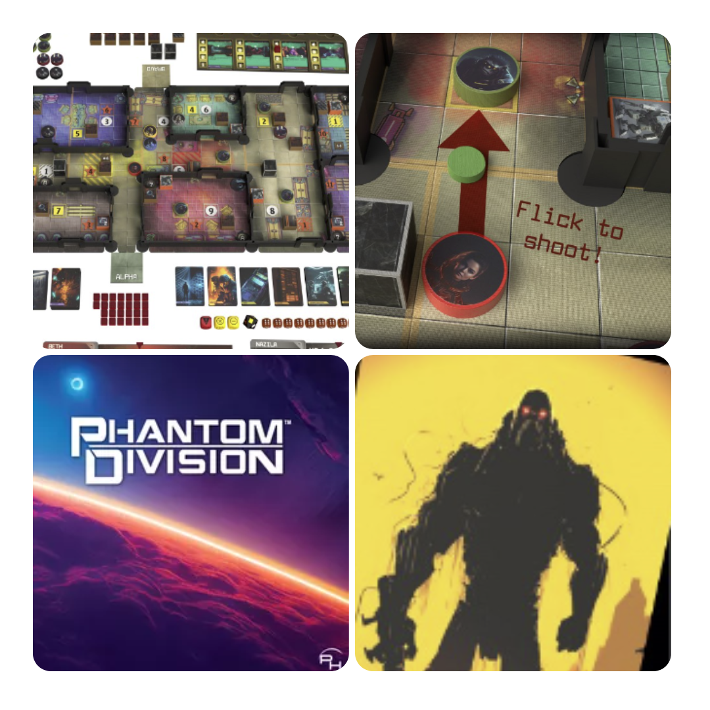
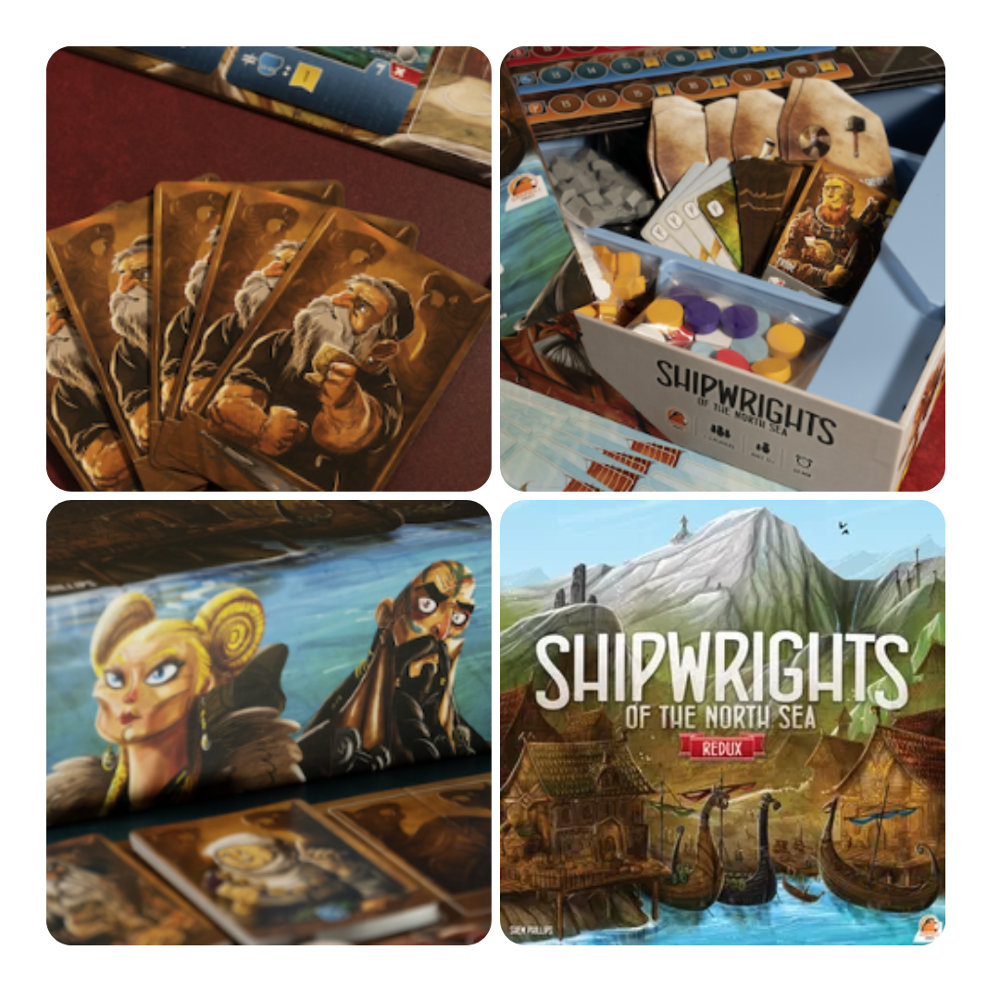

<FundingIntro>
  Vuoi per una scelta più sicura per le case editrici, vuoi per costi minori nel mondo del crowdfunding, oggi sono
  sempre di più le storie di grandi ritorni. Giochi antichi modernizzati, ristampe con regole migliorate ecc… Però
  ovviamente non sono solo opere ristrutturate che si trovano su kickstarter, ma anche giochi che cercano di emergere
  con nuove meccaniche.
</FundingIntro>

<FundingBit
  title="Inventions: Evolution of Ideas"
  player_count={3}
  player_count_official="1-4"
  weight={5}
  playing_time="100min"
  playing_time_official="60-150min"
  hype={7}
  deadline="09/07/2023"
  delivery="02/2024"
  price="129 US$"
  otherPrice="19US$ + VAT"
  designer={["Vital Lacerda"]}
  publisher={["Eagle-Gryphon Games"]}
  mechanism={["Movimento su mappa", "Piazzamento lavoratori"]}
>
  Fin dai tempi antichi, gli esseri umani hanno cercato nuove idee, sviluppando costantemente concetti sempre più
  innovativi.  
  Inventions: Evolution of Ideas è un gioco di strategia che ruota attorno a una pianificazione a lungo termine. Il progresso
  di ciascuna società verrà misurato in Punti Ingegno (IP). Il giocatore con il punteggio più alto avrà la società più avanzata
  e vincerà la partita.  
  In questo suo nuovo gioco, il rinomato Lacerda ci porta in un mondo fatto di idee e scoperte. Un gioco per sua natura
  complicato che non potrà che piacere agli amanti dell’autore. È però un buon punto di inizio per un neofita di
  Lacerda? Sembrerebbe di sì, in quanto si ha un amalgama di suoi vecchi giochi con leggere modifiche!
</FundingBit>

<FundingBit
  title="Gloomhaven: Second Edition"
  player_count={3}
  player_count_official="1-4"
  weight={3}
  playing_time="90min"
  playing_time_official="60-120min"
  hype={8}
  deadline="20/07/2023"
  delivery="03/2024"
  price="130 US$"
  otherPrice="25 US$ + VAT"
  designer={["Isaac Childres", "Drew Penn", "Dennis Vögele"]}
  publisher={["Cephalofair Games"]}
  mechanism={["Campagna", "Cooperativo", "Carte"]}
>
  Gloomhaven è uno di quei giochi che ormai non hanno bisogno di presentazioni e quindi sarò super breve. Ora esiste una
  seconda versione con miglioramenti su larga scala votati a rendere l’esperienza di gioco ancora migliore di quello che
  è. Badate bene: con questo backerkit sarà possibile ottenere il gioco di ruolo, le miniature e Frosthaven, il seguito
  di Gloomhaven. Resta però il fatto che non sia un prodotto per tutti. Giocare a Gloomhaven richiede dedizione, tempo e
  un gruppo di gioco affiatato per gustarlo al meglio, miglioramenti o no. Se pensate di avere tutto questo… Gloomhaven
  second edition è sicuramente un pledge da valutare!
</FundingBit>

<FundingBit
  title="Phantom Division"
  player_count={2}
  player_count_official="1-4"
  weight={2}
  playing_time="x60min"
  playing_time_official="45-75min"
  hype={9}
  deadline="22/07/2023"
  delivery="05/2024"
  price="85 US$"
  otherPrice="30 US$ + VAT"
  designer={["Pete Ruth", "Mark Thomas (I)"]}
  publisher={["Phantom Horizon"]}
  mechanism={["Cooperativo", "Destrezza", "Dadi"]}
>
  Phantom division è un gioco cooperativo con i classici scenari, ambientazione fantascientifica ecc ecc… “Peccato" sia
  un gioco di destrezza! Infatti in questo gioco, tra l’altro basato sulla meccanica della furtività, i proiettili
  devono essere letteralmente schiccherati per fare danno: e questa è indubbiamente la meccanica più innovativa.  
  È un gioco che, per quanto poco curato graficamente, o quanto meno che sa di grafica vecchia e amatoriale, prova a fare
  qualcosa di nuovo in un modo decisamente interessante. Probabilmente si merita fiducia!  
   
  Purtroppo la campagna in data 30/06/2023 è stata cancellata, ma tornerà più avanti, speriamo con migliorie grafiche!
</FundingBit>

<FundingBit
  title="Shipwrights of the North Sea: Redux"
  player_count={3}
  player_count_official="1-5"
  weight={2}
  playing_time="60min"
  playing_time_official="60-80min"
  hype={10}
  deadline="13/07/2023"
  delivery="02/2024"
  price="74 NZ$"
  otherPrice="26 NZ$"
  designer={["Shem Phillips"]}
  publisher={["Garphill Games"]}
  mechanism={["Gestione mano", "Drafting", "Piazzamento lavoratori"]}
>
  Ed eccolo! Il primo gioco della prima trilogia della Garphill Games, in una versione Redux, che non è una semplice
  riedizione del gioco, ma piuttosto un remastered.  
  Ogni turno presenta decisioni interessanti, mentre i giocatori costruiscono il loro motore e trovano strategie. La modalità
  solitario include quattro avversari unici, consentendo ai giocatori di affrontare sfide multiple in una singola partita.
  La tensione e la competizione aumentano mentre i giocatori si sfidano sulle tre tracce di progresso. L'obiettivo è guadagnare
  il maggior numero di Punti Vittoria costruendo edifici e navi, reclutando Jarl, attirando Eroi e collezionando Oro.  {" "}
  Che dire, nuova linfa vitale per una saga, quella del nord, che è sempre stata ingiustamente bistrattata!
</FundingBit>

