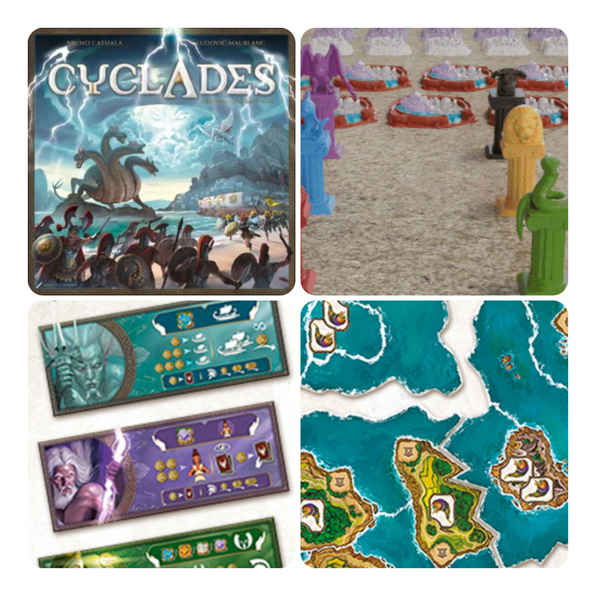
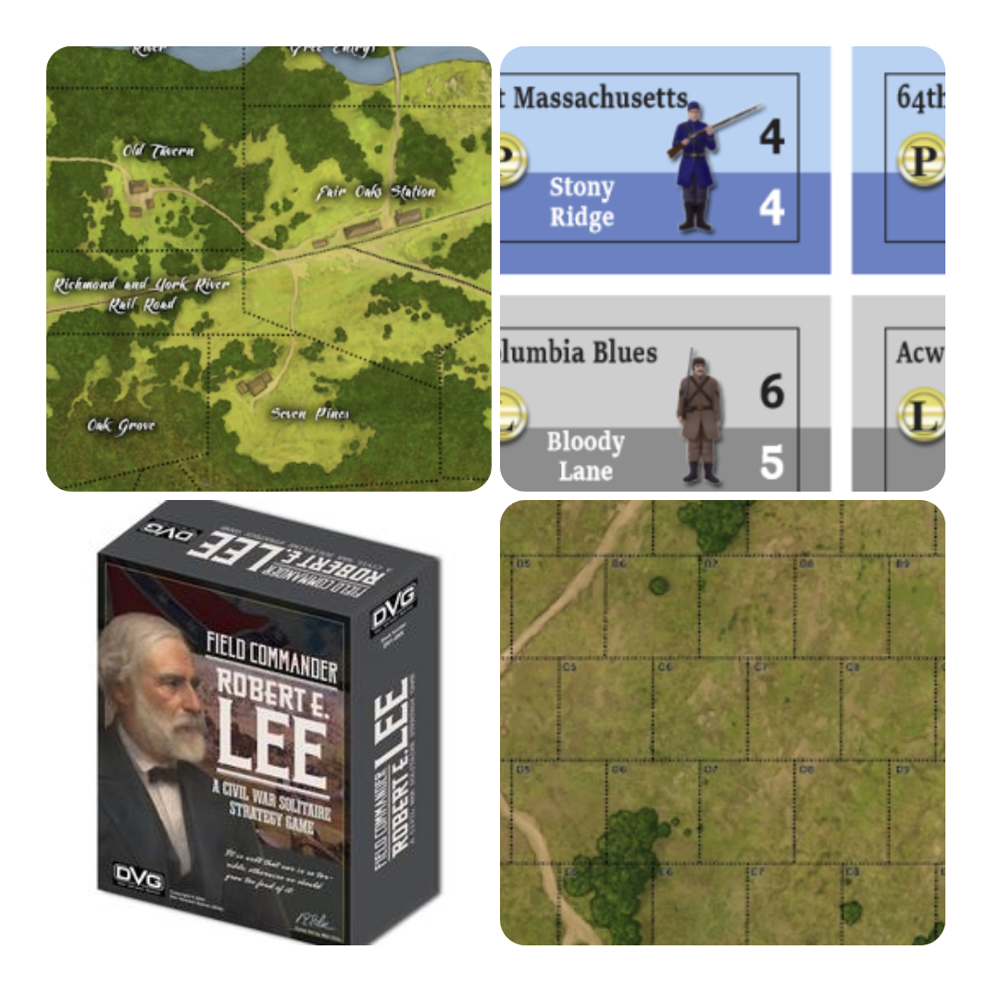

<FundingIntro>
  Si sa, esistono periodi nel magico mondo del crowdfunding in cui per fortuna ci sono meno progetti da valutare, e
  quindi si fa meno fatica nella scelta di dove lanciare sullo schermo i propri sudati guadagni! Quindi adesso eccovi 4
  titoli un po’ particolari e un po’ no!
</FundingIntro>

<FundingBit
  title="Cyclades: Legendary Edition"
  player_count={3}
  player_count_official="2-6"
  weight={3}
  playing_time="90min"
  playing_time_official="60-90min"
  hype={8}
  deadline="08/08/2023"
  delivery="12/2024"
  price="59€"
  otherPrice="23€"
  designer={["Bruno Cathala", "Ludovic Maublanc"]}
  publisher={["Open Sesame Games"]}
  mechanism={["Controllo area", "Asta", "Collezione set"]}
>
  Dopo anni ritorna il gioco considerato una delle basi delle meccaniche di asta, sviluppo e conquista. Comandare la
  propria fazione fino alla vittoria non è mai stato così bello. Ci sono molte migliorie apportate in questa edizione di
  Cyclades, dai modi per giocare a varie migliorie, più ovviamente le miniature!  
  Non prendiamoci in giro: Cyclades è un gioco che in un modo o nell’altro dovrebbe sempre essere presente in una collezione
  e questa potrebbe essere un’occasione d’oro per mettersi in pari!
</FundingBit>

<FundingBit
  title="DC Deck-Building Game: Justice League Dark Expansion"
  player_count={2}
  player_count_official="2-4"
  weight={2}
  playing_time="45min"
  playing_time_official="45-45min"
  hype={7}
  deadline="27/07/2023"
  delivery="04/2024"
  price="75 US$"
  otherPrice="33 US$ + VAT"
  designer={["Nathaniel Yamaguchi"]}
  publisher={["Cryptozoic Entertainment"]}
  mechanism={["Carte", "Deck building", "Drafting aperto"]}
>
  Per chi non lo sapesse, la Justice League Dark è una sezione della Justice League che cerca di affrontare le minacce
  più occulte del mondo. In questo kickstarter, basato sul sistema di gioco DC che si è venuto a creare nel corso degli
  anni, ci saranno nuove carte a tema e nuove meccaniche di gioco pronte a mettere a dura prova anche i giocatori più
  abili, come solo il sistema DC sa fare!
</FundingBit>

<FundingBit
  title="Field Commander: Robert E. Lee"
  player_count={1}
  player_count_official="1"
  weight={3}
  playing_time="180min"
  playing_time_official="180-180min"
  hype={6}
  deadline="23/07/2023"
  delivery="01/2024"
  price="90 US$"
  otherPrice="25 US$"
  designer={[]}
  publisher={["Dan Verssen Games (DVG)"]}
  mechanism={["Solitario", "Movimento ad area", "Dadi"]}
>
  "Field Commander - Robert E. Lee" è un gioco basato sul design e sul gameplay di "Field Commander - Napoleon", che
  mette il giocatore al comando dell'Armata della Virginia Settentrionale durante la Guerra Civile Americana, mentre le
  forze dell'Unione sono controllate dal bot.  
  Il gioco include cinque campagne che coprono importanti battaglie della guerra civile americana con mappe e regole speciali.{" "}
   
  Ci sono diverse nuove caratteristiche nel gioco volte a potenziarne l’esperienza e renderla ancora più godibile, come
  i piani di battaglia speciali, la cattura di artiglierie anziché la loro distruzione, l'attenuazione della gittata
  dell'artiglieria in base alla distanza.  
  Complessivamente, "Field Commander - Robert E. Lee" offre una ricca esperienza di gioco strategica e storica, permettendo
  ai giocatori di assumere il ruolo del leggendario generale confederato Robert E. Lee e guidare le sue truppe attraverso
  alcune delle battaglie più importanti della Guerra Civile Americana.
</FundingBit>

<FundingBit
  title="Tanares Adventures - Ultimate Edition"
  player_count={3}
  player_count_official="1-8"
  weight={2}
  playing_time="90min"
  playing_time_official="90-150min"
  hype={8}
  deadline="20/07/2023"
  delivery="02/2024"
  price="129 US$"
  otherPrice="39 US$ + VAT"
  designer={["Alexandre Aboud", "Danilo de Alcantara", "Michael Alves", "Clayton Machado"]}
  publisher={["Dragori Games"]}
  mechanism={["Campagna", "Narrativo"]}
>
  Questo kickstarter è l’occasione per saltare dentro nel mondo di Tanares, un mondo gigante, fatto di un sacco di
  espansioni e di miniature enormi. Un gioco che si è evoluto negli anni e che in questa campagna appunto si propone di
  ottenere una versione aggiornata del gioco e delle scatole, in grado di contenere tutta la collezione (niente male!
  Indovinate la dimensione…). I “novizi” invece avranno la possibilità di ottenere questo gioco anche in versione
  “standee”, in modo da godersi un’esperienza di gioco con una barriera di ingresso ridotta!
</FundingBit>

