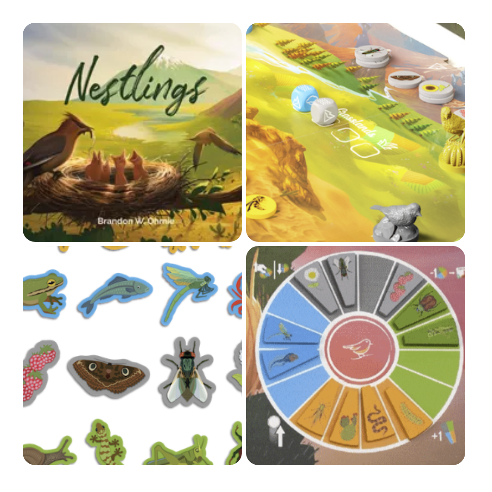
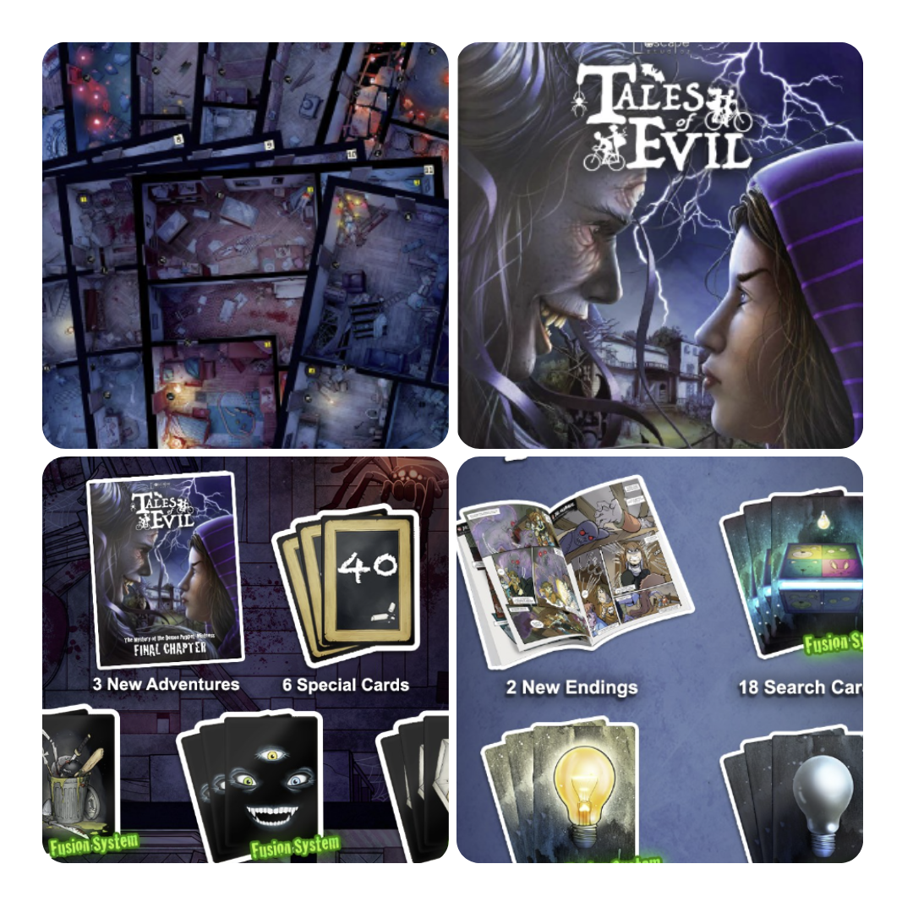
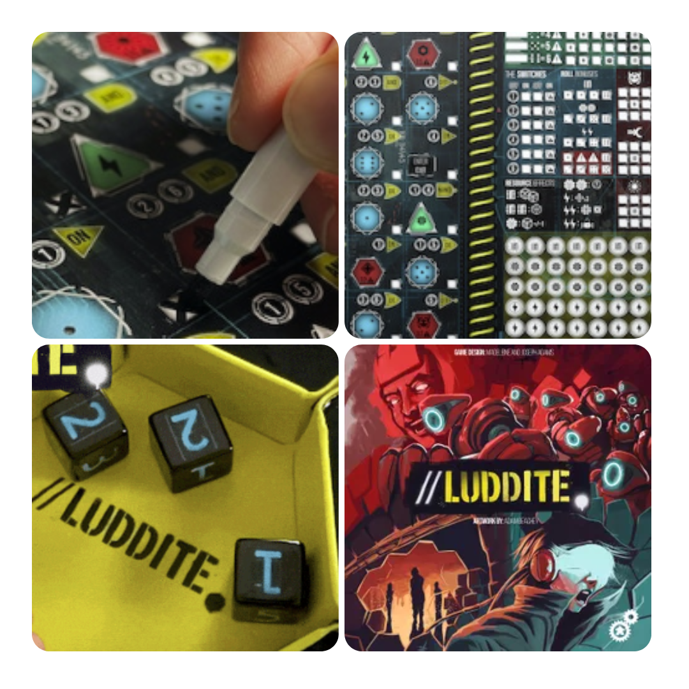

<FundingIntro>
  Ogni tanto, il mondo del crowdfunding va in pausa, e di solito ciò avviene in estate. Tuttavia, si trovano sempre
  giochi interessanti e alle volte un Dudefunding non è abbastanza per trovarli tutti in un colpo solo. Ma piano piano,
  pezzo dopo pezzo, nel caldo li troviamo e li scoviamo tutti!
</FundingIntro>

<FundingBit
  title="Nestlings"
  player_count={4}
  player_count_official="1-4"
  weight={2}
  playing_time="60min"
  playing_time_official="30-60min"
  hype={8}
  deadline="22/07/2023"
  delivery="03/2024"
  price="39 US$"
  otherPrice="18 US$ + VAT"
  designer={["Brandon Ohmie"]}
  publisher={["Tangerine Games"]}
  mechanism={["Dadi", "Gestione mano", "Collezione set"]}
>
  Nestling è un gioco da tavolo basato su una lotta di sopravvivenza tra volatili, nella speranza di far sopravvivere il
  proprio nido.  
  Il gioco si suddivide in 4 round, in ognuno dei quali i giocatori avranno a che fare con il ripristino delle risorse nei
  Biomi, la gestione dei propri dadi da mettere nei biomi per determinare chi ha la priorità nella raccolta delle risorse
  negli ambienti. Inoltre, la raccolta di risorse permetterà ai giocatori di diventare più efficaci nei biomi, ottenendo
  determinati bonus. Il tutto condito dalla ricerca di punti vittoria data dal completamento di obiettivi!  
  Sinceramente non mi piacciono i giochi basati sugli uccelli, ma questo sembra dare quello che il buon{" "}
  <Link to="/reviews/wingspan">Wingspan</Link> non mi ha mai trasmesso: divertimento e complessità. Sarà davvero così?
  Lo spero vivamente!
</FundingBit>

<FundingBit
  title="Tales Of Evil Final Chapter"
  player_count={2}
  player_count_official="1-6"
  weight={2}
  playing_time="60min"
  playing_time_official="60min"
  hype={8}
  deadline="19/07/2023"
  delivery="06/2024"
  price="59€"
  otherPrice="16€"
  designer={["Antonio Ferrara"]}
  publisher={["Escape Studios"]}
  mechanism={["Cooperativo", "Movimento ad Area", "Narrativo"]}
>
  Il Capitolo Finale di Tales of Evil è l'avventura che ci condurrà allo scontro finale contro la Signora dei Burattini
  Demoniaca, la chiusura definitiva del ciclo de La Maledizione del Burattinaio Demoniaco.  
  Non solo Tales of Evil però, ma anche nuovi componenti per Boogeyman e 5 Carte Esclusive per The Maniac (il nuovo gioco
  di Escape Studios che sarà lanciato l'inverno prossimo).  
  La quantità di storie, carte, eventi e tessere aggiuntive permetterà di vivere un'esperienza unica all'interno
  dell'universo di Pizza & Investigation. Queste nuove avventure avranno a che fare con il mondo dei sogni dell'inverso
  - sì, avete capito bene. Si giocherà su due piani, quello reale e quello del Burattinaio Demoniaco, che avrà in serbo
  colpi di scena e una sfida mai vista prima. Pronti a tuffarvi nell'incubo?
</FundingBit>

<FundingBit
  title="Mystery of the Abbey - Mojito Studios"
  player_count={5}
  player_count_official="3-6"
  weight={2}
  playing_time="75min"
  playing_time_official="60-90min"
  hype={6}
  deadline="19/07/2023"
  delivery="07/2024"
  price="40 US$"
  otherPrice="17 US$ + VAT"
  designer={["Bruno Faidutti", "Serge Laget"]}
  publisher={["Mojito Studios"]}
  mechanism={["Dadi", "Deduzione"]}
>
  Mystery of the Abbey è un successore spirituale di Cluedo, quindi… beh… si tratta di risolvere un omicidio, questa
  volta in un’abbazia della Francia!  
  In termini di gioco, ci si muoverà sulla mappa facendo domande ad altri giocatori in modo da capire chi è il colpevole.
  Ci saranno anche eventi ed effetti pronti a complicare la situazione!  
  Un giochino che può avere un senso per gli amanti di Cluedo che vogliono dare una vampata di novità ad un sistema di
  gioco che non muore mai… Ha senso? Se piace, sicuramente! Soprattutto perché in questa versione ci sono delle
  regolette e degli effetti in grado di far “rivivere" il gioco nel migliore dei modi!
</FundingBit>

<FundingBit
  title="Luddite"
  player_count={1}
  player_count_official="1-99"
  weight={2}
  playing_time="30min"
  playing_time_official="20-40min"
  hype={9}
  deadline="05/08/2023"
  delivery="12/2024"
  price="4£"
  otherPrice="0€"
  designer={["Madeleine Adams", "Joseph N Adams"]}
  publisher={["Cogito ergo Meeple"]}
  mechanism={["Dadi", "Push your luck"]}
>
  Prima di qualsiasi cosa… Il prezzo indicato è chiaramente riferito alla versione print and play. In questo gioco
  dall’atmosfera cyberpunk dovrete seguire la storia rappresentata, mentre dovrete aumentare le vostre potenzialità
  prima che il tempo scada, per essere in grado di eliminare le creature. Il tutto può essere giocato non solo a
  campagna, ma anche in modalità partite singole. Un gioco che vive sull’essere un push your luck per dare al giocatore
  una sensazione d’ansia, come se il timer non bastasse, molto in linea con l’atmosfera del gioco! Tra l’altro, un Roll
  and write con una graphic novel integrata… Wow!
</FundingBit>

