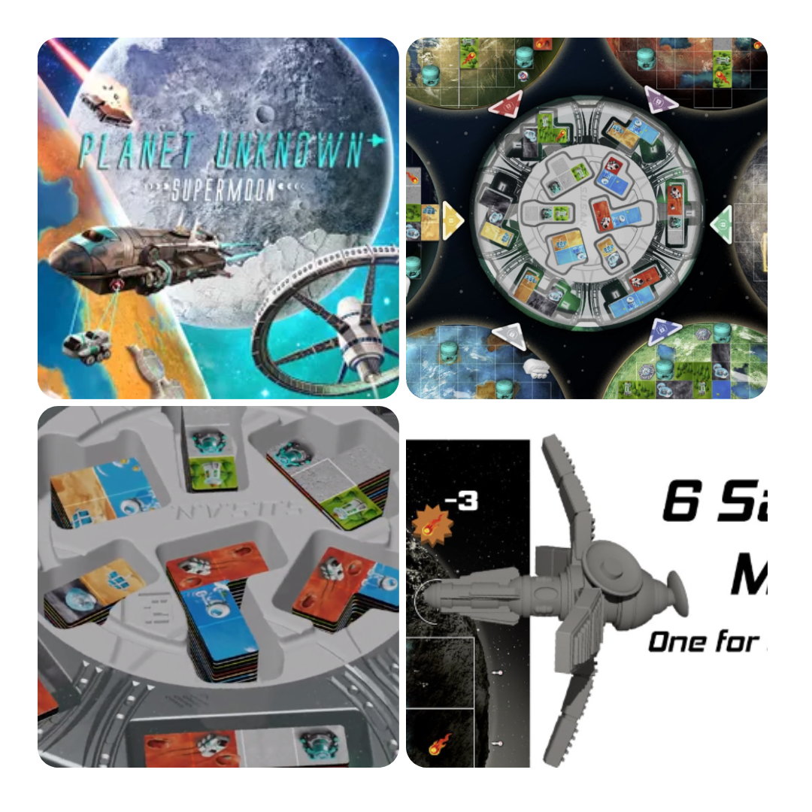
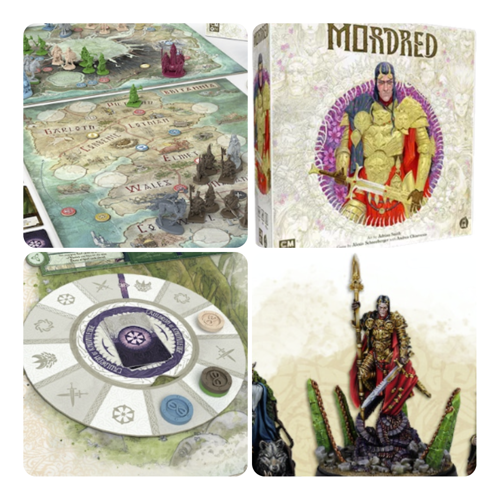
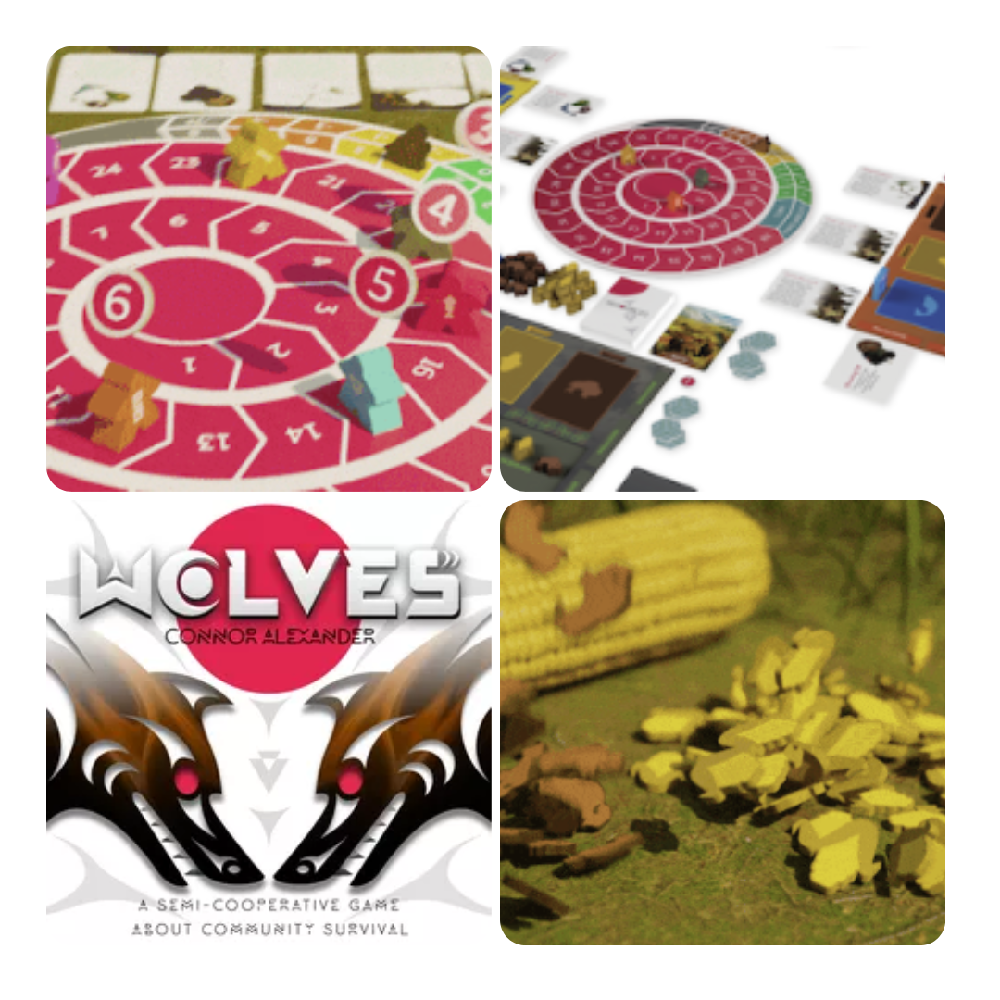
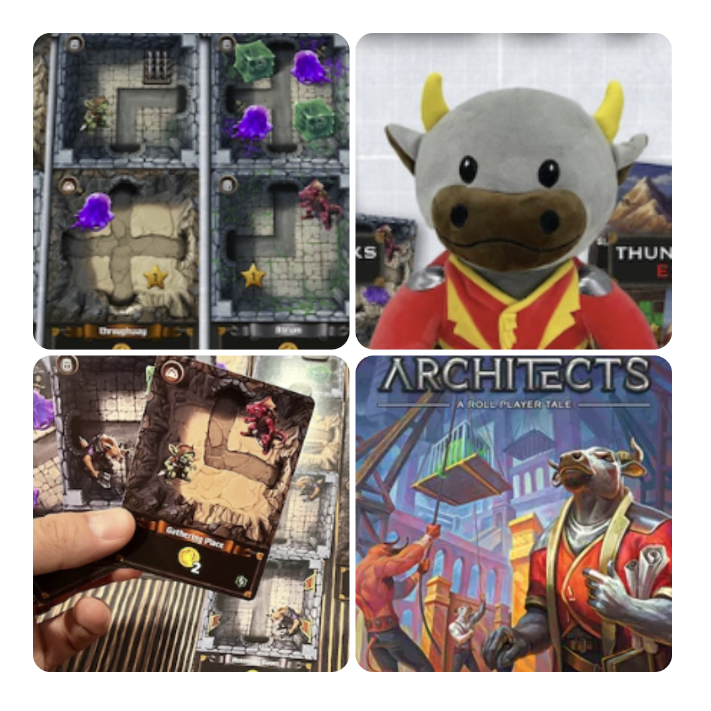

<FundingIntro>
  Un fatto importante da considerare nel mondo dei kickstarter sta nel fatto che ha indubbiamente permesso a nuove
  realtà di emergere e confermarne molto altre. Ora siamo in una nuova fase. Il mercato è più saturo quindi solo i
  migliori rimango. Solo quello che funziona o espansioni di quello che funziona. Quanto durerà ancora questa fase che
  riduce all’osso le novità vere novità ?
</FundingIntro>

<FundingBit
  title="Planet Unknown: Supermoon"
  player_count={4}
  player_count_official="1-6"
  weight={2}
  playing_time="60min"
  playing_time_official="65-80min"
  hype={9}
  deadline="29/07/2023"
  delivery="04/2024"
  price="30 US$"
  otherPrice="12 US$ + VAT"
  designer={["Ryan Lambert", "Adam Rehberg"]}
  publisher={["Adam's Apple Games, LLC"]}
  mechanism={["Piazzamento tessere", "Drafting"]}
>
  L'espansione "Supermoon" per il gioco da tavolo "Planet Unknown" è l’espansione che ogni gioco si merita : nuove sfide
  e nuove possibilità grazie alla presenza della Super luna. Come se non bastasse, ci sarebbero nuove tessere.  
  Tutto questo però ha un prezzo : circa 15 minuti in più di gioco, ma vista l'aggiunta di una nuova corporazione e di un
  pianeta, l'espansione Supermoon offre nuove combinazioni asimmetriche che renderanno l'esperienza di gioco ancora più avvincente
  in Planet Unknown e varranno questo allungamento del gameplay!
</FundingBit>

<FundingBit
  title="Mordred"
  player_count={3}
  player_count_official="2-4"
  weight={3}
  playing_time="90min"
  playing_time_official="90min"
  hype={8}
  deadline="27/07/2023"
  delivery="08/2024"
  price="110 US$"
  otherPrice="40 US$ + VAT"
  designer={["Andrea Chiarvesio", "Alexio Schneeberger"]}
  publisher={["CMON"]}
  mechanism={["Influenza", "Maggioranze"]}
>
  In Mordred, il gioco competitivo creato da Alexio Schneeberger con Andrea Chiarvesio, i giocatori si contendono il
  favore dei tre grandi leader: Mordred, Morgana e Merlino usando fazioni asimmetriche mentre cercano di guadagnarsi la
  loro benevolenza, ma il tempo è prezioso e ogni azione richiede una ponderata strategia!   Le abilità uniche di
  ciascuna fazione dovranno essere sfruttate al meglio per ottenere la supremazia e la gloria. Il gioco si dipana
  attraverso diversi round, durante i quali i partecipanti cercheranno di mitigare la presenza e l'influenza di bestie
  mostruose che vagano per la terra.  
  Con le straordinarie illustrazioni di Adrian Smith e le miniature realizzate dallo Studio McVey, Mordred trasporta i giocatori
  in una guerra che abbraccia i confini tra i mondi. Solo l'emergere di un nuovo regno potrà fermare il caos che si diffonde
  imperterrito. Lasciati coinvolgere in questo epico conflitto e dimostra di essere il degno sovrano della Britannia!
</FundingBit>

<FundingBit
  title="Wolves"
  player_count={5}
  player_count_official="3-6"
  weight={2}
  playing_time="90min"
  playing_time_official="60-90min"
  hype={8}
  deadline="08/08/2023"
  delivery="’03/2024"
  price="55 US$"
  otherPrice="non disponibile in europa"
  designer={["Connor Alexander"]}
  publisher={["Coyote & Crow LLC"]}
  mechanism={["Semi-cooperativo", "Push your luck", "Gestione mano"]}
>
  "Wolves" è un coinvolgente gioco da tavolo semi-cooperativo per 3-6 giocatori, in cui ciascuno assume il ruolo di un
  leader comunitario impegnato nella sopravvivenza durante un duro inverno. Il successo dipende dalla raccolta e dalla
  condivisione strategica delle risorse con gli altri giocatori. Se anche solo uno fallisce, tutti perdono!  
  Durante otto turni, dalla primavera all'inverno, i giocatori compiranno azioni sia simultaneamente che in base al loro
  status. Risorse diverse, come pesce, mais e bisonte, saranno disponibili e i giocatori dovranno scegliere quando fermarsi
  nella raccolta, evitando di esaurirle.  
  La condivisione delle risorse è fondamentale per mantenere tutti nel gioco, ma bisogna anche considerare il proprio
  potere. La generosità viene ricompensata, ma bilanciare egoismo e generosità ti renderà il leader perfetto. Wolves
  sembra un gioco davvero interessante, peccato che purtroppo in europa non sarà disponibile fino a quando sarà in
  negozio… Quindi è qui solo per ricordarvi della sua esistenza che magari in futuro sarà il vostro gioco preferito!
</FundingBit>

<FundingBit
  title="Stonespine Architects"
  player_count={3}
  player_count_official="1-5"
  weight={2}
  playing_time="45min"
  playing_time_official="45-60min"
  hype={8}
  deadline="02/08/2023"
  delivery="04/2024"
  price="36 US$"
  otherPrice="12 US$ + VAT"
  designer={["Jordy Adan"]}
  publisher={["Thunderworks Games"]}
  mechanism={["Gestione mano", "Costruzione pattern", "Contratti"]}
>
  In Stonespine Architects, unisci la costruzione di un dungeon al draft di carte in un gioco per 1-5 giocatori,
  intagliando il tuo labirinto pericoloso nella base delle Montagne Stonespine. Con il draft simultaneo delle carte,
  espandi il tuo dungeon, una stanza alla volta, seguendo una pianta unica e diverse sfide di punteggio. Scegli tra
  tracciare un percorso attraverso i passaggi sotterranei, posizionare elementi chiave nelle stanze o cercare tesori
  extra. Spendi oro tra i round per personalizzare il tuo labirinto con mostri, trappole, tesori e passaggi segreti.
  Alla fine di quattro anni, il giocatore con il dungeon più pericoloso otterrà il titolo di Architetto Maestro!  
  Abbiamo un nuovo gioco nel magico mondo di cartographer e questo, anche se ci porta nei labiritinti sembra l’ennesima evoluzione
  a livello di game design. Ogni gioco facente parte di questo mondo sembra sempre più bello e più divertente e Architects…
  beh è su questa strada!
</FundingBit>

