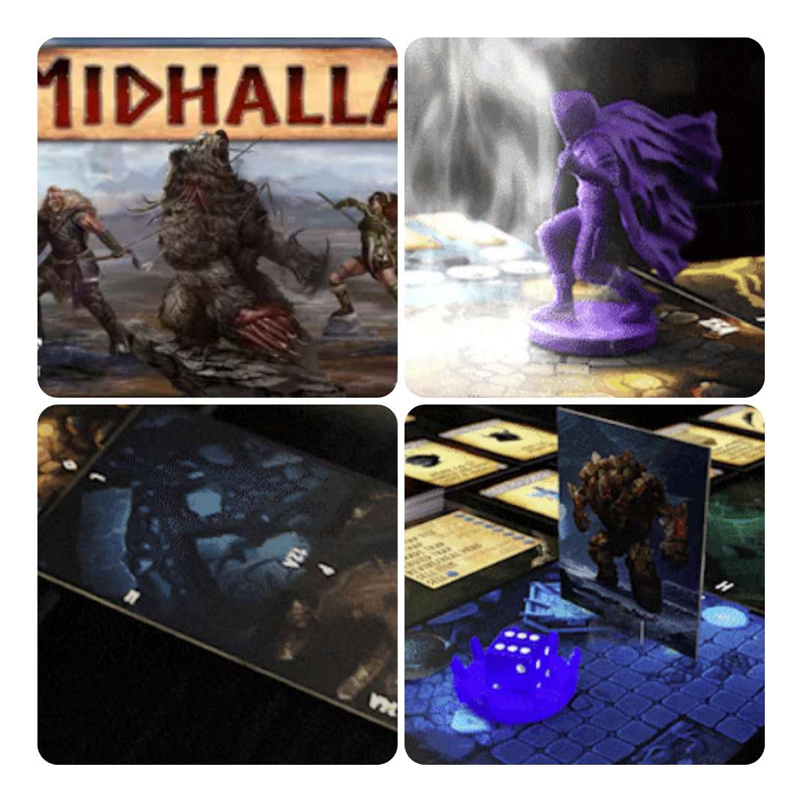
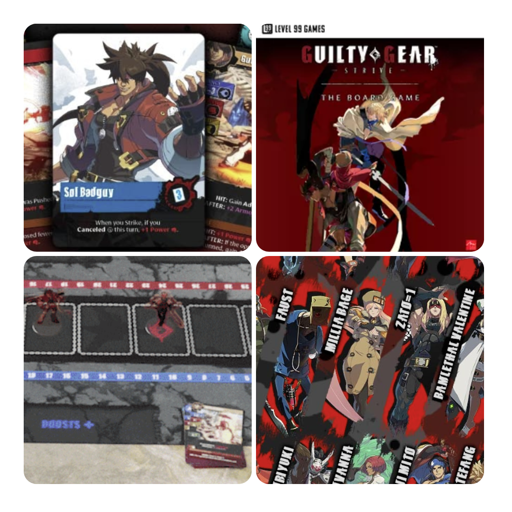
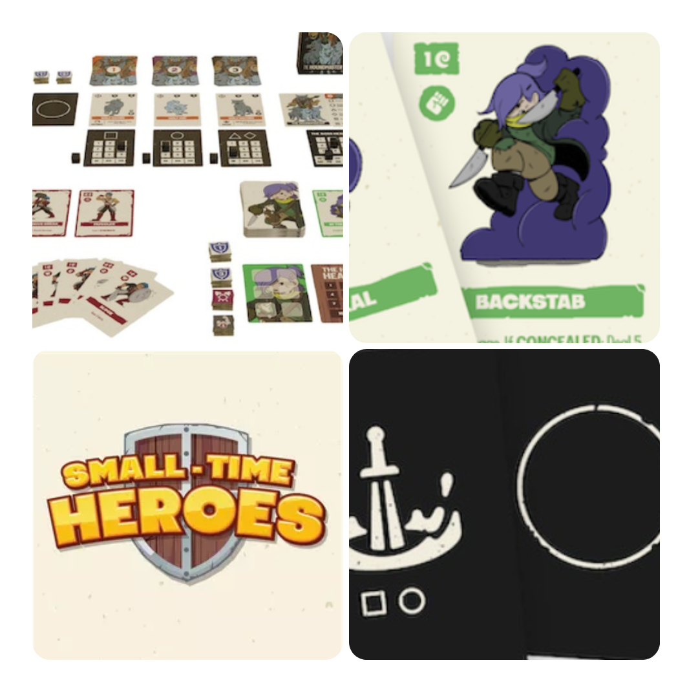
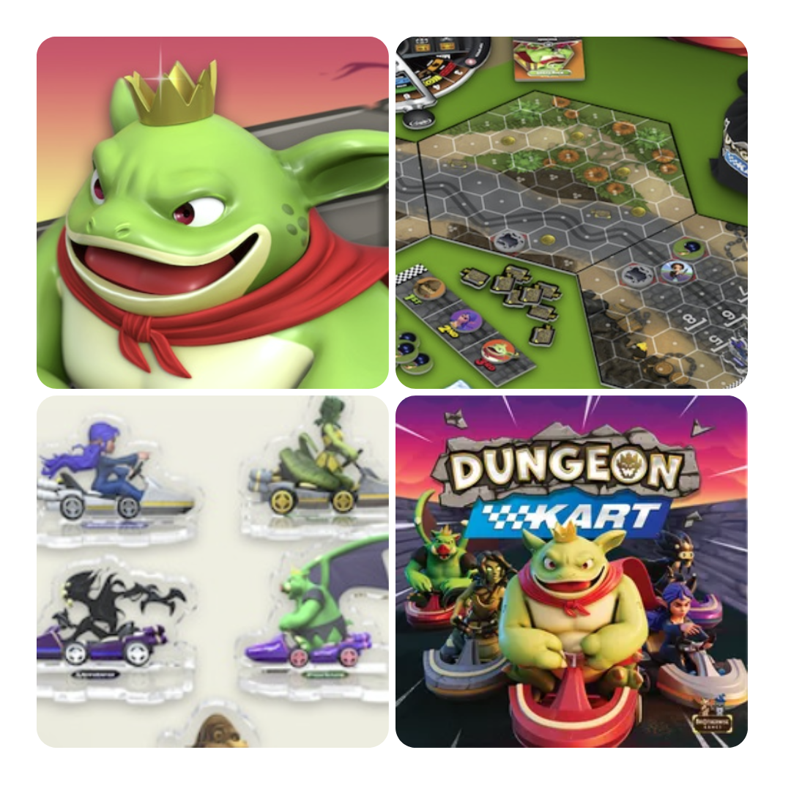

<FundingIntro>
  We're back! DudeFunding è rimasto fermo per un po' ma non il mondo dei Kickstarter, che ha continuato imperterrito a
  sfornare giochi su giochi! Troppi? Di poca qualità? Chi lo sa. Noi di Dudexpress facciamo in modo di fornirvi solo un
  distillato dei migliori!
</FundingIntro>

<FundingBit
  title="Midhalla"
  player_count={3}
  player_count_official="1-4"
  weight={3}
  playing_time="100min"
  playing_time_official="90-180min"
  hype={9}
  deadline="13/09/2023"
  delivery="12/2024"
  price="87€"
  otherPrice="25€"
  designer={["Eike J. Meyer", "Michael Meyer"]}
  publisher={["Fyrnwest Games"]}
  mechanism={["Cooperativo", "Mappa modulare", "Punti azione"]}
>
  Midhalla, e si va a menare finalmente come un vichingo!  
  Lo ammetto, ho letto vichingo e il mio cervello è andato in brodo di giuggiole. Però quando la mia mente è rinsavita mi
  sono accorto ugualmente che Midhalla è un gioco che può dare molte soddisfazioni. I giocatori, dovranno addentrarsi in
  pericolosi dungeon, utilizzando dei personaggi che nel corso della campagna diventeranno sempre più forti e preparati ad
  affrontare i pericoli, in un sistema di combattimento che vede il suo punto di forza nel suo essere deterministico. La
  dea bendata non vi aiuterà in questo caso e di fatto renderà il gioco un curioso puzzle. La variabilità risiederà nella
  generazione dei nemici e dagli eventi.  
  Un gioco che incuriosisce: capisco il confronto che viene fatto con il famoso Gloomhaven, ma a parer mio sembra
  raccogliere di più l'eredità dell'aspetto puzzle di Mage Knight, il che non può che far piacere! Un Kickstarter da
  tenere sicuramente in attenta considerazione!
</FundingBit>

<FundingBit
  title="Guilty Gear: Strive"
  player_count={2}
  player_count_official="2-2"
  weight={2}
  playing_time="20min"
  playing_time_official="15min"
  hype={7}
  deadline="12/09/2023"
  delivery="07/2024"
  price="99 US$"
  otherPrice="15 US$ + VAT"
  designer={["D. Brad Talton, Jr."]}
  publisher={["Level 99 Games"]}
  mechanism={["Gestione mano", "Combattimento risolto con carte"]}
>
  Vi abbiamo già parlato di <Link to="/reviews/exceed-street-fighter-ryu-box/">Exceed</Link> no? Beh, ora la Level 99,
  ci permette di seguire le avventure di un'altra saga di picchiaduro, ovvero: Guilty Gear!   Vi chiederete perché
  questo kickstarter è interessante, no? Perché vi dà la possibilità di ottenere <strong>LA COLLECTOR EDITION</strong>{" "}
  che curiosamente offre tutto il materiale uscito per la saga Exceed, tranne proprio la scatola di Ryu! Cogliere
  l'occasione?
</FundingBit>

<FundingBit
  title="Small-Time Heroes"
  player_count={1}
  player_count_official="1-3"
  weight={2}
  playing_time="30min"
  playing_time_official="30-90min"
  hype={10}
  deadline="12/09/2023"
  delivery="09/2023"
  price="3 US$"
  otherPrice="n/a"
  designer={["Drew Corkill"]}
  publisher={["Drew Corkill"]}
  mechanism={["Deck building"]}
>
  Small Time Heroes è il classico gioco che sembra piccolo e super curato. Riceve ispirazione dal genere roguelike in
  modo da avere una generazione casuale delle abilità dell'eroe in un mazzo di carte, ma con un interessante twist: non
  esistono carte moneta, bensì ogni carta ha un'utilità!!! Addio <Link to="/reviews/aeon-s-end"> Gemme </Link>! Ogni
  round sarà composto da una mano di 5 carte con 3 energie spendibili con cui bisognerà rispondere all'intento nemico
  fino ad eliminarlo e… ehi, ovviamente guadagnare punti esperienza con cui ottenere ricompense!  
  Un giochino che sembra davvero speciale e che, per un prezzo irrisorio, sembra promettere moltissimo divertimento!
</FundingBit>

<FundingBit
  title="Dungeon Kart"
  player_count={4}
  player_count_official="2-6"
  weight={2}
  playing_time="45min"
  playing_time_official="30-60min"
  hype={8}
  deadline="08/09/2023"
  delivery="08/2024"
  price="50 US$"
  otherPrice="12 US$ + VAT"
  designer={["Michael Xuereb"]}
  publisher={["Brotherwise Games"]}
  mechanism={[
    "Movimento su griglia",
    "Gara",
  ]}
>
Affronta la corsa verso la vittoria con Dungeon Kart, un nuovissimo gioco ambientato nel mondo di Boss Monster che regala ai giocatori l'esperienza di una gara di kart cattivissima. Vi ritroverete nei panni di uno dei cattivissimi Boss con il proprio set di poteri unici e  utilizzando anche unici Incantesimi per seminare caos e distruzione fino ad arrivare al traguardo, possibilmente interi e possibilmente per primi! 
Dungeon kart è un gioco di corse che, per capirci, sulla carta sembra bello come <Link to="/reviews/heat-pedal-to-the-metal/"> Heat </Link>. Inoltre, la presenza di tessere esagonali sulla mappa dovrebbe permettere manovre diversive davvero interessanti e, come ci suggerisce il video nella pagina Kickstarter, c'è la bellissima possibilità di <strong>scontrarsi </strong> !!!!

</FundingBit>

