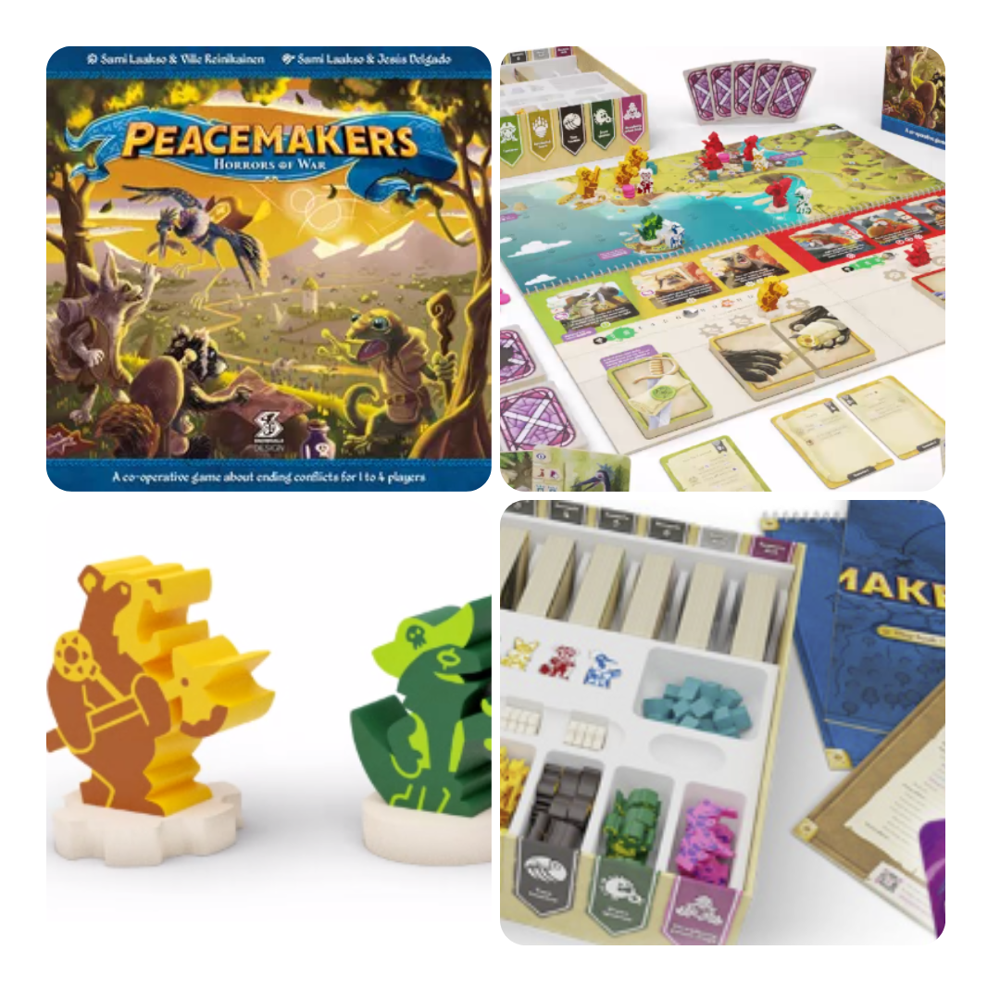
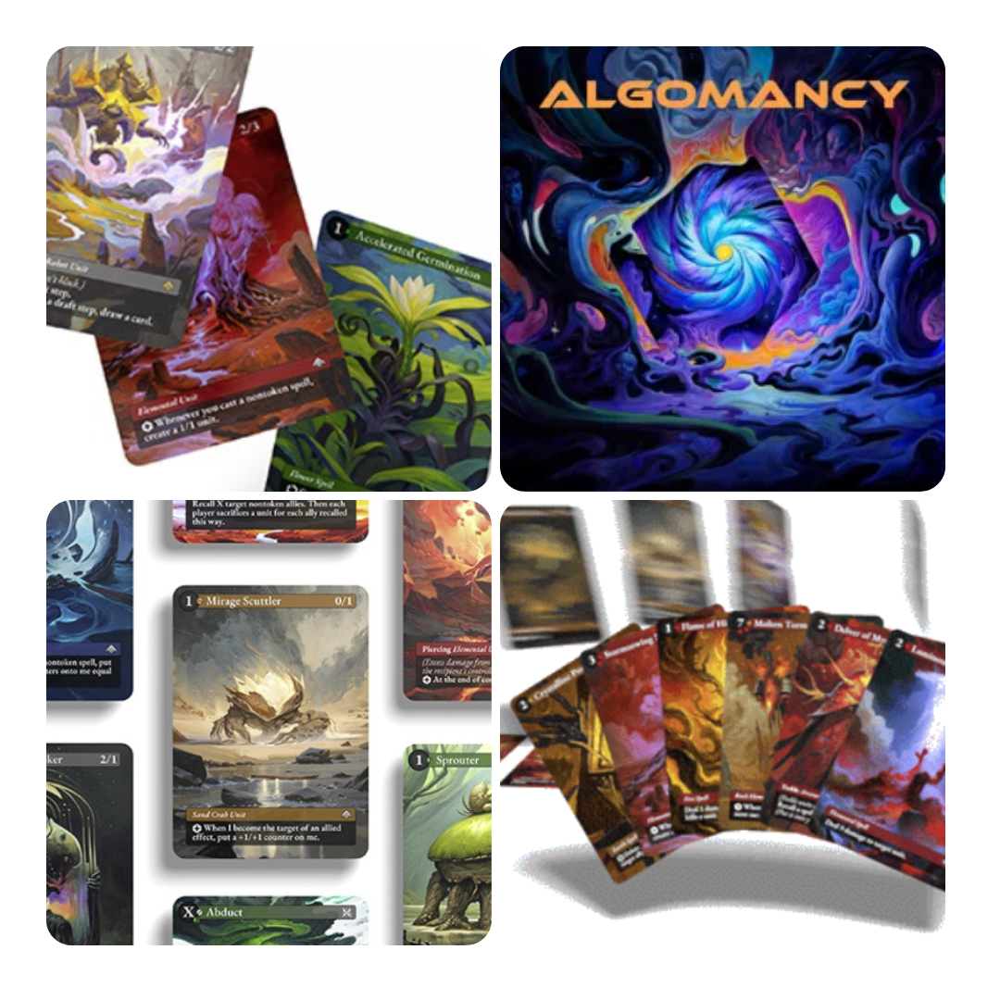
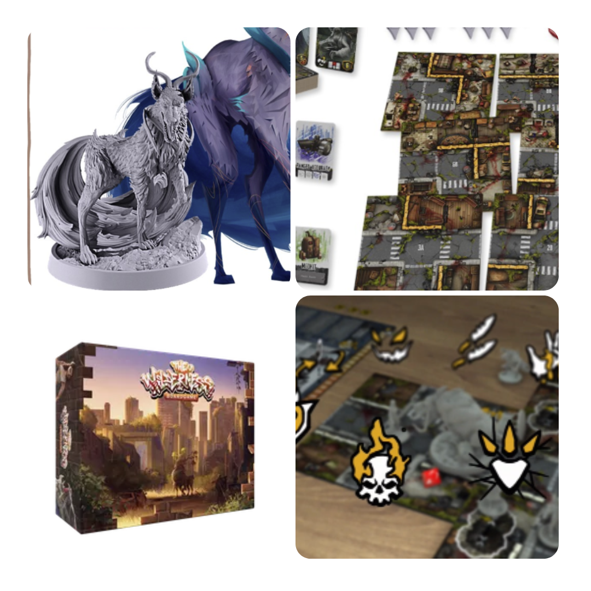
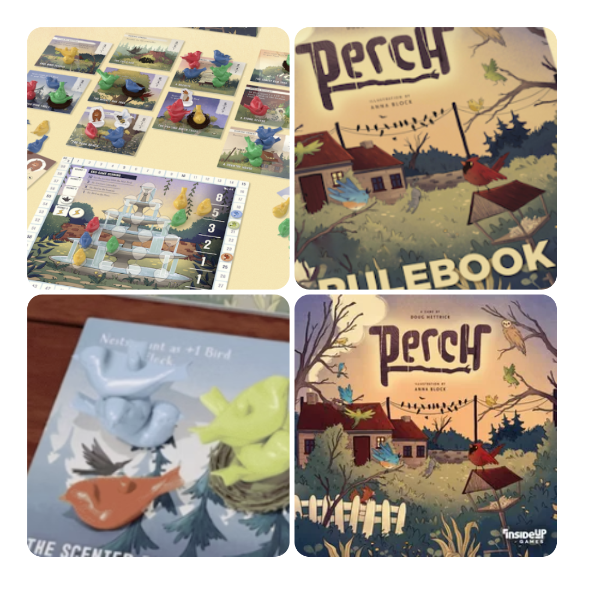

<FundingIntro>
  È innegabile che più tempo passa e più fare un gioco davvero innovativo è difficile. Eppure per ogni ambientazione,
  per ogni meccanica, c’è sempre una piccola variazione da fare, qualcosa di piccolo da aggiungere per rendere sempre
  più emozionante un nuovo gioco… Chissà dove andremo a finire a furia di fare piccole modifiche!!
</FundingIntro>

<FundingBit
  title="Peacemakers: Horrors of War"
  player_count={3}
  player_count_official="1-4"
  weight={2}
  playing_time="90min"
  playing_time_official="60-120min"
  hype={7}
  deadline="21/09/2023"
  delivery="07/2024"
  price="54,95€"
  otherPrice="20€"
  designer={["Sami Laakso", "Ville Reinikainen"]}
  publisher={["Snowdale Design"]}
  mechanism={["Cooperativo", "Gestione mano", "Movimento su griglia"]}
>
  In Peacemakers bisogna, beh… ovviamente portare la pace nel mondo. Da 1 a 4 giocatori dovranno appunto assicurarsi
  cooperative che negli scenari offerti nella scatola base si risolvano senza eccessivi spargimenti di sangue, il tutto
  con tempi di setup e desetup <strong>velocissimi!</strong>  
  In termini di gioco avremo un mazzo di carte con cui si potranno manipolare le fazioni in campo durante una fase, mentre
  un altro mazzo di carte farà continuare il conflitto e, beh ovviamente ogni scenario vedrà le armate muoversi in maniera
  diversa!  
  Questo è uno di quei coop che permettono di avere una visione alternativa rispetto ad un classico tema. Di solito
  avremmo dovuto governare una delle due armate verso la vittoria e invece questa volta… <strong>NO</strong>!
  Bellissimo!
</FundingBit>

<FundingBit
  title="Algomancy"
  player_count={2}
  player_count_official="2-10"
  weight={2}
  playing_time="30min"
  playing_time_official="30-180min"
  hype={8}
  deadline="07/09/2023"
  delivery="07/2024"
  price="69 US$"
  otherPrice="20 US$ + VAT"
  designer={["Caleb Gannon"]}
  publisher={["Self published"]}
  mechanism={["Drafting", "Gestione mano"]}
>
  Algomancy, cioè una bellissima lettera d’amore verso Magic. Feeling molto simile, conoscenza delle carte basilare per
  migliorare e godersi a pieno il gioco.  
  Il mana si ottiene riciclando carte e permette di evocare le creature che si dovranno dare battaglia in una regione.  
  Un gioco che sicuramente ha tanto da dire, che si capisce da dove viene (in quanto ogni sua meccanica trasuda dal
  desiderio di migliorare, per quanto, possibile, l’originale), ma che in questa sua decisione vede anche il suo grande
  limite: non vi piace Magic? Perché prendere Algomancy? Non sarà di certo lui a farvi cambiare idea!
</FundingBit>

<FundingBit
  title="The Wilderness"
  player_count={3}
  player_count_official="1-6"
  weight={3}
  playing_time="60min"
  playing_time_official="45-150min"
  hype={7}
  deadline="15/09/2023"
  delivery="04/2024"
  price="110 US$"
  otherPrice="23 US$ + VAT"
  designer={["Rafael Arnaud"]}
  publisher={["Boardgame Adventures"]}
  mechanism={["Cooperativo", "Dadi", "Punti azione"]}
>
  In un mondo in cui la natura si è evoluta in maniera tale da essere in grado di riprendersi ciò che era suo
  dall’umanità, i pochi sopravvissuti cercano di adattarsi come possono.  
  Scegliete il vostro team e guidatelo attraverso le zone desolate, stando attenti a recuperare quanti più materiali con
  cui poter migliorare le possibilità di sopravvivenza, ma attenzione alle bestie… Sono sempre più pericolose…  
  Lo spin “natura che riconquista il mondo” è decisamente affascinante e lo stesso dicasi per l’impiego di modificatori
  alle abilità delle bestie, peraltro diverse ad ogni partita, che fanno sì che si comportino in maniera differente
  costringendo i giocatori a dover adattarsi alla situazione!
</FundingBit>

<FundingBit
  title="Perch"
  player_count={3}
  player_count_official="2-5"
  weight={2}
  playing_time="45min"
  playing_time_official="30-60min"
  hype={8}
  deadline="06/09/2023"
  delivery="07/2024"
  price="49 CA$"
  otherPrice="13 US$ + VAT"
  designer={["Douglas Hettrick"]}
  publisher={["Inside Up Games"]}
  mechanism={["Maggioranze area", "Mappa modulare", "Re della collina"]}
>
  Al di là delle battute, è sempre interessante vedere come <Link to="/reviews/wingspan">Wingspan</Link> abbia sdoganato
  il tema degli uccelli e della natura per il mondo dei game designer. In questa iterazione del magnifico mondo del
  Bird-design (segnatevelo) abbiamo un gioco che si basa sul fenomeno migratorio e sulla conquista territoriale del
  proprio stormo. Un controllo territori, insomma, diciamocelo!  
  Perch è un gioco che affascina decisamente per la sua grafica, ma il gioco in sé sarà all’altezza? Un miscuglio tra controllo
  area e re della collina, con un pizzico di bag building. Come fa ad essere brutto?
</FundingBit>

