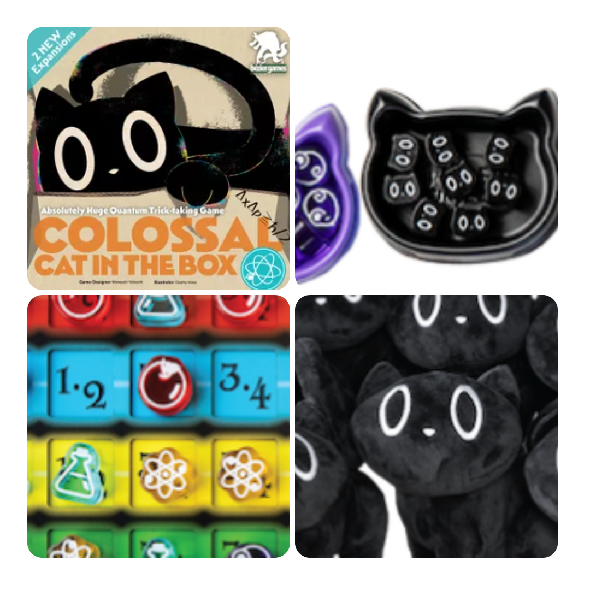
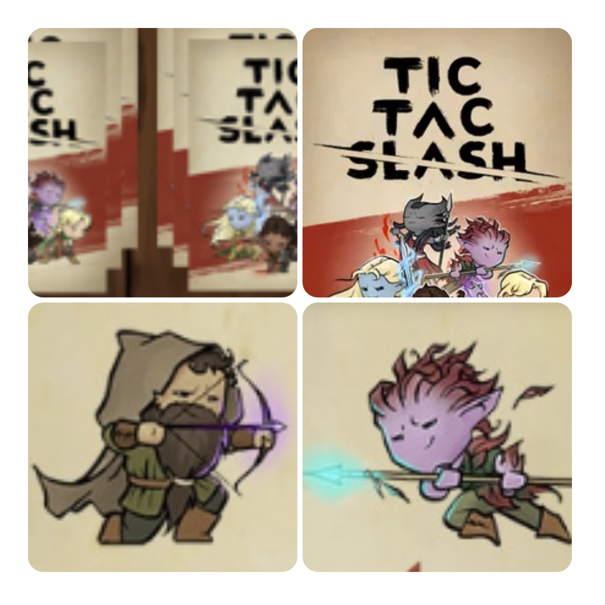
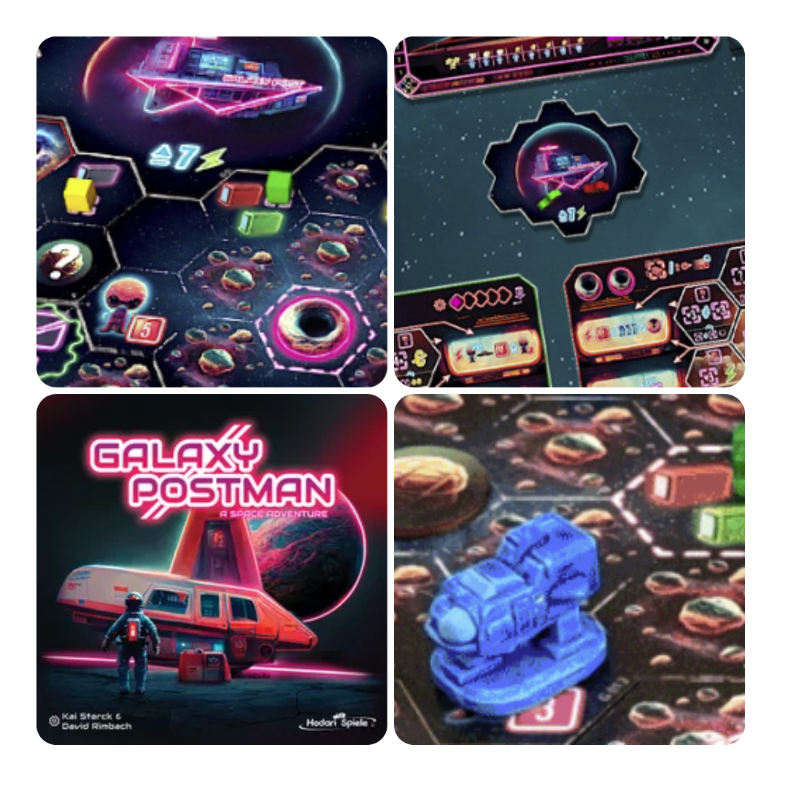
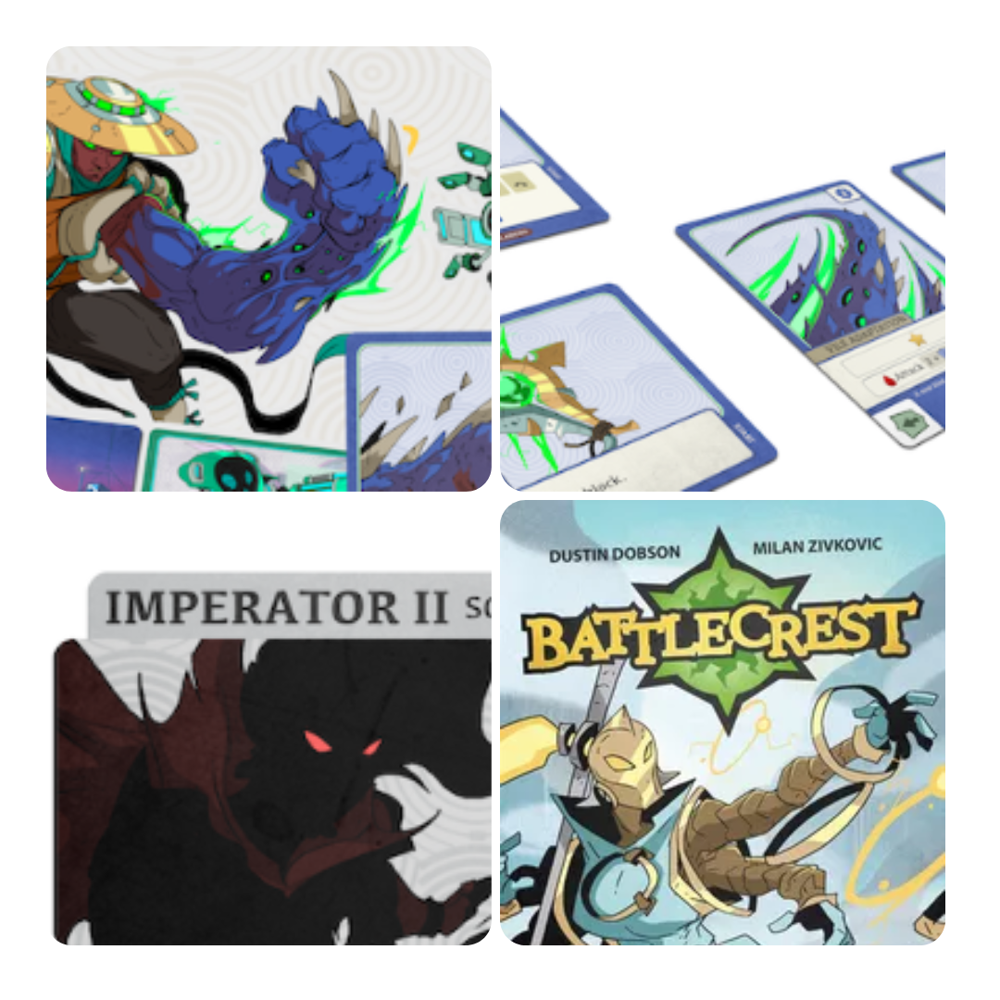

<FundingIntro>
  In un mondo ideale, Kickstarter non dovrebbe essere uno strumento per proporre edizioni rivedute e corrette dei propri
  giochi… E infatti ogni tanto si vedono giochi che “crollano” perché l’obiettivo non viene raggiunto in maniera
  corretta, ma è meramente uno specchietto per marketing! Però è sempre bello vedere dei giochi che cercano di dire la
  loro in questo mondo folle e pieno di COLOSSALI gatti!
</FundingIntro>

<FundingBit
  title="Colossal Cat in the Box"
  player_count={4}
  player_count_official="2-5"
  weight={1}
  playing_time="30min"
  playing_time_official="20-40min"
  hype={10}
  deadline="27/09/2023"
  delivery="07/2024"
  price="59 US$"
  otherPrice="25 US$ + VAT"
  designer={["Ted Alspach", "Muneyuki Yokouchi "]}
  publisher={["Bézier Games"]}
  mechanism={["Trick-taking", "Asta"]}
>
  Avete già letto la recensione di <Link to="/reviews/cat-in-the-box/">Cat in the box</Link> giusto? Questo Kickstarter
  vi permetterà di ottenere ben due espansioni: 'String Theory' e 'Doppler Effect'. La prima permetterà ai giocatori di
  concentrarsi sulle connessioni, viaggiando sulla sottile linea del rischio del paradosso. La seconda espansione,
  invece, aggiunge più controllo al gioco, riducendo il rischio di paradossi e dando ai giocatori più possibilità di
  decidere il “proprio” destino quantistico!  
  Ah beh, OVVIAMENTE SI POTRÀ OTTENERE LA VERSIONE COLOSSALE DEL GIOCO, IN CUI TUTTO È GIGANTE, PERSINO IL <strong>DIVERTIMENTO</strong>
</FundingBit>

<FundingBit
  title="Tic-Tac-Slash!"
  player_count={2}
  player_count_official="2-2"
  weight={2}
  playing_time="20min"
  playing_time_official="15-30min"
  hype={7}
  deadline="13/09/2023"
  delivery="10/2023"
  price="15 US$"
  otherPrice="0 US$"
  designer={["Brandon Simmons II"]}
  publisher={["The Wilderforge"]}
  mechanism={["Gestione Mano", "Costruzione pattern"]}
>
  Ebbene sì: qualcuno è riuscito a rendere <strong>interessante </strong> Tic Tac Toe (tris). Con una edizione “wallet”
  che strizza l’occhio ai giochi <Link to="/publishers/button-shy-games"> Button Shy</Link>! In questa sua nuova
  incarnazione fantasy o ninja è diventato un gioco di carte in cui ora, sebbene lo scopo sia quello di fare il solito
  tris di X o di O, bisognerà anche stare attenti ad incastrare i vari simboli sulle carte, che ovviamente ci possono
  regalare molteplici varianti su come giocare le carte e addirittura bloccare le giocate dell’avversario! Come si fa a
  non resistere al fascino del Tic Tac Toe?!
</FundingBit>

<FundingBit
  title="Galaxy Postman"
  player_count={3}
  player_count_official="1-4"
  weight={3}
  playing_time="60min"
  playing_time_official="45-60min"
  hype={8}
  deadline="11/09/2023"
  delivery="06/2024"
  price="50€"
  otherPrice="18€ + VAT"
  designer={["David Rimbach", "Kai Starck"]}
  publisher={["Hodari Spiele"]}
  mechanism={["Uso di dadi", "Movimento su griglia", "Mappa modulare"]}
>
  Cosa c’è di peggio che un pacco che non arriva? Beh, un pacco che non arriva nello spazio! Infatti in Galaxy Postman i
  giocatori saranno dei postini spaziali. Figo no?  
  In termini di gioco? Scordatevi i combattimenti, ovviamente! Siete dei corrieri, mica dei pirati! Dovrete invece assicurarvi
  che la vostra navicella sopravviva potenziandosi nel corso della partita, così da potervi permettere di trasportare i vostri
  amichetti (clienti) alieni. Ora il gioco non sembra niente male. Forse non eccessivamente innovativo, ma il classico buon
  amalgama di meccaniche che sembra promettere ore di divertimento!
</FundingBit>

<FundingBit
  title="Battlecrest: Year Two"
  player_count={2}
  player_count_official="1-4"
  weight={2}
  playing_time="15min"
  playing_time_official="20-20min"
  hype={9}
  deadline="16/09/2023"
  delivery="02/2024"
  price="12 US$"
  otherPrice="16U$ + VAT"
  designer={["Dustin Dobson", "Milan Zivkovic"]}
  publisher={["Button Shy"]}
  mechanism={["Gestione mano", "Movimento su griglia"]}
>
  Ahhh… Button Shy, Button Shy… Ormai vedo ogni loro Kickstarter e penso: “Peccato che per un gioco da 12€ devo pagare
  20€ di spedizioni. Aspetterò il mio acquisto annuale per ampliare la mia collezione”. Eppure ogni volta ne sono
  attratto. Voi pensate che non abbia l’anno uno di Battlecrest vero? Eppure arriverà a breve, forse no una recensione
  di questo gioco! Perchè è una figata e assieme al buon{" "}
  <Link to="/reviews/exceed-street-fighter-ryu-box/"> Exceed </Link> li considero dei validissimi titoli per tutti gli
  amanti dei picchiaduro. Questo è ovviamente più fantascientifico e più semplicistico, ma in cui ogni scelta è
  ugualmente sofferta e sentita!
</FundingBit>

