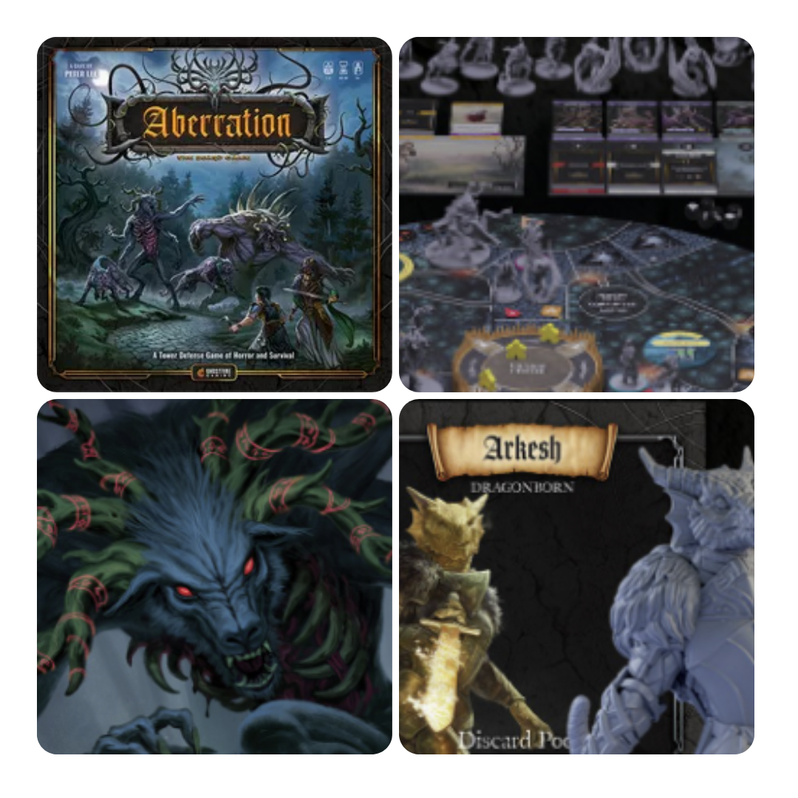
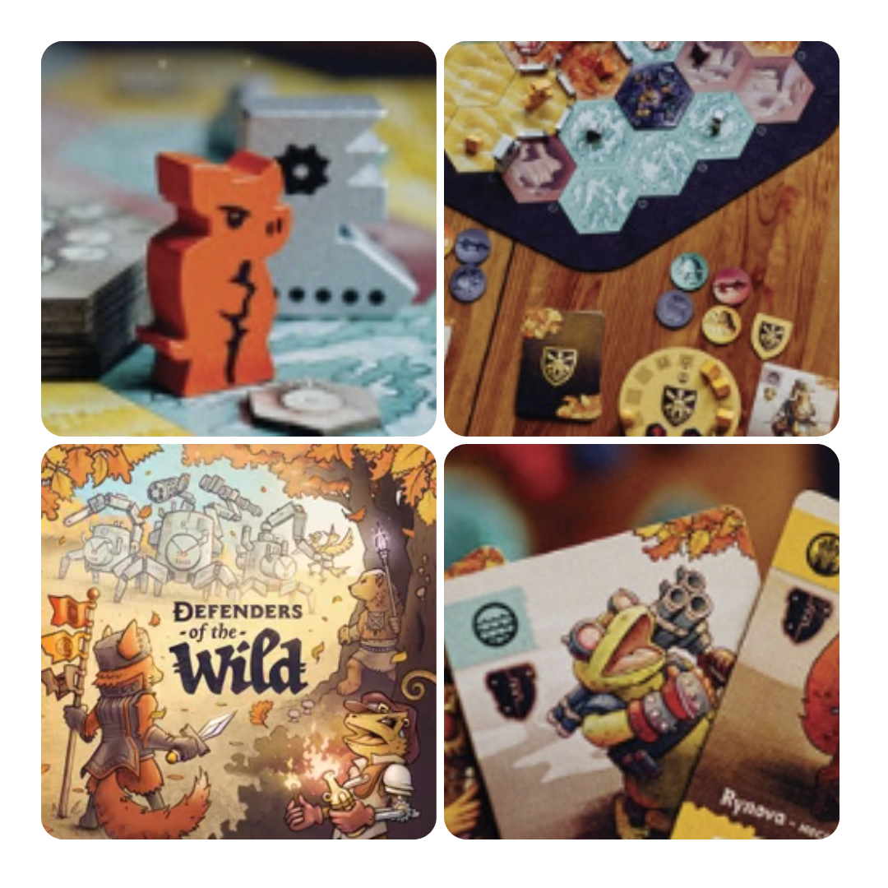
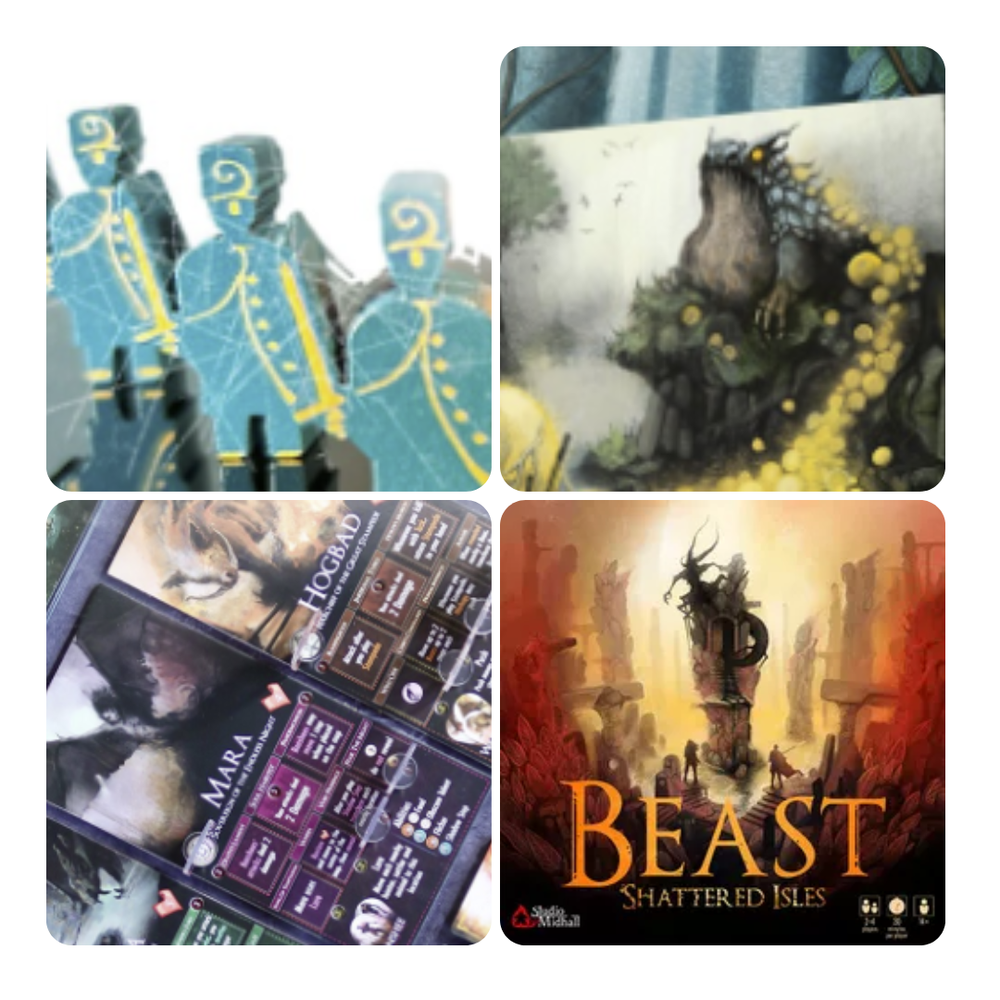

<FundingIntro>
  Tra le mille mila uscite che escono ogni anno è sempre più difficile trovare delle perle che vale la pena comprare. O
  sono successi incredibili o sono cafonate devastanti. Il mondo del crowdfunding ha fatto sì che potessero esistere un
  sacco di cafonate… Però ha anche aumentato il numero di perle che si possono trovare in giro!!!
</FundingIntro>

<FundingBit
  title="Aberration"
  player_count={3}
  player_count_official="1-4"
  weight={3}
  playing_time="90min"
  playing_time_official="60-90min"
  hype={7}
  deadline="21/10/2023"
  delivery="12/2024"
  price="79 US$"
  otherPrice="25 US$ + VAT"
  designer={["Peter Lee"]}
  publisher={["Ghostfire Gaming"]}
  mechanism={["Cooperativo"]}
>
  Le bestie stanno attaccando il villaggio e solamente voi, i suoi eroi, potete difenderlo in questo gioco da 1 a 4
  giocatori che vuole mischiare elementi di bag building, e{" "}
  <Link to="/mechanisms/piazzamento-lavoratori">piazzamento lavoratori</Link>.   Per un gioco che fa del suo punto
  di forza la sua variabilità, come fa a non essere questo il suo punto forte grazie alle sue 80 combinazioni di eroi e
  classi? E 70 combinazioni di mappa. Il tutto gestito da carte, dadi e nebbia di guerra!  
  Che dire se non che questo Aberration è un gioco che sembra promettere ore e ore di vario divertimento?!
</FundingBit>

<FundingBit
  title="Final Girl"
  player_count={1}
  player_count_official="1"
  weight={2}
  playing_time="30min"
  playing_time_official="20-60min"
  hype={9}
  deadline="14/10/2023"
  delivery="10/2024"
  price="20 US$"
  otherPrice="variabile € + VAT"
  designer={["Evan Derrick", "A. J. Porfirio"]}
  publisher={["Van Ryder Games"]}
  mechanism={["Solitario", "Gestione mano", "Deck building", "Uso di dadi", "Poteri variabili"]}
>
  Final Girl, è proprio uno di questi <Link to="/mechanisms/solitario">Solitari</Link> moderni, veloci, molto variabili
  e pieni di divertimento/terrore. In questa sua terza iterazione abbiamo nuove ragazze pronte a lottare con i denti per
  la salvezza e nuovi crudelissimi cattivi. E voi vi chiederete perché non ne parliamo di più in questo frangente… Beh
  ovvio: perchè è in arrivo una recensione… Intanto fidatevi: è un gioco con i fiocchi!
</FundingBit>

<FundingBit
  title="Defenders of the Wild"
  player_count={2}
  player_count_official="1-4"
  weight={2}
  playing_time="60min"
  playing_time_official="45-90min"
  hype={8}
  deadline="14/10/2023"
  delivery="08/2024"
  price="44 US$"
  otherPrice="18 US$ + VAT"
  designer={["Henry Audubon", "T.L. Simons"]}
  publisher={["Outlandish Games"]}
  mechanism={["Cooperativo"]}
>
  Animaletti pucciosi come <Link to="/reviews/root">Root</Link>? Apriti portafoglio!  
  In questo gioco che sa di un misto tra il sopra citato Root e, quasi quasi, un po’ di <Link to="/reviews/spirit-island">
    Spirit Island
  </Link>, abbiamo delle creature carucce con un solo scopo : salvare il proprio mondo dalle macchine in espansione! Punti
  azione, push your luck, controllo territorio: un amalgama di meccaniche che si sono dimostrate sicuramente vincenti nel
  mondo dei giochi da tavolo. Basteranno per creare quell’esperienza di gioco fantastica che questo titolo promette?
</FundingBit>

<FundingBit
  title="Beast: Shattered Isles"
  player_count={3}
  player_count_official="2-4"
  weight={4}
  playing_time="90min"
  playing_time_official="60-120min"
  hype={7}
  deadline="16/10/2023"
  delivery="10/2024"
  price="45 US$"
  otherPrice="13€ + VAT"
  designer={["Elon Midhall", "Aron Midhall", "Assar Pettersson"]}
  publisher={["Studio Midhall"]}
  mechanism={["Gestione mano", "Movimento nascosto", "Drafting"]}
>
  <Link to="/reviews/beast">Beast</Link> è tornato e questa volta ci porterà in un nuovo luogo che, ovviamente, non ha
  Creature cattive da cacciare… Ah no, ci sono. Quindi in questa espansione troverete sicuramente sia nuove Bestie che
  cacciatori, nuove carte e nuove meccaniche per adattare ognuna delle due fazioni al nuovo habit.  
  <strong>Interessante e decisamente apprezzato</strong> è il fatto che alcune modifiche sono votate al rendere l’esperienza
  in 4 giocatori più divertente. Sì, siamo in un mondo in cui i giochi sono in costante testing e “forse" non dovrebbe essere
  così, ma ehi è sempre segno di cura quando dei designer vogliono migliorare la propria creatura!
</FundingBit>

