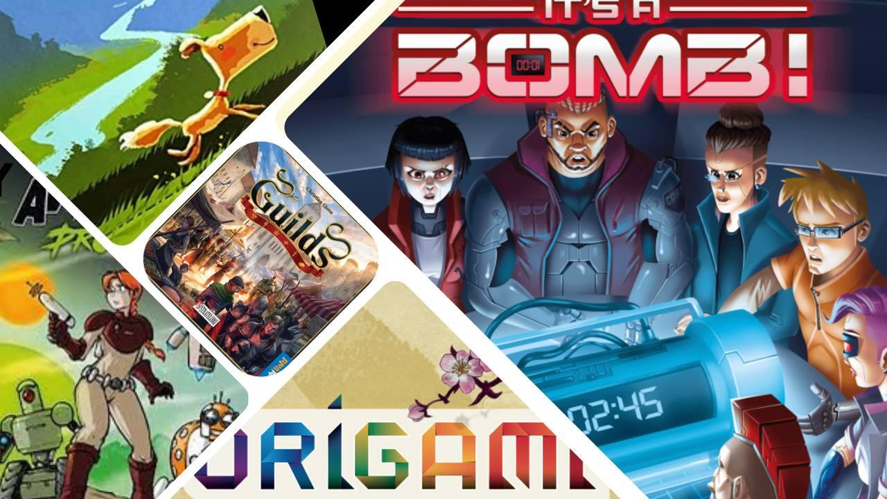

<InterviewIntro>
  <strong>It’a Bomb</strong>, di recente approdato sugli scaffali, è solo uno dei tanti giochi firmati{" "}
  <strong>Christian Giove</strong> che ha trovato un vastissimo riscontro tra il pubblico e oggi, in quest’intervista
  che Christian ci ha gentilmente concesso, indagheremo su che cosa si cela dietro a titoli come questo.
   
  Insieme abbiamo chiacchierato dei tanti aspetti della vita di un autore di giochi, game designer nonché lead developer
  di un’importante azienda italiana, e abbiamo svelato per voi qualche piccolo segreto.
   
  Buona lettura.
</InterviewIntro>

<InterviewItem type="question">
  Qual è stato il momento esatto della tua vita in cui hai capito che non volevi fare l’astronauta ma l’autore di giochi
  da tavolo?
</InterviewItem>

<InterviewItem type="answer" name="CG">
  I giochi (nel senso più ampio possibile: giochi da tavolo, librigioco, videogiochi, giochi di ruolo, ecc.) sono sempre
  stati la mia passione, assieme a quasi ogni altro aspetto dello spettro creativo.{" "}
  <strong>Da allora non ho mai realmente smesso di giocare. </strong>
  Come per molti, all’inizio della mia carriera come autore il game design era un’attività secondaria, che affiancavo al
  mio vecchio lavoro (grafica, web design e comunicazione web), ma l’ho fatto sin dal principio con l’idea di farne il mio
  lavoro principale… per quanto quasi tutti mi dicessero che era quasi impossibile vivere solo di game design. Alla fine
  pare avessi ragione io. XD
</InterviewItem>

<InterviewItem type="question">
  E meno male! ^_^ Hai seguito quindi un <strong>percorso formativo specifico</strong> che ti ha portato ad essere
  quello che sei ora?
</InterviewItem>

<InterviewItem type="answer" name="CG">
  Oggi esistono numerosi percorsi formativi specialistici (qui a Torino abbiamo ad esempio i corsi di game design tenuti
  dalla Scuola Holden e dalla Scuola Internazionale di Comics) che sono un forte acceleratore per un aspirante
  game-designer. Quando io ho iniziato ad approcciarmi a questa professione (7 anni fa) ancora non ce n’erano, quindi
  nel mio caso sono stato completamente autodidatta.
</InterviewItem>

<InterviewItem type="question">
  Da cosa dipende, secondo te, il fatto che esistono <strong>pochi</strong> (e spesso costosi){" "}
  <strong>percorsi di studi dedicati alla tua professione</strong>? Immagino che questo sia un fattore che potrebbe far
  desistere aspiranti game designer dal seguire questo percorso.
</InterviewItem>

<InterviewItem type="answer" name="CG">
  Penso sia normale. È un settore piccolo ed è quindi un mestiere che in Italia è svolto con successo da poche decine di
  persone, molte delle quali lo fanno come attività complementare a un altro lavoro. E se guardiamo poi ai game designer
  che come me vivono solo dei proventi dal settore ludico (tra royalties per i propri giochi e consulenze per gli
  editori), forse non superiamo la dozzina di persone. Per altri mestieri esistono centinaia di corsi dedicati, ma anche
  decine di migliaia di posti di lavoro. Tutto è proporzionale.
</InterviewItem>

<InterviewItem type="question">
  Forse, dopo la pandemia, che ci ha costretto in casa e ci ha spinto a cercare nuove forme di intrattenimento, i giochi
  da tavolo e affini sono tornati ufficialmente alla ribalta dopo anni di quiescenza. Anche se il mondo ludico sembra
  entrato nella sua età d’oro, come riportato anche sul{" "}
  <a href="https://www.washingtonpost.com/business/2022/12/24/board-game-popularity/" target="_blank">
    Washington Post
  </a>
  , con sempre più giochi pubblicati e un numero di giocatori costantemente in crescita, resta il fatto che a questa categoria
  non viene riservata quell’attenzione pubblica di cui altri settori dell’intrattenimento godono. Cosa ne pensi?
</InterviewItem>

<InterviewItem type="answer" name="CG">
  Certamente un gioco da tavolo per le sue caratteristiche intrinseche è più difficile da spettacolarizzare e
  trasmettere a chi non lo sta giocando. Basti pensare a quanto può essere più cinematografico il trailer di un
  videogioco, usando solo effettivi momenti di gameplay.{" "}
</InterviewItem>

<InterviewItem type="answer" name="CG">

Va anche tenuto conto che l’Italia è un settore particolare del mercato ludico:
sebbene siamo cresciuti moltissimo, siamo ancora <strong>
enormemente indietro</strong>
rispetto
alla media europea a livello di diffusione del gioco e di giocatori; nel corso
degli ultimi 10 anni siamo stati superati di molte lunghezze anche da Paesi che
partivano da più indietro di noi. Ma non saprei dirti le ragioni di questo apparente <strong>“freno a mano tirato”</strong> del settore italiano. Alcuni davano la colpa al clima mite (inverni più brevi e tanto
sole che spingevano meno le famiglie e gli amici a chiudersi in casa a giocare) ma
siamo stati superati anche da Paesi come la Spagna, climaticamente affini a noi.

</InterviewItem>

<InterviewItem type="question">
  Quando penso ad un autore, alla sua storia, al perché è diventato quello che è, cerco sempre di immaginare da{" "}
  <strong>dove è iniziato tutto</strong>, qual è stata la scintilla che ha dato origine a quell’{" "}
  <strong>evoluzione</strong> che lo ha portato fino alla meta, quindi ti chiedo:{" "}
  <strong>ricordi il primo gioco che hai creato?</strong>
</InterviewItem>

<InterviewItem type="answer" name="CG">
  Il mio <strong>primissimo regolamento</strong> risale alle <strong>elementari</strong>, quando intorno agli 8 anni{" "}
  <strong>creai un insieme di regole per giocare assieme agli amici con i lego medievali</strong> (che prevedeva punti
  vita, tiri per colpire, riduzione dei danni in base a scudi/armature, movimento a piedi o a cavallo, danno delle armi,
  abilità speciali dei personaggi unici e altre regole). Alle <strong>medie</strong> creai anche i miei{" "}
  <strong>primi giochi da tavolo</strong>, con tanto di{" "}
  <strong>scatolina fatta a mano e disegni delle carte fatti da me… </strong>
  un mio amico ancora ne possiede uno.
</InterviewItem>

<InterviewItem type="question">
  Quando si dice “ce l’hai nel sangue”! Se penso al processo di <strong>creazione di un gioco</strong> immagino la mente
  dell’autore come se fosse il <strong>Big Bang</strong>, con infinitesime particelle di millemila elementi diversi che
  si incontrano, si scontrano, si fondono per dare origine a un’ <strong>opera unica</strong>, quindi mi chiedo: da cosa
  sono rappresentate queste particelle nel cervello di Christian Giove?! Quali sono le <strong>fonti</strong> da cui
  normalmente trai <strong>ispirazione?</strong>{" "}
</InterviewItem>

<InterviewItem type="answer" name="CG">
  <strong>Hai presente “tutto”? </strong>
  Ecco. <strong>Letteralmente tutto. </strong>
  Io per carattere sono <strong>onnivoro e mai sazio</strong> di ogni forma di input (libri, serie tv, videogiochi,
  fumetti, anime, saggi, documentari, ecc.) e amo esperire più cose possibili: è davvero difficile che io ti dica “no”
  se mi proponi qualcosa… senza contare che sono quasi <strong>sempre in movimento</strong>, come i tonni o i border
  collie. Tutti questi input, nei momenti di quiete e di noia, vanno poi a ricomporsi in un{" "}
  <strong>caleidoscopio di forme generando idee o suggestioni. </strong>
  Poi naturalmente passare dall’idea al gioco/fumetto/progetto effettivo non è automatico e molte idee non ce la fanno, altre
  finiscono in stand-by (ho un moleskine in cui segno tutti gli spunti di meccaniche, ambientazioni, storie o concept che
  trovo interessanti ma su cui non ho tempo di lavorare), mentre <strong>solo una piccola parte</strong> arriva alla fine
  sugli scaffali.
</InterviewItem>

<InterviewItem type="question">
  <strong>Come si ferma il processo creativo?</strong> Come fai a dire “adesso basta, il gioco è fatto”?
</InterviewItem>

<InterviewItem type="answer" name="CG">
  Oh, <strong>questo non accade MAI.</strong>
   
  Si tratta sempre di una (piccola) forzatura, almeno per me. Se dovessi seguire il mio istinto andrei avanti a fare
  micro modifiche e piccole migliorie per anni: non esiste nessun gioco, nemmeno tra i più famosi, che non possa essere
  ulteriormente migliorato o limato. Una delle cose che si imparano da autore è capire quel punto in cui oggettivamente
  non vale più la pena continuare a lavorare al <strong>“fine-tuning” </strong>
  perché ormai <strong>lo si sta facendo per noi stessi e non più per il giocatore</strong> che lo prenderà in mano. Questo
  vale anche in ogni altro settore creativo come la scrittura, la composizione musicale o la pittura.
</InterviewItem>

<InterviewItem type="question">
  Esiste un gioco che avresti voluto ideare tu? Se sì, ovviamente vogliamo sapere quale!
</InterviewItem>

<InterviewItem type="answer" name="CG">
  Questa è una domanda molto difficile a cui rispondere… credo che mi sarebbe piaciuto creare un{" "}
  <strong>gioco iconico </strong>
  per il settore come Ticket to Ride o Pandemic, <strong>
    giochi che sono entrati nell’immaginario collettivo.
  </strong> Per ora non è stato così, ma c’è tempo.
</InterviewItem>

<InterviewItem type="question">
  Lo so che non si dovrebbe mai chiederlo a un padre, ma noi in fondo siamo qui per indagare nel profondo, quindi ci
  corre l’obbligo di chiedertelo: <strong>qual è il gioco di cui vai più fiero?</strong> E perché?
</InterviewItem>

<InterviewItem type="answer" name="CG">
  Si sa che <strong>il gioco preferito è sempre l’ultimo</strong> perché in qualche modo{" "}
  <strong>incarna l’attuale punto di arrivo di un percorso</strong> che, si spera, è fatto di continui mutamenti e
  miglioramenti. Il gioco di cui al momento vado più fiero è sicuramente <strong>Alpaca</strong>, che troverete nei
  negozi tra un paio di mesi (anche se la prevendita è già aperta). Si tratta di un <strong>deck-building</strong>{" "}
  leggero, che per la quantità di regole si adatta anche a giocatori alle prime armi, ma che per profondità farà felici
  gli amanti del genere e in generale tutti gli amanti dei giochi di combo, grazie alle{" "}
  <strong>tantissime strategie</strong> possibili e a un <strong>setup sempre diverso. </strong>Tra l’altro è già stato
  accolto con enorme interesse anche da diversi editori esteri.
</InterviewItem>

<InterviewItem type="question">
  E non è certo il tuo primo titolo ad aver raggiunto questo grado di successo. Se guardi indietro, quali sono stati i{" "}
  <strong>giochi più significativi</strong> per la tua carriera?
</InterviewItem>

<InterviewItem type="answer" name="CG">
  Ti citerei sicuramente <strong>Guilds</strong> (il primissimo gioco che ho creato, anche se non è stato il{" "}
  <strong>primo edito</strong>), <strong>Origami</strong> (un eccellente gioco di combo che è stato ad oggi il mio gioco{" "}
  <strong>più venduto all’estero</strong>), “<Link to="/reviews/giorno-da-cana/">Un giorno da Cana</Link>” (il mio
  inizio come <strong>sceneggiatore</strong> di fumetti e il mio ingresso nel settore della narrativa a bivi),{" "}
  <strong>It’s a Bomb</strong> (sicuramente una delle mie opere migliori per dinamiche al tavolo oltre che il mio{" "}
  <strong>primo cooperativo</strong>, per quanto molto fuori dai normali canoni) e infine la serie delle{" "}
  <Link to="/reviews/mini-escapes-il-mistero-del-culto-perduto/">Mini Escapes</Link> (con cui sono entrato da autore nel
  mondo delle <strong>escape room</strong>, che amo, e che considero un gioiello per rapporto costo/ore di gioco, oltre
  che un’idea produttiva che è stata una svolta importante per il periodo in cui è uscito).
</InterviewItem>

<InterviewItem type="question">
  Stiamo un momento su alcuni di quelli che hai appena nominato: “It’s a Bomb!”, per esempio, un gioco{" "}
  <strong>collaborativo asimmetrico a scenari</strong> nel quale bisogna tentare di disinnescare una bomba. Quali sono
  stati gli scenari più divertenti da creare e perché?
</InterviewItem>

<InterviewItem type="answer" name="CG">
  In realtà ho amato creare tutti gli <strong>scenari</strong>, anche perché a parte i primi due che sono “introduttivi”
  alle meccaniche base, ognuno degli altri scenari ha una sua regola speciale nuova e/o dei{" "}
  <strong>componenti speciali.</strong> Invece i miei preferiti a livello di gioco, tra gli scenari della scatola, sono
  quello con i <strong>detonatori secondari</strong>, quello con il segnale disturbato e la doppia bomba.
</InterviewItem>

<InterviewItem type="question">
  E “<Link to="/reviews/giorno-da-cana/">Un giorno da Cana</Link>”? È uno dei tuoi titoli approdati anche in Paesi
  stranieri, <strong>superando le frontiere europee</strong> e raggiungendo addirittura Cina e Corea: quale pensi sia
  stato l’ingrediente che ha permesso questo grande salto?
</InterviewItem>

<InterviewItem type="answer" name="CG">
  Sembra banale e un po’ pretenzioso, ma dipende banalmente dalla <strong>qualità</strong> del prodotto. Quando si
  tratta di convincere degli editori esteri a produrre quel gioco per il loro Paese, allora quello che conta è in gran
  parte il prodotto di per sé. Chiaramente questo discorso non è valido per le grandi holding (ad esempio Hasbro o
  Asmodee) che hanno già sedi in numerosi Paesi. Poi ovviamente ci sono anche altri fattori, ma avere un prodotto in
  grado di <strong>parlare ad un pubblico molto ampio e diversificato</strong> è fondamentale. Mi aiuta in questo anche
  il fatto di mettere normalmente al primo posto, in quello che creo, le dinamiche al tavolo e la{" "}
  <strong>componente emotiva.</strong>
</InterviewItem>

<InterviewItem type="question">
  Insomma, alle spalle hai un vero <strong>caleidoscopio di pubblicazioni</strong>: spazi da giochi da tavolo (anche
  molto diversi tra loro) ai fumetti-gioco. Approfitto quindi per chiederti di soddisfare una curiosità personale che mi
  pervade da sempre: ora che hai esplorato tanti campi diversi, quali sono le tue preferenze? Quanto diresti che
  corrispondono le tue preferenze da autore a quelle da giocatore? E, infine, esiste una tipologia di giochi che ti
  piace giocare, ma che non vorresti creare?
</InterviewItem>

<InterviewItem type="answer" name="CG">
  Assolutamente no. <strong>Punto a creare quello che mi viene in mente. </strong>Ad esempio, pochi anni fa mi venne
  voglia di creare un fumetto gioco (genere che funziona bene in Francia ma era completamente morto in Italia) e mi sono
  impegnato a capire come creare qualcosa che potesse funzionare e raggiungere un pubblico ampio che nemmeno sapeva
  esistesse questo prodotto. La <strong>sceneggiatura</strong> era un campo totalmente nuovo per me ma da questo mio
  desiderio è nato prima Un giorno da Cana, assieme al geniale Stefano Tartarotti che ho poi coinvolto in molti altri
  miei progetti, e poi Avventure nello Spazio Profondo, fatto insieme al bravissimo Bigio.
</InterviewItem>

<InterviewItem type="answer" name="CG">
  In generale a me piace il lavoro creativo, <strong>amo trasmettere emozioni</strong> alle persone: qualsiasi strumento
  per farlo mi va bene e mi diverte mettermi alla prova con cose nuove. È molto probabile che in futuro metta il piede
  anche in altri settori (ad alcune cose sto già lavorando, ma non posso parlarne).
</InterviewItem>

<InterviewItem type="answer" name="CG">
  Per quanto riguarda le mie preferenze, gioco e <strong>amo</strong> sostanzialmente{" "}
  <strong>ogni tipo di gioco</strong>, e questo si riflette anche sulla varietà di titoli che ho pubblicato. Per mia
  scelta, però, come autore (per ora) non mi sono mai spinto oltre il gestionale di peso medio-basso, categoria in cui
  ricade ad esempio Guilds. Questo perché, nonostante mi diverta a giocare anche gli eurogame più lunghi e complessi
  (credo di aver giocato almeno una volta la quasi totalità dei pesi massimi usciti), non sono la mia prima scelta nelle
  serate con gli amici e non tutti i miei gruppi di gioco li apprezzano: va sempre ricordato che creare un gioco
  comporta molte decine di partite allo stesso gioco, prima di arrivare alla versione finale.
</InterviewItem>

<InterviewItem type="question">
  Dato che hai citato l’illustratore <Link to="/designers/stefano-tartarotti">Stefano Tartarotti</Link> con cui ormai
  collabori da molto tempo, ci racconti come è nata questa collaborazione?
</InterviewItem>

<InterviewItem type="answer" name="CG">
  <strong>Feci amicizia con lui al salone del libro</strong> nel 2018 e rimanemmo in contatto. Circa 6 mesi dopo mi misi
  in testa di creare un fumetto-gioco e velocemente mi resi conto che, per quello che volevo fare, lo stile di Stefano
  sarebbe stato <strong>perfetto</strong>. A gennaio 2019 ero a pranzo a casa sua (feci tappa mentre andavo a Ideag
  Parma) e gli proposi un fumetto a bivi basato sulle avventure della sua <strong>cagnolona</strong>, sulla quale già
  pubblicava piccole storielle e strisce monocromatiche. L’idea gli piacque e nell’arco di 18 mesi, un po’ a distanza e
  un po’ passando qualche weekend assieme, è nato <strong>Un Giorno da cana.</strong>
</InterviewItem>

<InterviewItem type="answer" name="CG">
  Stefano è bravissimo, ma davvero fuori scala, e visto che ci trovammo benissimo a lavorare assieme, una volta
  diventato lead developer di GOG me lo sono “portato dietro”. <strong>Mai scelta fu più azzeccata</strong> visto che i
  suoi disegni sono stati davvero apprezzati dalla <strong>community</strong> dei giocatori. In questi anni tra noi si è
  creata una splendida sinergia.
</InterviewItem>

<InterviewItem type="question">
  Parliamo appunto di progetti in corso. In cosa consiste esattamente il tuo lavoro come <strong>lead developer</strong>{" "}
  per la <Link to="/publishers/gateongames">GateOnGames</Link> (che, per chi non lo sapesse, è un grosso editore
  italiano)?
</InterviewItem>

<InterviewItem type="answer" name="CG">
  Sostanzialmente mi occupo di tutti i passaggi legati alla <strong>nascita di nuovi giochi.</strong> È un percorso che
  inizia con la <strong>ricerca dei prototipi</strong> e la valutazione di quali possono rientrare nelle nostre linee,
  ma talvolta vuol dire anche <strong>ideare nuove linee di prodotti</strong>, come è successo ad esempio per le collane
  di libri-gioco. Una volta avuto il via libera per la produzione da Mario Cortese (il titolare di GateOnGames), seguo
  tutto l’iter di sviluppo, il che significa: la <strong>messa a punto del gioco assieme all’autore</strong> (quasi mai
  un gioco è già pronto per essere pubblicato, quando ci arriva), le varie fasi di <strong>playtest</strong>, la{" "}
  <strong>stesura del regolamento</strong> finale, il seguire l’illustratore per la{" "}
  <strong>creazione delle immagini</strong> e infine il coordinarmi con il reparto grafico di GOG (capitanato dalla
  bravissima e insostituibile Margherita Cagnola) che si occupa dell’impaginazione di manuale, carte, tessere e scatola.
  Sono inoltre il <strong>curatore editoriale</strong> delle loro attuali collane di libri-gioco (romanzi, antologie e
  romanzi brevi) e in generale dei loro prodotti librari.
</InterviewItem>

<InterviewItem type="question">
  Bene, dopo questa panoramica mi sembra giusto chiudere con la domanda più canonica del mondo: quali{" "}
  <strong>nuovi progetti</strong> vede Christian Giove nel suo futuro?
</InterviewItem>

<InterviewItem type="answer" name="CG">
  Beh, questo autunno però arriveranno sugli scaffali almeno due miei nuovi giochi. Uno è <strong>Alpaca</strong>, di
  cui vi ho parlato prima e che sarà illustrato da Stefano Tartarotti col suo inconfondibile stile{" "}
  <strong>puccioso</strong>. L’altro è invece l’atteso <strong>terzo capitolo</strong> della mia collana{" "}
  <strong>Mini Escapes</strong>: come i precedenti, conterrà 3 escape room tascabili da circa 1h di gioco l’una, sempre
  basate sul sistema “unfolding escapes” che ho ideato l’anno scorso; questo nuovo capitolo si intitolerà “Ultimo
  Viaggio in Antartide” e troverete nuovamente come protagonista Emily Mound, in una nuova spedizione che partirà dopo
  la fine delle sue avventure in Sud America raccontate nel primo volume.
</InterviewItem>

<InterviewItem type="answer" name="CG">
  Parlando invece di progetti non ancora annunciati, <strong>sto lavorando a diversi nuovi giochi</strong> ma purtroppo
  di alcuni non posso proprio parlare, mentre di altri sono costretto a tenermi vago. Posso ad esempio rivelarvi che sto
  lavorando a un <strong>progetto ludico collegato a Simple&Madama</strong>, nel quale mi hanno coinvolto i suoi autori
  (Lorenza di Sepio e Marco Barretta): anche in questo caso abbiamo stretto amicizia alcuni anni fa a un Salone del
  Libro e siamo poi rimasti in contatto. E da cosa nasce cosa. ^_^
</InterviewItem>

<InterviewItem type="answer" name="CG">
  Invece parlando dei miei giochi futuri a marchio <strong>GateOnGames</strong> posso solo rivelarvi che sto lavorando a
  un prodotto molto particolare che sarà una sorta di <strong>dungeon crawler</strong> super immediato e tascabile,
  oltre che a un gioco di cui vado molto fiero a tema <strong>lovecraftiano</strong>, con un’interessante componente{" "}
  <strong>narrativa</strong> e incentrato su una meccanica a cui ancora non mi ero approcciato. Quasi dimenticavo! A
  breve verrà annunciata sui canali GOG anche un nuovo prodotto che penso sarà molto apprezzato dagli aspiranti autori
  (ai quali ricordo anche di non perdersi la terza stagione del <strong>Twitch Pitch</strong>).
</InterviewItem>

<InterviewItem type="answer" name="CG">
  Poi, credo sia inutile dirlo, prosegue a pieno regime anche il mio lavoro di sviluppatore su giochi di altri autori,
  sia sulla collana Mini Crimes (per la quale sto sviluppando la <strong>terza stagione</strong> con altre super novità
  a livello di autori coinvolti) che su moltissimi altri progetti GOG dei quali però non posso ancora parlare.
</InterviewItem>

  Poter chiacchierare a tu per tu con un autore che si stima e di cui si amano diversi titoli è sempre davvero
  emozionante, soprattutto quando lo si è potuto fare nella propria città, davanti ad una birra, proprio prima di
  giocare a Mini Escapes!  
  Non possiamo quindi far altro che ringraziare Christian per il piacevole tempo trascorso insieme e la sua gentilezza.  
  La ripresa di alcune domande già poste <Link to="/interview/nestore-mangone/">in questa intervista</Link> è stata
  voluta, così da cercare un <strong>dialogo virtuale</strong> tra autori diversi su alcune questioni che riteniamo
  fondamentali e offrire al pubblico diversi punti di vista.  
  Speriamo di aver aperto qualche ulteriore spiraglio su questo mondo ancora in ombra e di essere riusciti ad accompagnarvi
  alla <strong>scoperta</strong> di qualcosa di nuovo sul fantastico e sfaccettato universo dei giochi da tavolo. Alla prossima!

