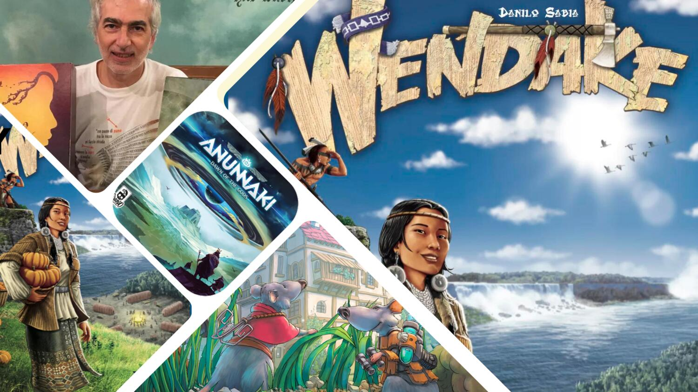

<InterviewIntro>
  L'Essen Spiel è da poco finito, e uno dei grandi protagonisti di questa edizione è stato sicuramente{" "}
  <strong>Danilo Sabia</strong>, con il suo <strong>Ratti di Wistar</strong>, ideato insieme a Simone Luciani. Ma non lo
  citiamo solo per questo: proprio in questi giorni sta arrivando sul tavolo dei giocatori un'altra sua creazione, tra i
  titoli più attesi del 2023, ovvero <strong>Anunnaki</strong>, del quale anche in questo caso è co-autore Simone
  Luciani. Insomma, questo sembra essere <strong>l'anno di Sabia</strong>, che è tornato a far parlare molto di sè dopo
  l'ottimo Wendake (2017): abbiamo voluto fargli qualche domanda, per capire qualcosa di più su questo autore e vedere
  da un altro punto di vista – il suo – il mondo dei giochi da tavolo.
</InterviewIntro>

<InterviewItem type="question">
  Raccontaci un po' di te: come è <strong>nata la tua passione</strong> per i giochi da tavolo? E come sei diventato un
  game designer?
</InterviewItem>

<InterviewItem type="answer" name="DS">
  Sono sempre stato attratto dai giochi in scatola, fin da bambino: mi divertivo a cambiare/integrare regole ai giochi
  che conoscevo e, più tardi, ho iniziato a crearne di nuovi in occasione di feste di compleanni,
  capodanni...ecc...ecc... Poi, nel 2010, <strong>ho scoperto l'esistenza di IDEAG</strong> e allora ho iniziato a
  pensare seriamente di creare giochi in ottica di pubblicazione.
</InterviewItem>

<InterviewItem type="question">
  Quali sono i giochi che <strong>“porti nel cuore”</strong>? C'è qualche episodio o ricordo in particolare che associ
  ad essi?
</InterviewItem>

<InterviewItem type="answer" name="DS">
  <strong>Il gioco a cui faccio sempre riferimento, anche come autore, è Advanced Civilization, della AH</strong>. Mi ricordo
  che, durante una delle mie prime partite, una sera, dovevamo proseguirne una interrotta precedentemente e ho invitato mio
  cugino a giocare in previsione di poterlo inserire quando sarebbe uscita la calamità della Guerra Civile. Ebbene, mio cugino
  è rimasto tutta la sera a guardare. Penso che adesso, dopo 30 anni, mi odi ancora...
</InterviewItem>

<InterviewItem type="question">
  Nella tua attività di creazione, che cosa ricerchi? <strong>Quali obiettivi</strong> e aspirazioni coltivi? Cosa metti
  di te?
</InterviewItem>

<InterviewItem type="answer" name="DS">
  Soprattutto cerco di inserire qualcosa di <strong>"nuovo"</strong> (ed è sempre più difficile); inoltre, nonostante prediliga i "german" (benché con presenza di interazione diretta e/o indiretta) tengo molto all'ambientazione. Il mio principale obiettivo è che la gente si diverta, per quanto complesso un gioco possa essere, e che abbia la sensazione di aver giocato a qualcosa di diverso dal solito.

</InterviewItem>

<InterviewItem type="question">
  Il tuo primo gioco pubblicato è stato <strong>Wendake</strong>, che ha riscosso consenso ed è stato apprezzato: come è
  nato e come è arrivato alla pubblicazione?
</InterviewItem>

<InterviewItem type="answer" name="DS">
 Un giorno mi è venuta <strong>l'idea di usare il giochino del 15</strong> (quello dove bisogna mettere in fila i numeri in una griglia 4x4) per una meccanica di selezione delle azioni per un gioco complesso. Vista la mia passione per i Nativi Americani, ed avendone già ideato uno sui Nativi delle Pianure (Indians), ho pensato appunto di inserirla per un gioco sui Nativi dei Grandi Laghi. Dopo alcune prove la griglia è diventata 3x3 ed è nato il "cuore" di Wendake. Il percorso per la pubblicazione è stato fin troppo breve, visto che di fatto ha finito per sostituire Indians (la cui pubblicazione doveva essere solo posticipata e invece...).

</InterviewItem>

<InterviewItem type="question">
  Un titolo, ideato da te e Simone Luciani, che abbiamo avuto il piacere di provare al Modena Play, è Anunnaki:{" "}
  <strong>come è nato e come è stata la collaborazione con Luciani?</strong>
</InterviewItem>

<InterviewItem type="answer" name="DS">
  Anche qui è iniziato tutto con un'idea di selezione delle azioni venutami pensando alla classica stella che si disegna
  senza staccare la penna dal foglio. Il primo prototipo (Star Ash) ha subito vari cambiamenti (soprattutto ho dovuto
  "tagliare" perché era davvero troppo complesso e lungo) prima che lo presentassi alla Cranio ed era diventato un
  "german" puro. Simone mi ha proposto di farlo diventare un ibrido e quindi, dopo aver deciso l'ambientazione, abbiamo
  iniziato a lavorarci, e molto direi.{" "}
  <strong>Con Simone mi sono trovato davvero bene e non parlo solo a livello professionale.</strong>
</InterviewItem>

<InterviewItem type="question">
  È stato annunciato il tuo nuovo <strong>Ratti di Wistar</strong>, sempre in collaborazione con Simone Luciani, e che è
  stato presentato ad Essen: cosa ci aspetta?
</InterviewItem>

<InterviewItem type="answer" name="DS">
  <strong>Ratti di Wistar</strong> è meno complesso di Anunnaki e amalgama diverse meccaniche: un piazzamento lavoratori
  e selezione azioni con delle particolarità che lo contraddistingue, un gioco di carte alla Ark Nova, per intenderci,
  una parte di esplorazione con missioni da compiere che sbloccano abilità/bonus sulla propria plancia ed una gestione
  risorse da classico "german".
</InterviewItem>

<InterviewItem type="question">
  <strong>Come vivi l'universo dei giochi da tavolo</strong> nella tua sfera privata? È una passione che ha contagiato
  pure i tuoi cari, oppure vi è uno “stacco”?
</InterviewItem>

<InterviewItem type="answer" name="DS">
  Mia figlia giocava molto e bene da piccola; poi ha praticamente smesso per un certo periodo, mentre adesso ha ripreso
  ad interessarsi nuovamente. Anche mia moglie gioca, anche se, purtroppo, soprattutto giochi non complessi.{" "}
  <strong>Ma il vero problema dell'universo dei giochi da tavolo nella mia sfera personale rimane lo spazio che occupano nella casa.</strong>
</InterviewItem>

<InterviewItem type="question">
  {" "}
  Il mondo dei Giochi da Tavolo è <strong>esploso in questi anni</strong>, in particolare durante e dopo il lockdown: ti
  ci ritrovi in questa nuova dimensione e crescita di utenti, autori, editori e pubblicazioni? Vedi criticità oppure particolari
  opportunità?
</InterviewItem>

<InterviewItem type="answer" name="DS">
  Sì, <strong>soprattutto in Italia il gioco da tavolo si sta diffondendo sempre più</strong>, anche se siamo ancora lontani
  rispetto a quanto si gioca in altre nazioni. Il lockdown credo abbia aumentato la richiesta della modalità solitario e,
  ovviamente, gli editori si sono adeguati. Se da una parte sono contento che la cultura dei giochi da tavolo si stia diffondendo
  sempre più (sia come autore che come giocatore), dall'altra mi preoccupa il fatto che sembra si dia la precedenza alla
  quantità di pubblicazioni a discapito della "vita" media di un gioco. Moltissimi giochi entrano nel dimenticatoio dopo
  un anno, colpa anche degli utenti, sempre alla ricerca del "nuovo".
</InterviewItem>

<InterviewItem type="question">
  Ultimamente si discute molto del <strong>crowdfunding</strong>, per i costi, i tempi di produzione e di consegna
  sempre più dilatati, per progetti falliti o per casi di "sparizione" di chi aveva raccolto i fondi. Cosa ne pensi? È
  uno strumento utile oppure c'è un problema?
</InterviewItem>
<InterviewItem type="answer" name="DS">
  <strong>I problemi sono vari</strong>. Vorrei sottolineare però il fatto che Kickstarter era nato per dare la
  possibilità ad una persona qualunque di realizzare un progetto che altrimenti rimaneva nel cassetto. Adesso, almeno
  per i giochi da tavolo, ciò è sempre più difficile, oscurati forse dai "colossi" del settore. Su Kickstarter risulta
  fondamentale la "reputazione" dell'editore, la presentazione del prodotto e la qualità&quantità dei materiali, ma a
  tutto ciò non sempre è abbinata anche una qualità del gioco nelle meccaniche.
</InterviewItem>

<InterviewItem type="question">
  <strong>Cosa consiglieresti</strong> a chi vuole diventare un game designer come te oppure vuole pubblicare una sua
  creazione?
</InterviewItem>
<InterviewItem type="answer" name="DS">
  Per me creare giochi <strong>rimane una passione</strong>, anche se non sono sicuro di voler continuare ancora a
  lungo, almeno a tempo pieno. Per chi vuole diventare game designer posso parlare della mia esperienza e posso dire
  che, oltre alla ovvia soddisfazione per essere riuscito a pubblicare, ho vissuto momenti di frustrazione non da poco.
  Però alla fine ci sono riuscito perciò, che dire? Non arrendetevi, sperando nella buona sorte.
</InterviewItem>

E si conclude così la nostra intervista a Danilo Sabia: siamo contenti di aver potuto vedere una parte meno conosciuta di questo autore e che ci ha portato a scoprire un po' il suo pensiero e la sua vita, sia personale che di game designer. Lo ringraziamo per la sua disponibilità, per la sua gentilezza e per averci voluto parlare di sé con semplicità. E voi che ne pensate? Speriamo anche con questa intervista di avervi fatto scoprire un po' di più il mondo dei giochi <strong>“dall'altra parte della barricata”</strong>, quella di chi i giochi li crea, oltre che giocarli.

