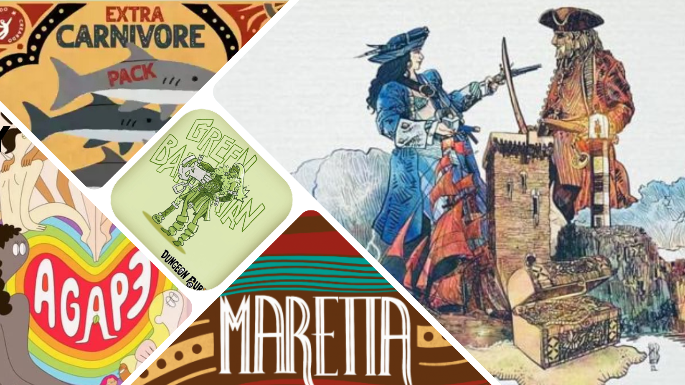

<InterviewIntro>
Emanuele Sassi Zanichelli ci omaggia di questa intervista, concedendoci anche qualche spiraglio più intimo e personale, sulla sua <strong>filosofia ludica</strong> e sulla straordinaria avventura chiamata <strong>Creardo</strong>. A lui e a suo fratello Francesco facciamo tanti auguri di proseguire con successo su questo binario. Buona lettura!
</InterviewIntro>

<InterviewItem type="question">
Che cos’è e come nasce Creardo?
</InterviewItem>

<InterviewItem type="answer" name="ES">
Creardo nasce prima di tutto. Nel senso che Creardo nasce come <strong>entità orientata all’uomo</strong>, al benessere dell’uomo, alle relazioni umane: è stata la mia <strong>reazione</strong> a tutto quel mondo lavorativo e commerciale, da cui venivo, che dal mio punto di vista ha perso sempre più l’attenzione alla ricerca del prodotto, dei materiali (che sono prettamente materiali tecnici, tecnologici), ha perso <strong>l’attenzione al fare</strong> come si faceva un tempo, penso agli anni ’70 in particolare… Creardo nasce prima di tutto in questa idea primigenia. In seguito si concretizza nel primo progetto che ho sviluppato insieme a mio fratello, che è stato <em>Finis Terrae</em>, in cui abbiamo cercato di condensare un po’ questa filosofia, con grande difficoltà, tant’è che il progetto originariamente prevedeva l’utilizzo di <strong>elementi recuperati da scarti industriali</strong>: pezzi di vetro, tappi di bottiglia, elementi di plastica recuperata o elementi ripresi da aziende di burattatura, che poi si sono rivelati molto complessi dal punto di vista delle certificazioni, per cui alla fine sono stati abbandonati. Ma esistono dei kit di <em>Finis Terrae</em> in cui si può giocare con tutti questi materiali di riuso. Ecco, questa è la genesi originaria di Creardo. L’ultimo passaggio è avvenuto <strong>nel 2023</strong>, a dicembre, quando sono entrati 17 nuovi soci con il lancio della <strong>ricapitalizzazione dell’azienda</strong> e tutto ha cambiato sfumatura ulteriormente: siamo diventati a tutti gli effetti ciò che siamo oggi. 
</InterviewItem>

<InterviewItem type="question">
Cosa hai/avete riversato di “vostro” in questa impresa?
</InterviewItem>

<InterviewItem type="answer" name="ES">
Di nostro direi tutto: <strong>Creardo riflette il <em>nostro</em> modo di essere</strong>. Dico <em>nostro</em> perché non parlo solo di me, ma anche dei <em>soci</em>: la grandezza di questa impresa sta nel fatto che io abbia incontrato altre persone che condividevano un ideale. Tutti insieme riversiamo sì in questa azienda <em>l’aspettativa di un guadagno</em>, <em>ma senza rinunciare alle relazioni umane</em>, di etica, di condivisione, di trasparenza, di accessibilità. Creardo rispecchia un modo di essere che, a ben vedere, ha rappresentato anche un deterrente per l’ingresso di tanti soci (anche con importanti portafogli) i quali non hanno visto in questa operazione una operazione di massimo lucro. 
</InterviewItem>

<InterviewItem type="question">
Ti/vi senti/-te di rappresentare “l’italianità” nel mondo o hai/avete un’idea diversa? (consentimi questa domandina politica: sono un Dude engagé…)
</InterviewItem>

<InterviewItem type="answer" name="ES">
Sicuramente <strong>siamo orgogliosi di essere italiani</strong> e “un’italianità” emerge dal modo di fare, dal modo di essere e di rapportarsi. Come ci insegnano tanti autori di giochi famosi, la propria indole e la propria cultura di appartenenza al Paese di origine affiora dai giochi stessi. Dopodiché, in verità, a noi piacerebbe essere iniziatori di un percorso che consenta di stabilire <strong>nuove relazioni sui territori</strong>, in termini di <strong>filiera corta</strong>: se immagino di esportare i prodotti in un altro Paese mi piacerebbe anche che la filiera fosse legata a quel Paese. Per cui, si parte dall’Italia nel modo di fare, ma per il resto <strong>siamo cittadini del mondo e amici di tutti i popoli</strong>. 
</InterviewItem>

<InterviewItem type="question">
Cosa significa per la tua/vostra impresa esistere in un mercato ludico sempre più selvaggio e “aggressivo”? (ovvero: le deluxe editions stanno diventando una norma, in un hobby che già nasce per essere di nicchia e non proprio economico: Creardo dove si colloca?)
</InterviewItem>

<InterviewItem type="answer" name="ES">
Guarda, su questa cosa ci risponderà il futuro. Da parte mia c’era sicuramente <strong>una certa stanchezza verso questo mondo estremamente luccicante</strong>. Io conservo nella mia memoria il ricordo di giochi molto semplici, che erano molto gratificanti soprattutto perché ci lasciavano spazio per immaginare le cose: ecco, <strong>credo che l’immaginazione sia la grande assente</strong> in tantissimi settori della nostra contemporaneità, dall’amore all’ideazione di prodotti e di oggetti, finanche nel pensare la propria vita. Immaginare cosa possiamo essere in fondo è il primo passo per diventare quella cosa. E quindi avere tutto iperdefinito e iperdettagliato, i progetti renderizzati dove si vede tutto, ci toglie un po’ la magia… Quindi <strong>a me piacerebbe ritornare a giochi in cui i meeple sono un fiasco di vino, un trenino, un fungo</strong>… Cosa importa il motivo per cui erano così? Di fatto ognuno prendeva quello in cui si identificava e giocava un gioco sul monopolio: ma in quell’atto di scelta c’era una componente di immaginazione che secondo me si è persa nel tempo. Perciò a me piacerebbe tornare a un prodotto più artigianale, più semplice, dove emerga la vicenda, la storia, la lore. In questo subiremo l’attacco e, probabilmente, la vittoria di tutti questi prodotti. Ciononostante, vogliamo parlare a chi come noi vuole fare un passetto indietro e <strong>“gustarsi un po’ più la trattoria”</strong>, come parafrasando dice la nostra amica Vanessa, alias <em>miss.inpieces</em>, quando parla del nostro approccio <strong>“fuori dal mainstream”</strong>. Credo lei abbia colto un po’ questa essenza della nostra postura: la trattoria può essere più scomoda, ma ci vai per gustare qualcosa di diverso. Chi cerca fuori dal mainstream qualcosa di uguale al mainstream secondo me sbaglia approccio. 
</InterviewItem>

<InterviewItem type="question">
Plastica deluxe o biodegradabile? Qual è (realisticamente) il futuro del mercato ludico?
</InterviewItem>

<InterviewItem type="answer" name="ES">
Io credo che ci sarà senz’altro un aumento dell’utilizzo delle bioplastiche o delle plastiche biodegradabili, ma <strong>non ritengo che la plastica in sé sia da demonizzare</strong>. Va utilizzata per quello che è: un elemento che dura tantissimo nel tempo. Un giorno mi piacerebbe fare un oggetto in plastica: quando capirò che cosa fare perché abbia senso che duri “per sempre”! E poi c’è il tema del <strong>biodegradabile</strong> e delle <strong>bioresine</strong>: non sapremo mai fino in fondo, se non fra un po’, quanto costi in termini ambientali produrre con quelle. Quel che mi sembra certo è che <strong>l’unico modo per non inquinare è non fare</strong>: non c’è una vera alternativa sostenibile. Queste sono più sostenibili, forse, in ogni caso da sperimentare, però la verità del loro impatto la conosceremo solo con il tempo. 
</InterviewItem>

<InterviewItem type="question">
Finis Terrae è stato il tuo/vostro primogenito: qual è stato il processo creativo alle sue spalle? Cosa rifareste e cosa no?
</InterviewItem>

<InterviewItem type="answer" name="ES">
Guarda, <em>Finis Terrae</em> non ci aspettavamo nemmeno di farlo! È un gioco <strong>nato per caso</strong>, in una <strong>notte di san Silvestro</strong>, mentre io e mio fratello giocavamo <strong>con le nostre figlie</strong> mischiando cose diverse. È stato giocando con loro che ci siamo resi conto di essere nel bel mezzo di un processo creativo, in cui <strong>stavamo mettendo insieme elementi sparsi di giochi che amavamo</strong>, attingendo da essi solo quelle cose che ci piacevano di più: piazzamento tessere, piazzamento lavoratori, però con movimento, con gestione di risorse, il pick-up e delivery, contemporaneamente l’esplorazione, la scoperta, qualcosa di imprevedibile… E a dirla tutta credo che <em>Finis Terrae</em> <strong>non</strong> sia <strong>ancora compreso fino in fondo</strong>. Tutti i padri ovviamente sono soddisfatti dei loro figli, anche se io in verità non lo sono sempre dei prodotti che ho. Devo però dire che <em>Finis Terrae</em> nel tempo mi sta dando tante soddisfazioni: al di là del pubblico che abbraccia, che è molto eterogeneo, e della sua possibile espandibilità, stiamo parlando di un prodotto che ha il pregio di essere <strong>immediatamente giocabile</strong>, che è <strong>tanto rigiocabile</strong>, e che secondo me <strong>avrà un suo futuro</strong>. Che cosa non rifarei? Commercialmente è molto difficile distribuire un prodotto da 48€ di un’azienda sconosciuta… E <strong>paghiamo il costo dei materiali</strong>, perché ci sono carte naturali, vernici all’acqua e protettive molto costose… Sicuramente in una futura produzione dovremo considerare di abbassare un po’ questi elementi, sempre rimanendo nel sostenibile, per rendere il prodotto di più ampio respiro e distribuirlo a un costo inferiore (torniamo all’accessibilità di cui dicevamo prima). 
</InterviewItem>

<InterviewItem type="question">
Maretta: un gioco familiare che vi proietta nel futuro o è già acqua passata?
</InterviewItem>

<InterviewItem type="answer" name="ES">
Maretta è <strong>un progetto editoriale di cui non ci libereremo molto facilmente</strong>! Piace / non piace; troppo breve / troppo lungo; troppa alea / piccole strategie. Ognuno ha la sua visione. Ma Maretta, lo abbiamo detto sin dall’inizio e lo abbiamo scritto anche nel regolamento, è un progetto editoriale <strong>fatto da una comunità</strong>. Non so quanti progetti ci siano simili in circolazione. Quando prima parlavo di trattoria e di sperimentazione, mi riferivo anche a questo: Maretta è <strong>sperimentazione</strong>. Siamo usciti a luglio, anticipando i tempi che avevamo detto (dicembre) con una prima versione, con leggere asimmetrie e con ruoli, in aggiunta gratuitamente e scaricabile dal nostro sito. Ora ne stiamo sviluppando insieme a Dr Houserules una versione solitaria, collaborativa, a mio parere molto interessante, che stiamo playtestando in questi giorni, che verrà rilasciata probabilmente a dicembre: anche questa gratuita. Dove trovare un gioco che ha così <strong>tante versioni</strong>, ideate da <strong>autori diversi</strong>, che stanno partecipando a questo progetto? Noi continueremo di certo su questa strada. Anche questo prodotto ci apre a soluzioni diverse: ti dirò, secondo me anche al ritorno di amori di chi non lo ha amato nella sua prima versione. Quindi… <strong>stay tuned</strong>! 
</InterviewItem>

<InterviewItem type="question">
A cosa giochi, quando non sei impegnato nella creazione?
</InterviewItem>

<InterviewItem type="answer" name="ES">
Questa è una domanda spinosa, perché io <strong>ho 3 figlie piccole</strong>… Quindi quando non sono preso dalla gestione di Creardo, dallo sviluppo dei giochi, dagli eventi o dalle mie figlie (ovvero dal giocare a giochi dai 3 agli 8-10 anni), gioco con Davide principalmente, il mio maestro, e gioco un po’ a tutto. <strong>Non amo i giochi particolarmente cerebrali</strong>, forse perché arrivo sempre in momenti di stanchezza, e comunque con le mie figlie ultimamente stiamo giocando a Santorini, a Carcassonne (mia figlia di 6 anni mi ha battuto a Carcassonne e non so ancora come abbia fatto!). Con Davide abbiamo recentemente giocato a Secrets del buon Bruno Faidutti, a Seven Wonders Duel, Hanamikoji, Everdell, Skull, Dominion (che non è 100% il mio), Azul, Dodelido (eh sì…). Con le mie figlie invece giochiamo a Furbi come Volpi, Pirati (djeco) e Gorilla (djeco), Finis Terrae in una versione 5+ che un giorno rilasceremo (!), Jelly Monster Attack, Poul Poul, il Pirata Pop-up e tanti giochi fatti in casa e manuali che prendiamo dal web. Amo un gioco che si chiama Village of Legends: Entri Giochi Esci. E in generale <strong>amo i giochi entro i 60 min e con interazione tra giocatori</strong>. Per il resto, <strong>gioco tanto tanti prototipi di autori amici</strong>. Ah, non mi piace Puerto Rico! 
</InterviewItem>

<InterviewItem type="question">
Da papà a papà (con 3 figli per uno!), quale gioco della tua collezione non vedi l’ora di far giocare alle tue figlie e a cosa giocate ultimamente?
</InterviewItem>

<InterviewItem type="answer" name="ES">
Ti dirò, io <strong>sono un social gamer</strong>, per cui dove mi metti sto. Se penso alle mie figlie, non so se ho più voglia di giocare con loro a Secret Hitler, a Skull o a Cards Against Humanity, per vedere come si comportano in certe situazioni. Più che la smania di far giocare loro un gioco in particolare, ho il desiderio di <strong>vederle crescere nel mondo ludico per osservare e scoprire la loro personalità</strong>. Questa forse è la cosa che mi interessa di più. 
</InterviewItem>

<InterviewItem type="question">
Cosa ha in serbo Creardo per il futuro ludico? Svelaci qualche retroscena…
</InterviewItem>

<InterviewItem type="answer" name="ES">
Quest’anno abbiamo sviluppato <strong>moltissime idee</strong> che giacevano nelle nostre teste da un po’ di tempo. Abbiamo iniziato delle <strong>collaborazioni</strong> con vari autori, quindi il prossimo anno vedremo dei solitari, degli astratti, titoli di autori importanti (abbiamo un <strong>Kickstarter</strong> in uscita <strong>insieme a Marco Salogni</strong>). Vedremo anche tematiche inesplorate, dei giochi che parlano di un futuro lontano e di paesi lontani, insieme a zombi, insieme ad arene di guerrieri, insieme a giochi versatili che avranno tantissime tematiche diverse, dalla peste alle malattie. Vedremo un solitario a tema Dungeon dove un oracolo risponderà a qualunque domanda che faremo durante il gioco! Ma, soprattutto, vedremo Creardo <strong>partecipare a tantissime situazioni sociali e scolari</strong>, perché vogliamo essere sempre più presenti con le amministrazioni e con le associazioni, nonché all’interno delle scuole, per fare giocare, per far pensare, per far riflettere su cosa significhi giocare e su quanto sia importante farlo per riscoprire <strong>il bambino sopito dentro di noi</strong>… Questo bambino che in fondo <strong>non è qualcosa di latente, ma di presente</strong>, che ci condiziona, ci parla delle nostre paure, dei nostri desideri, delle nostre convinzioni. Non è qualcuno su cui siamo cresciuti ma è l’essenza di noi stessi. Questo è il futuro di Creardo. Vedremo! Colgo l’occasione per invitare i lettori alla <strong>seconda edizione della ricapitalizzazione di Creardo</strong>, se interessati: i prossimi appuntamenti sono proprio in questa seconda parte del mese, il 17, il 25 e il 29 <strong>ottobre</strong> alle 13.00 e il 23 ottobre alle 21.00. <strong>Vi aspettiamo in famiglia!</strong> 
</InterviewItem>

Rinnoviamo i nostri auguri a Emanuele e a Creardo per queste iniziative, che dal nostro punto di vista interpretano a fondo e correttamente quello che molti tra noi giocatori siamo e vogliamo: un mondo in cui <strong>giocare</strong>, oltre che un passatempo, sia una <strong>forma alta e nobile di socialità</strong>, di <strong>conoscenza di sé</strong> e di <strong>sostenibilità ambientale</strong>. Grazie e alla prossima! 

