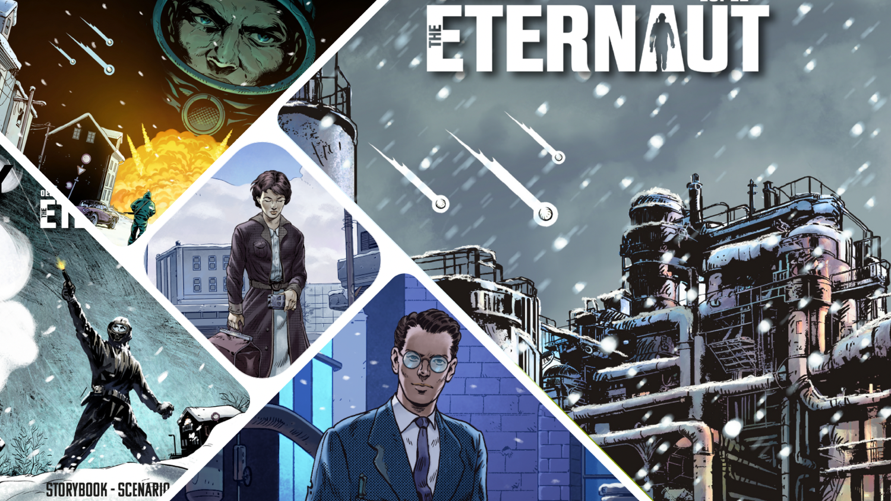

<InterviewIntro>
Sono un <strong>amante di fumetti</strong> semplice: vedo un gioco ambientato in uno di quei fantastici mondi, lo guardo, mi informo e, alla fine, lo provo. 
È così che ho conosciuto <strong>Mauro</strong>, lo scorso ottobre, ad <strong>Essen</strong>. Ha accompagnato me e Leonardo, un mio amico, in un viaggio dove la neve non era bella, dove le porte era meglio tenerle chiuse e dove le chiacchiere al tavolo erano di qualità. 
Tra poco parte la sua <strong>campagna kickstarter</strong> e noi siamo qui a presentarvi l'autore! 
Date un caloroso benvenuto a Mauro Chiabotto!
</InterviewIntro>

<InterviewItem type="question">
Qual è stato il tuo percorso formativo come autore di giochi?
</InterviewItem>

<InterviewItem type="answer" name="MC">
È nato tutto un po’ per caso: nel <strong>2012</strong>, insieme a mio fratello e ad alcuni amici, siamo andati a curiosare nel padiglione di <strong>giocAosta</strong> dove abbiamo conosciuto Ticket to Ride: Europa e <Link to="/reviews/dominion-nasce-un-regno">Dominion</Link>.  Il giorno dopo, mio fratello è arrivato a casa con un foglio spiegazzato dicendomi <strong>“ho inventato un gioco”</strong>. Durata: 340 minuti, 1200 segnalini e regole acerbe. Ma abbiamo cominciato a discutere su come migliorare il gioco, abbiamo poi “schiavizzato” i nostri amici giocatori per aiutarci nei playtest e ci siamo avvicinati al <strong>mondo autoriale grazie a Ideag</strong>, che si svolgeva all’epoca ancora a Torino.  E da lì è partito tutto.
</InterviewItem>

<InterviewItem type="question">
Qual è il gioco di cui vai più fiero, tra tutti quelli che hai creato? E perché?
</InterviewItem>

<InterviewItem type="answer" name="MC">
Il gioco di cui vado più fiero è quello a cui sto lavorando adesso e, quasi sicuramente, la risposta sarà sempre questa. Sono, purtroppo o per fortuna, <strong>molto critico</strong> verso i miei giochi “del passato”. Ogni volta che capita l’occasione di intavolarne uno mi chiedo sempre “ma davvero questa cosa l’avevo fatta così?”. Credo, e spero, che sia un’abitudine comune a molti autori.
</InterviewItem>

<InterviewItem type="question">
Tra pochissimo partirà la campagna Kickstarter dell'Eternauta. Ci racconti in 50 parole come funziona il gioco?
</InterviewItem>

<InterviewItem type="answer" name="MC">
L’Eternauta è un <Link to='/mechanisms/cooperativo'>gioco cooperativo</Link> per 1-4 giocatori basato sull’omonimo <strong>fumetto argentino</strong>. È un gioco di sopravvivenza, dove impersonerete un gruppo di improbabili eroi scampati per miracolo a una <strong>nevicata mortale</strong> che ricopre completamente Buenos Aires. Il gioco mescola un sistema di esplorazione <strong>“punta&clicca”</strong> con una forte componente narrativa.
</InterviewItem>

<InterviewItem type="question">
L'Eternauta, per chi non l'avesse letto, inizia in una gelida sera d'inverno a Buenos Aires. Hector Oersterheld, fumettista, vede comparire davanti a sé la figura di un uomo, Juan Galvez, detto, appunto, l'Eternauta. Questi inizia a raccontare dell'invasione aliena di Buenos Aires da lui stesso vissuta, della neve che uccide tutto quello che tocca e del modo in cui è sopravvissuto e molto, molto altro. 
Che cos’ha di affascinante la storia dell’Eternauta dal punto di vista ludico?
</InterviewItem>

<InterviewItem type="answer" name="MC">
Se dovessi descrivere l’Eternauta con un singolo aggettivo, lo definirei <strong>“sfiancante”</strong>: la sua storia è una lunga agonia, un continuo scontro contro qualcosa più grosso di noi esseri umani ma che, allo stesso tempo, unisce <strong>persone molto diverse che condividono un ideale comune</strong>. Questo fumetto mostra la vera attitudine di ciascuna persona ad affrontare sfide praticamente impossibili, dove il nemico sembra invincibile. 
Questi sono tutti concetti molto affini a un sistema di gioco cooperativo di sopravvivenza. 
Il fatto di scoprire, pagina per pagina, sempre una nuova “minaccia” da affrontare, mi ha spinto a creare un gioco strutturato a <Link to='/mechanisms/campagna'>campagna</Link> dove i giocatori, scenario dopo scenario, aprono delle scatoline e rivelano man mano i nuovi materiali di gioco da usare nelle partite future.
</InterviewItem>

<InterviewItem type="question">
Come si fa a trasformare un fumetto di successo come questo in un gdt?
</InterviewItem>

<InterviewItem type="answer" name="MC">
L’Eternauta (fumetto) ha la capacità di farti sentire molto vicino alla tragedia che vivono i suoi protagonisti, che sono tutti personaggi molto umani e non stereotipati (ognuno ha i suoi dubbi, le sue paure e debolezze: nessuno è un eroe, ma è il gruppo stesso a esserlo). 
Quindi, per trasformare questa esperienza in un gioco, ho deciso di mantenere i capisaldi del fumetto:
<ul>
<li>Agiamo come un gruppo: i giocatori, non impersoneranno ciascuno un personaggio, ma potranno assegnare le azioni da fare al personaggio che desiderano, proprio per rimarcare il concetto di essere un “gruppo”;</li>
<li>Il sistema a campagna: il gioco inizia con una nevicata mortale, dove i giocatori dovranno “imparare” a cooperare. Le discussioni saranno molte al tavolo, poiché la strada per concludere lo scenario non sarà mai così evidente;</li>
<li>Scenario per scenario, verranno introdotte nuove componenti e regole per aumentare dopo ogni partita il livello di sfida dei giocatori;</li>
<li>Ciascun personaggio in gioco avrà i suoi punti di forza e le sue debolezze: ogni scelta morale difficile porterà i personaggi a reagire in un determinato modo, fino al raggiungimento del proprio epilogo. Purtroppo non sarà possibile accontentare tutte le richieste dei vari membri del nostro gruppo, quindi saranno i giocatori stessi i responsabili del loro destino.</li>
</ul>
</InterviewItem>

<InterviewItem type="question">
Interessante! Immagino solo la difficoltà di ottenere i diritti per poter utilizzarla, mi sbaglio?
</InterviewItem>

<InterviewItem type="answer" name="MC">
Non mi occupo in prima persona dell’acquisizione dei diritti, ma sono a conoscenza del fatto che è stato <strong>molto complesso entrare in contatto con gli eredi degli autori</strong>. Purtroppo, come molti sanno, Hector Oersterheld è un “desaparecido”, insieme alle sue figlie.
</InterviewItem>

<InterviewItem type="question">
Come è nata la collaborazione con Pendragon? Avevi già collaborato con loro in passato?
</InterviewItem>

<InterviewItem type="answer" name="MC">
Ho conosciuto il team Pendragon con il progetto Last Aurora, di cui sono autore e che ho curato insieme a <Link to='/publishers/pendragon-game-studio'>Pendragon</Link> per la campagna <strong>Kickstarter</strong>. In seguito ho collaborato nuovamente con loro per la campagna di <strong>The Thing: the board game</strong>. Da tre anni, lavoro esclusivamente con Pendragon nella realizzazione dei giochi a 360°.
</InterviewItem>

<InterviewItem type="question">
Sono curioso, come hai eseguito la fase di beta testing?
</InterviewItem>

<InterviewItem type="answer" name="MC">
Questo gioco è estremamente facile da spiegare ma estremamente complesso da progettare e da playtestare: oltre al testare le meccaniche in sé, occorre anche testare l’intera campagna (provare il sistema di crescita dei personaggi, testare che le partite non siano sempre ripetitive e testare, testare e ritestare il regolamento, che non deve avere intoppi). Fortunatamente, ho un bel gruppo di persone che mi aiutano in questo!
</InterviewItem>

<InterviewItem type="question">
In ogni caso, l'Eternauta non è il primo fumetto che un lettore prenderebbe in mano, sia per la complessità, sia perché non lo definirei molto POP. A quanti anni hai iniziato a leggere? Come sei arrivato a mettere le mani sull'opera di Héctor Oesterheld?
</InterviewItem>

<InterviewItem type="answer" name="MC">
Non sono un grande lettore, ma da piccolo divoravo 2-3 librogame al giorno (ricordo perfettamente la faccia della bibliotecaria che mi diceva ogni giorno “li hai già finiti tutti?”). Oltre a questo, leggevo tanti fantasy, dalla saga di <em>Dragonlance</em> al ciclo dell’<em>Eredità di Paolini</em>. 
La passione per i <strong>librigame</strong> si rivede tantissimo nell’Eternauta, perché tutta la parte narrativa è costruita esattamente come un librogame. 
L’Eternauta l’ho sempre conosciuto di nome ma non l’ho mai letto. Appena entrato in Pendragon, ho saputo della licenza, ho divorato e analizzato il fumetto. Avevo da anni una meccanica in testa per far vivere una storia in un gioco da tavolo, e mi sono proposto come designer. Ed eccomi qui.
</InterviewItem>

<InterviewItem type="question">
Chiudiamo con l'angolo dei consigli: tre fumetti / graphic novel che consiglieresti di leggere ai nostri lettori.
</InterviewItem>

<InterviewItem type="answer" name="MC">
Non essendo un grandissimo lettore non mi sento in grado di consigliare tanti fumetti o Graphic Novel, ma sicuramente <strong>consiglio di leggere L’Eternauta</strong>: troverete tante cose “già viste” e “che ricordano tantissimo quel film o quella storia”. Poi però, se andate a vedere la data di pubblicazione del fumetto, capirete che molte storie che consideriamo “capolavori di originalità” hanno attinto a piene mani dalle pagine dell’Eternauta.
</InterviewItem>

  E anche questa intervista è conclusa! 
  Io sono rimasto davvero colpito per la semplicità e l'<strong>immersività di questo titolo</strong>... e non vedo l'ora di poterci fare tutta la campagna! 
  Se conoscere Mauro è stato molto bello, potete solo immaginare l'emozione di poter giocare all'Eternauta con lui seduto sullo sgabello a fianco al mio per tutta la durata della demo!  
  Grazie Mauro, alla prossima!

